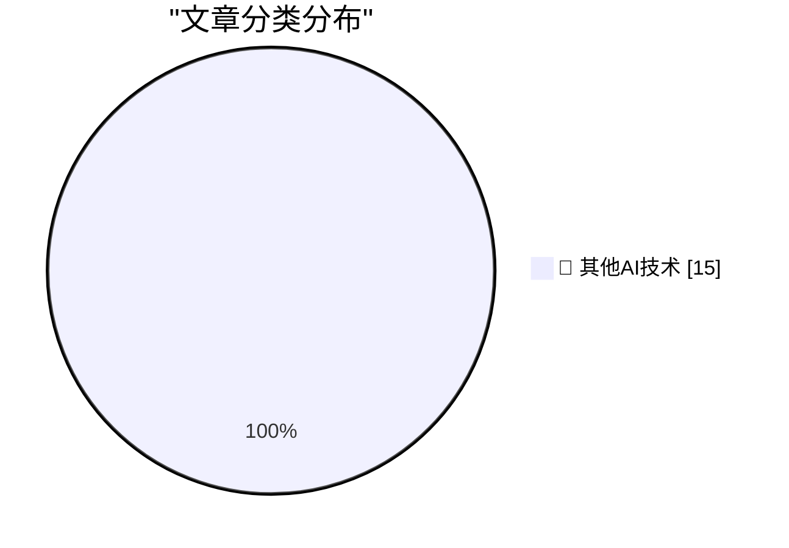

# 📰 AI 博客每日精选 — 2026-07-31

> 来自 98 个技术博客和社交媒体源，AI 精选 Top 15

## 🏆 今日必读

🥇 **Getting 25 Gbps Thunderbolt Ethernet on my Mac Studio**

[Getting 25 Gbps Thunderbolt Ethernet on my Mac Studio](https://www.jeffgeerling.com/blog/2026/getting-25g-ethernet-mac-thunderbolt/) — jeffgeerling.com · 8 小时前 · 🔬 其他AI技术

> Getting 25 Gbps Thunderbolt Ethernet on my Mac Studio

🥈 **AI models need moral support to make discoveries**

[AI models need moral support to make discoveries](https://seangoedecke.com/ai-models-need-moral-support/) — seangoedecke.com · 22 小时前 · 🔬 其他AI技术

> AI models need moral support to make discoveries

🥉 **★ Temu Is a Comically Bad App**

[★ Temu Is a Comically Bad App](https://daringfireball.net/2026/07/temu_is_a_comically_bad_app) — daringfireball.net · 3 小时前 · 🔬 其他AI技术

> ★ Temu Is a Comically Bad App

4️⃣ **BI Slop**

[BI Slop](https://idiallo.com/blog/business-intelligence-slop) — idiallo.com · 22 小时前 · 🔬 其他AI技术

> BI Slop

5️⃣ **Pluralistic: Better to beg forgiveness (31 Jul 2026)**

[Pluralistic: Better to beg forgiveness (31 Jul 2026)](https://pluralistic.net/2026/07/31/just-do-it/) — pluralistic.net · 10 小时前 · 🔬 其他AI技术

> Pluralistic: Better to beg forgiveness (31 Jul 2026)

---

## 📊 数据概览

| 扫描源 | 抓取文章 | 时间范围 | 精选 |
|:---:|:---:|:---:|:---:|
| 77/98 | 2726 篇 → 18 篇 | 24h | **15 篇** |

### 分类分布

---

====================

## 🔬 其他AI技术

### 1. Getting 25 Gbps Thunderbolt Ethernet on my Mac Studio

[Getting 25 Gbps Thunderbolt Ethernet on my Mac Studio](https://www.jeffgeerling.com/blog/2026/getting-25g-ethernet-mac-thunderbolt/) — **jeffgeerling.com** · 8 小时前 · ⭐ 15/25

> Getting 25 Gbps Thunderbolt Ethernet on my Mac Studio

📌 其他AI技术

---

### 2. AI models need moral support to make discoveries

[AI models need moral support to make discoveries](https://seangoedecke.com/ai-models-need-moral-support/) — **seangoedecke.com** · 22 小时前 · ⭐ 15/25

> AI models need moral support to make discoveries

📌 其他AI技术

---

### 3. ★ Temu Is a Comically Bad App

[★ Temu Is a Comically Bad App](https://daringfireball.net/2026/07/temu_is_a_comically_bad_app) — **daringfireball.net** · 3 小时前 · ⭐ 15/25

> ★ Temu Is a Comically Bad App

📌 其他AI技术

---

### 4. BI Slop

[BI Slop](https://idiallo.com/blog/business-intelligence-slop) — **idiallo.com** · 22 小时前 · ⭐ 15/25

> BI Slop

📌 其他AI技术

---

### 5. Pluralistic: Better to beg forgiveness (31 Jul 2026)

[Pluralistic: Better to beg forgiveness (31 Jul 2026)](https://pluralistic.net/2026/07/31/just-do-it/) — **pluralistic.net** · 10 小时前 · ⭐ 15/25

> Pluralistic: Better to beg forgiveness (31 Jul 2026)

📌 其他AI技术

---

### 6. Why do OpenAI's GPT-2 weights beat mine?  Part three: testing overtraining

[Why do OpenAI's GPT-2 weights beat mine?  Part three: testing overtraining](https://www.gilesthomas.com/2026/07/why-do-openai-gpt2-weights-beat-mine-3-overtraining) — **gilesthomas.com** · 20 小时前 · ⭐ 15/25

> Why do OpenAI's GPT-2 weights beat mine?  Part three: testing overtraining

📌 其他AI技术

---

### 7. How I use AI on this blog

[How I use AI on this blog](https://www.gilesthomas.com/2026/07/ai-use) — **gilesthomas.com** · 3 小时前 · ⭐ 15/25

> How I use AI on this blog

📌 其他AI技术

---

### 8. Notes from July 2026

[Notes from July 2026](https://evanhahn.com/notes-from-july-2026/) — **evanhahn.com** · 16 小时前 · ⭐ 15/25

> Notes from July 2026

📌 其他AI技术

---

### 9. The AI Phrasebook

[The AI Phrasebook](https://nesbitt.io/2026/07/31/the-ai-phrasebook.html) — **nesbitt.io** · 12 小时前 · ⭐ 15/25

> The AI Phrasebook

📌 其他AI技术

---

### 10. Premium: AI Is Getting Way Too Expensive

[Premium: AI Is Getting Way Too Expensive](https://www.wheresyoured.at/premium-ai-is-getting-way-too-expensive/) — **wheresyoured.at** · 6 小时前 · ⭐ 15/25

> Premium: AI Is Getting Way Too Expensive

📌 其他AI技术

---

### 11. Y2K Will Be Quite Okay

[Y2K Will Be Quite Okay](https://www.filfre.net/2026/07/y2k-will-be-quite-okay/) — **filfre.net** · 5 小时前 · ⭐ 15/25

> Y2K Will Be Quite Okay

📌 其他AI技术

---

### 12. Windows NT 4.0: Released to Manufacturing July 31, 1996

[Windows NT 4.0: Released to Manufacturing July 31, 1996](https://dfarq.homeip.net/windows-nt-4-0-released-to-manufacturing-july-31-1996/?utm_source=rss&#038;utm_medium=rss&#038;utm_campaign=windows-nt-4-0-released-to-manufacturing-july-31-1996) — **dfarq.homeip.net** · 11 小时前 · ⭐ 15/25

> Windows NT 4.0: Released to Manufacturing July 31, 1996

📌 其他AI技术

---

### 13. AI: Considerations for people who make decisions

[AI: Considerations for people who make decisions](https://berthub.eu/articles/posts/ai-for-decision-makers/) — **berthub.eu** · 14 小时前 · ⭐ 15/25

> AI: Considerations for people who make decisions

📌 其他AI技术

---

### 14. ➡️ @OpenAIDevs has reduced prices for GPT-5.6 Luna by 80% and GPT-5.6 Terra by 20%. Try them out in GitHub Copilot wherever you work.

[➡️ @OpenAIDevs has reduced prices for GPT-5.6 Luna by 80% and GPT-5.6 Terra by 20%. Try them out in GitHub Copilot wherever you work.](https://x.com/github/status/2083261791363363273) — **𝕏 @GitHub** · 3 小时前 · ⭐ 15/25

> ➡️ @OpenAIDevs has reduced prices for GPT-5.6 Luna by 80% and GPT-5.6 Terra by 20%. Try them out in GitHub Copilot wherever you work.

📌 其他AI技术

---

### 15. RT Sameen Karim: The launch of Stacked PRs is one of the biggest releases in @github history, touching almost every service we run I wanted to share s...

[RT Sameen Karim: The launch of Stacked PRs is one of the biggest releases in @github history, touching almost every service we run I wanted to share s...](https://x.com/github/status/2083253749389349003) — **𝕏 @GitHub** · 4 小时前 · ⭐ 15/25

> RT Sameen Karim: The launch of Stacked PRs is one of the biggest releases in @github history, touching almost every service we run I wanted to share s...

📌 其他AI技术

---

====================

*生成于 2026-07-31 22:01 | 扫描 77 源 → 获取 2726 篇 → 精选 15 篇*
*基于 [Hacker News Popularity Contest 2025](https://refactoringenglish.com/tools/hn-popularity/) RSS 源列表，由 [Andrej Karpathy](https://x.com/karpathy) 推荐*
*由「懂点儿AI」制作，欢迎关注同名微信公众号获取更多 AI 实用技巧 💡*
