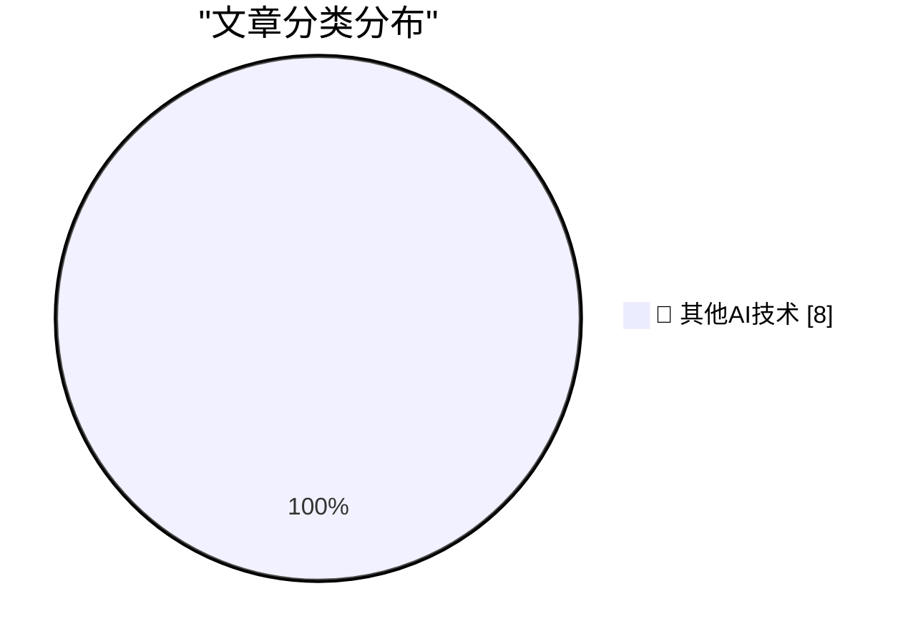

# 📰 AI 博客每日精选 — 2026-08-01

> 来自 98 个技术博客和社交媒体源，AI 精选 Top 8

## 🏆 今日必读

🥇 **The Apple Upgrade Situation**

[The Apple Upgrade Situation](https://randsinrepose.com/archives/the-apple-upgrade-situation/) — daringfireball.net · 5 小时前 · 🔬 其他AI技术

> The Apple Upgrade Situation

🥈 **Apple Q3 2026 Results**

[Apple Q3 2026 Results](https://sixcolors.com/post/2026/07/apple-announces-record-q3-results/) — daringfireball.net · 5 小时前 · 🔬 其他AI技术

> Apple Q3 2026 Results

🥉 **The Talk Show: ‘What’s in Louie’s Wallet’**

[The Talk Show: ‘What’s in Louie’s Wallet’](https://daringfireball.net/thetalkshow/2026/07/31/ep-453) — daringfireball.net · 23 小时前 · 🔬 其他AI技术

> The Talk Show: ‘What’s in Louie’s Wallet’

4️⃣ **Pluralistic: Why businesses lie about AI (01 Aug 2026)**

[Pluralistic: Why businesses lie about AI (01 Aug 2026)](https://pluralistic.net/2026/08/01/dare-snot/) — pluralistic.net · 9 小时前 · 🔬 其他AI技术

> Pluralistic: Why businesses lie about AI (01 Aug 2026)

5️⃣ **Gadget Review: HIKMICRO D02 Thermal Camera ★★★★★**

[Gadget Review: HIKMICRO D02 Thermal Camera ★★★★★](https://shkspr.mobi/blog/2026/08/gadget-review-hikmicro-d02-thermal-camera/) — shkspr.mobi · 10 小时前 · 🔬 其他AI技术

> Gadget Review: HIKMICRO D02 Thermal Camera ★★★★★

---

## 📊 数据概览

| 扫描源 | 抓取文章 | 时间范围 | 精选 |
|:---:|:---:|:---:|:---:|
| 77/98 | 2734 篇 → 8 篇 | 24h | **8 篇** |

### 分类分布

---

====================

## 🔬 其他AI技术

### 1. The Apple Upgrade Situation

[The Apple Upgrade Situation](https://randsinrepose.com/archives/the-apple-upgrade-situation/) — **daringfireball.net** · 5 小时前 · ⭐ 15/25

> The Apple Upgrade Situation

📌 其他AI技术

---

### 2. Apple Q3 2026 Results

[Apple Q3 2026 Results](https://sixcolors.com/post/2026/07/apple-announces-record-q3-results/) — **daringfireball.net** · 5 小时前 · ⭐ 15/25

> Apple Q3 2026 Results

📌 其他AI技术

---

### 3. The Talk Show: ‘What’s in Louie’s Wallet’

[The Talk Show: ‘What’s in Louie’s Wallet’](https://daringfireball.net/thetalkshow/2026/07/31/ep-453) — **daringfireball.net** · 23 小时前 · ⭐ 15/25

> The Talk Show: ‘What’s in Louie’s Wallet’

📌 其他AI技术

---

### 4. Pluralistic: Why businesses lie about AI (01 Aug 2026)

[Pluralistic: Why businesses lie about AI (01 Aug 2026)](https://pluralistic.net/2026/08/01/dare-snot/) — **pluralistic.net** · 9 小时前 · ⭐ 15/25

> Pluralistic: Why businesses lie about AI (01 Aug 2026)

📌 其他AI技术

---

### 5. Gadget Review: HIKMICRO D02 Thermal Camera ★★★★★

[Gadget Review: HIKMICRO D02 Thermal Camera ★★★★★](https://shkspr.mobi/blog/2026/08/gadget-review-hikmicro-d02-thermal-camera/) — **shkspr.mobi** · 10 小时前 · ⭐ 15/25

> Gadget Review: HIKMICRO D02 Thermal Camera ★★★★★

📌 其他AI技术

---

### 6. This Week in Package Management: 1 August 2026

[This Week in Package Management: 1 August 2026](https://nesbitt.io/2026/08/01/this-week-in-package-management.html) — **nesbitt.io** · 11 小时前 · ⭐ 15/25

> This Week in Package Management: 1 August 2026

📌 其他AI技术

---

### 7. July shipped 🚢 GitHub Copilot app for every plan, new models, and of course, stacked pull requests 👇 http://x.com/i/article/2082563593552404480

[July shipped 🚢 GitHub Copilot app for every plan, new models, and of course, stacked pull requests 👇 http://x.com/i/article/2082563593552404480](https://x.com/github/status/2083665175757160793) — **𝕏 @GitHub** · 27 分钟前 · ⭐ 15/25

> July shipped 🚢 GitHub Copilot app for every plan, new models, and of course, stacked pull requests 👇 http://x.com/i/article/2082563593552404480

📌 其他AI技术

---

### 8. Large changes are hard to review. Smaller pull requests make them easier to ship. Stacked PRs are now on GitHub. https://docs.github.com/en/pull-reque...

[Large changes are hard to review. Smaller pull requests make them easier to ship. Stacked PRs are now on GitHub. https://docs.github.com/en/pull-reque...](https://x.com/github/status/2083605977345962197) — **𝕏 @GitHub** · 4 小时前 · ⭐ 15/25

> Large changes are hard to review. Smaller pull requests make them easier to ship. Stacked PRs are now on GitHub. https://docs.github.com/en/pull-reque...

📌 其他AI技术

---

====================

*生成于 2026-08-01 21:51 | 扫描 77 源 → 获取 2734 篇 → 精选 8 篇*
*基于 [Hacker News Popularity Contest 2025](https://refactoringenglish.com/tools/hn-popularity/) RSS 源列表，由 [Andrej Karpathy](https://x.com/karpathy) 推荐*
*由「懂点儿AI」制作，欢迎关注同名微信公众号获取更多 AI 实用技巧 💡*
