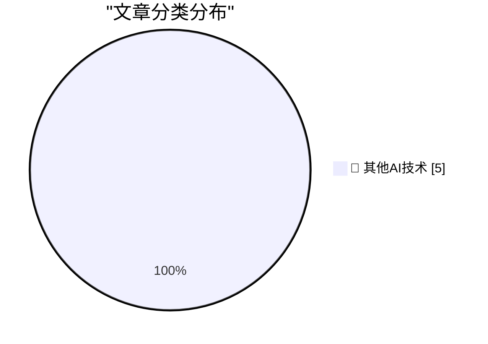

# 📰 AI 博客每日精选 — 2026-08-02

> 来自 98 个技术博客和社交媒体源，AI 精选 Top 5

## 🏆 今日必读

🥇 **Giving and taking credit in big tech companies**

[Giving and taking credit in big tech companies](https://seangoedecke.com/giving-and-taking-credit/) — seangoedecke.com · 21 小时前 · 🔬 其他AI技术

> Giving and taking credit in big tech companies

🥈 **Agent Fone**

[Agent Fone](https://fail.xyz/phone/) — daringfireball.net · 50 分钟前 · 🔬 其他AI技术

> Agent Fone

🥉 **Boris Cherny on Trying to Get Claude Code to Rewrite the Claude App**

[Boris Cherny on Trying to Get Claude Code to Rewrite the Claude App](https://www.ycrootaccess.com/p/boris-cherny-building-claude-code) — daringfireball.net · 51 分钟前 · 🔬 其他AI技术

> Boris Cherny on Trying to Get Claude Code to Rewrite the Claude App

4️⃣ **Mathematics Without Mathematicians**

[Mathematics Without Mathematicians](https://borretti.me/article/mathematics-without-mathematicians) — borretti.me · 21 小时前 · 🔬 其他AI技术

> Mathematics Without Mathematicians

5️⃣ **I'm (mostly) picking models on speed now, not intelligence**

[I'm (mostly) picking models on speed now, not intelligence](https://martinalderson.com/posts/speed-vs-intelligence/?utm_source=rss&amp;utm_medium=rss&amp;utm_campaign=feed) — martinalderson.com · 21 小时前 · 🔬 其他AI技术

> I'm (mostly) picking models on speed now, not intelligence

---

## 📊 数据概览

| 扫描源 | 抓取文章 | 时间范围 | 精选 |
|:---:|:---:|:---:|:---:|
| 78/98 | 2746 篇 → 5 篇 | 24h | **5 篇** |

### 分类分布

---

====================

## 🔬 其他AI技术

### 1. Giving and taking credit in big tech companies

[Giving and taking credit in big tech companies](https://seangoedecke.com/giving-and-taking-credit/) — **seangoedecke.com** · 21 小时前 · ⭐ 15/25

> Giving and taking credit in big tech companies

📌 其他AI技术

---

### 2. Agent Fone

[Agent Fone](https://fail.xyz/phone/) — **daringfireball.net** · 50 分钟前 · ⭐ 15/25

> Agent Fone

📌 其他AI技术

---

### 3. Boris Cherny on Trying to Get Claude Code to Rewrite the Claude App

[Boris Cherny on Trying to Get Claude Code to Rewrite the Claude App](https://www.ycrootaccess.com/p/boris-cherny-building-claude-code) — **daringfireball.net** · 51 分钟前 · ⭐ 15/25

> Boris Cherny on Trying to Get Claude Code to Rewrite the Claude App

📌 其他AI技术

---

### 4. Mathematics Without Mathematicians

[Mathematics Without Mathematicians](https://borretti.me/article/mathematics-without-mathematicians) — **borretti.me** · 21 小时前 · ⭐ 15/25

> Mathematics Without Mathematicians

📌 其他AI技术

---

### 5. I'm (mostly) picking models on speed now, not intelligence

[I'm (mostly) picking models on speed now, not intelligence](https://martinalderson.com/posts/speed-vs-intelligence/?utm_source=rss&amp;utm_medium=rss&amp;utm_campaign=feed) — **martinalderson.com** · 21 小时前 · ⭐ 15/25

> I'm (mostly) picking models on speed now, not intelligence

📌 其他AI技术

---

====================

*生成于 2026-08-02 21:52 | 扫描 78 源 → 获取 2746 篇 → 精选 5 篇*
*基于 [Hacker News Popularity Contest 2025](https://refactoringenglish.com/tools/hn-popularity/) RSS 源列表，由 [Andrej Karpathy](https://x.com/karpathy) 推荐*
*由「懂点儿AI」制作，欢迎关注同名微信公众号获取更多 AI 实用技巧 💡*
