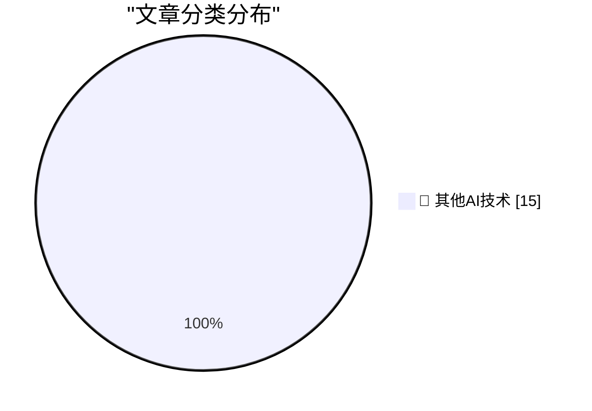

# 📰 AI 博客每日精选 — 2026-08-03

> 来自 98 个技术博客和社交媒体源，AI 精选 Top 15

## 🏆 今日必读

🥇 **John Ternus Has Rehired Former Hardware VP Laura Legros**

[John Ternus Has Rehired Former Hardware VP Laura Legros](https://www.macrumors.com/2026/08/03/apple-john-ternus-hiring-retired-vp/) — daringfireball.net · 4 分钟前 · 🔬 其他AI技术

> John Ternus Has Rehired Former Hardware VP Laura Legros

🥈 **The Information on Apple’s Unusual Use of iCloud for Confidential Work**

[The Information on Apple’s Unusual Use of iCloud for Confidential Work](https://www.theinformation.com/articles/apple-icloud-policy-fueled-employee-leaks-ahead-openai-suit?rc=jfy0lk) — daringfireball.net · 20 分钟前 · 🔬 其他AI技术

> The Information on Apple’s Unusual Use of iCloud for Confidential Work

🥉 **Om Malik’s Final Essay: ‘The Myth, the Mythos and the Man’**

[Om Malik’s Final Essay: ‘The Myth, the Mythos and the Man’](https://om.co/2026/06/07/the-myth-the-mythos-and-the-man/) — daringfireball.net · 1 小时前 · 🔬 其他AI技术

> Om Malik’s Final Essay: ‘The Myth, the Mythos and the Man’

4️⃣ **★ Why Apple Requires a Cellular Account Through a Big Three Carrier to Lease an iPhone**

[★ Why Apple Requires a Cellular Account Through a Big Three Carrier to Lease an iPhone](https://daringfireball.net/2026/08/followup_big_three_carrier_requirement) — daringfireball.net · 4 小时前 · 🔬 其他AI技术

> ★ Why Apple Requires a Cellular Account Through a Big Three Carrier to Lease an iPhone

5️⃣ **Ulysses S. Grant on the Future Dividing Line**

[Ulysses S. Grant on the Future Dividing Line](https://www.snopes.com/fact-check/grant-next-civil-war/) — daringfireball.net · 4 小时前 · 🔬 其他AI技术

> Ulysses S. Grant on the Future Dividing Line

---

## 📊 数据概览

| 扫描源 | 抓取文章 | 时间范围 | 精选 |
|:---:|:---:|:---:|:---:|
| 77/98 | 2709 篇 → 17 篇 | 24h | **15 篇** |

### 分类分布

---

====================

## 🔬 其他AI技术

### 1. John Ternus Has Rehired Former Hardware VP Laura Legros

[John Ternus Has Rehired Former Hardware VP Laura Legros](https://www.macrumors.com/2026/08/03/apple-john-ternus-hiring-retired-vp/) — **daringfireball.net** · 4 分钟前 · ⭐ 15/25

> John Ternus Has Rehired Former Hardware VP Laura Legros

📌 其他AI技术

---

### 2. The Information on Apple’s Unusual Use of iCloud for Confidential Work

[The Information on Apple’s Unusual Use of iCloud for Confidential Work](https://www.theinformation.com/articles/apple-icloud-policy-fueled-employee-leaks-ahead-openai-suit?rc=jfy0lk) — **daringfireball.net** · 20 分钟前 · ⭐ 15/25

> The Information on Apple’s Unusual Use of iCloud for Confidential Work

📌 其他AI技术

---

### 3. Om Malik’s Final Essay: ‘The Myth, the Mythos and the Man’

[Om Malik’s Final Essay: ‘The Myth, the Mythos and the Man’](https://om.co/2026/06/07/the-myth-the-mythos-and-the-man/) — **daringfireball.net** · 1 小时前 · ⭐ 15/25

> Om Malik’s Final Essay: ‘The Myth, the Mythos and the Man’

📌 其他AI技术

---

### 4. ★ Why Apple Requires a Cellular Account Through a Big Three Carrier to Lease an iPhone

[★ Why Apple Requires a Cellular Account Through a Big Three Carrier to Lease an iPhone](https://daringfireball.net/2026/08/followup_big_three_carrier_requirement) — **daringfireball.net** · 4 小时前 · ⭐ 15/25

> ★ Why Apple Requires a Cellular Account Through a Big Three Carrier to Lease an iPhone

📌 其他AI技术

---

### 5. Ulysses S. Grant on the Future Dividing Line

[Ulysses S. Grant on the Future Dividing Line](https://www.snopes.com/fact-check/grant-next-civil-war/) — **daringfireball.net** · 4 小时前 · ⭐ 15/25

> Ulysses S. Grant on the Future Dividing Line

📌 其他AI技术

---

### 6. Truth Social Launches Paid Early Access to Trump Posts

[Truth Social Launches Paid Early Access to Trump Posts](https://www.npr.org/2026/08/01/nx-s1-5912219/trump-truth-social-access-insider-trading) — **daringfireball.net** · 6 小时前 · ⭐ 15/25

> Truth Social Launches Paid Early Access to Trump Posts

📌 其他AI技术

---

### 7. Invisible Problems

[Invisible Problems](https://idiallo.com/blog/invisible-problems) — **idiallo.com** · 15 小时前 · ⭐ 15/25

> Invisible Problems

📌 其他AI技术

---

### 8. Pluralistic: Dualism (03 Aug 2026)

[Pluralistic: Dualism (03 Aug 2026)](https://pluralistic.net/2026/08/03/andor/) — **pluralistic.net** · 13 小时前 · ⭐ 15/25

> Pluralistic: Dualism (03 Aug 2026)

📌 其他AI技术

---

### 9. Book Review: The Field Guide to Understanding 'Human Error' by Sidney Dekker ★★★★☆

[Book Review: The Field Guide to Understanding 'Human Error' by Sidney Dekker ★★★★☆](https://shkspr.mobi/blog/2026/08/book-review-the-field-guide-to-understanding-human-error-by-sidney-dekker/) — **shkspr.mobi** · 10 小时前 · ⭐ 15/25

> Book Review: The Field Guide to Understanding 'Human Error' by Sidney Dekker ★★★★☆

📌 其他AI技术

---

### 10. Agentic coding techniques

[Agentic coding techniques](https://micahflee.com/agentic-coding-techniques/) — **micahflee.com** · 6 小时前 · ⭐ 15/25

> Agentic coding techniques

📌 其他AI技术

---

### 11. Why smarter AI models could drive up compute prices 10x

[Why smarter AI models could drive up compute prices 10x](https://www.dwarkesh.com/p/why-compute-might-get-10x-more-expensive-video) — **dwarkesh.com** · 4 小时前 · ⭐ 15/25

> Why smarter AI models could drive up compute prices 10x

📌 其他AI技术

---

### 12. Review: Job-Less Utopia

[Review: Job-Less Utopia](https://borretti.me/article/review-job-less-utopia) — **borretti.me** · 22 小时前 · ⭐ 15/25

> Review: Job-Less Utopia

📌 其他AI技术

---

### 13. The Caldera-SCO merger of 2000

[The Caldera-SCO merger of 2000](https://dfarq.homeip.net/the-caldera-sco-merger-of-2000/?utm_source=rss&#038;utm_medium=rss&#038;utm_campaign=the-caldera-sco-merger-of-2000) — **dfarq.homeip.net** · 11 小时前 · ⭐ 15/25

> The Caldera-SCO merger of 2000

📌 其他AI技术

---

### 14. Docs shouldn’t trail the code. The Aspire team used GitHub Agentic Workflows to turn merged features into cross-repo docs PRs, with scoped permission...

[Docs shouldn’t trail the code. The Aspire team used GitHub Agentic Workflows to turn merged features into cross-repo docs PRs, with scoped permission...](https://x.com/github/status/2084348327387132062) — **𝕏 @GitHub** · 3 小时前 · ⭐ 15/25

> Docs shouldn’t trail the code. The Aspire team used GitHub Agentic Workflows to turn merged features into cross-repo docs PRs, with scoped permission...

📌 其他AI技术

---

### 15. 📁 Notion ┃ ┣ 📁 System of Record ┃ ┣ 📁Databases ┃ ┣ 📁Meeting Notes ┃ ┣ 📁Version Control ┃ ┣ 📁Wiki ┃ ┣ 📁Projects ┃ ┣ ...

[📁 Notion ┃ ┣ 📁 System of Record ┃ ┣ 📁Databases ┃ ┣ 📁Meeting Notes ┃ ┣ 📁Version Control ┃ ┣ 📁Wiki ┃ ┣ 📁Projects ┃ ┣ ...](https://x.com/NotionHQ/status/2084314220389392509) — **𝕏 @NotionHQ** · 5 小时前 · ⭐ 15/25

> 📁 Notion ┃ ┣ 📁 System of Record ┃ ┣ 📁Databases ┃ ┣ 📁Meeting Notes ┃ ┣ 📁Version Control ┃ ┣ 📁Wiki ┃ ┣ 📁Projects ┃ ┣ ...

📌 其他AI技术

---

====================

*生成于 2026-08-03 22:05 | 扫描 77 源 → 获取 2709 篇 → 精选 15 篇*
*基于 [Hacker News Popularity Contest 2025](https://refactoringenglish.com/tools/hn-popularity/) RSS 源列表，由 [Andrej Karpathy](https://x.com/karpathy) 推荐*
*由「懂点儿AI」制作，欢迎关注同名微信公众号获取更多 AI 实用技巧 💡*
