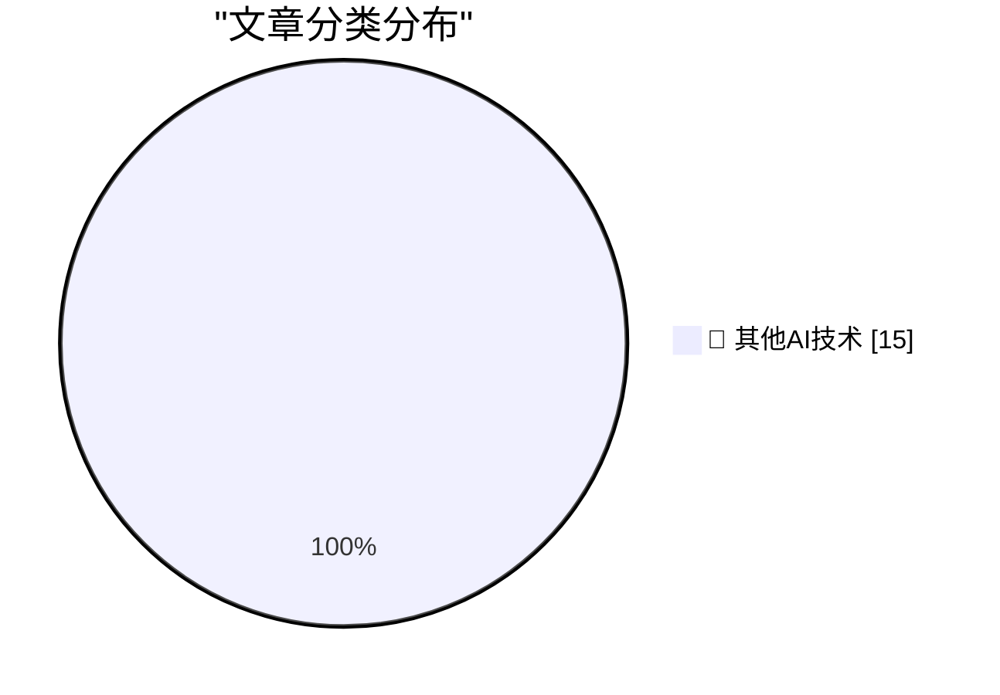

# 📰 AI 博客每日精选 — 2026-08-04

> 来自 98 个技术博客和社交媒体源，AI 精选 Top 15

## 🏆 今日必读

🥇 **Yours Truly on TBPN Yesterday**

[Yours Truly on TBPN Yesterday](https://www.youtube.com/live/ruL8Q-TsbbI?t=4085) — daringfireball.net · 3 小时前 · 🔬 其他AI技术

> Yours Truly on TBPN Yesterday

🥈 **Apple Seeks Preliminary Injunction Against OpenAI in Trade Secrets Case**

[Apple Seeks Preliminary Injunction Against OpenAI in Trade Secrets Case](https://www.reuters.com/legal/litigation/apple-seeks-preliminary-injunction-against-openai-trade-secrets-case-2026-08-04/) — daringfireball.net · 6 小时前 · 🔬 其他AI技术

> Apple Seeks Preliminary Injunction Against OpenAI in Trade Secrets Case

🥉 **Bending Spoons to Buy Airtable for $1.3 Billion**

[Bending Spoons to Buy Airtable for $1.3 Billion](https://techcrunch.com/2026/08/04/bending-spoons-to-buy-airtable-for-1-28b/) — daringfireball.net · 6 小时前 · 🔬 其他AI技术

> Bending Spoons to Buy Airtable for $1.3 Billion

4️⃣ **TerminalWidget 1.0**

[TerminalWidget 1.0](https://terminalwidget.app/) — daringfireball.net · 19 小时前 · 🔬 其他AI技术

> TerminalWidget 1.0

5️⃣ **[Sponsor] MCP vs. REST: The Right Way to Connect Agents to Your API**

[[Sponsor] MCP vs. REST: The Right Way to Connect Agents to Your API](https://workos.com/blog/mcp-vs-rest?utm_source=daringfireball&amp;utm_medium=newsletter&amp;utm_campaign=q32026) — daringfireball.net · 23 小时前 · 🔬 其他AI技术

> [Sponsor] MCP vs. REST: The Right Way to Connect Agents to Your API

---

## 📊 数据概览

| 扫描源 | 抓取文章 | 时间范围 | 精选 |
|:---:|:---:|:---:|:---:|
| 79/98 | 2761 篇 → 20 篇 | 24h | **15 篇** |

### 分类分布

---

====================

## 🔬 其他AI技术

### 1. Yours Truly on TBPN Yesterday

[Yours Truly on TBPN Yesterday](https://www.youtube.com/live/ruL8Q-TsbbI?t=4085) — **daringfireball.net** · 3 小时前 · ⭐ 15/25

> Yours Truly on TBPN Yesterday

📌 其他AI技术

---

### 2. Apple Seeks Preliminary Injunction Against OpenAI in Trade Secrets Case

[Apple Seeks Preliminary Injunction Against OpenAI in Trade Secrets Case](https://www.reuters.com/legal/litigation/apple-seeks-preliminary-injunction-against-openai-trade-secrets-case-2026-08-04/) — **daringfireball.net** · 6 小时前 · ⭐ 15/25

> Apple Seeks Preliminary Injunction Against OpenAI in Trade Secrets Case

📌 其他AI技术

---

### 3. Bending Spoons to Buy Airtable for $1.3 Billion

[Bending Spoons to Buy Airtable for $1.3 Billion](https://techcrunch.com/2026/08/04/bending-spoons-to-buy-airtable-for-1-28b/) — **daringfireball.net** · 6 小时前 · ⭐ 15/25

> Bending Spoons to Buy Airtable for $1.3 Billion

📌 其他AI技术

---

### 4. TerminalWidget 1.0

[TerminalWidget 1.0](https://terminalwidget.app/) — **daringfireball.net** · 19 小时前 · ⭐ 15/25

> TerminalWidget 1.0

📌 其他AI技术

---

### 5. [Sponsor] MCP vs. REST: The Right Way to Connect Agents to Your API

[[Sponsor] MCP vs. REST: The Right Way to Connect Agents to Your API](https://workos.com/blog/mcp-vs-rest?utm_source=daringfireball&amp;utm_medium=newsletter&amp;utm_campaign=q32026) — **daringfireball.net** · 23 小时前 · ⭐ 15/25

> [Sponsor] MCP vs. REST: The Right Way to Connect Agents to Your API

📌 其他AI技术

---

### 6. Pluralistic: Post-American compute for a post-American Internet (04 Aug 2026)

[Pluralistic: Post-American compute for a post-American Internet (04 Aug 2026)](https://pluralistic.net/2026/08/04/technology-freedom-cooperative/) — **pluralistic.net** · 10 小时前 · ⭐ 15/25

> Pluralistic: Post-American compute for a post-American Internet (04 Aug 2026)

📌 其他AI技术

---

### 7. Gig Review: Belle & Sebastian - If You’re Feeling Sinister at Margate Dreamland ★★★★★

[Gig Review: Belle & Sebastian - If You’re Feeling Sinister at Margate Dreamland ★★★★★](https://shkspr.mobi/blog/2026/08/gig-review-belle-sebastian-if-youre-feeling-sinister-at-margate-dreamland/) — **shkspr.mobi** · 10 小时前 · ⭐ 15/25

> Gig Review: Belle & Sebastian - If You’re Feeling Sinister at Margate Dreamland ★★★★★

📌 其他AI技术

---

### 8. brew install actions/checkout

[brew install actions/checkout](https://nesbitt.io/2026/08/04/brew-install-actions-checkout.html) — **nesbitt.io** · 12 小时前 · ⭐ 15/25

> brew install actions/checkout

📌 其他AI技术

---

### 9. The AI Demand Bubble

[The AI Demand Bubble](https://www.wheresyoured.at/the-ai-demand-bubble/) — **wheresyoured.at** · 6 小时前 · ⭐ 15/25

> The AI Demand Bubble

📌 其他AI技术

---

### 10. Radio Shack’s TRS-80: Introduced Aug 3, 1977

[Radio Shack’s TRS-80: Introduced Aug 3, 1977](https://dfarq.homeip.net/radio-shacks-trs-80-introduced-aug-3-1977/?utm_source=rss&#038;utm_medium=rss&#038;utm_campaign=radio-shacks-trs-80-introduced-aug-3-1977) — **dfarq.homeip.net** · 11 小时前 · ⭐ 15/25

> Radio Shack’s TRS-80: Introduced Aug 3, 1977

📌 其他AI技术

---

### 11. Relative velocity and closing speed

[Relative velocity and closing speed](https://eli.thegreenplace.net/2026/relative-velocity-and-closing-speed/) — **eli.thegreenplace.net** · 19 小时前 · ⭐ 15/25

> Relative velocity and closing speed

📌 其他AI技术

---

### 12. We're detailing two new incidents that occurred during external cyber evaluations conducted by independent evaluation partners. We outline what happen...

[We're detailing two new incidents that occurred during external cyber evaluations conducted by independent evaluation partners. We outline what happen...](https://x.com/OpenAI/status/2084747580693426555) — **𝕏 @OpenAI** · 1 小时前 · ⭐ 15/25

> We're detailing two new incidents that occurred during external cyber evaluations conducted by independent evaluation partners. We outline what happen...

📌 其他AI技术

---

### 13. RT npm: npm is rotating write-scoped npm Granular Access Tokens that bypass 2FA as a precaution following a now-contained security incident. This does...

[RT npm: npm is rotating write-scoped npm Granular Access Tokens that bypass 2FA as a precaution following a now-contained security incident. This does...](https://x.com/github/status/2084741575897456785) — **𝕏 @GitHub** · 1 小时前 · ⭐ 15/25

> RT npm: npm is rotating write-scoped npm Granular Access Tokens that bypass 2FA as a precaution following a now-contained security incident. This does...

📌 其他AI技术

---

### 14. RT Andrea: Your coding agent is fast, Your reviewer is a person with a a coffee. When stacked PRs earned their branches...and when they don't 👇🏼...

[RT Andrea: Your coding agent is fast, Your reviewer is a person with a a coffee. When stacked PRs earned their branches...and when they don't 👇🏼...](https://x.com/github/status/2084691126276198908) — **𝕏 @GitHub** · 5 小时前 · ⭐ 15/25

> RT Andrea: Your coding agent is fast, Your reviewer is a person with a a coffee. When stacked PRs earned their branches...and when they don't 👇🏼...

📌 其他AI技术

---

### 15. RT chloe venn: i’m in NYC celebrating 2 years at Notion <3

[RT chloe venn: i’m in NYC celebrating 2 years at Notion <3](https://x.com/NotionHQ/status/2084748852842917950) — **𝕏 @NotionHQ** · 3 小时前 · ⭐ 15/25

> RT chloe venn: i’m in NYC celebrating 2 years at Notion <3

📌 其他AI技术

---

====================

*生成于 2026-08-04 22:08 | 扫描 79 源 → 获取 2761 篇 → 精选 15 篇*
*基于 [Hacker News Popularity Contest 2025](https://refactoringenglish.com/tools/hn-popularity/) RSS 源列表，由 [Andrej Karpathy](https://x.com/karpathy) 推荐*
*由「懂点儿AI」制作，欢迎关注同名微信公众号获取更多 AI 实用技巧 💡*
