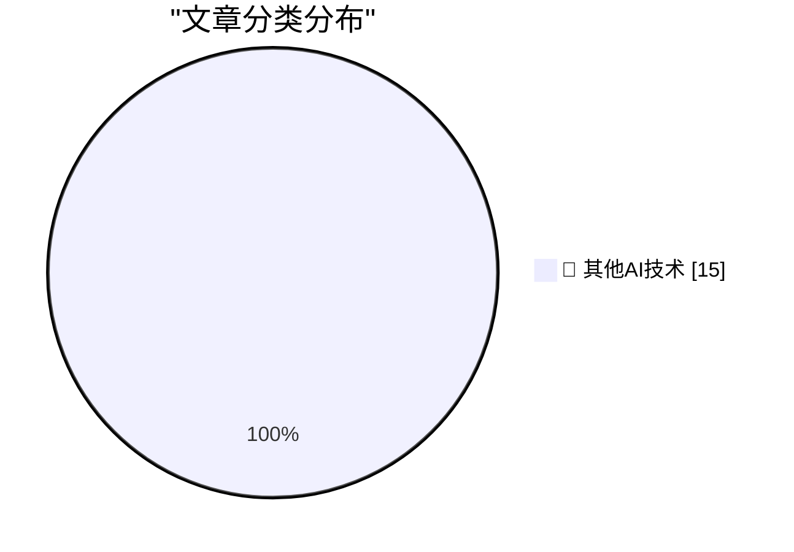

# 📰 AI 博客每日精选 — 2026-08-05

> 来自 98 个技术博客和社交媒体源，AI 精选 Top 15

## 🏆 今日必读

🥇 **Proxmox officially supports Arm, with some caveats**

[Proxmox officially supports Arm, with some caveats](https://www.jeffgeerling.com/blog/2026/proxmox-ve-arm-official/) — jeffgeerling.com · 5 小时前 · 🔬 其他AI技术

> Proxmox officially supports Arm, with some caveats

🥈 **Uh, I’m Pretty Sure People Would Know**

[Uh, I’m Pretty Sure People Would Know](https://www.nytimes.com/2026/08/04/magazine/trump-rfk-steak-kimchi-diet.html?unlocked_article_code=1.21A.ymed.OyFVP85xWyNK) — daringfireball.net · 16 分钟前 · 🔬 其他AI技术

> Uh, I’m Pretty Sure People Would Know

🥉 **Sam Altman, Definitely Not a Ghoul**

[Sam Altman, Definitely Not a Ghoul](https://www.businessinsider.com/ai-parenting-debate-sam-altman-2026-8) — daringfireball.net · 59 分钟前 · 🔬 其他AI技术

> Sam Altman, Definitely Not a Ghoul

4️⃣ **David Pogue: ‘Alexa+ Is a Buggy Embarrassment’**

[David Pogue: ‘Alexa+ Is a Buggy Embarrassment’](https://pogueman.substack.com/p/alexa-is-a-buggy-embarrassment) — daringfireball.net · 1 小时前 · 🔬 其他AI技术

> David Pogue: ‘Alexa+ Is a Buggy Embarrassment’

5️⃣ **Apple News Ad of the Week**

[Apple News Ad of the Week](https://mastodon.social/@gruber/117044545772667716) — daringfireball.net · 2 小时前 · 🔬 其他AI技术

> Apple News Ad of the Week

---

## 📊 数据概览

| 扫描源 | 抓取文章 | 时间范围 | 精选 |
|:---:|:---:|:---:|:---:|
| 76/98 | 2698 篇 → 22 篇 | 24h | **15 篇** |

### 分类分布

---

====================

## 🔬 其他AI技术

### 1. Proxmox officially supports Arm, with some caveats

[Proxmox officially supports Arm, with some caveats](https://www.jeffgeerling.com/blog/2026/proxmox-ve-arm-official/) — **jeffgeerling.com** · 5 小时前 · ⭐ 15/25

> Proxmox officially supports Arm, with some caveats

📌 其他AI技术

---

### 2. Uh, I’m Pretty Sure People Would Know

[Uh, I’m Pretty Sure People Would Know](https://www.nytimes.com/2026/08/04/magazine/trump-rfk-steak-kimchi-diet.html?unlocked_article_code=1.21A.ymed.OyFVP85xWyNK) — **daringfireball.net** · 16 分钟前 · ⭐ 15/25

> Uh, I’m Pretty Sure People Would Know

📌 其他AI技术

---

### 3. Sam Altman, Definitely Not a Ghoul

[Sam Altman, Definitely Not a Ghoul](https://www.businessinsider.com/ai-parenting-debate-sam-altman-2026-8) — **daringfireball.net** · 59 分钟前 · ⭐ 15/25

> Sam Altman, Definitely Not a Ghoul

📌 其他AI技术

---

### 4. David Pogue: ‘Alexa+ Is a Buggy Embarrassment’

[David Pogue: ‘Alexa+ Is a Buggy Embarrassment’](https://pogueman.substack.com/p/alexa-is-a-buggy-embarrassment) — **daringfireball.net** · 1 小时前 · ⭐ 15/25

> David Pogue: ‘Alexa+ Is a Buggy Embarrassment’

📌 其他AI技术

---

### 5. Apple News Ad of the Week

[Apple News Ad of the Week](https://mastodon.social/@gruber/117044545772667716) — **daringfireball.net** · 2 小时前 · ⭐ 15/25

> Apple News Ad of the Week

📌 其他AI技术

---

### 6. Paul Thurrott Reviews the HP OmniBook Ultra 14, With Qualcomm’s Snapdragon X2

[Paul Thurrott Reviews the HP OmniBook Ultra 14, With Qualcomm’s Snapdragon X2](https://www.thurrott.com/mobile/copilot-pc/340107/hp-omnibook-ultra-14-snapdragon-x2-review) — **daringfireball.net** · 6 小时前 · ⭐ 15/25

> Paul Thurrott Reviews the HP OmniBook Ultra 14, With Qualcomm’s Snapdragon X2

📌 其他AI技术

---

### 7. Hacker News Thread on OpenAI’s ‘Apple Is Getting This Wrong’ Post

[Hacker News Thread on OpenAI’s ‘Apple Is Getting This Wrong’ Post](https://news.ycombinator.com/item?id=49164649) — **daringfireball.net** · 7 小时前 · ⭐ 15/25

> Hacker News Thread on OpenAI’s ‘Apple Is Getting This Wrong’ Post

📌 其他AI技术

---

### 8. ★ OpenAI Responds to Apple’s Lawsuit and Motion for Preliminary Injunction: ‘Apple Is Getting This Wrong’

[★ OpenAI Responds to Apple’s Lawsuit and Motion for Preliminary Injunction: ‘Apple Is Getting This Wrong’](https://daringfireball.net/2026/08/openai_apple_is_getting_this_wrong) — **daringfireball.net** · 23 小时前 · ⭐ 15/25

> ★ OpenAI Responds to Apple’s Lawsuit and Motion for Preliminary Injunction: ‘Apple Is Getting This Wrong’

📌 其他AI技术

---

### 9. Pluralistic: Google is a scammer's paradise (05 Aug 2026)

[Pluralistic: Google is a scammer's paradise (05 Aug 2026)](https://pluralistic.net/2026/08/05/absentee-landlord/) — **pluralistic.net** · 11 小时前 · ⭐ 15/25

> Pluralistic: Google is a scammer's paradise (05 Aug 2026)

📌 其他AI技术

---

### 10. How Compiler Explorer Runs on AWS in 2026

[How Compiler Explorer Runs on AWS in 2026](http://xania.org/202608/how-compiler-explorer-runs-on-aws?utm_source=feed&amp;utm_medium=rss) — **xania.org** · 6 小时前 · ⭐ 15/25

> How Compiler Explorer Runs on AWS in 2026

📌 其他AI技术

---

### 11. News: Microsoft Disclosures Suggest OpenAI Sales Account For Around 70% Of FY26 AI Revenue, more than 7% of FY26 Revenue

[News: Microsoft Disclosures Suggest OpenAI Sales Account For Around 70% Of FY26 AI Revenue, more than 7% of FY26 Revenue](https://www.wheresyoured.at/news-microsoft-disclosures-suggest-openai-sales-account-for-around-70-of-fy26-ai-revenue-more-than-7-of-fy26-revenue/) — **wheresyoured.at** · 3 小时前 · ⭐ 15/25

> News: Microsoft Disclosures Suggest OpenAI Sales Account For Around 70% Of FY26 AI Revenue, more than 7% of FY26 Revenue

📌 其他AI技术

---

### 12. Ebay’s 1995 debut

[Ebay’s 1995 debut](https://dfarq.homeip.net/ebays-1995-debut/?utm_source=rss&#038;utm_medium=rss&#038;utm_campaign=ebays-1995-debut) — **dfarq.homeip.net** · 11 小时前 · ⭐ 15/25

> Ebay’s 1995 debut

📌 其他AI技术

---

### 13. What does it take to modernize an 8-year-old codebase? Stacks (on stacks). 🥞 http://x.com/i/article/2084722601482657792

[What does it take to modernize an 8-year-old codebase? Stacks (on stacks). 🥞 http://x.com/i/article/2084722601482657792](https://x.com/github/status/2085039546576806332) — **𝕏 @GitHub** · 5 小时前 · ⭐ 15/25

> What does it take to modernize an 8-year-old codebase? Stacks (on stacks). 🥞 http://x.com/i/article/2084722601482657792

📌 其他AI技术

---

### 14. Small QoL improvement: you can now share pages with your Custom Agents straight from the Share menu. Easier to give them all the context they need �...

[Small QoL improvement: you can now share pages with your Custom Agents straight from the Share menu. Easier to give them all the context they need �...](https://x.com/NotionHQ/status/2085123644578254961) — **𝕏 @NotionHQ** · 9 分钟前 · ⭐ 15/25

> Small QoL improvement: you can now share pages with your Custom Agents straight from the Share menu. Easier to give them all the context they need �...

📌 其他AI技术

---

### 15. RT Stephen Wu: Developers: we’re opening up an early alpha for custom blocks. It’s a new Notion primitive for building interactive blocks that can r...

[RT Stephen Wu: Developers: we’re opening up an early alpha for custom blocks. It’s a new Notion primitive for building interactive blocks that can r...](https://x.com/NotionHQ/status/2085062765274914864) — **𝕏 @NotionHQ** · 4 小时前 · ⭐ 15/25

> RT Stephen Wu: Developers: we’re opening up an early alpha for custom blocks. It’s a new Notion primitive for building interactive blocks that can r...

📌 其他AI技术

---

====================

*生成于 2026-08-05 22:09 | 扫描 76 源 → 获取 2698 篇 → 精选 15 篇*
*基于 [Hacker News Popularity Contest 2025](https://refactoringenglish.com/tools/hn-popularity/) RSS 源列表，由 [Andrej Karpathy](https://x.com/karpathy) 推荐*
*由「懂点儿AI」制作，欢迎关注同名微信公众号获取更多 AI 实用技巧 💡*
