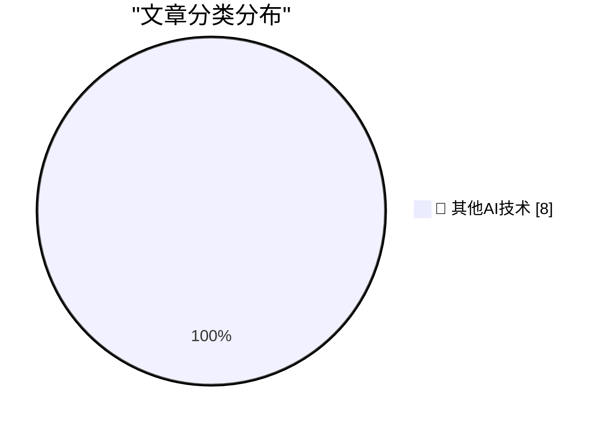

# 📰 AI 博客每日精选 — 2026-08-08

> 来自 98 个技术博客和社交媒体源，AI 精选 Top 8

## 🏆 今日必读

🥇 **Corrupt Minds Think Alike**

[Corrupt Minds Think Alike](https://www.nytimes.com/2026/08/06/business/fifa-world-cup-privatization.html?unlocked_article_code=1.3VA.4zqH.Pul7X9bQ2kv0&amp;smid=bs-share) — daringfireball.net · 54 分钟前 · 🔬 其他AI技术

> Corrupt Minds Think Alike

🥈 **Maybe ‘Steal Underpants by Blowing a Fortune on AI Tokens’ Is, in Fact, Not a Good Business Plan**

[Maybe ‘Steal Underpants by Blowing a Fortune on AI Tokens’ Is, in Fact, Not a Good Business Plan](https://www.404media.co/the-tokenpocalypse-is-here-companies-are-scrambling-to-stop-spending-so-much-on-ai/) — daringfireball.net · 1 小时前 · 🔬 其他AI技术

> Maybe ‘Steal Underpants by Blowing a Fortune on AI Tokens’ Is, in Fact, Not a Good Business Plan

🥉 **Pluralistic: Digital sewer socialism (08 Aug 2026)**

[Pluralistic: Digital sewer socialism (08 Aug 2026)](https://pluralistic.net/2026/08/08/find-yourself-a-city/) — pluralistic.net · 12 小时前 · 🔬 其他AI技术

> Pluralistic: Digital sewer socialism (08 Aug 2026)

4️⃣ **[RSS Club] I got an NLnet grant!**

[[RSS Club] I got an NLnet grant!](https://shkspr.mobi/blog/2026/08/rss-club-i-got-an-nlnet-grant/) — shkspr.mobi · 9 小时前 · 🔬 其他AI技术

> [RSS Club] I got an NLnet grant!

5️⃣ **This Week in Package Management: 8 August 2026**

[This Week in Package Management: 8 August 2026](https://nesbitt.io/2026/08/08/this-week-in-package-management.html) — nesbitt.io · 11 小时前 · 🔬 其他AI技术

> This Week in Package Management: 8 August 2026

---

## 📊 数据概览

| 扫描源 | 抓取文章 | 时间范围 | 精选 |
|:---:|:---:|:---:|:---:|
| 73/98 | 2666 篇 → 8 篇 | 24h | **8 篇** |

### 分类分布

---

====================

## 🔬 其他AI技术

### 1. Corrupt Minds Think Alike

[Corrupt Minds Think Alike](https://www.nytimes.com/2026/08/06/business/fifa-world-cup-privatization.html?unlocked_article_code=1.3VA.4zqH.Pul7X9bQ2kv0&amp;smid=bs-share) — **daringfireball.net** · 54 分钟前 · ⭐ 15/25

> Corrupt Minds Think Alike

📌 其他AI技术

---

### 2. Maybe ‘Steal Underpants by Blowing a Fortune on AI Tokens’ Is, in Fact, Not a Good Business Plan

[Maybe ‘Steal Underpants by Blowing a Fortune on AI Tokens’ Is, in Fact, Not a Good Business Plan](https://www.404media.co/the-tokenpocalypse-is-here-companies-are-scrambling-to-stop-spending-so-much-on-ai/) — **daringfireball.net** · 1 小时前 · ⭐ 15/25

> Maybe ‘Steal Underpants by Blowing a Fortune on AI Tokens’ Is, in Fact, Not a Good Business Plan

📌 其他AI技术

---

### 3. Pluralistic: Digital sewer socialism (08 Aug 2026)

[Pluralistic: Digital sewer socialism (08 Aug 2026)](https://pluralistic.net/2026/08/08/find-yourself-a-city/) — **pluralistic.net** · 12 小时前 · ⭐ 15/25

> Pluralistic: Digital sewer socialism (08 Aug 2026)

📌 其他AI技术

---

### 4. [RSS Club] I got an NLnet grant!

[[RSS Club] I got an NLnet grant!](https://shkspr.mobi/blog/2026/08/rss-club-i-got-an-nlnet-grant/) — **shkspr.mobi** · 9 小时前 · ⭐ 15/25

> [RSS Club] I got an NLnet grant!

📌 其他AI技术

---

### 5. This Week in Package Management: 8 August 2026

[This Week in Package Management: 8 August 2026](https://nesbitt.io/2026/08/08/this-week-in-package-management.html) — **nesbitt.io** · 11 小时前 · ⭐ 15/25

> This Week in Package Management: 8 August 2026

📌 其他AI技术

---

### 6. 👀🔜☕️

[👀🔜☕️](https://x.com/NotionHQ/status/2085852077213819335) — **𝕏 @NotionHQ** · 23 小时前 · ⭐ 15/25

> 👀🔜☕️

📌 其他AI技术

---

### 7. RT alli: I may talk more to my @NotionHQ agent than my husband at this point

[RT alli: I may talk more to my @NotionHQ agent than my husband at this point](https://x.com/NotionHQ/status/2085851557451440502) — **𝕏 @NotionHQ** · 23 小时前 · ⭐ 15/25

> RT alli: I may talk more to my @NotionHQ agent than my husband at this point

📌 其他AI技术

---

### 8. “Asking chat” is great for blue-sky planning. But good stuff often gets lost in the thread. Use MCP to turn your chat into a Notion page your entire...

[“Asking chat” is great for blue-sky planning. But good stuff often gets lost in the thread. Use MCP to turn your chat into a Notion page your entire...](https://x.com/NotionHQ/status/2085842998643052789) — **𝕏 @NotionHQ** · 23 小时前 · ⭐ 15/25

> “Asking chat” is great for blue-sky planning. But good stuff often gets lost in the thread. Use MCP to turn your chat into a Notion page your entire...

📌 其他AI技术

---

====================

*生成于 2026-08-08 21:26 | 扫描 73 源 → 获取 2666 篇 → 精选 8 篇*
*基于 [Hacker News Popularity Contest 2025](https://refactoringenglish.com/tools/hn-popularity/) RSS 源列表，由 [Andrej Karpathy](https://x.com/karpathy) 推荐*
*由「懂点儿AI」制作，欢迎关注同名微信公众号获取更多 AI 实用技巧 💡*
