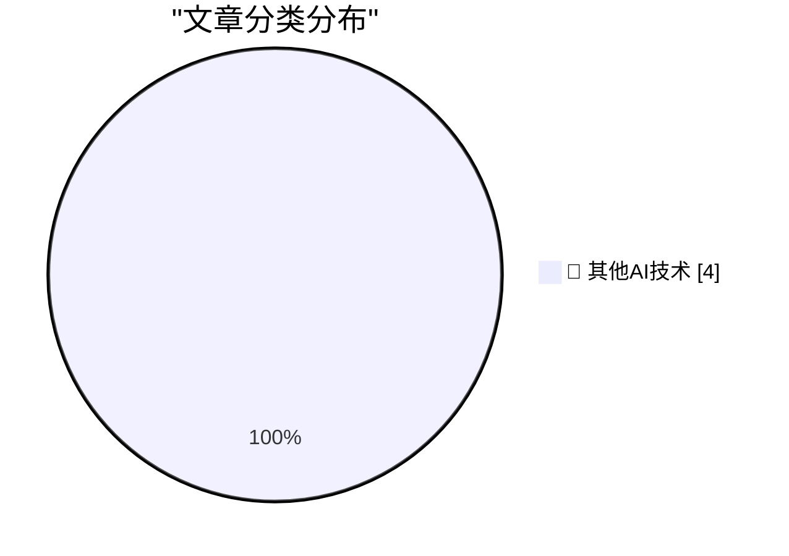

# 📰 AI 博客每日精选 — 2026-08-09

> 来自 98 个技术博客和社交媒体源，AI 精选 Top 4

## 🏆 今日必读

🥇 **★ Retraction: The App Store Rejection of the Week That Was, in Fact, a Correct Rejection**

[★ Retraction: The App Store Rejection of the Week That Was, in Fact, a Correct Rejection](https://daringfireball.net/2026/08/retraction_app_store_rejection_of_the_week) — daringfireball.net · 18 小时前 · 🔬 其他AI技术

> ★ Retraction: The App Store Rejection of the Week That Was, in Fact, a Correct Rejection

🥈 **Edinburgh Fringe: 4 Aussies For Aussies - The Raging Bull ★★⯪☆☆**

[Edinburgh Fringe: 4 Aussies For Aussies - The Raging Bull ★★⯪☆☆](https://shkspr.mobi/blog/2026/08/edinburgh-fringe-4-aussies-for-aussies-the-raging-bull/) — shkspr.mobi · 5 小时前 · 🔬 其他AI技术

> Edinburgh Fringe: 4 Aussies For Aussies - The Raging Bull ★★⯪☆☆

🥉 **Against Doomerism**

[Against Doomerism](https://shkspr.mobi/blog/2026/08/against-doomerism/) — shkspr.mobi · 9 小时前 · 🔬 其他AI技术

> Against Doomerism

4️⃣ **Tracking down a Zsh history data loss bug 🐞**

[Tracking down a Zsh history data loss bug 🐞](https://michael.stapelberg.ch/posts/2026-08-09-zsh-history-truncation-bug/) — michael.stapelberg.ch · 13 小时前 · 🔬 其他AI技术

> Tracking down a Zsh history data loss bug 🐞

---

## 📊 数据概览

| 扫描源 | 抓取文章 | 时间范围 | 精选 |
|:---:|:---:|:---:|:---:|
| 77/98 | 2722 篇 → 4 篇 | 24h | **4 篇** |

### 分类分布

---

====================

## 🔬 其他AI技术

### 1. ★ Retraction: The App Store Rejection of the Week That Was, in Fact, a Correct Rejection

[★ Retraction: The App Store Rejection of the Week That Was, in Fact, a Correct Rejection](https://daringfireball.net/2026/08/retraction_app_store_rejection_of_the_week) — **daringfireball.net** · 18 小时前 · ⭐ 15/25

> ★ Retraction: The App Store Rejection of the Week That Was, in Fact, a Correct Rejection

📌 其他AI技术

---

### 2. Edinburgh Fringe: 4 Aussies For Aussies - The Raging Bull ★★⯪☆☆

[Edinburgh Fringe: 4 Aussies For Aussies - The Raging Bull ★★⯪☆☆](https://shkspr.mobi/blog/2026/08/edinburgh-fringe-4-aussies-for-aussies-the-raging-bull/) — **shkspr.mobi** · 5 小时前 · ⭐ 15/25

> Edinburgh Fringe: 4 Aussies For Aussies - The Raging Bull ★★⯪☆☆

📌 其他AI技术

---

### 3. Against Doomerism

[Against Doomerism](https://shkspr.mobi/blog/2026/08/against-doomerism/) — **shkspr.mobi** · 9 小时前 · ⭐ 15/25

> Against Doomerism

📌 其他AI技术

---

### 4. Tracking down a Zsh history data loss bug 🐞

[Tracking down a Zsh history data loss bug 🐞](https://michael.stapelberg.ch/posts/2026-08-09-zsh-history-truncation-bug/) — **michael.stapelberg.ch** · 13 小时前 · ⭐ 15/25

> Tracking down a Zsh history data loss bug 🐞

📌 其他AI技术

---

====================

*生成于 2026-08-09 21:28 | 扫描 77 源 → 获取 2722 篇 → 精选 4 篇*
*基于 [Hacker News Popularity Contest 2025](https://refactoringenglish.com/tools/hn-popularity/) RSS 源列表，由 [Andrej Karpathy](https://x.com/karpathy) 推荐*
*由「懂点儿AI」制作，欢迎关注同名微信公众号获取更多 AI 实用技巧 💡*
