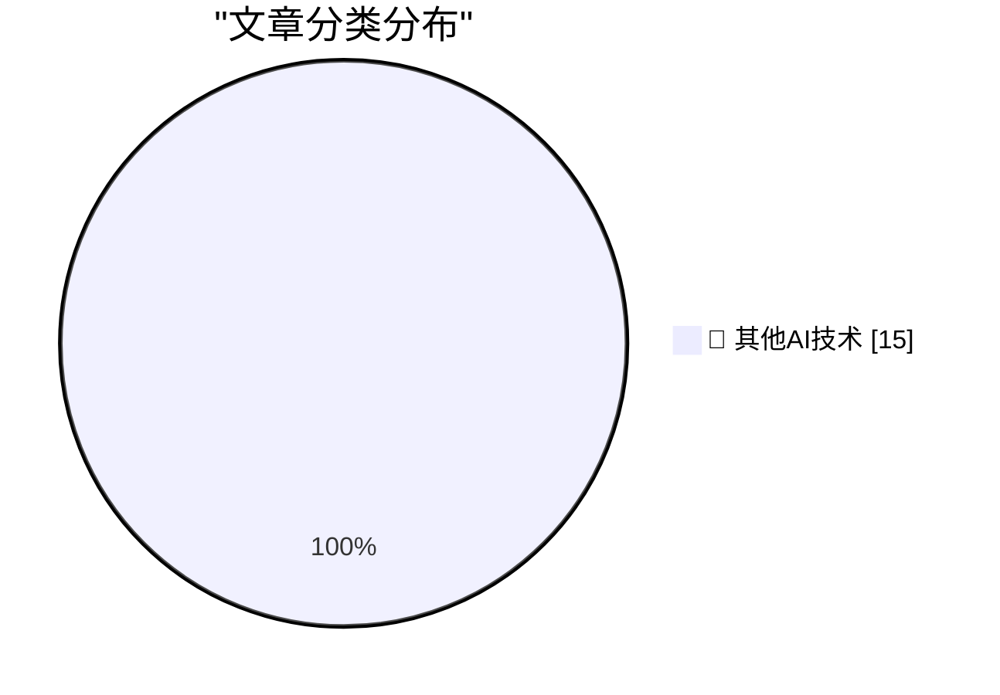

# 📰 AI 博客每日精选 — 2026-08-10

> 来自 98 个技术博客和社交媒体源，AI 精选 Top 15

## 🏆 今日必读

🥇 **Advanced AI sycophancy**

[Advanced AI sycophancy](https://seangoedecke.com/advanced-ai-sycophancy/) — seangoedecke.com · 21 小时前 · 🔬 其他AI技术

> Advanced AI sycophancy

🥈 **‘Friday Night Baseball’ Will Start Broadcasting Games Live, in Apple Immersive, on Vision Pro**

[‘Friday Night Baseball’ Will Start Broadcasting Games Live, in Apple Immersive, on Vision Pro](https://www.apple.com/newsroom/2026/08/apple-mlb-announce-september-friday-night-baseball-schedule/) — daringfireball.net · 50 分钟前 · 🔬 其他AI技术

> ‘Friday Night Baseball’ Will Start Broadcasting Games Live, in Apple Immersive, on Vision Pro

🥉 **Michael Tsai on My Retraction of the Astrology/Astronomy App Store Rejection Story**

[Michael Tsai on My Retraction of the Astrology/Astronomy App Store Rejection Story](https://mjtsai.com/blog/2026/08/07/dark-hours-rejected-from-the-app-store/) — daringfireball.net · 1 小时前 · 🔬 其他AI技术

> Michael Tsai on My Retraction of the Astrology/Astronomy App Store Rejection Story

4️⃣ **‘The Problem With Vibe-Coded Flattery’**

[‘The Problem With Vibe-Coded Flattery’](https://tedium.co/2026/08/09/vibe-coding-insincerity/) — daringfireball.net · 4 小时前 · 🔬 其他AI技术

> ‘The Problem With Vibe-Coded Flattery’

5️⃣ **The NYT and WSJ on Apple, China, and the RAM Crisis**

[The NYT and WSJ on Apple, China, and the RAM Crisis](https://www.nytimes.com/2026/08/10/technology/memory-chip-shortage-ai.html?unlocked_article_code=1.4VA.49f7.Qj8S541DkkOz) — daringfireball.net · 6 小时前 · 🔬 其他AI技术

> The NYT and WSJ on Apple, China, and the RAM Crisis

---

## 📊 数据概览

| 扫描源 | 抓取文章 | 时间范围 | 精选 |
|:---:|:---:|:---:|:---:|
| 77/98 | 2737 篇 → 21 篇 | 24h | **15 篇** |

### 分类分布

---

====================

## 🔬 其他AI技术

### 1. Advanced AI sycophancy

[Advanced AI sycophancy](https://seangoedecke.com/advanced-ai-sycophancy/) — **seangoedecke.com** · 21 小时前 · ⭐ 15/25

> Advanced AI sycophancy

📌 其他AI技术

---

### 2. ‘Friday Night Baseball’ Will Start Broadcasting Games Live, in Apple Immersive, on Vision Pro

[‘Friday Night Baseball’ Will Start Broadcasting Games Live, in Apple Immersive, on Vision Pro](https://www.apple.com/newsroom/2026/08/apple-mlb-announce-september-friday-night-baseball-schedule/) — **daringfireball.net** · 50 分钟前 · ⭐ 15/25

> ‘Friday Night Baseball’ Will Start Broadcasting Games Live, in Apple Immersive, on Vision Pro

📌 其他AI技术

---

### 3. Michael Tsai on My Retraction of the Astrology/Astronomy App Store Rejection Story

[Michael Tsai on My Retraction of the Astrology/Astronomy App Store Rejection Story](https://mjtsai.com/blog/2026/08/07/dark-hours-rejected-from-the-app-store/) — **daringfireball.net** · 1 小时前 · ⭐ 15/25

> Michael Tsai on My Retraction of the Astrology/Astronomy App Store Rejection Story

📌 其他AI技术

---

### 4. ‘The Problem With Vibe-Coded Flattery’

[‘The Problem With Vibe-Coded Flattery’](https://tedium.co/2026/08/09/vibe-coding-insincerity/) — **daringfireball.net** · 4 小时前 · ⭐ 15/25

> ‘The Problem With Vibe-Coded Flattery’

📌 其他AI技术

---

### 5. The NYT and WSJ on Apple, China, and the RAM Crisis

[The NYT and WSJ on Apple, China, and the RAM Crisis](https://www.nytimes.com/2026/08/10/technology/memory-chip-shortage-ai.html?unlocked_article_code=1.4VA.49f7.Qj8S541DkkOz) — **daringfireball.net** · 6 小时前 · ⭐ 15/25

> The NYT and WSJ on Apple, China, and the RAM Crisis

📌 其他AI技术

---

### 6. WorkOS: Connect Your Agents to Your API

[WorkOS: Connect Your Agents to Your API](https://workos.com/blog/mcp-vs-rest?utm_source=daringfireball&amp;utm_medium=newsletter&amp;utm_campaign=q32026) — **daringfireball.net** · 21 小时前 · ⭐ 15/25

> WorkOS: Connect Your Agents to Your API

📌 其他AI技术

---

### 7. Failing after Success

[Failing after Success](https://idiallo.com/blog/failing-after-success) — **idiallo.com** · 14 小时前 · ⭐ 15/25

> Failing after Success

📌 其他AI技术

---

### 8. When the Aliens Finally Came to Visit

[When the Aliens Finally Came to Visit](https://idiallo.com/byte-size/when-the-aliens-came-to-visit) — **idiallo.com** · 17 小时前 · ⭐ 15/25

> When the Aliens Finally Came to Visit

📌 其他AI技术

---

### 9. Pluralistic: The bureaucratic AI arms-race is mutually assured destruction (10 Aug 2026)

[Pluralistic: The bureaucratic AI arms-race is mutually assured destruction (10 Aug 2026)](https://pluralistic.net/2026/08/10/deep-state-wopr/) — **pluralistic.net** · 14 小时前 · ⭐ 15/25

> Pluralistic: The bureaucratic AI arms-race is mutually assured destruction (10 Aug 2026)

📌 其他AI技术

---

### 10. Edinburgh Fringe: 15 Minutes of Shame ★★★★⯪

[Edinburgh Fringe: 15 Minutes of Shame ★★★★⯪](https://shkspr.mobi/blog/2026/08/edinburgh-fringe-15-minutes-of-shame/) — **shkspr.mobi** · 54 分钟前 · ⭐ 15/25

> Edinburgh Fringe: 15 Minutes of Shame ★★★★⯪

📌 其他AI技术

---

### 11. Edinburgh Fringe - Kat Ronson: Millennial Girl ★★★★☆

[Edinburgh Fringe - Kat Ronson: Millennial Girl ★★★★☆](https://shkspr.mobi/blog/2026/08/edinburgh-fringe-kat-ronson-millennial-girl/) — **shkspr.mobi** · 3 小时前 · ⭐ 15/25

> Edinburgh Fringe - Kat Ronson: Millennial Girl ★★★★☆

📌 其他AI技术

---

### 12. Edinburgh Fringe - Michael Brunström: William Tell vs the Algorithm ★★★☆☆

[Edinburgh Fringe - Michael Brunström: William Tell vs the Algorithm ★★★☆☆](https://shkspr.mobi/blog/2026/08/edinburgh-fringe-michael-brunstrom-william-tell-vs-the-algorithm/) — **shkspr.mobi** · 5 小时前 · ⭐ 15/25

> Edinburgh Fringe - Michael Brunström: William Tell vs the Algorithm ★★★☆☆

📌 其他AI技术

---

### 13. Edinburgh Fringe - Rachel Creeger: Ultimate Jewish Mother 2026 ★★★★★

[Edinburgh Fringe - Rachel Creeger: Ultimate Jewish Mother 2026 ★★★★★](https://shkspr.mobi/blog/2026/08/edinburgh-fringe-rachel-creeger-ultimate-jewish-mother-2026/) — **shkspr.mobi** · 7 小时前 · ⭐ 15/25

> Edinburgh Fringe - Rachel Creeger: Ultimate Jewish Mother 2026 ★★★★★

📌 其他AI技术

---

### 14. Edinburgh Fringe: Smut Slam ★★★☆☆

[Edinburgh Fringe: Smut Slam ★★★☆☆](https://shkspr.mobi/blog/2026/08/edinburgh-fringe-smut-slam/) — **shkspr.mobi** · 21 小时前 · ⭐ 15/25

> Edinburgh Fringe: Smut Slam ★★★☆☆

📌 其他AI技术

---

### 15. Edinburgh Fringe - Heated Rivalry: The Musical Parody! ★★★★★

[Edinburgh Fringe - Heated Rivalry: The Musical Parody! ★★★★★](https://shkspr.mobi/blog/2026/08/edinburgh-fringe-heated-rivalry-the-musical-parody/) — **shkspr.mobi** · 22 小时前 · ⭐ 15/25

> Edinburgh Fringe - Heated Rivalry: The Musical Parody! ★★★★★

📌 其他AI技术

---

====================

*生成于 2026-08-10 21:37 | 扫描 77 源 → 获取 2737 篇 → 精选 15 篇*
*基于 [Hacker News Popularity Contest 2025](https://refactoringenglish.com/tools/hn-popularity/) RSS 源列表，由 [Andrej Karpathy](https://x.com/karpathy) 推荐*
*由「懂点儿AI」制作，欢迎关注同名微信公众号获取更多 AI 实用技巧 💡*
