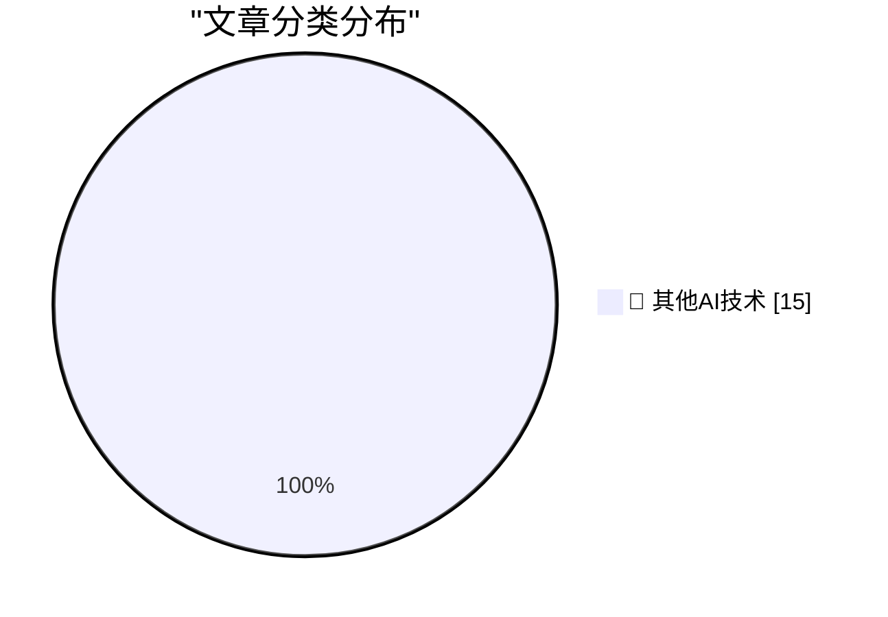

# 📰 AI 博客每日精选 — 2026-08-11

> 来自 98 个技术博客和社交媒体源，AI 精选 Top 15

## 🏆 今日必读

🥇 **No, local models will not win**

[No, local models will not win](https://seangoedecke.com/local-models-will-not-win/) — seangoedecke.com · 21 小时前 · 🔬 其他AI技术

> No, local models will not win

🥈 **The Economist: ‘How to Spot AI Writing’**

[The Economist: ‘How to Spot AI Writing’](https://www.economist.com/culture/2026/07/30/how-to-spot-ai-writing?giftId=YWNmMzkyMzAtNTRjMy00MTYyLWE4MGUtYjRmNTMyYjIzY2Fm) — daringfireball.net · 5 分钟前 · 🔬 其他AI技术

> The Economist: ‘How to Spot AI Writing’

🥉 **Alex Micek on BMW’s iDrive ‘Special Surprises’**

[Alex Micek on BMW’s iDrive ‘Special Surprises’](https://tumbledry.org/2026/08/07/idrive_ads) — daringfireball.net · 1 小时前 · 🔬 其他AI技术

> Alex Micek on BMW’s iDrive ‘Special Surprises’

4️⃣ **BMW Probably Paid Sony for the Spider-Man Dashboard Ads, Not the Other Way Around**

[BMW Probably Paid Sony for the Spider-Man Dashboard Ads, Not the Other Way Around](https://www.press.bmwgroup.com/global/article/detail/T0459622EN/bmw-brings-modern-mobility-to-the-sony-pictures-film-%E2%80%9Cspider-man%E2%84%A2:-brand-new-day%E2%80%9D?language=en) — daringfireball.net · 1 小时前 · 🔬 其他AI技术

> BMW Probably Paid Sony for the Spider-Man Dashboard Ads, Not the Other Way Around

5️⃣ **Mark Zuckerberg Posts 6,500-Word AI Essay**

[Mark Zuckerberg Posts 6,500-Word AI Essay](https://www.meta.com/thefutureisforeveryone/) — daringfireball.net · 2 小时前 · 🔬 其他AI技术

> Mark Zuckerberg Posts 6,500-Word AI Essay

---

## 📊 数据概览

| 扫描源 | 抓取文章 | 时间范围 | 精选 |
|:---:|:---:|:---:|:---:|
| 77/98 | 2717 篇 → 28 篇 | 24h | **15 篇** |

### 分类分布

---

====================

## 🔬 其他AI技术

### 1. No, local models will not win

[No, local models will not win](https://seangoedecke.com/local-models-will-not-win/) — **seangoedecke.com** · 21 小时前 · ⭐ 15/25

> No, local models will not win

📌 其他AI技术

---

### 2. The Economist: ‘How to Spot AI Writing’

[The Economist: ‘How to Spot AI Writing’](https://www.economist.com/culture/2026/07/30/how-to-spot-ai-writing?giftId=YWNmMzkyMzAtNTRjMy00MTYyLWE4MGUtYjRmNTMyYjIzY2Fm) — **daringfireball.net** · 5 分钟前 · ⭐ 15/25

> The Economist: ‘How to Spot AI Writing’

📌 其他AI技术

---

### 3. Alex Micek on BMW’s iDrive ‘Special Surprises’

[Alex Micek on BMW’s iDrive ‘Special Surprises’](https://tumbledry.org/2026/08/07/idrive_ads) — **daringfireball.net** · 1 小时前 · ⭐ 15/25

> Alex Micek on BMW’s iDrive ‘Special Surprises’

📌 其他AI技术

---

### 4. BMW Probably Paid Sony for the Spider-Man Dashboard Ads, Not the Other Way Around

[BMW Probably Paid Sony for the Spider-Man Dashboard Ads, Not the Other Way Around](https://www.press.bmwgroup.com/global/article/detail/T0459622EN/bmw-brings-modern-mobility-to-the-sony-pictures-film-%E2%80%9Cspider-man%E2%84%A2:-brand-new-day%E2%80%9D?language=en) — **daringfireball.net** · 1 小时前 · ⭐ 15/25

> BMW Probably Paid Sony for the Spider-Man Dashboard Ads, Not the Other Way Around

📌 其他AI技术

---

### 5. Mark Zuckerberg Posts 6,500-Word AI Essay

[Mark Zuckerberg Posts 6,500-Word AI Essay](https://www.meta.com/thefutureisforeveryone/) — **daringfireball.net** · 2 小时前 · ⭐ 15/25

> Mark Zuckerberg Posts 6,500-Word AI Essay

📌 其他AI技术

---

### 6. The Talk Show: ‘Getting the Snack Right’

[The Talk Show: ‘Getting the Snack Right’](https://daringfireball.net/thetalkshow/2026/08/10/ep-454) — **daringfireball.net** · 2 小时前 · ⭐ 15/25

> The Talk Show: ‘Getting the Snack Right’

📌 其他AI技术

---

### 7. Netflix Has Peaked

[Netflix Has Peaked](https://sharptext.net/2026/is-netflix-washed-now/) — **daringfireball.net** · 2 小时前 · ⭐ 15/25

> Netflix Has Peaked

📌 其他AI技术

---

### 8. Anthropic Posts ‘How Claude Marks AI-Generated Content’ Without Explaining How Claude Marks AI-Generated Content

[Anthropic Posts ‘How Claude Marks AI-Generated Content’ Without Explaining How Claude Marks AI-Generated Content](https://support.claude.com/en/articles/16266773-how-claude-marks-ai-generated-content) — **daringfireball.net** · 3 小时前 · ⭐ 15/25

> Anthropic Posts ‘How Claude Marks AI-Generated Content’ Without Explaining How Claude Marks AI-Generated Content

📌 其他AI技术

---

### 9. [Sponsor] Drata

[[Sponsor] Drata](https://drata.com/daring) — **daringfireball.net** · 23 小时前 · ⭐ 15/25

> [Sponsor] Drata

📌 其他AI技术

---

### 10. What’s New in iOS 27 Beta 5

[What’s New in iOS 27 Beta 5](https://9to5mac.com/2026/08/10/heres-whats-new-with-ios-27-beta-5/) — **daringfireball.net** · 23 小时前 · ⭐ 15/25

> What’s New in iOS 27 Beta 5

📌 其他AI技术

---

### 11. Pluralistic: Surveillance vs guillotines (11 Aug 2026)

[Pluralistic: Surveillance vs guillotines (11 Aug 2026)](https://pluralistic.net/2026/08/11/tragedy-of-the-commoners/) — **pluralistic.net** · 10 小时前 · ⭐ 15/25

> Pluralistic: Surveillance vs guillotines (11 Aug 2026)

📌 其他AI技术

---

### 12. Thoughts I had while reading your comment

[Thoughts I had while reading your comment](https://dynomight.net/comment/) — **dynomight.net** · 21 小时前 · ⭐ 15/25

> Thoughts I had while reading your comment

📌 其他AI技术

---

### 13. Extending immutability: deletion without losing data

[Extending immutability: deletion without losing data](https://www.tigrisdata.com/blog/soft-delete-deep-dive/) — **xeiaso.net** · 21 小时前 · ⭐ 15/25

> Extending immutability: deletion without losing data

📌 其他AI技术

---

### 14. Shared Code Between Package Managers

[Shared Code Between Package Managers](https://nesbitt.io/2026/08/11/package-manager-library-reuse.html) — **nesbitt.io** · 11 小时前 · ⭐ 15/25

> Shared Code Between Package Managers

📌 其他AI技术

---

### 15. A noob learns FFT

[A noob learns FFT](https://entropicthoughts.com/fft) — **entropicthoughts.com** · 23 小时前 · ⭐ 15/25

> A noob learns FFT

📌 其他AI技术

---

====================

*生成于 2026-08-11 21:42 | 扫描 77 源 → 获取 2717 篇 → 精选 15 篇*
*基于 [Hacker News Popularity Contest 2025](https://refactoringenglish.com/tools/hn-popularity/) RSS 源列表，由 [Andrej Karpathy](https://x.com/karpathy) 推荐*
*由「懂点儿AI」制作，欢迎关注同名微信公众号获取更多 AI 实用技巧 💡*
