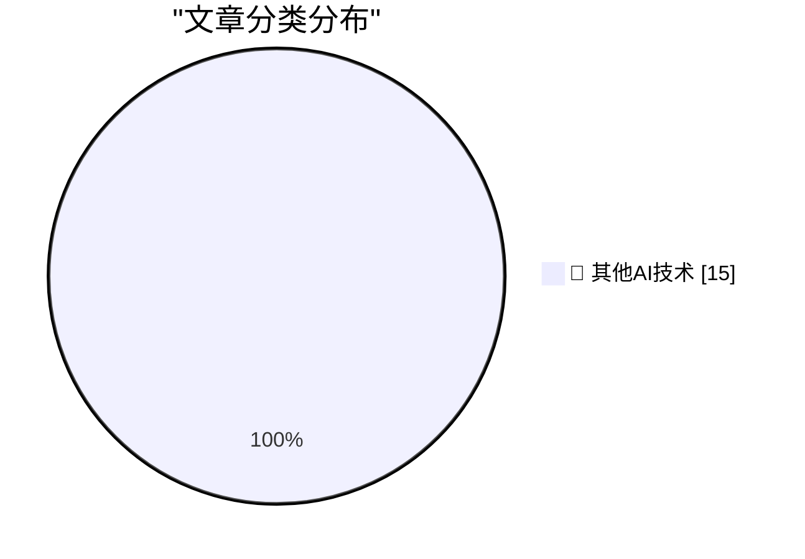

# 📰 AI 博客每日精选 — 2026-08-12

> 来自 98 个技术博客和社交媒体源，AI 精选 Top 15

## 🏆 今日必读

🥇 **Joanna Stern on the Pixel 11 ‘HiLight’ Notification Light**

[Joanna Stern on the Pixel 11 ‘HiLight’ Notification Light](https://thenewthings.com/p/the-new-pixel-feature-i-want-on-my-iphone?gift_content=e9bf3ebd-db33-4ee5-91b0-84d7acac3263) — daringfireball.net · 18 分钟前 · 🔬 其他AI技术

> Joanna Stern on the Pixel 11 ‘HiLight’ Notification Light

🥈 **Google Introduces ‘Camera Looks’ With Pixel 11 Phones**

[Google Introduces ‘Camera Looks’ With Pixel 11 Phones](https://www.theverge.com/tech/978084/google-camera-looks-interview-computational-photography) — daringfireball.net · 43 分钟前 · 🔬 其他AI技术

> Google Introduces ‘Camera Looks’ With Pixel 11 Phones

🥉 **TechCrunch on Google’s Pixel 11 Lineup**

[TechCrunch on Google’s Pixel 11 Lineup](https://techcrunch.com/2026/08/12/pixel-11-has-few-hardware-changes-and-more-gemini/) — daringfireball.net · 1 小时前 · 🔬 其他AI技术

> TechCrunch on Google’s Pixel 11 Lineup

4️⃣ **Hands-On With Google Pixel 11 Pro Fold**

[Hands-On With Google Pixel 11 Pro Fold](https://www.engadget.com/2235294/google-pixel-11-pro-fold-hands-on/) — daringfireball.net · 2 小时前 · 🔬 其他AI技术

> Hands-On With Google Pixel 11 Pro Fold

5️⃣ **Google’s Pixel Watch 5**

[Google’s Pixel Watch 5](https://www.theverge.com/tech/978094/pixel-watch-5-hands-on-made-by-google-gemini-wearables-smartwatch) — daringfireball.net · 2 小时前 · 🔬 其他AI技术

> Google’s Pixel Watch 5

---

## 📊 数据概览

| 扫描源 | 抓取文章 | 时间范围 | 精选 |
|:---:|:---:|:---:|:---:|
| 76/98 | 2711 篇 → 26 篇 | 24h | **15 篇** |

### 分类分布

---

====================

## 🔬 其他AI技术

### 1. Joanna Stern on the Pixel 11 ‘HiLight’ Notification Light

[Joanna Stern on the Pixel 11 ‘HiLight’ Notification Light](https://thenewthings.com/p/the-new-pixel-feature-i-want-on-my-iphone?gift_content=e9bf3ebd-db33-4ee5-91b0-84d7acac3263) — **daringfireball.net** · 18 分钟前 · ⭐ 15/25

> Joanna Stern on the Pixel 11 ‘HiLight’ Notification Light

📌 其他AI技术

---

### 2. Google Introduces ‘Camera Looks’ With Pixel 11 Phones

[Google Introduces ‘Camera Looks’ With Pixel 11 Phones](https://www.theverge.com/tech/978084/google-camera-looks-interview-computational-photography) — **daringfireball.net** · 43 分钟前 · ⭐ 15/25

> Google Introduces ‘Camera Looks’ With Pixel 11 Phones

📌 其他AI技术

---

### 3. TechCrunch on Google’s Pixel 11 Lineup

[TechCrunch on Google’s Pixel 11 Lineup](https://techcrunch.com/2026/08/12/pixel-11-has-few-hardware-changes-and-more-gemini/) — **daringfireball.net** · 1 小时前 · ⭐ 15/25

> TechCrunch on Google’s Pixel 11 Lineup

📌 其他AI技术

---

### 4. Hands-On With Google Pixel 11 Pro Fold

[Hands-On With Google Pixel 11 Pro Fold](https://www.engadget.com/2235294/google-pixel-11-pro-fold-hands-on/) — **daringfireball.net** · 2 小时前 · ⭐ 15/25

> Hands-On With Google Pixel 11 Pro Fold

📌 其他AI技术

---

### 5. Google’s Pixel Watch 5

[Google’s Pixel Watch 5](https://www.theverge.com/tech/978094/pixel-watch-5-hands-on-made-by-google-gemini-wearables-smartwatch) — **daringfireball.net** · 2 小时前 · ⭐ 15/25

> Google’s Pixel Watch 5

📌 其他AI技术

---

### 6. Amazon Is Spiting Customers With Unhelpful Order Confirmation Emails

[Amazon Is Spiting Customers With Unhelpful Order Confirmation Emails](https://www.theverge.com/ai-artificial-intelligence/977733/amazon-order-emails-google-gmail-ai-agents-data) — **daringfireball.net** · 2 小时前 · ⭐ 15/25

> Amazon Is Spiting Customers With Unhelpful Order Confirmation Emails

📌 其他AI技术

---

### 7. App Store Scam of the Week: ‘TabControl Extension’ for Safari

[App Store Scam of the Week: ‘TabControl Extension’ for Safari](https://lapcatsoftware.com/articles/2026/8/4.html) — **daringfireball.net** · 6 小时前 · ⭐ 15/25

> App Store Scam of the Week: ‘TabControl Extension’ for Safari

📌 其他AI技术

---

### 8. Reed Jobs Tells a Neuroscience Story

[Reed Jobs Tells a Neuroscience Story](https://x.com/sabrinahalper/status/2086964813788258588?s=46) — **daringfireball.net** · 6 小时前 · ⭐ 15/25

> Reed Jobs Tells a Neuroscience Story

📌 其他AI技术

---

### 9. Nature Is Healing

[Nature Is Healing](https://mastodon.social/@BasicAppleGuy/117073366339407186) — **daringfireball.net** · 6 小时前 · ⭐ 15/25

> Nature Is Healing

📌 其他AI技术

---

### 10. Where Did the Productivity Gains Go?

[Where Did the Productivity Gains Go?](https://idiallo.com/blog/where-did-the-productivity-gains-go) — **idiallo.com** · 9 小时前 · ⭐ 15/25

> Where Did the Productivity Gains Go?

📌 其他AI技术

---

### 11. Pluralistic: Model collapse (12 Aug 2026)

[Pluralistic: Model collapse (12 Aug 2026)](https://pluralistic.net/2026/08/12/insurance-value-of-biodiversity/) — **pluralistic.net** · 12 小时前 · ⭐ 15/25

> Pluralistic: Model collapse (12 Aug 2026)

📌 其他AI技术

---

### 12. Edinburgh Fringe - Heated Rivalry: The Unauthorized Musical Parody ★★★★☆

[Edinburgh Fringe - Heated Rivalry: The Unauthorized Musical Parody ★★★★☆](https://shkspr.mobi/blog/2026/08/edinburgh-fringe-heated-rivalry-the-unauthorized-musical-parody/) — **shkspr.mobi** · 19 分钟前 · ⭐ 15/25

> Edinburgh Fringe - Heated Rivalry: The Unauthorized Musical Parody ★★★★☆

📌 其他AI技术

---

### 13. Edinburgh Fringe - James Rowland: Team Viking ★★⯪☆☆

[Edinburgh Fringe - James Rowland: Team Viking ★★⯪☆☆](https://shkspr.mobi/blog/2026/08/edinburgh-fringe-james-rowland-team-viking/) — **shkspr.mobi** · 2 小时前 · ⭐ 15/25

> Edinburgh Fringe - James Rowland: Team Viking ★★⯪☆☆

📌 其他AI技术

---

### 14. Edinburgh Fringe - Garrett Millerick: We Tried it Your Way ★☆☆☆☆

[Edinburgh Fringe - Garrett Millerick: We Tried it Your Way ★☆☆☆☆](https://shkspr.mobi/blog/2026/08/edinburgh-fringe-garrett-millerick-we-tried-it-your-way/) — **shkspr.mobi** · 3 小时前 · ⭐ 15/25

> Edinburgh Fringe - Garrett Millerick: We Tried it Your Way ★☆☆☆☆

📌 其他AI技术

---

### 15. Edinburgh Fringe: When Vincent Met John ★★★★★

[Edinburgh Fringe: When Vincent Met John ★★★★★](https://shkspr.mobi/blog/2026/08/edinburgh-fringe-when-vincent-met-john/) — **shkspr.mobi** · 6 小时前 · ⭐ 15/25

> Edinburgh Fringe: When Vincent Met John ★★★★★

📌 其他AI技术

---

====================

*生成于 2026-08-12 21:41 | 扫描 76 源 → 获取 2711 篇 → 精选 15 篇*
*基于 [Hacker News Popularity Contest 2025](https://refactoringenglish.com/tools/hn-popularity/) RSS 源列表，由 [Andrej Karpathy](https://x.com/karpathy) 推荐*
*由「懂点儿AI」制作，欢迎关注同名微信公众号获取更多 AI 实用技巧 💡*
