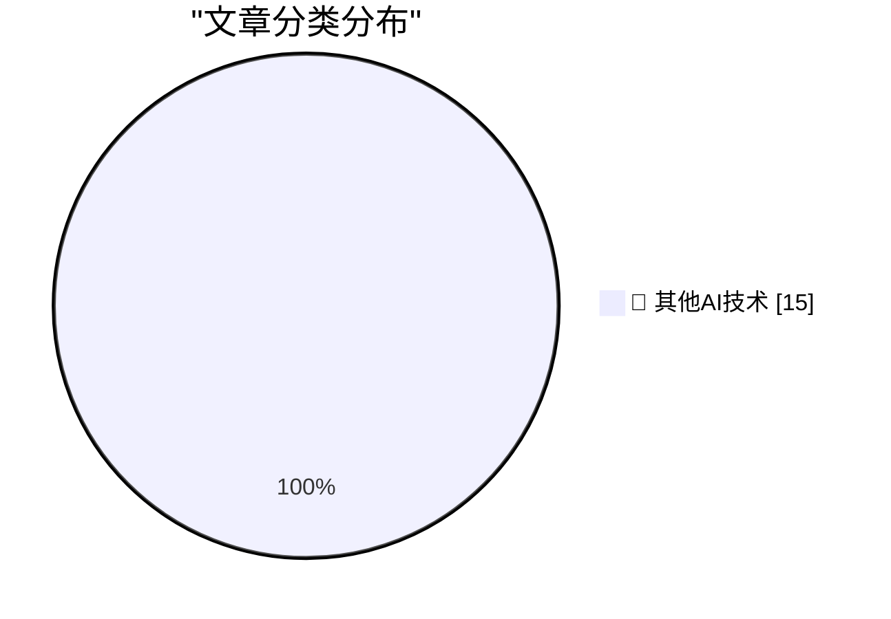

# 📰 AI 博客每日精选 — 2026-08-13

> 来自 98 个技术博客和社交媒体源，AI 精选 Top 15

## 🏆 今日必读

🥇 **Ceramic Shield 2 Is the Real Deal**

[Ceramic Shield 2 Is the Real Deal](https://www.tomsguide.com/phones/iphones/iphone-17-and-iphone-air-durability-testing-heres-how-the-new-iphones-stand-up-to-bending-scratching-and-dropping) — daringfireball.net · 5 小时前 · 🔬 其他AI技术

> Ceramic Shield 2 Is the Real Deal

🥈 **Google Design Pisses Its Pants on Twitter/X**

[Google Design Pisses Its Pants on Twitter/X](https://x.com/googledesign/status/2087195277094695096) — daringfireball.net · 20 小时前 · 🔬 其他AI技术

> Google Design Pisses Its Pants on Twitter/X

🥉 **Edinburgh Fringe: The Musical Mystery Caller ★★★★★**

[Edinburgh Fringe: The Musical Mystery Caller ★★★★★](https://shkspr.mobi/blog/2026/08/edinburgh-fringe-the-musical-mystery-caller/) — shkspr.mobi · 1 小时前 · 🔬 其他AI技术

> Edinburgh Fringe: The Musical Mystery Caller ★★★★★

4️⃣ **Edinburgh Fringe: Miscast Sondheim ★★☆☆☆**

[Edinburgh Fringe: Miscast Sondheim ★★☆☆☆](https://shkspr.mobi/blog/2026/08/edinburgh-fringe-miscast-sondheim/) — shkspr.mobi · 2 小时前 · 🔬 其他AI技术

> Edinburgh Fringe: Miscast Sondheim ★★☆☆☆

5️⃣ **Edinburgh Fringe: Hot Flush – A Bold, We’re Old(ish) Burlesque Show ★★★☆☆**

[Edinburgh Fringe: Hot Flush – A Bold, We’re Old(ish) Burlesque Show ★★★☆☆](https://shkspr.mobi/blog/2026/08/edinburgh-fringe-hot-flush-a-bold-were-oldish-burlesque-show/) — shkspr.mobi · 4 小时前 · 🔬 其他AI技术

> Edinburgh Fringe: Hot Flush – A Bold, We’re Old(ish) Burlesque Show ★★★☆☆

---

## 📊 数据概览

| 扫描源 | 抓取文章 | 时间范围 | 精选 |
|:---:|:---:|:---:|:---:|
| 74/98 | 2688 篇 → 19 篇 | 24h | **15 篇** |

### 分类分布

---

====================

## 🔬 其他AI技术

### 1. Ceramic Shield 2 Is the Real Deal

[Ceramic Shield 2 Is the Real Deal](https://www.tomsguide.com/phones/iphones/iphone-17-and-iphone-air-durability-testing-heres-how-the-new-iphones-stand-up-to-bending-scratching-and-dropping) — **daringfireball.net** · 5 小时前 · ⭐ 15/25

> Ceramic Shield 2 Is the Real Deal

📌 其他AI技术

---

### 2. Google Design Pisses Its Pants on Twitter/X

[Google Design Pisses Its Pants on Twitter/X](https://x.com/googledesign/status/2087195277094695096) — **daringfireball.net** · 20 小时前 · ⭐ 15/25

> Google Design Pisses Its Pants on Twitter/X

📌 其他AI技术

---

### 3. Edinburgh Fringe: The Musical Mystery Caller ★★★★★

[Edinburgh Fringe: The Musical Mystery Caller ★★★★★](https://shkspr.mobi/blog/2026/08/edinburgh-fringe-the-musical-mystery-caller/) — **shkspr.mobi** · 1 小时前 · ⭐ 15/25

> Edinburgh Fringe: The Musical Mystery Caller ★★★★★

📌 其他AI技术

---

### 4. Edinburgh Fringe: Miscast Sondheim ★★☆☆☆

[Edinburgh Fringe: Miscast Sondheim ★★☆☆☆](https://shkspr.mobi/blog/2026/08/edinburgh-fringe-miscast-sondheim/) — **shkspr.mobi** · 2 小时前 · ⭐ 15/25

> Edinburgh Fringe: Miscast Sondheim ★★☆☆☆

📌 其他AI技术

---

### 5. Edinburgh Fringe: Hot Flush – A Bold, We’re Old(ish) Burlesque Show ★★★☆☆

[Edinburgh Fringe: Hot Flush – A Bold, We’re Old(ish) Burlesque Show ★★★☆☆](https://shkspr.mobi/blog/2026/08/edinburgh-fringe-hot-flush-a-bold-were-oldish-burlesque-show/) — **shkspr.mobi** · 4 小时前 · ⭐ 15/25

> Edinburgh Fringe: Hot Flush – A Bold, We’re Old(ish) Burlesque Show ★★★☆☆

📌 其他AI技术

---

### 6. Edinburgh Fringe - Eleanor Morton: The Mermaid ★★★⯪☆

[Edinburgh Fringe - Eleanor Morton: The Mermaid ★★★⯪☆](https://shkspr.mobi/blog/2026/08/edinburgh-fringe-eleanor-morton-the-mermaid/) — **shkspr.mobi** · 6 小时前 · ⭐ 15/25

> Edinburgh Fringe - Eleanor Morton: The Mermaid ★★★⯪☆

📌 其他AI技术

---

### 7. Book Review: Coding Literacy by Annette Vee ★★⯪☆☆

[Book Review: Coding Literacy by Annette Vee ★★⯪☆☆](https://shkspr.mobi/blog/2026/08/book-review-coding-literacy-by-annette-vee/) — **shkspr.mobi** · 10 小时前 · ⭐ 15/25

> Book Review: Coding Literacy by Annette Vee ★★⯪☆☆

📌 其他AI技术

---

### 8. Supplier Security Questionnaire

[Supplier Security Questionnaire](https://nesbitt.io/2026/08/13/supplier-security-questionnaire.html) — **nesbitt.io** · 4 小时前 · ⭐ 15/25

> Supplier Security Questionnaire

📌 其他AI技术

---

### 9. IBM 5170 PC/AT

[IBM 5170 PC/AT](https://dfarq.homeip.net/ibm-5170-pc-at/?utm_source=rss&#038;utm_medium=rss&#038;utm_campaign=ibm-5170-pc-at) — **dfarq.homeip.net** · 10 小时前 · ⭐ 15/25

> IBM 5170 PC/AT

📌 其他AI技术

---

### 10. Another partial SSI trick with canonicalize

[Another partial SSI trick with canonicalize](https://bernsteinbear.com/blog/more-partial-ssi/?utm_source=rss) — **bernsteinbear.com** · 21 小时前 · ⭐ 15/25

> Another partial SSI trick with canonicalize

📌 其他AI技术

---

### 11. 🆕 @GoogleAI's Gemini 3.7 Flash is now generally available and rolling out in GitHub Copilot. Early testing shows: ➡️ improvements in web and app ...

[🆕 @GoogleAI's Gemini 3.7 Flash is now generally available and rolling out in GitHub Copilot. Early testing shows: ➡️ improvements in web and app ...](https://x.com/github/status/2087988626265395417) — **𝕏 @GitHub** · 1 小时前 · ⭐ 15/25

> 🆕 @GoogleAI's Gemini 3.7 Flash is now generally available and rolling out in GitHub Copilot. Early testing shows: ➡️ improvements in web and app ...

📌 其他AI技术

---

### 12. The GitHub Copilot app brings your AI-powered development workflow into one place, helping you turn ideas into code and keep your projects moving. Bri...

[The GitHub Copilot app brings your AI-powered development workflow into one place, helping you turn ideas into code and keep your projects moving. Bri...](https://x.com/github/status/2087698487030739389) — **𝕏 @GitHub** · 21 小时前 · ⭐ 15/25

> The GitHub Copilot app brings your AI-powered development workflow into one place, helping you turn ideas into code and keep your projects moving. Bri...

📌 其他AI技术

---

### 13. RT Every 🪨: CONFIRMED: @ivanhzhao, CEO of @NotionHQ, is speaking at Thesis, our inaugural conference on work and AI. Ivan calls today’s AI “singl...

[RT Every 🪨: CONFIRMED: @ivanhzhao, CEO of @NotionHQ, is speaking at Thesis, our inaugural conference on work and AI. Ivan calls today’s AI “singl...](https://x.com/NotionHQ/status/2087998048115011923) — **𝕏 @NotionHQ** · 1 小时前 · ⭐ 15/25

> RT Every 🪨: CONFIRMED: @ivanhzhao, CEO of @NotionHQ, is speaking at Thesis, our inaugural conference on work and AI. Ivan calls today’s AI “singl...

📌 其他AI技术

---

### 14. Your team writes the spec in Notion. You build with Codex. Notion MCP brings them together. Try it: ask Codex to read the spec, find where the code di...

[Your team writes the spec in Notion. You build with Codex. Notion MCP brings them together. Try it: ask Codex to read the spec, find where the code di...](https://x.com/NotionHQ/status/2087918574497406980) — **𝕏 @NotionHQ** · 6 小时前 · ⭐ 15/25

> Your team writes the spec in Notion. You build with Codex. Notion MCP brings them together. Try it: ask Codex to read the spec, find where the code di...

📌 其他AI技术

---

### 15. RT Akshay Kothari: a sneak peek at what we’ve been building at @NotionHQ this week

[RT Akshay Kothari: a sneak peek at what we’ve been building at @NotionHQ this week](https://x.com/NotionHQ/status/2087694351912857728) — **𝕏 @NotionHQ** · 21 小时前 · ⭐ 15/25

> RT Akshay Kothari: a sneak peek at what we’ve been building at @NotionHQ this week

📌 其他AI技术

---

====================

*生成于 2026-08-13 21:41 | 扫描 74 源 → 获取 2688 篇 → 精选 15 篇*
*基于 [Hacker News Popularity Contest 2025](https://refactoringenglish.com/tools/hn-popularity/) RSS 源列表，由 [Andrej Karpathy](https://x.com/karpathy) 推荐*
*由「懂点儿AI」制作，欢迎关注同名微信公众号获取更多 AI 实用技巧 💡*
