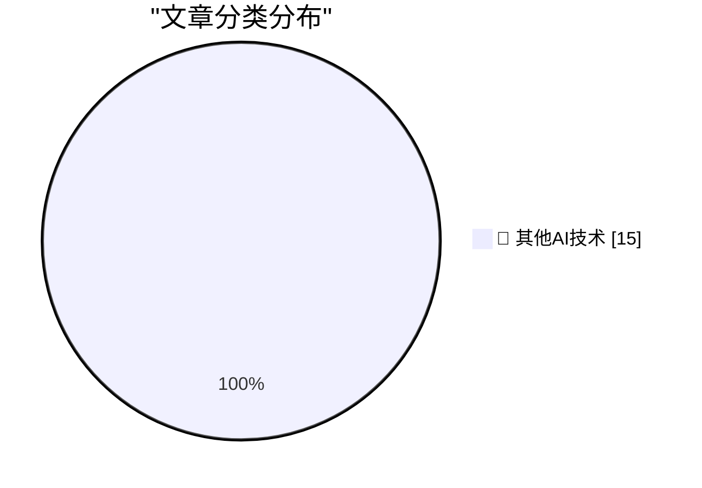

# 📰 AI 博客每日精选 — 2026-08-14

> 来自 98 个技术博客和社交媒体源，AI 精选 Top 15

## 🏆 今日必读

🥇 **★ You Don’t Need to Worry About Scratching Your iPhone Camera Lenses**

[★ You Don’t Need to Worry About Scratching Your iPhone Camera Lenses](https://daringfireball.net/2026/08/iphone_camera_lens_scratch_resistance) — daringfireball.net · 4 小时前 · 🔬 其他AI技术

> ★ You Don’t Need to Worry About Scratching Your iPhone Camera Lenses

🥈 **Google’s ‘Material 3’ Design Write-Up Is 93.3 Percent Embarrassing**

[Google’s ‘Material 3’ Design Write-Up Is 93.3 Percent Embarrassing](https://design.google/library/expressive-material-design-google-research) — daringfireball.net · 4 小时前 · 🔬 其他AI技术

> Google’s ‘Material 3’ Design Write-Up Is 93.3 Percent Embarrassing

🥉 **Pluralistic: Capital formation (14 Aug 2026)**

[Pluralistic: Capital formation (14 Aug 2026)](https://pluralistic.net/2026/08/14/one-chokable-throat/) — pluralistic.net · 10 小时前 · 🔬 其他AI技术

> Pluralistic: Capital formation (14 Aug 2026)

4️⃣ **Edinburgh Fringe: Target Audience ★★★★★**

[Edinburgh Fringe: Target Audience ★★★★★](https://shkspr.mobi/blog/2026/08/edinburgh-fringe-target-audience/) — shkspr.mobi · 2 小时前 · 🔬 其他AI技术

> Edinburgh Fringe: Target Audience ★★★★★

5️⃣ **Edinburgh Fringe: Stand-up Philosophy ★★★⯪☆**

[Edinburgh Fringe: Stand-up Philosophy ★★★⯪☆](https://shkspr.mobi/blog/2026/08/edinburgh-fringe-stand-up-philosophy/) — shkspr.mobi · 6 小时前 · 🔬 其他AI技术

> Edinburgh Fringe: Stand-up Philosophy ★★★⯪☆

---

## 📊 数据概览

| 扫描源 | 抓取文章 | 时间范围 | 精选 |
|:---:|:---:|:---:|:---:|
| 78/98 | 2760 篇 → 27 篇 | 24h | **15 篇** |

### 分类分布

---

====================

## 🔬 其他AI技术

### 1. ★ You Don’t Need to Worry About Scratching Your iPhone Camera Lenses

[★ You Don’t Need to Worry About Scratching Your iPhone Camera Lenses](https://daringfireball.net/2026/08/iphone_camera_lens_scratch_resistance) — **daringfireball.net** · 4 小时前 · ⭐ 15/25

> ★ You Don’t Need to Worry About Scratching Your iPhone Camera Lenses

📌 其他AI技术

---

### 2. Google’s ‘Material 3’ Design Write-Up Is 93.3 Percent Embarrassing

[Google’s ‘Material 3’ Design Write-Up Is 93.3 Percent Embarrassing](https://design.google/library/expressive-material-design-google-research) — **daringfireball.net** · 4 小时前 · ⭐ 15/25

> Google’s ‘Material 3’ Design Write-Up Is 93.3 Percent Embarrassing

📌 其他AI技术

---

### 3. Pluralistic: Capital formation (14 Aug 2026)

[Pluralistic: Capital formation (14 Aug 2026)](https://pluralistic.net/2026/08/14/one-chokable-throat/) — **pluralistic.net** · 10 小时前 · ⭐ 15/25

> Pluralistic: Capital formation (14 Aug 2026)

📌 其他AI技术

---

### 4. Edinburgh Fringe: Target Audience ★★★★★

[Edinburgh Fringe: Target Audience ★★★★★](https://shkspr.mobi/blog/2026/08/edinburgh-fringe-target-audience/) — **shkspr.mobi** · 2 小时前 · ⭐ 15/25

> Edinburgh Fringe: Target Audience ★★★★★

📌 其他AI技术

---

### 5. Edinburgh Fringe: Stand-up Philosophy ★★★⯪☆

[Edinburgh Fringe: Stand-up Philosophy ★★★⯪☆](https://shkspr.mobi/blog/2026/08/edinburgh-fringe-stand-up-philosophy/) — **shkspr.mobi** · 6 小时前 · ⭐ 15/25

> Edinburgh Fringe: Stand-up Philosophy ★★★⯪☆

📌 其他AI技术

---

### 6. Edinburgh Fringe: Waiting for Wonka ★★★⯪☆

[Edinburgh Fringe: Waiting for Wonka ★★★⯪☆](https://shkspr.mobi/blog/2026/08/edinburgh-fringe-waiting-for-wonka/) — **shkspr.mobi** · 8 小时前 · ⭐ 15/25

> Edinburgh Fringe: Waiting for Wonka ★★★⯪☆

📌 其他AI技术

---

### 7. Edinburgh Fringe: Doris, Dolly and the Dressing Room Divas ★★★★⯪

[Edinburgh Fringe: Doris, Dolly and the Dressing Room Divas ★★★★⯪](https://shkspr.mobi/blog/2026/08/edinburgh-fringe-doris-dolly-and-the-dressing-room-divas/) — **shkspr.mobi** · 22 小时前 · ⭐ 15/25

> Edinburgh Fringe: Doris, Dolly and the Dressing Room Divas ★★★★⯪

📌 其他AI技术

---

### 8. Forcing an ARM64X executable to run as a specific architecture

[Forcing an ARM64X executable to run as a specific architecture](https://devblogs.microsoft.com/oldnewthing/20260814-00/?p=112613) — **devblogs.microsoft.com/oldnewthing** · 7 小时前 · ⭐ 15/25

> Forcing an ARM64X executable to run as a specific architecture

📌 其他AI技术

---

### 9. Printing Lists

[Printing Lists](https://matklad.github.io/2026/08/14/printing-lists.html) — **matklad.github.io** · 21 小时前 · ⭐ 15/25

> Printing Lists

📌 其他AI技术

---

### 10. How This Blog Is Built

[How This Blog Is Built](https://nesbitt.io/2026/08/14/how-this-blog-is-built.html) — **nesbitt.io** · 11 小时前 · ⭐ 15/25

> How This Blog Is Built

📌 其他AI技术

---

### 11. Premium: How Much Money Does AI Need?

[Premium: How Much Money Does AI Need?](https://www.wheresyoured.at/premium-how-much-money-does-ai-need/) — **wheresyoured.at** · 5 小时前 · ⭐ 15/25

> Premium: How Much Money Does AI Need?

📌 其他AI技术

---

### 12. This Week on The Analog Antiquarian

[This Week on The Analog Antiquarian](https://www.filfre.net/2026/08/this-week-on-the-analog-antiquarian/) — **filfre.net** · 5 小时前 · ⭐ 15/25

> This Week on The Analog Antiquarian

📌 其他AI技术

---

### 13. Oh Hey, It’s Not Just Me

[Oh Hey, It’s Not Just Me](https://blog.jim-nielsen.com/2026/its-not-just-me/) — **blog.jim-nielsen.com** · 2 小时前 · ⭐ 15/25

> Oh Hey, It’s Not Just Me

📌 其他AI技术

---

### 14. Commodore’s purchase of Amiga, August 14, 1984

[Commodore’s purchase of Amiga, August 14, 1984](https://dfarq.homeip.net/commodores-purchase-of-amiga-august-14-1984/?utm_source=rss&#038;utm_medium=rss&#038;utm_campaign=commodores-purchase-of-amiga-august-14-1984) — **dfarq.homeip.net** · 10 小时前 · ⭐ 15/25

> Commodore’s purchase of Amiga, August 14, 1984

📌 其他AI技术

---

### 15. 𝚐𝚒𝚝 𝚌𝚘𝚖𝚖𝚒𝚝 -𝚖 "𝚊𝚍𝚍 𝚞𝚗𝚒𝚌𝚘𝚛𝚗𝚜 𝚊𝚗𝚍 𝚛𝚊𝚒𝚗𝚋𝚘𝚠𝚜" 🦄🌈 #js...

[𝚐𝚒𝚝 𝚌𝚘𝚖𝚖𝚒𝚝 -𝚖 "𝚊𝚍𝚍 𝚞𝚗𝚒𝚌𝚘𝚛𝚗𝚜 𝚊𝚗𝚍 𝚛𝚊𝚒𝚗𝚋𝚘𝚠𝚜" 🦄🌈 #js...](https://x.com/github/status/2088061319824232766) — **𝕏 @GitHub** · 20 小时前 · ⭐ 15/25

> 𝚐𝚒𝚝 𝚌𝚘𝚖𝚖𝚒𝚝 -𝚖 "𝚊𝚍𝚍 𝚞𝚗𝚒𝚌𝚘𝚛𝚗𝚜 𝚊𝚗𝚍 𝚛𝚊𝚒𝚗𝚋𝚘𝚠𝚜" 🦄🌈 #js...

📌 其他AI技术

---

====================

*生成于 2026-08-14 21:21 | 扫描 78 源 → 获取 2760 篇 → 精选 15 篇*
*基于 [Hacker News Popularity Contest 2025](https://refactoringenglish.com/tools/hn-popularity/) RSS 源列表，由 [Andrej Karpathy](https://x.com/karpathy) 推荐*
*由「懂点儿AI」制作，欢迎关注同名微信公众号获取更多 AI 实用技巧 💡*
