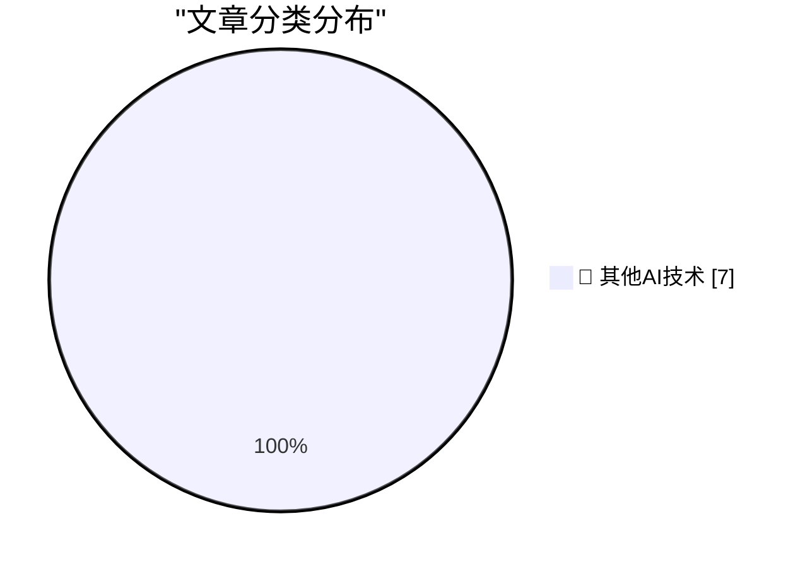

# 📰 AI 博客每日精选 — 2026-08-15

> 来自 98 个技术博客和社交媒体源，AI 精选 Top 7

## 🏆 今日必读

🥇 **Book Review: Slags by Emma Jane Unsworth ★★★⯪☆**

[Book Review: Slags by Emma Jane Unsworth ★★★⯪☆](https://shkspr.mobi/blog/2026/08/book-review-slags-by-emma-jane-unsworth/) — shkspr.mobi · 9 小时前 · 🔬 其他AI技术

> Book Review: Slags by Emma Jane Unsworth ★★★⯪☆

🥈 **Site update: a few posts have been removed**

[Site update: a few posts have been removed](https://xeiaso.net/notes/2026/blogposts-removed/) — xeiaso.net · 21 小时前 · 🔬 其他AI技术

> Site update: a few posts have been removed

🥉 **This Week in Package Management: 15 August 2026**

[This Week in Package Management: 15 August 2026](https://nesbitt.io/2026/08/15/this-week-in-package-management.html) — nesbitt.io · 11 小时前 · 🔬 其他AI技术

> This Week in Package Management: 15 August 2026

4️⃣ **Concurrent Servers: Part 7 - Rust**

[Concurrent Servers: Part 7 - Rust](https://eli.thegreenplace.net/2026/concurrent-servers-part-7-rust/) — eli.thegreenplace.net · 4 小时前 · 🔬 其他AI技术

> Concurrent Servers: Part 7 - Rust

5️⃣ **Training a Reinforcement Learning Model to Play Bonk.io**

[Training a Reinforcement Learning Model to Play Bonk.io](https://blog.pixelmelt.dev/training-a-reinforcement-learning-model-to-play-bonk-io/) — blog.pixelmelt.dev · 18 小时前 · 🔬 其他AI技术

> Training a Reinforcement Learning Model to Play Bonk.io

---

## 📊 数据概览

| 扫描源 | 抓取文章 | 时间范围 | 精选 |
|:---:|:---:|:---:|:---:|
| 76/98 | 2725 篇 → 7 篇 | 24h | **7 篇** |

### 分类分布

---

====================

## 🔬 其他AI技术

### 1. Book Review: Slags by Emma Jane Unsworth ★★★⯪☆

[Book Review: Slags by Emma Jane Unsworth ★★★⯪☆](https://shkspr.mobi/blog/2026/08/book-review-slags-by-emma-jane-unsworth/) — **shkspr.mobi** · 9 小时前 · ⭐ 15/25

> Book Review: Slags by Emma Jane Unsworth ★★★⯪☆

📌 其他AI技术

---

### 2. Site update: a few posts have been removed

[Site update: a few posts have been removed](https://xeiaso.net/notes/2026/blogposts-removed/) — **xeiaso.net** · 21 小时前 · ⭐ 15/25

> Site update: a few posts have been removed

📌 其他AI技术

---

### 3. This Week in Package Management: 15 August 2026

[This Week in Package Management: 15 August 2026](https://nesbitt.io/2026/08/15/this-week-in-package-management.html) — **nesbitt.io** · 11 小时前 · ⭐ 15/25

> This Week in Package Management: 15 August 2026

📌 其他AI技术

---

### 4. Concurrent Servers: Part 7 - Rust

[Concurrent Servers: Part 7 - Rust](https://eli.thegreenplace.net/2026/concurrent-servers-part-7-rust/) — **eli.thegreenplace.net** · 4 小时前 · ⭐ 15/25

> Concurrent Servers: Part 7 - Rust

📌 其他AI技术

---

### 5. Training a Reinforcement Learning Model to Play Bonk.io

[Training a Reinforcement Learning Model to Play Bonk.io](https://blog.pixelmelt.dev/training-a-reinforcement-learning-model-to-play-bonk-io/) — **blog.pixelmelt.dev** · 18 小时前 · ⭐ 15/25

> Training a Reinforcement Learning Model to Play Bonk.io

📌 其他AI技术

---

### 6. Go from an empty repo to a live GitHub Pages site on a custom domain, secured with HTTPS, in about 14 minutes, without manually editing a single DNS r...

[Go from an empty repo to a live GitHub Pages site on a custom domain, secured with HTTPS, in about 14 minutes, without manually editing a single DNS r...](https://x.com/github/status/2088709818714329316) — **𝕏 @GitHub** · 1 小时前 · ⭐ 15/25

> Go from an empty repo to a live GitHub Pages site on a custom domain, secured with HTTPS, in about 14 minutes, without manually editing a single DNS r...

📌 其他AI技术

---

### 7. OpenClaw. Is it the Linux of AI? 👀

[OpenClaw. Is it the Linux of AI? 👀](https://x.com/github/status/2088658355581509664) — **𝕏 @GitHub** · 5 小时前 · ⭐ 15/25

> OpenClaw. Is it the Linux of AI? 👀

📌 其他AI技术

---

====================

*生成于 2026-08-15 21:17 | 扫描 76 源 → 获取 2725 篇 → 精选 7 篇*
*基于 [Hacker News Popularity Contest 2025](https://refactoringenglish.com/tools/hn-popularity/) RSS 源列表，由 [Andrej Karpathy](https://x.com/karpathy) 推荐*
*由「懂点儿AI」制作，欢迎关注同名微信公众号获取更多 AI 实用技巧 💡*
