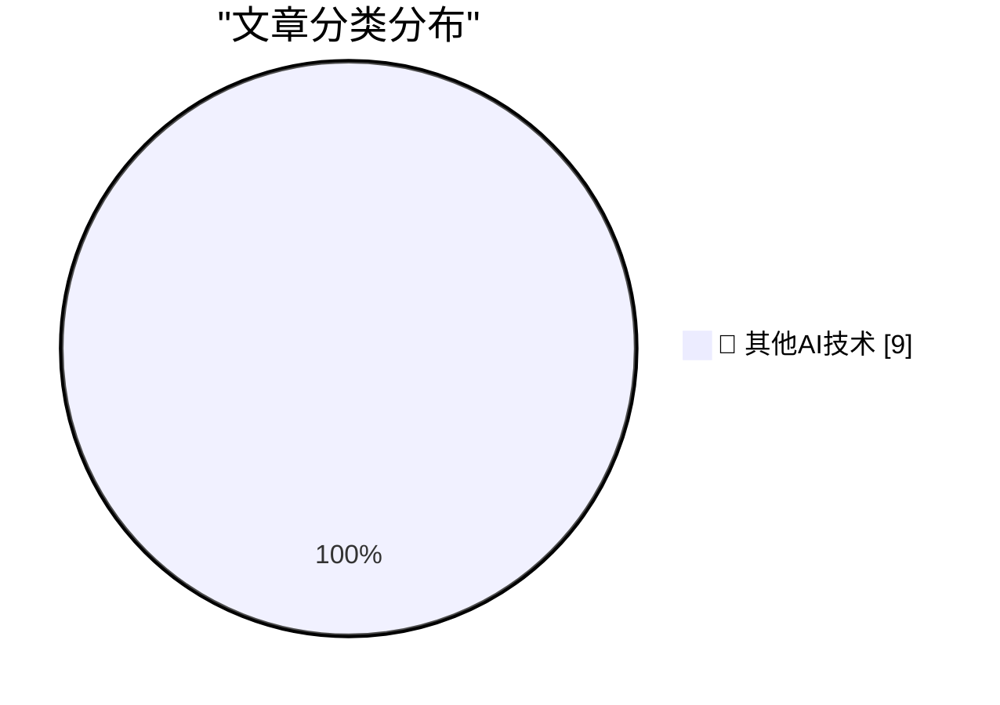

# 📰 AI 博客每日精选 — 2026-08-17

> 来自 98 个技术博客和社交媒体源，AI 精选 Top 9

## 🏆 今日必读

🥇 **Pluralistic: Jennifer Jenkins' 'Music Copyright, Creativity, and Culture' (17 Aug 2026)**

[Pluralistic: Jennifer Jenkins' 'Music Copyright, Creativity, and Culture' (17 Aug 2026)](https://pluralistic.net/2026/08/17/great-sousas-ghost/) — pluralistic.net · 14 小时前 · 🔬 其他AI技术

> Pluralistic: Jennifer Jenkins' 'Music Copyright, Creativity, and Culture' (17 Aug 2026)

🥈 **And then the men with guns tell you to do it anyway**

[And then the men with guns tell you to do it anyway](https://shkspr.mobi/blog/2026/08/and-then-the-men-with-guns-tell-you-to-do-it-anyway/) — shkspr.mobi · 9 小时前 · 🔬 其他AI技术

> And then the men with guns tell you to do it anyway

🥉 **How do functions like alloca allocate memory from the stack?**

[How do functions like alloca allocate memory from the stack?](https://devblogs.microsoft.com/oldnewthing/20260817-40/?p=112617) — devblogs.microsoft.com/oldnewthing · 5 小时前 · 🔬 其他AI技术

> How do functions like alloca allocate memory from the stack?

4️⃣ **When the Internet reached half of US households**

[When the Internet reached half of US households](https://dfarq.homeip.net/when-the-internet-reached-half-of-us-households/?utm_source=rss&#038;utm_medium=rss&#038;utm_campaign=when-the-internet-reached-half-of-us-households) — dfarq.homeip.net · 10 小时前 · 🔬 其他AI技术

> When the Internet reached half of US households

5️⃣ **RT Greg Brockman: defenders can see the future, and have a narrow window to uplevel their cybersecurity practices now. key is to uplevel fundamentals ...**

[RT Greg Brockman: defenders can see the future, and have a narrow window to uplevel their cybersecurity practices now. key is to uplevel fundamentals ...](https://x.com/OpenAI/status/2089328616786248149) — 𝕏 @OpenAI · 8 小时前 · 🔬 其他AI技术

> RT Greg Brockman: defenders can see the future, and have a narrow window to uplevel their cybersecurity practices now. key is to uplevel fundamentals ...

---

## 📊 数据概览

| 扫描源 | 抓取文章 | 时间范围 | 精选 |
|:---:|:---:|:---:|:---:|
| 78/98 | 2751 篇 → 9 篇 | 24h | **9 篇** |

### 分类分布

---

====================

## 🔬 其他AI技术

### 1. Pluralistic: Jennifer Jenkins' 'Music Copyright, Creativity, and Culture' (17 Aug 2026)

[Pluralistic: Jennifer Jenkins' 'Music Copyright, Creativity, and Culture' (17 Aug 2026)](https://pluralistic.net/2026/08/17/great-sousas-ghost/) — **pluralistic.net** · 14 小时前 · ⭐ 15/25

> Pluralistic: Jennifer Jenkins' 'Music Copyright, Creativity, and Culture' (17 Aug 2026)

📌 其他AI技术

---

### 2. And then the men with guns tell you to do it anyway

[And then the men with guns tell you to do it anyway](https://shkspr.mobi/blog/2026/08/and-then-the-men-with-guns-tell-you-to-do-it-anyway/) — **shkspr.mobi** · 9 小时前 · ⭐ 15/25

> And then the men with guns tell you to do it anyway

📌 其他AI技术

---

### 3. How do functions like alloca allocate memory from the stack?

[How do functions like alloca allocate memory from the stack?](https://devblogs.microsoft.com/oldnewthing/20260817-40/?p=112617) — **devblogs.microsoft.com/oldnewthing** · 5 小时前 · ⭐ 15/25

> How do functions like alloca allocate memory from the stack?

📌 其他AI技术

---

### 4. When the Internet reached half of US households

[When the Internet reached half of US households](https://dfarq.homeip.net/when-the-internet-reached-half-of-us-households/?utm_source=rss&#038;utm_medium=rss&#038;utm_campaign=when-the-internet-reached-half-of-us-households) — **dfarq.homeip.net** · 10 小时前 · ⭐ 15/25

> When the Internet reached half of US households

📌 其他AI技术

---

### 5. RT Greg Brockman: defenders can see the future, and have a narrow window to uplevel their cybersecurity practices now. key is to uplevel fundamentals ...

[RT Greg Brockman: defenders can see the future, and have a narrow window to uplevel their cybersecurity practices now. key is to uplevel fundamentals ...](https://x.com/OpenAI/status/2089328616786248149) — **𝕏 @OpenAI** · 8 小时前 · ⭐ 15/25

> RT Greg Brockman: defenders can see the future, and have a narrow window to uplevel their cybersecurity practices now. key is to uplevel fundamentals ...

📌 其他AI技术

---

### 6. GitHub case-folds every byte of code search at over 45 GiB/s on one core. The biggest win came from removing an early-exit branch, not adding one. htt...

[GitHub case-folds every byte of code search at over 45 GiB/s on one core. The biggest win came from removing an early-exit branch, not adding one. htt...](https://x.com/github/status/2089108944278970650) — **𝕏 @GitHub** · 23 小时前 · ⭐ 15/25

> GitHub case-folds every byte of code search at over 45 GiB/s on one core. The biggest win came from removing an early-exit branch, not adding one. htt...

📌 其他AI技术

---

### 7. 🚨 New Slack feature incoming. Super top secret for now, so we can't say much yet. We can say you’ll want to be there when we drop it live. https:/...

[🚨 New Slack feature incoming. Super top secret for now, so we can't say much yet. We can say you’ll want to be there when we drop it live. https:/...](https://x.com/SlackHQ/status/2089398671972479276) — **𝕏 @SlackHQ** · 4 小时前 · ⭐ 15/25

> 🚨 New Slack feature incoming. Super top secret for now, so we can't say much yet. We can say you’ll want to be there when we drop it live. https:/...

📌 其他AI技术

---

### 8. RT Drena Kusari: Auto rewrite is one my favorite features in Word. It works with me and makes my writing more concise and meaningful. #AIProductivity ...

[RT Drena Kusari: Auto rewrite is one my favorite features in Word. It works with me and makes my writing more concise and meaningful. #AIProductivity ...](https://x.com/Microsoft365/status/2089408891750645819) — **𝕏 @Microsoft365** · 8 小时前 · ⭐ 15/25

> RT Drena Kusari: Auto rewrite is one my favorite features in Word. It works with me and makes my writing more concise and meaningful. #AIProductivity ...

📌 其他AI技术

---

### 9. Wherever you work, Gemini can capture your meeting details. ✍️ Whether you're meeting offsite – like at a cafe or in the car – or taking a meeting...

[Wherever you work, Gemini can capture your meeting details. ✍️ Whether you're meeting offsite – like at a cafe or in the car – or taking a meeting...](https://x.com/GoogleWorkspace/status/2089362914125758888) — **𝕏 @GoogleWorkspace** · 6 小时前 · ⭐ 15/25

> Wherever you work, Gemini can capture your meeting details. ✍️ Whether you're meeting offsite – like at a cafe or in the car – or taking a meeting...

📌 其他AI技术

---

====================

*生成于 2026-08-17 21:22 | 扫描 78 源 → 获取 2751 篇 → 精选 9 篇*
*基于 [Hacker News Popularity Contest 2025](https://refactoringenglish.com/tools/hn-popularity/) RSS 源列表，由 [Andrej Karpathy](https://x.com/karpathy) 推荐*
*由「懂点儿AI」制作，欢迎关注同名微信公众号获取更多 AI 实用技巧 💡*
