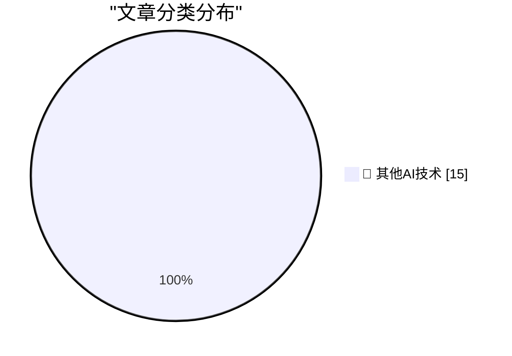

# 📰 AI 博客每日精选 — 2026-08-18

> 来自 98 个技术博客和社交媒体源，AI 精选 Top 15

## 🏆 今日必读

🥇 **Help peer**

[Help peer](https://seangoedecke.com/help-peer/) — seangoedecke.com · 21 小时前 · 🔬 其他AI技术

> Help peer

🥈 **Organized Thieves Are Targeting AI Server Chips With Violent Highway Hijackings**

[Organized Thieves Are Targeting AI Server Chips With Violent Highway Hijackings](https://www.wired.com/story/the-worst-ive-ever-seen-cargo-thieves-are-turning-violent-in-pursuit-of-ai-hardware/) — daringfireball.net · 2 小时前 · 🔬 其他AI技术

> Organized Thieves Are Targeting AI Server Chips With Violent Highway Hijackings

🥉 **‘Dickover’ Makes It Into The Guardian**

[‘Dickover’ Makes It Into The Guardian](https://www.theguardian.com/technology/2026/aug/18/dickovers-baggravation-botiquette-18-new-words-tech-hellscape) — daringfireball.net · 5 小时前 · 🔬 其他AI技术

> ‘Dickover’ Makes It Into The Guardian

4️⃣ **OpenAI Pot Complains That Google Kettle Is Black**

[OpenAI Pot Complains That Google Kettle Is Black](https://x.com/thsottiaux/status/2083373529081291076?s=12) — daringfireball.net · 6 小时前 · 🔬 其他AI技术

> OpenAI Pot Complains That Google Kettle Is Black

5️⃣ **Nature Is Healing: MacOS 27 Golden Gate Beta 6 Adds Redesigned Traffic Light Window Controls**

[Nature Is Healing: MacOS 27 Golden Gate Beta 6 Adds Redesigned Traffic Light Window Controls](https://9to5mac.com/2026/08/17/macos-27-golden-gate-beta-6-features-redesigned-traffic-light-window-controls/) — daringfireball.net · 8 小时前 · 🔬 其他AI技术

> Nature Is Healing: MacOS 27 Golden Gate Beta 6 Adds Redesigned Traffic Light Window Controls

---

## 📊 数据概览

| 扫描源 | 抓取文章 | 时间范围 | 精选 |
|:---:|:---:|:---:|:---:|
| 78/98 | 2754 篇 → 22 篇 | 24h | **15 篇** |

### 分类分布

---

====================

## 🔬 其他AI技术

### 1. Help peer

[Help peer](https://seangoedecke.com/help-peer/) — **seangoedecke.com** · 21 小时前 · ⭐ 15/25

> Help peer

📌 其他AI技术

---

### 2. Organized Thieves Are Targeting AI Server Chips With Violent Highway Hijackings

[Organized Thieves Are Targeting AI Server Chips With Violent Highway Hijackings](https://www.wired.com/story/the-worst-ive-ever-seen-cargo-thieves-are-turning-violent-in-pursuit-of-ai-hardware/) — **daringfireball.net** · 2 小时前 · ⭐ 15/25

> Organized Thieves Are Targeting AI Server Chips With Violent Highway Hijackings

📌 其他AI技术

---

### 3. ‘Dickover’ Makes It Into The Guardian

[‘Dickover’ Makes It Into The Guardian](https://www.theguardian.com/technology/2026/aug/18/dickovers-baggravation-botiquette-18-new-words-tech-hellscape) — **daringfireball.net** · 5 小时前 · ⭐ 15/25

> ‘Dickover’ Makes It Into The Guardian

📌 其他AI技术

---

### 4. OpenAI Pot Complains That Google Kettle Is Black

[OpenAI Pot Complains That Google Kettle Is Black](https://x.com/thsottiaux/status/2083373529081291076?s=12) — **daringfireball.net** · 6 小时前 · ⭐ 15/25

> OpenAI Pot Complains That Google Kettle Is Black

📌 其他AI技术

---

### 5. Nature Is Healing: MacOS 27 Golden Gate Beta 6 Adds Redesigned Traffic Light Window Controls

[Nature Is Healing: MacOS 27 Golden Gate Beta 6 Adds Redesigned Traffic Light Window Controls](https://9to5mac.com/2026/08/17/macos-27-golden-gate-beta-6-features-redesigned-traffic-light-window-controls/) — **daringfireball.net** · 8 小时前 · ⭐ 15/25

> Nature Is Healing: MacOS 27 Golden Gate Beta 6 Adds Redesigned Traffic Light Window Controls

📌 其他AI技术

---

### 6. MacOS 26.7 Tahoe Release Candidate Contains a Video Demonstrating Camera-Equipped AirPods in Action

[MacOS 26.7 Tahoe Release Candidate Contains a Video Demonstrating Camera-Equipped AirPods in Action](https://www.macrumors.com/2026/08/17/camera-equipped-airpods-macos-26-7/) — **daringfireball.net** · 17 小时前 · ⭐ 15/25

> MacOS 26.7 Tahoe Release Candidate Contains a Video Demonstrating Camera-Equipped AirPods in Action

📌 其他AI技术

---

### 7. ★ Follow-Up Thoughts on Watermarking Schemes for AI-Generated Text

[★ Follow-Up Thoughts on Watermarking Schemes for AI-Generated Text](https://daringfireball.net/2026/08/follow-up_thoughts_on_watermarking) — **daringfireball.net** · 20 小时前 · ⭐ 15/25

> ★ Follow-Up Thoughts on Watermarking Schemes for AI-Generated Text

📌 其他AI技术

---

### 8. Apple TV Still Has No Start Date for ‘The Savant’

[Apple TV Still Has No Start Date for ‘The Savant’](https://daringfireball.net/linked/2026/04/19/chastain-says-the-savant-will-be-released) — **daringfireball.net** · 23 小时前 · ⭐ 15/25

> Apple TV Still Has No Start Date for ‘The Savant’

📌 其他AI技术

---

### 9. No Update Since Early July Regarding Siri AI Coming to the EU, Ever

[No Update Since Early July Regarding Siri AI Coming to the EU, Ever](https://www.ft.com/content/807d25c3-f4ac-4402-b815-3aa91018237d) — **daringfireball.net** · 23 小时前 · ⭐ 15/25

> No Update Since Early July Regarding Siri AI Coming to the EU, Ever

📌 其他AI技术

---

### 10. Pluralistic: IP can't save you from AI (18 Aug 2026)

[Pluralistic: IP can't save you from AI (18 Aug 2026)](https://pluralistic.net/2026/08/18/enron-corpus/) — **pluralistic.net** · 6 小时前 · ⭐ 15/25

> Pluralistic: IP can't save you from AI (18 Aug 2026)

📌 其他AI技术

---

### 11. Two-Factor Authentication Across Package Registries

[Two-Factor Authentication Across Package Registries](https://nesbitt.io/2026/08/18/two-factor-authentication-across-package-registries.html) — **nesbitt.io** · 11 小时前 · ⭐ 15/25

> Two-Factor Authentication Across Package Registries

📌 其他AI技术

---

### 12. Snakes and Ladders

[Snakes and Ladders](https://entropicthoughts.com/snakes-and-ladders) — **entropicthoughts.com** · 23 小时前 · ⭐ 15/25

> Snakes and Ladders

📌 其他AI技术

---

### 13. Vim wants you to control, VSCode wants you to consume

[Vim wants you to control, VSCode wants you to consume](https://buttondown.com/hillelwayne/archive/vim-wants-you-to-control-vscode-wants-you-to/) — **buttondown.com/hillelwayne** · 4 小时前 · ⭐ 15/25

> Vim wants you to control, VSCode wants you to consume

📌 其他AI技术

---

### 14. AI Alignment as a Thought-Terminating Cliche

[AI Alignment as a Thought-Terminating Cliche](https://borretti.me/article/ai-alignment-as-thought-terminating-cliche) — **borretti.me** · 21 小时前 · ⭐ 15/25

> AI Alignment as a Thought-Terminating Cliche

📌 其他AI技术

---

### 15. What Happens If OpenAI Dies?

[What Happens If OpenAI Dies?](https://www.wheresyoured.at/what-happens-if-openai-dies/) — **wheresyoured.at** · 5 小时前 · ⭐ 15/25

> What Happens If OpenAI Dies?

📌 其他AI技术

---

====================

*生成于 2026-08-18 21:19 | 扫描 78 源 → 获取 2754 篇 → 精选 15 篇*
*基于 [Hacker News Popularity Contest 2025](https://refactoringenglish.com/tools/hn-popularity/) RSS 源列表，由 [Andrej Karpathy](https://x.com/karpathy) 推荐*
*由「懂点儿AI」制作，欢迎关注同名微信公众号获取更多 AI 实用技巧 💡*
