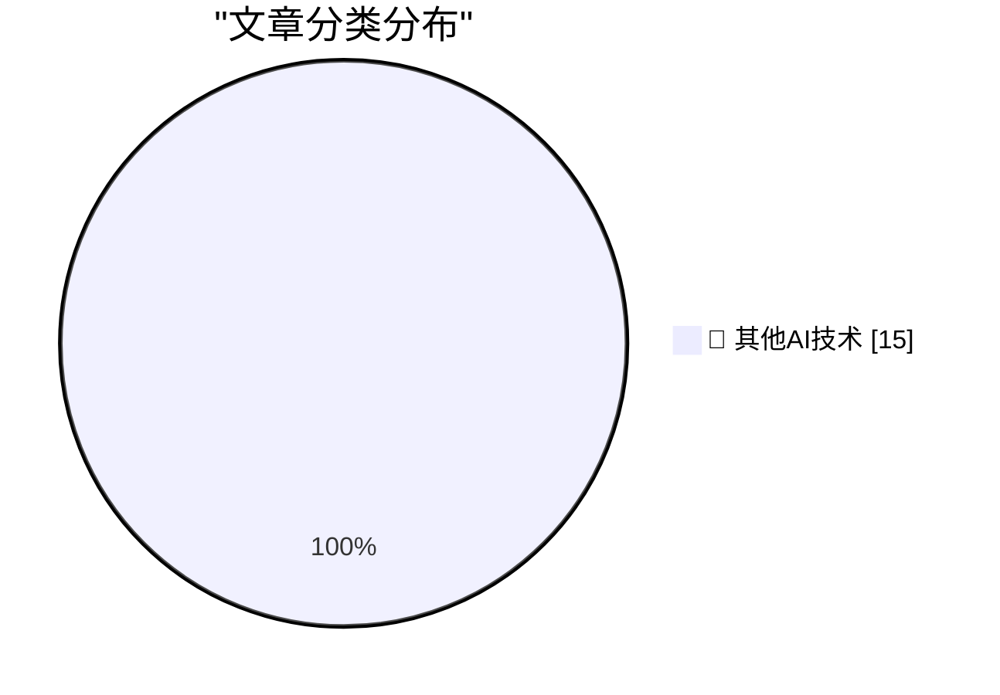

# 📰 AI 博客每日精选 — 2026-08-19

> 来自 98 个技术博客和社交媒体源，AI 精选 Top 15

## 🏆 今日必读

🥇 **Hands-on with Raspberry Pi's CM5 Programming Jig**

[Hands-on with Raspberry Pi's CM5 Programming Jig](https://www.jeffgeerling.com/blog/2026/cm5-programming-jig/) — jeffgeerling.com · 14 小时前 · 🔬 其他AI技术

> Hands-on with Raspberry Pi's CM5 Programming Jig

🥈 **Disney’s ABC Sues Trump’s FCC Over Challenge to Its Broadcast License**

[Disney’s ABC Sues Trump’s FCC Over Challenge to Its Broadcast License](https://www.wsj.com/business/media/disneys-abc-sues-fcc-over-challenge-to-its-broadcast-licenses-64e8f794?st=XTL4tA) — daringfireball.net · 22 小时前 · 🔬 其他AI技术

> Disney’s ABC Sues Trump’s FCC Over Challenge to Its Broadcast License

🥉 **Apple Gives Legal Middle Finger to DOJ Challenge on Apple’s July Discovery Win**

[Apple Gives Legal Middle Finger to DOJ Challenge on Apple’s July Discovery Win](https://9to5mac.com/2026/08/17/apple-dojs-latest-challenge-in-antitrust-case-fails-at-every-level/) — daringfireball.net · 22 小时前 · 🔬 其他AI技术

> Apple Gives Legal Middle Finger to DOJ Challenge on Apple’s July Discovery Win

4️⃣ **Pluralistic: The ordinariness of evil (19 Aug 2026)**

[Pluralistic: The ordinariness of evil (19 Aug 2026)](https://pluralistic.net/2026/08/19/banaility/) — pluralistic.net · 13 小时前 · 🔬 其他AI技术

> Pluralistic: The ordinariness of evil (19 Aug 2026)

5️⃣ **Asymmetric Agents**

[Asymmetric Agents](https://shkspr.mobi/blog/2026/08/asymmetric-agents/) — shkspr.mobi · 9 小时前 · 🔬 其他AI技术

> Asymmetric Agents

---

## 📊 数据概览

| 扫描源 | 抓取文章 | 时间范围 | 精选 |
|:---:|:---:|:---:|:---:|
| 78/98 | 2755 篇 → 18 篇 | 24h | **15 篇** |

### 分类分布

---

====================

## 🔬 其他AI技术

### 1. Hands-on with Raspberry Pi's CM5 Programming Jig

[Hands-on with Raspberry Pi's CM5 Programming Jig](https://www.jeffgeerling.com/blog/2026/cm5-programming-jig/) — **jeffgeerling.com** · 14 小时前 · ⭐ 15/25

> Hands-on with Raspberry Pi's CM5 Programming Jig

📌 其他AI技术

---

### 2. Disney’s ABC Sues Trump’s FCC Over Challenge to Its Broadcast License

[Disney’s ABC Sues Trump’s FCC Over Challenge to Its Broadcast License](https://www.wsj.com/business/media/disneys-abc-sues-fcc-over-challenge-to-its-broadcast-licenses-64e8f794?st=XTL4tA) — **daringfireball.net** · 22 小时前 · ⭐ 15/25

> Disney’s ABC Sues Trump’s FCC Over Challenge to Its Broadcast License

📌 其他AI技术

---

### 3. Apple Gives Legal Middle Finger to DOJ Challenge on Apple’s July Discovery Win

[Apple Gives Legal Middle Finger to DOJ Challenge on Apple’s July Discovery Win](https://9to5mac.com/2026/08/17/apple-dojs-latest-challenge-in-antitrust-case-fails-at-every-level/) — **daringfireball.net** · 22 小时前 · ⭐ 15/25

> Apple Gives Legal Middle Finger to DOJ Challenge on Apple’s July Discovery Win

📌 其他AI技术

---

### 4. Pluralistic: The ordinariness of evil (19 Aug 2026)

[Pluralistic: The ordinariness of evil (19 Aug 2026)](https://pluralistic.net/2026/08/19/banaility/) — **pluralistic.net** · 13 小时前 · ⭐ 15/25

> Pluralistic: The ordinariness of evil (19 Aug 2026)

📌 其他AI技术

---

### 5. Asymmetric Agents

[Asymmetric Agents](https://shkspr.mobi/blog/2026/08/asymmetric-agents/) — **shkspr.mobi** · 9 小时前 · ⭐ 15/25

> Asymmetric Agents

📌 其他AI技术

---

### 6. Anubis continues to expose new ways people configure webservers

[Anubis continues to expose new ways people configure webservers](https://xeiaso.net/notes/2026/anubis-csp-worker-hell/) — **xeiaso.net** · 21 小时前 · ⭐ 15/25

> Anubis continues to expose new ways people configure webservers

📌 其他AI技术

---

### 7. What Is Reasoning

[What Is Reasoning](https://lucumr.pocoo.org/2026/8/19/what-is-reasoning/) — **lucumr.pocoo.org** · 21 小时前 · ⭐ 15/25

> What Is Reasoning

📌 其他AI技术

---

### 8. MOS Technology founded August 19, 1974

[MOS Technology founded August 19, 1974](https://dfarq.homeip.net/mos-technology-founded-august-19-1974/?utm_source=rss&#038;utm_medium=rss&#038;utm_campaign=mos-technology-founded-august-19-1974) — **dfarq.homeip.net** · 10 小时前 · ⭐ 15/25

> MOS Technology founded August 19, 1974

📌 其他AI技术

---

### 9. RT Replit ⠕: Replit Free Mode, powered by @OpenAI GPT-5.6 Luna. Let’s make intelligence accessible to everyone.

[RT Replit ⠕: Replit Free Mode, powered by @OpenAI GPT-5.6 Luna. Let’s make intelligence accessible to everyone.](https://x.com/OpenAI/status/2090078848151154946) — **𝕏 @OpenAI** · 7 小时前 · ⭐ 15/25

> RT Replit ⠕: Replit Free Mode, powered by @OpenAI GPT-5.6 Luna. Let’s make intelligence accessible to everyone.

📌 其他AI技术

---

### 10. 👀

[👀](https://x.com/NotionHQ/status/2090176019357630644) — **𝕏 @NotionHQ** · 45 分钟前 · ⭐ 15/25

> 👀

📌 其他AI技术

---

### 11. ⌘ + shift + L = 🌒

[⌘ + shift + L = 🌒](https://x.com/NotionHQ/status/2090134199810625780) — **𝕏 @NotionHQ** · 3 小时前 · ⭐ 15/25

> ⌘ + shift + L = 🌒

📌 其他AI技术

---

### 12. RT Akshay Kothari: In good company here:

[RT Akshay Kothari: In good company here:](https://x.com/NotionHQ/status/2090130115846082726) — **𝕏 @NotionHQ** · 3 小时前 · ⭐ 15/25

> RT Akshay Kothari: In good company here:

📌 其他AI技术

---

### 13. RT Salesforce Developers: Ready to make the most of #DF26? 🎉 Your game plan starts with the @Salesforce Developer’s Guide to Dreamforce. Find must...

[RT Salesforce Developers: Ready to make the most of #DF26? 🎉 Your game plan starts with the @Salesforce Developer’s Guide to Dreamforce. Find must...](https://x.com/SlackHQ/status/2090133220654243880) — **𝕏 @SlackHQ** · 4 小时前 · ⭐ 15/25

> RT Salesforce Developers: Ready to make the most of #DF26? 🎉 Your game plan starts with the @Salesforce Developer’s Guide to Dreamforce. Find must...

📌 其他AI技术

---

### 14. RT Dreamforce: It’s time to build your Dreamforce agenda. Whether you're streaming free on Salesforce+ or joining in person, start planning your must...

[RT Dreamforce: It’s time to build your Dreamforce agenda. Whether you're streaming free on Salesforce+ or joining in person, start planning your must...](https://x.com/SlackHQ/status/2090111950805967158) — **𝕏 @SlackHQ** · 5 小时前 · ⭐ 15/25

> RT Dreamforce: It’s time to build your Dreamforce agenda. Whether you're streaming free on Salesforce+ or joining in person, start planning your must...

📌 其他AI技术

---

### 15. RT Headless 360 platform: 📣 New in Headless 360: • Salesforce Multi-Framework is GA • Headless Experience Layer is beta • 100+ reusable Agent Sk...

[RT Headless 360 platform: 📣 New in Headless 360: • Salesforce Multi-Framework is GA • Headless Experience Layer is beta • 100+ reusable Agent Sk...](https://x.com/SlackHQ/status/2090101761943928898) — **𝕏 @SlackHQ** · 7 小时前 · ⭐ 15/25

> RT Headless 360 platform: 📣 New in Headless 360: • Salesforce Multi-Framework is GA • Headless Experience Layer is beta • 100+ reusable Agent Sk...

📌 其他AI技术

---

====================

*生成于 2026-08-19 21:21 | 扫描 78 源 → 获取 2755 篇 → 精选 15 篇*
*基于 [Hacker News Popularity Contest 2025](https://refactoringenglish.com/tools/hn-popularity/) RSS 源列表，由 [Andrej Karpathy](https://x.com/karpathy) 推荐*
*由「懂点儿AI」制作，欢迎关注同名微信公众号获取更多 AI 实用技巧 💡*
