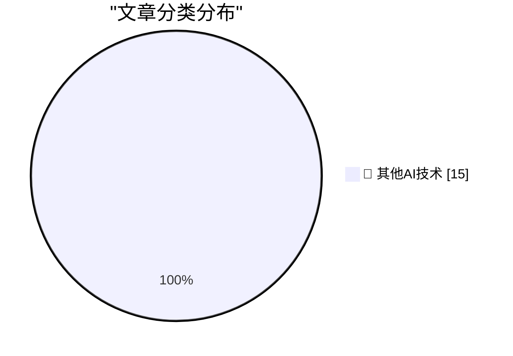

# 📰 AI 博客每日精选 — 2026-08-20

> 来自 98 个技术博客和社交媒体源，AI 精选 Top 15

## 🏆 今日必读

🥇 **Getting the Steam Deck LCD working on a Raspberry Pi**

[Getting the Steam Deck LCD working on a Raspberry Pi](https://www.jeffgeerling.com/blog/2026/steam-deck-lcd-pi-hat/) — jeffgeerling.com · 7 小时前 · 🔬 其他AI技术

> Getting the Steam Deck LCD working on a Raspberry Pi

🥈 **Use the built-in GELU, don't roll your own!**

[Use the built-in GELU, don't roll your own!](https://www.gilesthomas.com/2026/08/built-in-gelu) — gilesthomas.com · 19 小时前 · 🔬 其他AI技术

> Use the built-in GELU, don't roll your own!

🥉 **Issues in the Repo**

[Issues in the Repo](https://nesbitt.io/2026/08/20/issues-in-the-repo.html) — nesbitt.io · 12 小时前 · 🔬 其他AI技术

> Issues in the Repo

4️⃣ **Our Servants Will Do That For Us**

[Our Servants Will Do That For Us](https://borretti.me/article/our-servants-will-do-that-for-us) — borretti.me · 21 小时前 · 🔬 其他AI技术

> Our Servants Will Do That For Us

5️⃣ **A Sloppy Interface Is a Security Liability **

[A Sloppy Interface Is a Security Liability ](https://blog.jim-nielsen.com/2026/sloppy-ui-is-security-liability/) — blog.jim-nielsen.com · 2 小时前 · 🔬 其他AI技术

> A Sloppy Interface Is a Security Liability 

---

## 📊 数据概览

| 扫描源 | 抓取文章 | 时间范围 | 精选 |
|:---:|:---:|:---:|:---:|
| 77/98 | 2743 篇 → 18 篇 | 24h | **15 篇** |

### 分类分布

---

====================

## 🔬 其他AI技术

### 1. Getting the Steam Deck LCD working on a Raspberry Pi

[Getting the Steam Deck LCD working on a Raspberry Pi](https://www.jeffgeerling.com/blog/2026/steam-deck-lcd-pi-hat/) — **jeffgeerling.com** · 7 小时前 · ⭐ 15/25

> Getting the Steam Deck LCD working on a Raspberry Pi

📌 其他AI技术

---

### 2. Use the built-in GELU, don't roll your own!

[Use the built-in GELU, don't roll your own!](https://www.gilesthomas.com/2026/08/built-in-gelu) — **gilesthomas.com** · 19 小时前 · ⭐ 15/25

> Use the built-in GELU, don't roll your own!

📌 其他AI技术

---

### 3. Issues in the Repo

[Issues in the Repo](https://nesbitt.io/2026/08/20/issues-in-the-repo.html) — **nesbitt.io** · 12 小时前 · ⭐ 15/25

> Issues in the Repo

📌 其他AI技术

---

### 4. Our Servants Will Do That For Us

[Our Servants Will Do That For Us](https://borretti.me/article/our-servants-will-do-that-for-us) — **borretti.me** · 21 小时前 · ⭐ 15/25

> Our Servants Will Do That For Us

📌 其他AI技术

---

### 5. A Sloppy Interface Is a Security Liability 

[A Sloppy Interface Is a Security Liability ](https://blog.jim-nielsen.com/2026/sloppy-ui-is-security-liability/) — **blog.jim-nielsen.com** · 2 小时前 · ⭐ 15/25

> A Sloppy Interface Is a Security Liability 

📌 其他AI技术

---

### 6. Adobe Systems IPO August 20, 1986

[Adobe Systems IPO August 20, 1986](https://dfarq.homeip.net/adobe-systems-ipo-august-20-1986/?utm_source=rss&#038;utm_medium=rss&#038;utm_campaign=adobe-systems-ipo-august-20-1986) — **dfarq.homeip.net** · 10 小时前 · ⭐ 15/25

> Adobe Systems IPO August 20, 1986

📌 其他AI技术

---

### 7. Introducing Dashboard Touch, a build-your-own version of Touch ID

[Introducing Dashboard Touch, a build-your-own version of Touch ID](https://anildash.com/2026/08/20/introducing-dashboard-touch/) — **anildash.com** · 21 小时前 · ⭐ 15/25

> Introducing Dashboard Touch, a build-your-own version of Touch ID

📌 其他AI技术

---

### 8. RT Mati Staniszewski: One of my favourite ElevenLabs MCP features: transcribe anything, then immediately ask questions about it. I use it to get throu...

[RT Mati Staniszewski: One of my favourite ElevenLabs MCP features: transcribe anything, then immediately ask questions about it. I use it to get throu...](https://x.com/ElevenLabs/status/2090436501238669450) — **𝕏 @ElevenLabs** · 7 小时前 · ⭐ 15/25

> RT Mati Staniszewski: One of my favourite ElevenLabs MCP features: transcribe anything, then immediately ask questions about it. I use it to get throu...

📌 其他AI技术

---

### 9. RT Vlad F: On August 17, GitHub experienced a significant outage that disrupted developers and organizations around the world. If you were trying to s...

[RT Vlad F: On August 17, GitHub experienced a significant outage that disrupted developers and organizations around the world. If you were trying to s...](https://x.com/github/status/2090510227573510397) — **𝕏 @GitHub** · 2 小时前 · ⭐ 15/25

> RT Vlad F: On August 17, GitHub experienced a significant outage that disrupted developers and organizations around the world. If you were trying to s...

📌 其他AI技术

---

### 10. RT Ish Verduzco: how the Notion social team uses Notion

[RT Ish Verduzco: how the Notion social team uses Notion](https://x.com/NotionHQ/status/2090467871050887322) — **𝕏 @NotionHQ** · 16 小时前 · ⭐ 15/25

> RT Ish Verduzco: how the Notion social team uses Notion

📌 其他AI技术

---

### 11. One workspace for context, collaboration and agents.

[One workspace for context, collaboration and agents.](https://x.com/NotionHQ/status/2090226050466971948) — **𝕏 @NotionHQ** · 21 小时前 · ⭐ 15/25

> One workspace for context, collaboration and agents.

📌 其他AI技术

---

### 12. Five things you need to know about Slack Code, straight from Slack CPO Jaime DeLanghe. 👇

[Five things you need to know about Slack Code, straight from Slack CPO Jaime DeLanghe. 👇](https://x.com/SlackHQ/status/2090525647340777850) — **𝕏 @SlackHQ** · 1 小时前 · ⭐ 15/25

> Five things you need to know about Slack Code, straight from Slack CPO Jaime DeLanghe. 👇

📌 其他AI技术

---

### 13. RT Cognition: Introducing @SlackHQ Code in Devin. Now, Devin proactively creates dedicated code channels to keep work focused. Read more about how we ...

[RT Cognition: Introducing @SlackHQ Code in Devin. Now, Devin proactively creates dedicated code channels to keep work focused. Read more about how we ...](https://x.com/SlackHQ/status/2090515010283815019) — **𝕏 @SlackHQ** · 2 小时前 · ⭐ 15/25

> RT Cognition: Introducing @SlackHQ Code in Devin. Now, Devin proactively creates dedicated code channels to keep work focused. Read more about how we ...

📌 其他AI技术

---

### 14. LIVE NOW ‼️ Be the first to hear our latest news, watch teams already putting multiplayer AI to work, and catch live demos you won't want to miss. h...

[LIVE NOW ‼️ Be the first to hear our latest news, watch teams already putting multiplayer AI to work, and catch live demos you won't want to miss. h...](https://x.com/SlackHQ/status/2090499080002613690) — **𝕏 @SlackHQ** · 3 小时前 · ⭐ 15/25

> LIVE NOW ‼️ Be the first to hear our latest news, watch teams already putting multiplayer AI to work, and catch live demos you won't want to miss. h...

📌 其他AI技术

---

### 15. RT Matt Schrage: This was a fun one! Building an agent that feels at home in Slack is a surprisingly hard problem - there is a lot of informal social ...

[RT Matt Schrage: This was a fun one! Building an agent that feels at home in Slack is a surprisingly hard problem - there is a lot of informal social ...](https://x.com/SlackHQ/status/2090450930558710111) — **𝕏 @SlackHQ** · 8 小时前 · ⭐ 15/25

> RT Matt Schrage: This was a fun one! Building an agent that feels at home in Slack is a surprisingly hard problem - there is a lot of informal social ...

📌 其他AI技术

---

====================

*生成于 2026-08-20 21:24 | 扫描 77 源 → 获取 2743 篇 → 精选 15 篇*
*基于 [Hacker News Popularity Contest 2025](https://refactoringenglish.com/tools/hn-popularity/) RSS 源列表，由 [Andrej Karpathy](https://x.com/karpathy) 推荐*
*由「懂点儿AI」制作，欢迎关注同名微信公众号获取更多 AI 实用技巧 💡*
