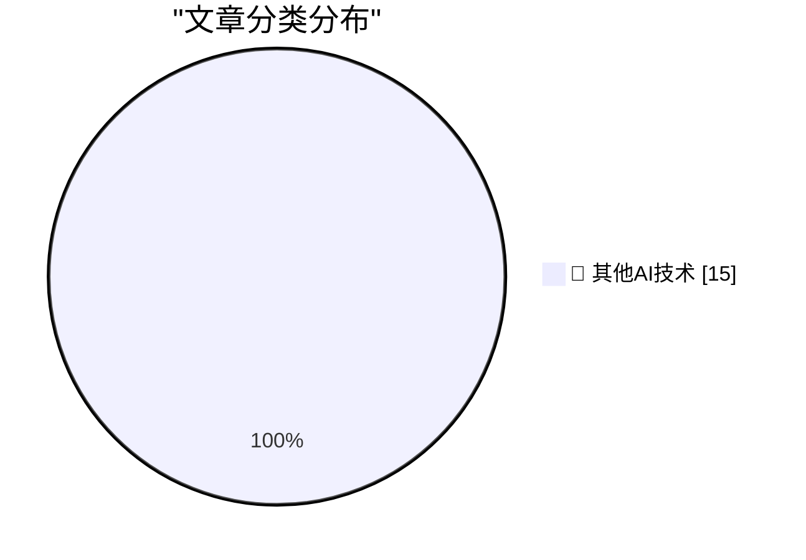

# 📰 AI 博客每日精选 — 2026-08-21

> 来自 98 个技术博客和社交媒体源，AI 精选 Top 15

## 🏆 今日必读

🥇 **Walmart Finally Caves, Will Soon Support Apple Pay**

[Walmart Finally Caves, Will Soon Support Apple Pay](https://corporate.walmart.com/news/2026/08/21/more-ways-to-pay-tap-to-pay-is-coming-to-walmart-and-sams-club) — daringfireball.net · 1 小时前 · 🔬 其他AI技术

> Walmart Finally Caves, Will Soon Support Apple Pay

🥈 **★ When New DF Posts Drop in a Forest and No One Is There to Read Them**

[★ When New DF Posts Drop in a Forest and No One Is There to Read Them](https://daringfireball.net/2026/08/df_posts_drop_in_a_forest) — daringfireball.net · 5 小时前 · 🔬 其他AI技术

> ★ When New DF Posts Drop in a Forest and No One Is There to Read Them

🥉 **Bluesky’s Active User Base Is Shrinking, and Remains Tiny Compared to Threads and Twitter/X**

[Bluesky’s Active User Base Is Shrinking, and Remains Tiny Compared to Threads and Twitter/X](https://techcrunch.com/2026/08/11/blueskys-active-user-base-is-shrinking-as-its-focus-expands-beyond-the-app/) — daringfireball.net · 7 小时前 · 🔬 其他AI技术

> Bluesky’s Active User Base Is Shrinking, and Remains Tiny Compared to Threads and Twitter/X

4️⃣ **Bluesky Is Full of Anti-AI Zealots**

[Bluesky Is Full of Anti-AI Zealots](https://bsky.app/profile/masnick.com/post/3mtk7cuvbok2x) — daringfireball.net · 8 小时前 · 🔬 其他AI技术

> Bluesky Is Full of Anti-AI Zealots

5️⃣ **How Bluesky and Threads Sneak Their Logos Into iOS Screenshots**

[How Bluesky and Threads Sneak Their Logos Into iOS Screenshots](https://timmarinin.net/2026/bluesky-screenshots/) — daringfireball.net · 18 小时前 · 🔬 其他AI技术

> How Bluesky and Threads Sneak Their Logos Into iOS Screenshots

---

## 📊 数据概览

| 扫描源 | 抓取文章 | 时间范围 | 精选 |
|:---:|:---:|:---:|:---:|
| 74/98 | 2691 篇 → 27 篇 | 24h | **15 篇** |

### 分类分布

---

====================

## 🔬 其他AI技术

### 1. Walmart Finally Caves, Will Soon Support Apple Pay

[Walmart Finally Caves, Will Soon Support Apple Pay](https://corporate.walmart.com/news/2026/08/21/more-ways-to-pay-tap-to-pay-is-coming-to-walmart-and-sams-club) — **daringfireball.net** · 1 小时前 · ⭐ 15/25

> Walmart Finally Caves, Will Soon Support Apple Pay

📌 其他AI技术

---

### 2. ★ When New DF Posts Drop in a Forest and No One Is There to Read Them

[★ When New DF Posts Drop in a Forest and No One Is There to Read Them](https://daringfireball.net/2026/08/df_posts_drop_in_a_forest) — **daringfireball.net** · 5 小时前 · ⭐ 15/25

> ★ When New DF Posts Drop in a Forest and No One Is There to Read Them

📌 其他AI技术

---

### 3. Bluesky’s Active User Base Is Shrinking, and Remains Tiny Compared to Threads and Twitter/X

[Bluesky’s Active User Base Is Shrinking, and Remains Tiny Compared to Threads and Twitter/X](https://techcrunch.com/2026/08/11/blueskys-active-user-base-is-shrinking-as-its-focus-expands-beyond-the-app/) — **daringfireball.net** · 7 小时前 · ⭐ 15/25

> Bluesky’s Active User Base Is Shrinking, and Remains Tiny Compared to Threads and Twitter/X

📌 其他AI技术

---

### 4. Bluesky Is Full of Anti-AI Zealots

[Bluesky Is Full of Anti-AI Zealots](https://bsky.app/profile/masnick.com/post/3mtk7cuvbok2x) — **daringfireball.net** · 8 小时前 · ⭐ 15/25

> Bluesky Is Full of Anti-AI Zealots

📌 其他AI技术

---

### 5. How Bluesky and Threads Sneak Their Logos Into iOS Screenshots

[How Bluesky and Threads Sneak Their Logos Into iOS Screenshots](https://timmarinin.net/2026/bluesky-screenshots/) — **daringfireball.net** · 18 小时前 · ⭐ 15/25

> How Bluesky and Threads Sneak Their Logos Into iOS Screenshots

📌 其他AI技术

---

### 6. Pluralistic: The actual epistemic crisis (20 Aug 2026)

[Pluralistic: The actual epistemic crisis (20 Aug 2026)](https://pluralistic.net/2026/08/20/epistemic-void/) — **pluralistic.net** · 21 小时前 · ⭐ 15/25

> Pluralistic: The actual epistemic crisis (20 Aug 2026)

📌 其他AI技术

---

### 7. Book Review: An Immense World - How Animal Senses Reveal the Hidden Realms Around Us by Ed Yong ★★★☆☆

[Book Review: An Immense World - How Animal Senses Reveal the Hidden Realms Around Us by Ed Yong ★★★☆☆](https://shkspr.mobi/blog/2026/08/book-review-an-immense-world-how-animal-senses-reveal-the-hidden-realms-around-us-by-ed-yong/) — **shkspr.mobi** · 9 小时前 · ⭐ 15/25

> Book Review: An Immense World - How Animal Senses Reveal the Hidden Realms Around Us by Ed Yong ★★★☆☆

📌 其他AI技术

---

### 8. Reducing C++ template bloat by factoring out the type-dependent portions of the function, practical exam

[Reducing C++ template bloat by factoring out the type-dependent portions of the function, practical exam](https://devblogs.microsoft.com/oldnewthing/20260821-00/?p=112632) — **devblogs.microsoft.com/oldnewthing** · 7 小时前 · ⭐ 15/25

> Reducing C++ template bloat by factoring out the type-dependent portions of the function, practical exam

📌 其他AI技术

---

### 9. Rust Glancer

[Rust Glancer](https://matklad.github.io/2026/08/21/rust-glancer.html) — **matklad.github.io** · 21 小时前 · ⭐ 15/25

> Rust Glancer

📌 其他AI技术

---

### 10. A Need for Speed

[A Need for Speed](https://www.filfre.net/2026/08/a-need-for-speed/) — **filfre.net** · 5 小时前 · ⭐ 15/25

> A Need for Speed

📌 其他AI技术

---

### 11. Microsoft QuickBasic remembered

[Microsoft QuickBasic remembered](https://dfarq.homeip.net/microsoft-quickbasic-remembered/?utm_source=rss&#038;utm_medium=rss&#038;utm_campaign=microsoft-quickbasic-remembered) — **dfarq.homeip.net** · 10 小时前 · ⭐ 15/25

> Microsoft QuickBasic remembered

📌 其他AI技术

---

### 12. In Purgatory Everyone Likes Crepes: My Time at a Greek All-Inclusive

[In Purgatory Everyone Likes Crepes: My Time at a Greek All-Inclusive](https://matduggan.com/in-purgatory-everyone-likes-crepes-my-time-at-a-greek-all-inclusive/) — **matduggan.com** · 12 小时前 · ⭐ 15/25

> In Purgatory Everyone Likes Crepes: My Time at a Greek All-Inclusive

📌 其他AI技术

---

### 13. Re Now available on the API and rolling out across eligible plans for ChatGPT Work and Codex credits. Pro, Plus, and Business subscription usage remai...

[Re Now available on the API and rolling out across eligible plans for ChatGPT Work and Codex credits. Pro, Plus, and Business subscription usage remai...](https://x.com/OpenAI/status/2090885188897460249) — **𝕏 @OpenAI** · 1 小时前 · ⭐ 15/25

> Re Now available on the API and rolling out across eligible plans for ChatGPT Work and Codex credits. Pro, Plus, and Business subscription usage remai...

📌 其他AI技术

---

### 14. As we continue to push the frontier of capabilities while improving efficiency, we're dropping API and credit pricing of GPT-5.6 Sol by over 20% for t...

[As we continue to push the frontier of capabilities while improving efficiency, we're dropping API and credit pricing of GPT-5.6 Sol by over 20% for t...](https://x.com/OpenAI/status/2090885187634905500) — **𝕏 @OpenAI** · 1 小时前 · ⭐ 15/25

> As we continue to push the frontier of capabilities while improving efficiency, we're dropping API and credit pricing of GPT-5.6 Sol by over 20% for t...

📌 其他AI技术

---

### 15. RT Tiago Botelho: Incredibly excited to launch our new and improved @github Slack and Teams app with a fully collaborative agentic experience. Buildin...

[RT Tiago Botelho: Incredibly excited to launch our new and improved @github Slack and Teams app with a fully collaborative agentic experience. Buildin...](https://x.com/github/status/2090838556025479374) — **𝕏 @GitHub** · 4 小时前 · ⭐ 15/25

> RT Tiago Botelho: Incredibly excited to launch our new and improved @github Slack and Teams app with a fully collaborative agentic experience. Buildin...

📌 其他AI技术

---

====================

*生成于 2026-08-21 21:20 | 扫描 74 源 → 获取 2691 篇 → 精选 15 篇*
*基于 [Hacker News Popularity Contest 2025](https://refactoringenglish.com/tools/hn-popularity/) RSS 源列表，由 [Andrej Karpathy](https://x.com/karpathy) 推荐*
*由「懂点儿AI」制作，欢迎关注同名微信公众号获取更多 AI 实用技巧 💡*
