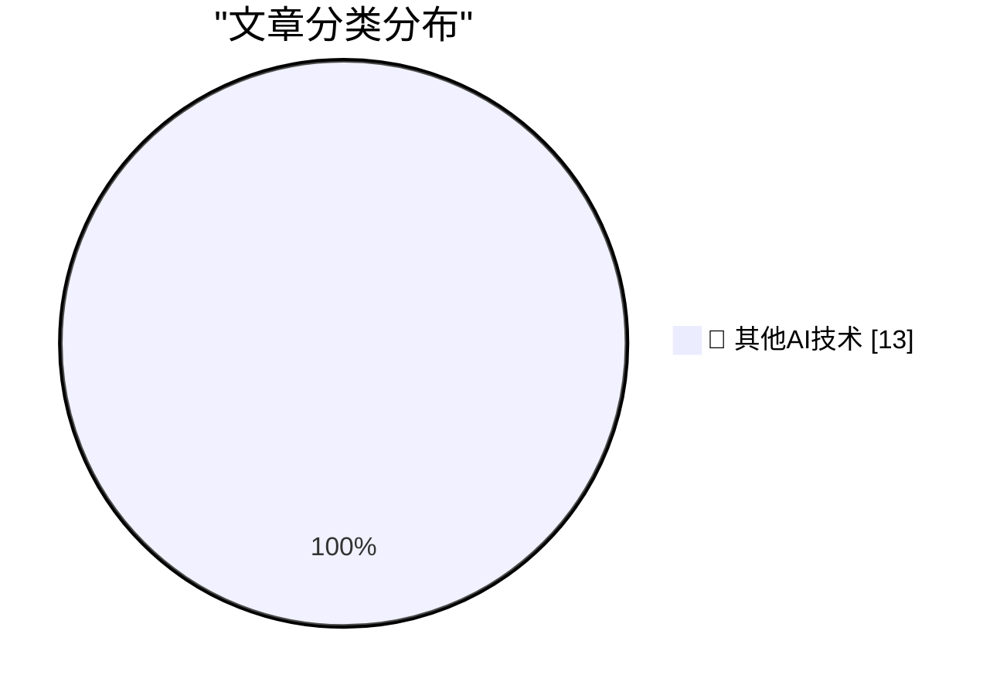

# 📰 AI 博客每日精选 — 2026-08-22

> 来自 98 个技术博客和社交媒体源，AI 精选 Top 13

## 🏆 今日必读

🥇 **Mark Carney on the U.S. Under Trump: ‘Sometimes, Its Signature Is Written in Pencil’**

[Mark Carney on the U.S. Under Trump: ‘Sometimes, Its Signature Is Written in Pencil’](https://www.nytimes.com/2026/08/22/world/canada/carney-tariffs-trade-trump.html?unlocked_article_code=1.7VA.r3Ue.GTc_tOhX0qSn) — daringfireball.net · 4 小时前 · 🔬 其他AI技术

> Mark Carney on the U.S. Under Trump: ‘Sometimes, Its Signature Is Written in Pencil’

🥈 **WorkOS: Agents Can Now Sign Up for Your App**

[WorkOS: Agents Can Now Sign Up for Your App](https://workos.com/auth-md?utm_source=daringfireball&amp;utm_medium=newsletter&amp;utm_campaign=q32026) — daringfireball.net · 6 小时前 · 🔬 其他AI技术

> WorkOS: Agents Can Now Sign Up for Your App

🥉 **Dutch Regulator Fines Uber $1 Billion for Suspending Dishonest Drivers**

[Dutch Regulator Fines Uber $1 Billion for Suspending Dishonest Drivers](https://www.reuters.com/world/dutch-regulator-fines-uber-966-million-automating-driver-suspensions-document-2026-08-21/) — daringfireball.net · 7 小时前 · 🔬 其他AI技术

> Dutch Regulator Fines Uber $1 Billion for Suspending Dishonest Drivers

4️⃣ **The Fourth Horseman of the File-Format-Hegemony Apocalypse**

[The Fourth Horseman of the File-Format-Hegemony Apocalypse](https://techcommunity.microsoft.com/blog/onedriveblog/introducing-markdown-support-in-sharepoint-and-onedrive/4512174) — daringfireball.net · 21 小时前 · 🔬 其他AI技术

> The Fourth Horseman of the File-Format-Hegemony Apocalypse

5️⃣ **Pluralistic: Born on technology's third base (21 Aug 2026)**

[Pluralistic: Born on technology's third base (21 Aug 2026)](https://pluralistic.net/2026/08/21/world-historic-forces/) — pluralistic.net · 19 小时前 · 🔬 其他AI技术

> Pluralistic: Born on technology's third base (21 Aug 2026)

---

## 📊 数据概览

| 扫描源 | 抓取文章 | 时间范围 | 精选 |
|:---:|:---:|:---:|:---:|
| 75/98 | 2703 篇 → 13 篇 | 24h | **13 篇** |

### 分类分布

---

====================

## 🔬 其他AI技术

### 1. Mark Carney on the U.S. Under Trump: ‘Sometimes, Its Signature Is Written in Pencil’

[Mark Carney on the U.S. Under Trump: ‘Sometimes, Its Signature Is Written in Pencil’](https://www.nytimes.com/2026/08/22/world/canada/carney-tariffs-trade-trump.html?unlocked_article_code=1.7VA.r3Ue.GTc_tOhX0qSn) — **daringfireball.net** · 4 小时前 · ⭐ 15/25

> Mark Carney on the U.S. Under Trump: ‘Sometimes, Its Signature Is Written in Pencil’

📌 其他AI技术

---

### 2. WorkOS: Agents Can Now Sign Up for Your App

[WorkOS: Agents Can Now Sign Up for Your App](https://workos.com/auth-md?utm_source=daringfireball&amp;utm_medium=newsletter&amp;utm_campaign=q32026) — **daringfireball.net** · 6 小时前 · ⭐ 15/25

> WorkOS: Agents Can Now Sign Up for Your App

📌 其他AI技术

---

### 3. Dutch Regulator Fines Uber $1 Billion for Suspending Dishonest Drivers

[Dutch Regulator Fines Uber $1 Billion for Suspending Dishonest Drivers](https://www.reuters.com/world/dutch-regulator-fines-uber-966-million-automating-driver-suspensions-document-2026-08-21/) — **daringfireball.net** · 7 小时前 · ⭐ 15/25

> Dutch Regulator Fines Uber $1 Billion for Suspending Dishonest Drivers

📌 其他AI技术

---

### 4. The Fourth Horseman of the File-Format-Hegemony Apocalypse

[The Fourth Horseman of the File-Format-Hegemony Apocalypse](https://techcommunity.microsoft.com/blog/onedriveblog/introducing-markdown-support-in-sharepoint-and-onedrive/4512174) — **daringfireball.net** · 21 小时前 · ⭐ 15/25

> The Fourth Horseman of the File-Format-Hegemony Apocalypse

📌 其他AI技术

---

### 5. Pluralistic: Born on technology's third base (21 Aug 2026)

[Pluralistic: Born on technology's third base (21 Aug 2026)](https://pluralistic.net/2026/08/21/world-historic-forces/) — **pluralistic.net** · 19 小时前 · ⭐ 15/25

> Pluralistic: Born on technology's third base (21 Aug 2026)

📌 其他AI技术

---

### 6. Fast and Hard Code

[Fast and Hard Code](https://lucumr.pocoo.org/2026/8/22/fast-hard-code/) — **lucumr.pocoo.org** · 21 小时前 · ⭐ 15/25

> Fast and Hard Code

📌 其他AI技术

---

### 7. This Week in Package Management: 22 August 2026

[This Week in Package Management: 22 August 2026](https://nesbitt.io/2026/08/22/this-week-in-package-management.html) — **nesbitt.io** · 11 小时前 · ⭐ 15/25

> This Week in Package Management: 22 August 2026

📌 其他AI技术

---

### 8. Concurrent Servers: Part 8 - Go

[Concurrent Servers: Part 8 - Go](https://eli.thegreenplace.net/2026/concurrent-servers-part-8-go/) — **eli.thegreenplace.net** · 6 小时前 · ⭐ 15/25

> Concurrent Servers: Part 8 - Go

📌 其他AI技术

---

### 9. RT Adam Fry: This week’s ChatGPT feature drop - Aug 21: Another Friday, another roundup of what we shipped this week: 1/ Recent photos: Long press on...

[RT Adam Fry: This week’s ChatGPT feature drop - Aug 21: Another Friday, another roundup of what we shipped this week: 1/ Recent photos: Long press on...](https://x.com/OpenAI/status/2090944840972571078) — **𝕏 @OpenAI** · 21 小时前 · ⭐ 15/25

> RT Adam Fry: This week’s ChatGPT feature drop - Aug 21: Another Friday, another roundup of what we shipped this week: 1/ Recent photos: Long press on...

📌 其他AI技术

---

### 10. Mission control, we're approaching Universe 2026. 🚀 Get your ticket 👇 https://githubuniverse.com/?utm_source=Twitter&utm_medium=Social&utm_campa...

[Mission control, we're approaching Universe 2026. 🚀 Get your ticket 👇 https://githubuniverse.com/?utm_source=Twitter&utm_medium=Social&utm_campa...](https://x.com/github/status/2091233593171337649) — **𝕏 @GitHub** · 2 小时前 · ⭐ 15/25

> Mission control, we're approaching Universe 2026. 🚀 Get your ticket 👇 https://githubuniverse.com/?utm_source=Twitter&utm_medium=Social&utm_campa...

📌 其他AI技术

---

### 11. RT Akshay Kothari: At Notion, we’re excited to serve not just the Fortune 500, but the Fortune 5 million. Diffusing the power of AI to millions of sm...

[RT Akshay Kothari: At Notion, we’re excited to serve not just the Fortune 500, but the Fortune 5 million. Diffusing the power of AI to millions of sm...](https://x.com/NotionHQ/status/2091182784740311450) — **𝕏 @NotionHQ** · 17 小时前 · ⭐ 15/25

> RT Akshay Kothari: At Notion, we’re excited to serve not just the Fortune 500, but the Fortune 5 million. Diffusing the power of AI to millions of sm...

📌 其他AI技术

---

### 12. RT Ethan Lee: Just got to visit the @NotionHQ SF office and honestly such a beautiful space. I genuinely don't think there's any other office that car...

[RT Ethan Lee: Just got to visit the @NotionHQ SF office and honestly such a beautiful space. I genuinely don't think there's any other office that car...](https://x.com/NotionHQ/status/2090942585460437476) — **𝕏 @NotionHQ** · 22 小时前 · ⭐ 15/25

> RT Ethan Lee: Just got to visit the @NotionHQ SF office and honestly such a beautiful space. I genuinely don't think there's any other office that car...

📌 其他AI技术

---

### 13. RT Zach Tratar: Notion is one of the top apps people connect in ChatGPT. If you're building an AI agent without a Notion integration, consider how muc...

[RT Zach Tratar: Notion is one of the top apps people connect in ChatGPT. If you're building an AI agent without a Notion integration, consider how muc...](https://x.com/NotionHQ/status/2090947933479051707) — **𝕏 @NotionHQ** · 23 小时前 · ⭐ 15/25

> RT Zach Tratar: Notion is one of the top apps people connect in ChatGPT. If you're building an AI agent without a Notion integration, consider how muc...

📌 其他AI技术

---

====================

*生成于 2026-08-22 21:17 | 扫描 75 源 → 获取 2703 篇 → 精选 13 篇*
*基于 [Hacker News Popularity Contest 2025](https://refactoringenglish.com/tools/hn-popularity/) RSS 源列表，由 [Andrej Karpathy](https://x.com/karpathy) 推荐*
*由「懂点儿AI」制作，欢迎关注同名微信公众号获取更多 AI 实用技巧 💡*
