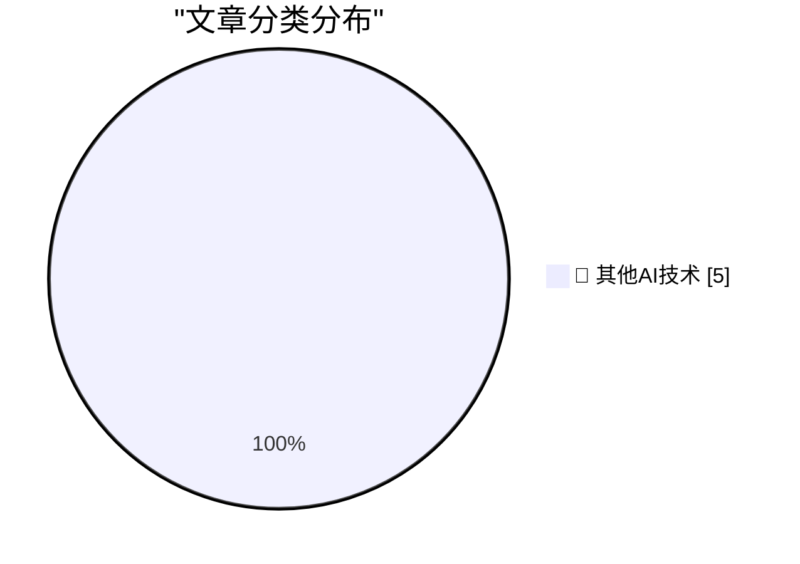

# 📰 AI 博客每日精选 — 2026-08-23

> 来自 98 个技术博客和社交媒体源，AI 精选 Top 5

## 🏆 今日必读

🥇 **Cooper Sharp Proves That American Cheese Can Be Great Cheese**

[Cooper Sharp Proves That American Cheese Can Be Great Cheese](https://sixcolors.com/member/2026/08/this-week-in-apple-lets-fight/) — daringfireball.net · 3 小时前 · 🔬 其他AI技术

> Cooper Sharp Proves That American Cheese Can Be Great Cheese

🥈 **Death to px, long live ch!**

[Death to px, long live ch!](https://shkspr.mobi/blog/2026/08/death-to-px-long-live-ch/) — shkspr.mobi · 9 小时前 · 🔬 其他AI技术

> Death to px, long live ch!

🥉 **The summer of open weights**

[The summer of open weights](https://martinalderson.com/posts/the-summer-of-open-weights/?utm_source=rss&amp;utm_medium=rss&amp;utm_campaign=feed) — martinalderson.com · 21 小时前 · 🔬 其他AI技术

> The summer of open weights

4️⃣ **Ever opened a repo thinking “this’ll just be a README”, and suddenly you’re building a full Python stack? Same. Get to know the hosts of our seaso...**

[Ever opened a repo thinking “this’ll just be a README”, and suddenly you’re building a full Python stack? Same. Get to know the hosts of our seaso...](https://x.com/github/status/2091631505223155820) — 𝕏 @GitHub · 17 分钟前 · 🔬 其他AI技术

> Ever opened a repo thinking “this’ll just be a README”, and suddenly you’re building a full Python stack? Same. Get to know the hosts of our seaso...

5️⃣ **Dependabot now waits three days before non-security version update pull requests, giving scanners time to catch a poisoned release first. The case for...**

[Dependabot now waits three days before non-security version update pull requests, giving scanners time to catch a poisoned release first. The case for...](https://x.com/github/status/2091575699073016098) — 𝕏 @GitHub · 3 小时前 · 🔬 其他AI技术

> Dependabot now waits three days before non-security version update pull requests, giving scanners time to catch a poisoned release first. The case for...

---

## 📊 数据概览

| 扫描源 | 抓取文章 | 时间范围 | 精选 |
|:---:|:---:|:---:|:---:|
| 77/98 | 2735 篇 → 5 篇 | 24h | **5 篇** |

### 分类分布

---

====================

## 🔬 其他AI技术

### 1. Cooper Sharp Proves That American Cheese Can Be Great Cheese

[Cooper Sharp Proves That American Cheese Can Be Great Cheese](https://sixcolors.com/member/2026/08/this-week-in-apple-lets-fight/) — **daringfireball.net** · 3 小时前 · ⭐ 15/25

> Cooper Sharp Proves That American Cheese Can Be Great Cheese

📌 其他AI技术

---

### 2. Death to px, long live ch!

[Death to px, long live ch!](https://shkspr.mobi/blog/2026/08/death-to-px-long-live-ch/) — **shkspr.mobi** · 9 小时前 · ⭐ 15/25

> Death to px, long live ch!

📌 其他AI技术

---

### 3. The summer of open weights

[The summer of open weights](https://martinalderson.com/posts/the-summer-of-open-weights/?utm_source=rss&amp;utm_medium=rss&amp;utm_campaign=feed) — **martinalderson.com** · 21 小时前 · ⭐ 15/25

> The summer of open weights

📌 其他AI技术

---

### 4. Ever opened a repo thinking “this’ll just be a README”, and suddenly you’re building a full Python stack? Same. Get to know the hosts of our seaso...

[Ever opened a repo thinking “this’ll just be a README”, and suddenly you’re building a full Python stack? Same. Get to know the hosts of our seaso...](https://x.com/github/status/2091631505223155820) — **𝕏 @GitHub** · 17 分钟前 · ⭐ 15/25

> Ever opened a repo thinking “this’ll just be a README”, and suddenly you’re building a full Python stack? Same. Get to know the hosts of our seaso...

📌 其他AI技术

---

### 5. Dependabot now waits three days before non-security version update pull requests, giving scanners time to catch a poisoned release first. The case for...

[Dependabot now waits three days before non-security version update pull requests, giving scanners time to catch a poisoned release first. The case for...](https://x.com/github/status/2091575699073016098) — **𝕏 @GitHub** · 3 小时前 · ⭐ 15/25

> Dependabot now waits three days before non-security version update pull requests, giving scanners time to catch a poisoned release first. The case for...

📌 其他AI技术

---

====================

*生成于 2026-08-23 21:17 | 扫描 77 源 → 获取 2735 篇 → 精选 5 篇*
*基于 [Hacker News Popularity Contest 2025](https://refactoringenglish.com/tools/hn-popularity/) RSS 源列表，由 [Andrej Karpathy](https://x.com/karpathy) 推荐*
*由「懂点儿AI」制作，欢迎关注同名微信公众号获取更多 AI 实用技巧 💡*
