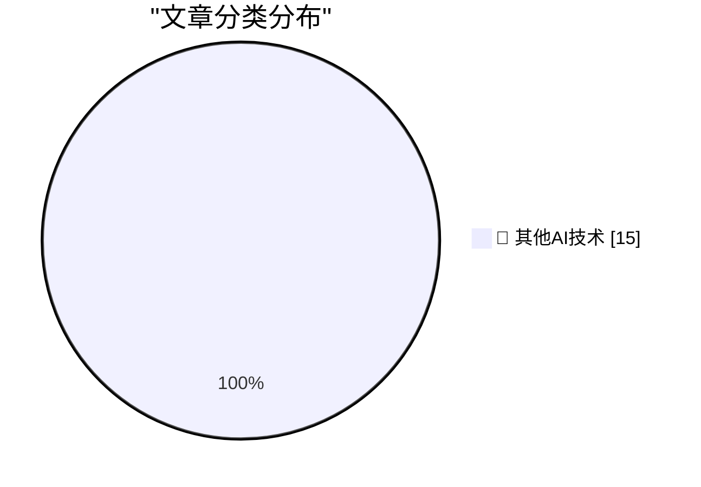

# 📰 AI 博客每日精选 — 2026-08-24

> 来自 98 个技术博客和社交媒体源，AI 精选 Top 15

## 🏆 今日必读

🥇 **BitCam: The 1-Bit Camera App Turns 2.0**

[BitCam: The 1-Bit Camera App Turns 2.0](https://bitcam-app.com/) — daringfireball.net · 4 小时前 · 🔬 其他AI技术

> BitCam: The 1-Bit Camera App Turns 2.0

🥈 **More on TestFlight’s Screwy Sort Order**

[More on TestFlight’s Screwy Sort Order](https://daringfireball.net/2026/08/apple_testflight_list_sort_order) — daringfireball.net · 6 小时前 · 🔬 其他AI技术

> More on TestFlight’s Screwy Sort Order

🥉 **Why do audience members choose specific shows at the Edinburgh Fringe?**

[Why do audience members choose specific shows at the Edinburgh Fringe?](https://shkspr.mobi/blog/2026/08/why-do-audience-members-choose-specific-shows-at-the-edinburgh-fringe/) — shkspr.mobi · 9 小时前 · 🔬 其他AI技术

> Why do audience members choose specific shows at the Edinburgh Fringe?

4️⃣ **Anger, Anxiety and Agency**

[Anger, Anxiety and Agency](https://lucumr.pocoo.org/2026/8/24/anger-anxiety-agency/) — lucumr.pocoo.org · 21 小时前 · 🔬 其他AI技术

> Anger, Anxiety and Agency

5️⃣ **Windows 95 released August 24, 1995**

[Windows 95 released August 24, 1995](https://dfarq.homeip.net/happy-20th-birthday-to-windows-95/?utm_source=rss&#038;utm_medium=rss&#038;utm_campaign=happy-20th-birthday-to-windows-95) — dfarq.homeip.net · 10 小时前 · 🔬 其他AI技术

> Windows 95 released August 24, 1995

---

## 📊 数据概览

| 扫描源 | 抓取文章 | 时间范围 | 精选 |
|:---:|:---:|:---:|:---:|
| 74/98 | 2701 篇 → 16 篇 | 24h | **15 篇** |

### 分类分布

---

====================

## 🔬 其他AI技术

### 1. BitCam: The 1-Bit Camera App Turns 2.0

[BitCam: The 1-Bit Camera App Turns 2.0](https://bitcam-app.com/) — **daringfireball.net** · 4 小时前 · ⭐ 15/25

> BitCam: The 1-Bit Camera App Turns 2.0

📌 其他AI技术

---

### 2. More on TestFlight’s Screwy Sort Order

[More on TestFlight’s Screwy Sort Order](https://daringfireball.net/2026/08/apple_testflight_list_sort_order) — **daringfireball.net** · 6 小时前 · ⭐ 15/25

> More on TestFlight’s Screwy Sort Order

📌 其他AI技术

---

### 3. Why do audience members choose specific shows at the Edinburgh Fringe?

[Why do audience members choose specific shows at the Edinburgh Fringe?](https://shkspr.mobi/blog/2026/08/why-do-audience-members-choose-specific-shows-at-the-edinburgh-fringe/) — **shkspr.mobi** · 9 小时前 · ⭐ 15/25

> Why do audience members choose specific shows at the Edinburgh Fringe?

📌 其他AI技术

---

### 4. Anger, Anxiety and Agency

[Anger, Anxiety and Agency](https://lucumr.pocoo.org/2026/8/24/anger-anxiety-agency/) — **lucumr.pocoo.org** · 21 小时前 · ⭐ 15/25

> Anger, Anxiety and Agency

📌 其他AI技术

---

### 5. Windows 95 released August 24, 1995

[Windows 95 released August 24, 1995](https://dfarq.homeip.net/happy-20th-birthday-to-windows-95/?utm_source=rss&#038;utm_medium=rss&#038;utm_campaign=happy-20th-birthday-to-windows-95) — **dfarq.homeip.net** · 10 小时前 · ⭐ 15/25

> Windows 95 released August 24, 1995

📌 其他AI技术

---

### 6. distributed identity

[distributed identity](https://jyn.dev/distributed-identity/) — **jyn.dev** · 21 小时前 · ⭐ 15/25

> distributed identity

📌 其他AI技术

---

### 7. Today we are releasing ElevenLabs CLI v1, which brings the entire ElevenLabs API into the terminal.

[Today we are releasing ElevenLabs CLI v1, which brings the entire ElevenLabs API into the terminal.](https://x.com/ElevenLabs/status/2091916523132616961) — **𝕏 @ElevenLabs** · 5 小时前 · ⭐ 15/25

> Today we are releasing ElevenLabs CLI v1, which brings the entire ElevenLabs API into the terminal.

📌 其他AI技术

---

### 8. RT Sarah Sachs: Recently shipped a bunch of under-the-hood improvements to make @NotionHQ agents more dependable! → Stalled runs dropped to 0.17% → ...

[RT Sarah Sachs: Recently shipped a bunch of under-the-hood improvements to make @NotionHQ agents more dependable! → Stalled runs dropped to 0.17% → ...](https://x.com/NotionHQ/status/2091975792301674799) — **𝕏 @NotionHQ** · 1 小时前 · ⭐ 15/25

> RT Sarah Sachs: Recently shipped a bunch of under-the-hood improvements to make @NotionHQ agents more dependable! → Stalled runs dropped to 0.17% → ...

📌 其他AI技术

---

### 9. RT Hurley: Every Notion all hands we invite a customer to speak. Last week was Jimmy Paul, Co-Founder / CTO at Crafty. It was too good to keep interna...

[RT Hurley: Every Notion all hands we invite a customer to speak. Last week was Jimmy Paul, Co-Founder / CTO at Crafty. It was too good to keep interna...](https://x.com/NotionHQ/status/2091945115879416073) — **𝕏 @NotionHQ** · 3 小时前 · ⭐ 15/25

> RT Hurley: Every Notion all hands we invite a customer to speak. Last week was Jimmy Paul, Co-Founder / CTO at Crafty. It was too good to keep interna...

📌 其他AI技术

---

### 10. RT chloe venn: in 2024, i was so happy to be working at Notion that i made an editorial video to capture the office ambiance lol

[RT chloe venn: in 2024, i was so happy to be working at Notion that i made an editorial video to capture the office ambiance lol](https://x.com/NotionHQ/status/2091942698840469525) — **𝕏 @NotionHQ** · 4 小时前 · ⭐ 15/25

> RT chloe venn: in 2024, i was so happy to be working at Notion that i made an editorial video to capture the office ambiance lol

📌 其他AI技术

---

### 11. RT Ian McClanan: Typically, skills are single-player and hard to collaborate on (especially for non-technical teams). Shared skills let your experts s...

[RT Ian McClanan: Typically, skills are single-player and hard to collaborate on (especially for non-technical teams). Shared skills let your experts s...](https://x.com/NotionHQ/status/2091923178151092259) — **𝕏 @NotionHQ** · 5 小时前 · ⭐ 15/25

> RT Ian McClanan: Typically, skills are single-player and hard to collaborate on (especially for non-technical teams). Shared skills let your experts s...

📌 其他AI技术

---

### 12. Notion vocabulary: - Block - Database - Template - Teamspace - Toolmaking - Tools for thought - The Notion Way - Life's work - Malleable software - Wo...

[Notion vocabulary: - Block - Database - Template - Teamspace - Toolmaking - Tools for thought - The Notion Way - Life's work - Malleable software - Wo...](https://x.com/NotionHQ/status/2091915618358534405) — **𝕏 @NotionHQ** · 5 小时前 · ⭐ 15/25

> Notion vocabulary: - Block - Database - Template - Teamspace - Toolmaking - Tools for thought - The Notion Way - Life's work - Malleable software - Wo...

📌 其他AI技术

---

### 13. Kinda chic to reply in thread

[Kinda chic to reply in thread](https://x.com/SlackHQ/status/2091946577703084208) — **𝕏 @SlackHQ** · 3 小时前 · ⭐ 15/25

> Kinda chic to reply in thread

📌 其他AI技术

---

### 14. You saw it live: Building will never be the same. (And neither will Slack!) See what happens when AI work becomes teamwork. 👇

[You saw it live: Building will never be the same. (And neither will Slack!) See what happens when AI work becomes teamwork. 👇](https://x.com/SlackHQ/status/2091940547476721863) — **𝕏 @SlackHQ** · 3 小时前 · ⭐ 15/25

> You saw it live: Building will never be the same. (And neither will Slack!) See what happens when AI work becomes teamwork. 👇

📌 其他AI技术

---

### 15. Not every task needs the same power. Copilot Cowork now gives you more control with effort levels in the model picker, so you can choose the right bal...

[Not every task needs the same power. Copilot Cowork now gives you more control with effort levels in the model picker, so you can choose the right bal...](https://x.com/Microsoft365/status/2091993982951706763) — **𝕏 @Microsoft365** · 25 分钟前 · ⭐ 15/25

> Not every task needs the same power. Copilot Cowork now gives you more control with effort levels in the model picker, so you can choose the right bal...

📌 其他AI技术

---

====================

*生成于 2026-08-24 21:25 | 扫描 74 源 → 获取 2701 篇 → 精选 15 篇*
*基于 [Hacker News Popularity Contest 2025](https://refactoringenglish.com/tools/hn-popularity/) RSS 源列表，由 [Andrej Karpathy](https://x.com/karpathy) 推荐*
*由「懂点儿AI」制作，欢迎关注同名微信公众号获取更多 AI 实用技巧 💡*
