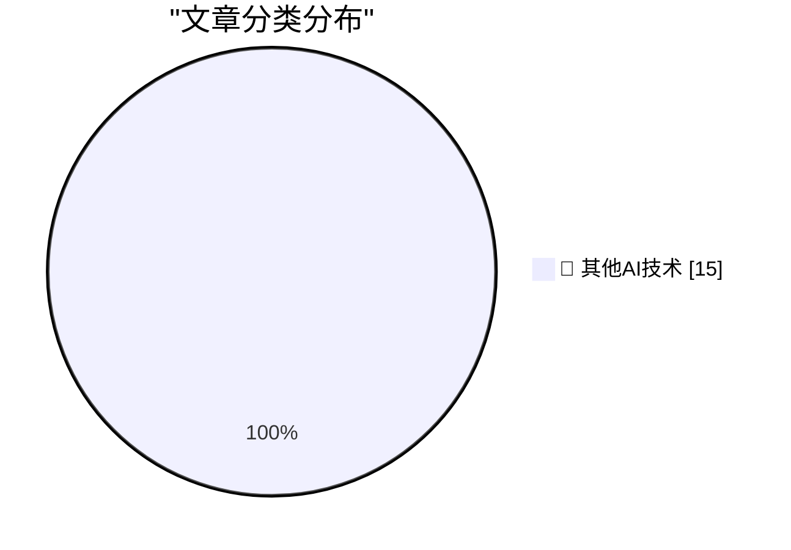

# 📰 AI 博客每日精选 — 2026-08-25

> 来自 98 个技术博客和社交媒体源，AI 精选 Top 15

## 🏆 今日必读

🥇 **Debugging Ubiquiti's 5G Backup on AT&T**

[Debugging Ubiquiti's 5G Backup on AT&T](https://www.jeffgeerling.com/blog/2026/unifi-u5g-backup-debugging/) — jeffgeerling.com · 2 小时前 · 🔬 其他AI技术

> Debugging Ubiquiti's 5G Backup on AT&T

🥈 **Footnote Regarding the GDPR and Cookie Permission Prompts**

[Footnote Regarding the GDPR and Cookie Permission Prompts](https://daringfireball.net/2026/08/what_is_the_point_of_the_dma#fn1-2026-08-24) — daringfireball.net · 5 小时前 · 🔬 其他AI技术

> Footnote Regarding the GDPR and Cookie Permission Prompts

🥉 **★ Memory and Storage Configurations and Pricing for the New Mac Minis (M6/M5 Pro) and Mac Studios (M5 Max/M5 Ultra)**

[★ Memory and Storage Configurations and Pricing for the New Mac Minis (M6/M5 Pro) and Mac Studios (M5 Max/M5 Ultra)](https://daringfireball.net/2026/08/configurations_and_pricing_for_new_mac_minis_and_mac_studios) — daringfireball.net · 6 小时前 · 🔬 其他AI技术

> ★ Memory and Storage Configurations and Pricing for the New Mac Minis (M6/M5 Pro) and Mac Studios (M5 Max/M5 Ultra)

4️⃣ **Apple Introduces M6 and M5 Ultra Chips, in New Mac Mini and Mac Studio**

[Apple Introduces M6 and M5 Ultra Chips, in New Mac Mini and Mac Studio](https://www.apple.com/newsroom/2026/08/apple-introduces-m6-and-m5-ultra-for-a-big-leap-in-performance-and-ai-compute/) — daringfireball.net · 8 小时前 · 🔬 其他AI技术

> Apple Introduces M6 and M5 Ultra Chips, in New Mac Mini and Mac Studio

5️⃣ **[Sponsor] Finalist 4: Inspired by Paper Day Planners**

[[Sponsor] Finalist 4: Inspired by Paper Day Planners](https://www.finalist.works/?utm_source=df-aug-2026) — daringfireball.net · 20 小时前 · 🔬 其他AI技术

> [Sponsor] Finalist 4: Inspired by Paper Day Planners

---

## 📊 数据概览

| 扫描源 | 抓取文章 | 时间范围 | 精选 |
|:---:|:---:|:---:|:---:|
| 78/98 | 2775 篇 → 29 篇 | 24h | **15 篇** |

### 分类分布

---

====================

## 🔬 其他AI技术

### 1. Debugging Ubiquiti's 5G Backup on AT&T

[Debugging Ubiquiti's 5G Backup on AT&T](https://www.jeffgeerling.com/blog/2026/unifi-u5g-backup-debugging/) — **jeffgeerling.com** · 2 小时前 · ⭐ 15/25

> Debugging Ubiquiti's 5G Backup on AT&T

📌 其他AI技术

---

### 2. Footnote Regarding the GDPR and Cookie Permission Prompts

[Footnote Regarding the GDPR and Cookie Permission Prompts](https://daringfireball.net/2026/08/what_is_the_point_of_the_dma#fn1-2026-08-24) — **daringfireball.net** · 5 小时前 · ⭐ 15/25

> Footnote Regarding the GDPR and Cookie Permission Prompts

📌 其他AI技术

---

### 3. ★ Memory and Storage Configurations and Pricing for the New Mac Minis (M6/M5 Pro) and Mac Studios (M5 Max/M5 Ultra)

[★ Memory and Storage Configurations and Pricing for the New Mac Minis (M6/M5 Pro) and Mac Studios (M5 Max/M5 Ultra)](https://daringfireball.net/2026/08/configurations_and_pricing_for_new_mac_minis_and_mac_studios) — **daringfireball.net** · 6 小时前 · ⭐ 15/25

> ★ Memory and Storage Configurations and Pricing for the New Mac Minis (M6/M5 Pro) and Mac Studios (M5 Max/M5 Ultra)

📌 其他AI技术

---

### 4. Apple Introduces M6 and M5 Ultra Chips, in New Mac Mini and Mac Studio

[Apple Introduces M6 and M5 Ultra Chips, in New Mac Mini and Mac Studio](https://www.apple.com/newsroom/2026/08/apple-introduces-m6-and-m5-ultra-for-a-big-leap-in-performance-and-ai-compute/) — **daringfireball.net** · 8 小时前 · ⭐ 15/25

> Apple Introduces M6 and M5 Ultra Chips, in New Mac Mini and Mac Studio

📌 其他AI技术

---

### 5. [Sponsor] Finalist 4: Inspired by Paper Day Planners

[[Sponsor] Finalist 4: Inspired by Paper Day Planners](https://www.finalist.works/?utm_source=df-aug-2026) — **daringfireball.net** · 20 小时前 · ⭐ 15/25

> [Sponsor] Finalist 4: Inspired by Paper Day Planners

📌 其他AI技术

---

### 6. Apple Rethinks Plan to Merge ‘Hide My Email’ Domain Name With ‘Sign In With Apple’

[Apple Rethinks Plan to Merge ‘Hide My Email’ Domain Name With ‘Sign In With Apple’](https://developer.apple.com/news/?id=1ptvdtcm) — **daringfireball.net** · 21 小时前 · ⭐ 15/25

> Apple Rethinks Plan to Merge ‘Hide My Email’ Domain Name With ‘Sign In With Apple’

📌 其他AI技术

---

### 7. ★ What Is the Point of the DMA?

[★ What Is the Point of the DMA?](https://daringfireball.net/2026/08/what_is_the_point_of_the_dma) — **daringfireball.net** · 22 小时前 · ⭐ 15/25

> ★ What Is the Point of the DMA?

📌 其他AI技术

---

### 8. Foot Guns for Sale

[Foot Guns for Sale](https://idiallo.com/blog/foot-gun-for-sale) — **idiallo.com** · 14 小时前 · ⭐ 15/25

> Foot Guns for Sale

📌 其他AI技术

---

### 9. Uranium from Příbram (Czechia)

[Uranium from Příbram (Czechia)](https://maurycyz.com/misc/rocks3/) — **maurycyz.com** · 21 小时前 · ⭐ 15/25

> Uranium from Příbram (Czechia)

📌 其他AI技术

---

### 10. Pluralistic: How Canada can help Americans and defeat America (23 Aug 2026)

[Pluralistic: How Canada can help Americans and defeat America (23 Aug 2026)](https://pluralistic.net/2026/08/24/elbows-really-up/) — **pluralistic.net** · 23 小时前 · ⭐ 15/25

> Pluralistic: How Canada can help Americans and defeat America (23 Aug 2026)

📌 其他AI技术

---

### 11. Theatre Review: Cats at Regent's Park Open Air Theatre ★★★★☆

[Theatre Review: Cats at Regent's Park Open Air Theatre ★★★★☆](https://shkspr.mobi/blog/2026/08/theatre-review-cats-at-regents-park-open-air-theatre/) — **shkspr.mobi** · 9 小时前 · ⭐ 15/25

> Theatre Review: Cats at Regent's Park Open Air Theatre ★★★★☆

📌 其他AI技术

---

### 12. Hardening the Override Flag

[Hardening the Override Flag](https://nesbitt.io/2026/08/25/hardening-the-override-flag.html) — **nesbitt.io** · 11 小时前 · ⭐ 15/25

> Hardening the Override Flag

📌 其他AI技术

---

### 13. A curmudgeon tries a language server

[A curmudgeon tries a language server](https://entropicthoughts.com/curmudgeon-tries-language-server) — **entropicthoughts.com** · 23 小时前 · ⭐ 15/25

> A curmudgeon tries a language server

📌 其他AI技术

---

### 14. Dylan Patel – Anthropic & OpenAI will have most of the world’s compute by 2028

[Dylan Patel – Anthropic & OpenAI will have most of the world’s compute by 2028](https://www.dwarkesh.com/p/dylan-patel-3) — **dwarkesh.com** · 5 小时前 · ⭐ 15/25

> Dylan Patel – Anthropic & OpenAI will have most of the world’s compute by 2028

📌 其他AI技术

---

### 15. The AI Hater's Manifesto

[The AI Hater's Manifesto](https://www.wheresyoured.at/the-ai-haters-manifesto/) — **wheresyoured.at** · 4 小时前 · ⭐ 15/25

> The AI Hater's Manifesto

📌 其他AI技术

---

====================

*生成于 2026-08-25 21:23 | 扫描 78 源 → 获取 2775 篇 → 精选 15 篇*
*基于 [Hacker News Popularity Contest 2025](https://refactoringenglish.com/tools/hn-popularity/) RSS 源列表，由 [Andrej Karpathy](https://x.com/karpathy) 推荐*
*由「懂点儿AI」制作，欢迎关注同名微信公众号获取更多 AI 实用技巧 💡*
