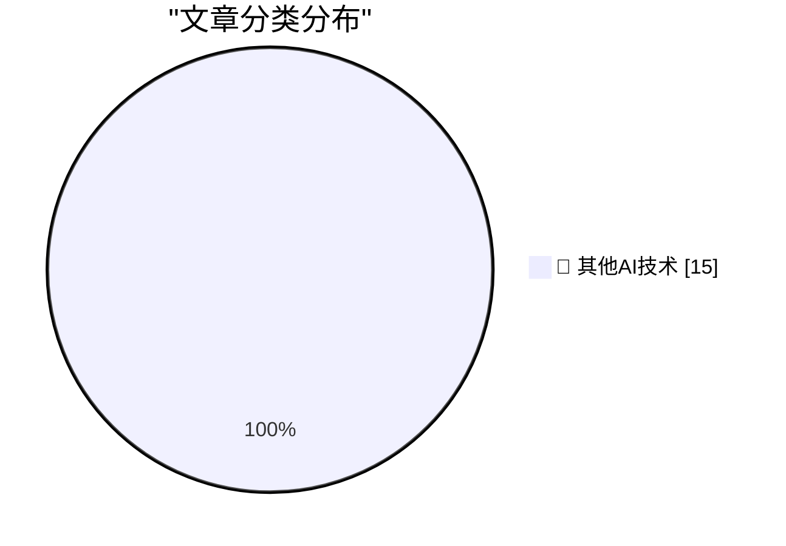

# 📰 AI 博客每日精选 — 2026-08-27

> 来自 98 个技术博客和社交媒体源，AI 精选 Top 15

## 🏆 今日必读

🥇 **POSIWID: The Purpose of a System Is What It Does**

[POSIWID: The Purpose of a System Is What It Does](https://en.wikipedia.org/wiki/The_purpose_of_a_system_is_what_it_does) — daringfireball.net · 4 小时前 · 🔬 其他AI技术

> POSIWID: The Purpose of a System Is What It Does

🥈 **Apple’s Polishing Cloth Is Now Just $9**

[Apple’s Polishing Cloth Is Now Just $9](https://9to5mac.com/2026/08/25/apple-releases-new-polishing-cloth-for-9/) — daringfireball.net · 5 小时前 · 🔬 其他AI技术

> Apple’s Polishing Cloth Is Now Just $9

🥉 **‘Surprise and Shine’ Apple Event: Wednesday 9 September**

[‘Surprise and Shine’ Apple Event: Wednesday 9 September](https://9to5mac.com/2026/08/26/apple-officially-announces-iphone-18-pro-foldable-event/) — daringfireball.net · 5 小时前 · 🔬 其他AI技术

> ‘Surprise and Shine’ Apple Event: Wednesday 9 September

4️⃣ **Pluralistic: The age of disinvention (25 Aug 2026)**

[Pluralistic: The age of disinvention (25 Aug 2026)](https://pluralistic.net/2026/08/25/gammamax/) — pluralistic.net · 21 小时前 · 🔬 其他AI技术

> Pluralistic: The age of disinvention (25 Aug 2026)

5️⃣ **Gadget Review: Thermal Master P3 Macro Lens ★★★★⯪**

[Gadget Review: Thermal Master P3 Macro Lens ★★★★⯪](https://shkspr.mobi/blog/2026/08/gadget-review-thermal-master-p3-macro-lens/) — shkspr.mobi · 12 小时前 · 🔬 其他AI技术

> Gadget Review: Thermal Master P3 Macro Lens ★★★★⯪

---

## 📊 数据概览

| 扫描源 | 抓取文章 | 时间范围 | 精选 |
|:---:|:---:|:---:|:---:|
| 77/98 | 2749 篇 → 15 篇 | 24h | **15 篇** |

### 分类分布

---

====================

## 🔬 其他AI技术

### 1. POSIWID: The Purpose of a System Is What It Does

[POSIWID: The Purpose of a System Is What It Does](https://en.wikipedia.org/wiki/The_purpose_of_a_system_is_what_it_does) — **daringfireball.net** · 4 小时前 · ⭐ 15/25

> POSIWID: The Purpose of a System Is What It Does

📌 其他AI技术

---

### 2. Apple’s Polishing Cloth Is Now Just $9

[Apple’s Polishing Cloth Is Now Just $9](https://9to5mac.com/2026/08/25/apple-releases-new-polishing-cloth-for-9/) — **daringfireball.net** · 5 小时前 · ⭐ 15/25

> Apple’s Polishing Cloth Is Now Just $9

📌 其他AI技术

---

### 3. ‘Surprise and Shine’ Apple Event: Wednesday 9 September

[‘Surprise and Shine’ Apple Event: Wednesday 9 September](https://9to5mac.com/2026/08/26/apple-officially-announces-iphone-18-pro-foldable-event/) — **daringfireball.net** · 5 小时前 · ⭐ 15/25

> ‘Surprise and Shine’ Apple Event: Wednesday 9 September

📌 其他AI技术

---

### 4. Pluralistic: The age of disinvention (25 Aug 2026)

[Pluralistic: The age of disinvention (25 Aug 2026)](https://pluralistic.net/2026/08/25/gammamax/) — **pluralistic.net** · 21 小时前 · ⭐ 15/25

> Pluralistic: The age of disinvention (25 Aug 2026)

📌 其他AI技术

---

### 5. Gadget Review: Thermal Master P3 Macro Lens ★★★★⯪

[Gadget Review: Thermal Master P3 Macro Lens ★★★★⯪](https://shkspr.mobi/blog/2026/08/gadget-review-thermal-master-p3-macro-lens/) — **shkspr.mobi** · 12 小时前 · ⭐ 15/25

> Gadget Review: Thermal Master P3 Macro Lens ★★★★⯪

📌 其他AI技术

---

### 6. Digg v4 and lessons not learned

[Digg v4 and lessons not learned](https://dfarq.homeip.net/digg-v4-and-lessons-not-learned/?utm_source=rss&#038;utm_medium=rss&#038;utm_campaign=digg-v4-and-lessons-not-learned) — **dfarq.homeip.net** · 13 小时前 · ⭐ 15/25

> Digg v4 and lessons not learned

📌 其他AI技术

---

### 7. RT Pierce Boggan: Windows Subsystem for Linux (WSL) is now experimentally supported in the GitHub Copilot app!

[RT Pierce Boggan: Windows Subsystem for Linux (WSL) is now experimentally supported in the GitHub Copilot app!](https://x.com/github/status/2092704532849475645) — **𝕏 @GitHub** · 7 小时前 · ⭐ 15/25

> RT Pierce Boggan: Windows Subsystem for Linux (WSL) is now experimentally supported in the GitHub Copilot app!

📌 其他AI技术

---

### 8. This is the way. Teams and agents working together.

[This is the way. Teams and agents working together.](https://x.com/NotionHQ/status/2092715902211170550) — **𝕏 @NotionHQ** · 3 小时前 · ⭐ 15/25

> This is the way. Teams and agents working together.

📌 其他AI技术

---

### 9. Our latest global campaign, Think Together, is showing up in cities around the world. It’s inspired by a simple belief: the most meaningful things ar...

[Our latest global campaign, Think Together, is showing up in cities around the world. It’s inspired by a simple belief: the most meaningful things ar...](https://x.com/NotionHQ/status/2092694856867192921) — **𝕏 @NotionHQ** · 5 小时前 · ⭐ 15/25

> Our latest global campaign, Think Together, is showing up in cities around the world. It’s inspired by a simple belief: the most meaningful things ar...

📌 其他AI技术

---

### 10. Agents you can depend on. More improvements on the way 🫡

[Agents you can depend on. More improvements on the way 🫡](https://x.com/NotionHQ/status/2092415503675588625) — **𝕏 @NotionHQ** · 23 小时前 · ⭐ 15/25

> Agents you can depend on. More improvements on the way 🫡

📌 其他AI技术

---

### 11. Now building is a team sport. 🤖 With Add to Slack, you can deploy custom AI agents directly into your channels in seconds. Get started with any of ...

[Now building is a team sport. 🤖 With Add to Slack, you can deploy custom AI agents directly into your channels in seconds. Get started with any of ...](https://x.com/SlackHQ/status/2092647866984452329) — **𝕏 @SlackHQ** · 8 小时前 · ⭐ 15/25

> Now building is a team sport. 🤖 With Add to Slack, you can deploy custom AI agents directly into your channels in seconds. Get started with any of ...

📌 其他AI技术

---

### 12. RT Replit ⠕: Coming Soon: Replit x @SlackHQ Code We’re bringing the world’s most powerful agent to the place where teams build, collaborate, and sh...

[RT Replit ⠕: Coming Soon: Replit x @SlackHQ Code We’re bringing the world’s most powerful agent to the place where teams build, collaborate, and sh...](https://x.com/SlackHQ/status/2092643885323366765) — **𝕏 @SlackHQ** · 8 小时前 · ⭐ 15/25

> RT Replit ⠕: Coming Soon: Replit x @SlackHQ Code We’re bringing the world’s most powerful agent to the place where teams build, collaborate, and sh...

📌 其他AI技术

---

### 13. RT Salesforce: The largest, most trusted technology event in the world. At your fingertips. Stream @Dreamforce from anywhere, live and totally free on...

[RT Salesforce: The largest, most trusted technology event in the world. At your fingertips. Stream @Dreamforce from anywhere, live and totally free on...](https://x.com/SlackHQ/status/2092664041462284604) — **𝕏 @SlackHQ** · 10 小时前 · ⭐ 15/25

> RT Salesforce: The largest, most trusted technology event in the world. At your fingertips. Stream @Dreamforce from anywhere, live and totally free on...

📌 其他AI技术

---

### 14. RT Salesforce: When Slackbot catches me up on my messages, lines up my to-do list, and prioritizes what matters before I’ve even had coffee

[RT Salesforce: When Slackbot catches me up on my messages, lines up my to-do list, and prioritizes what matters before I’ve even had coffee](https://x.com/SlackHQ/status/2092692221405413695) — **𝕏 @SlackHQ** · 11 小时前 · ⭐ 15/25

> RT Salesforce: When Slackbot catches me up on my messages, lines up my to-do list, and prioritizes what matters before I’ve even had coffee

📌 其他AI技术

---

### 15. Our latest Workspace feature drop is here, and it’s packed with AI-powered features to help you: 🤝 Eliminate the post-meeting chase with Google Me...

[Our latest Workspace feature drop is here, and it’s packed with AI-powered features to help you: 🤝 Eliminate the post-meeting chase with Google Me...](https://x.com/GoogleWorkspace/status/2092689286789218712) — **𝕏 @GoogleWorkspace** · 5 小时前 · ⭐ 15/25

> Our latest Workspace feature drop is here, and it’s packed with AI-powered features to help you: 🤝 Eliminate the post-meeting chase with Google Me...

📌 其他AI技术

---

====================

*生成于 2026-08-27 00:25 | 扫描 77 源 → 获取 2749 篇 → 精选 15 篇*
*基于 [Hacker News Popularity Contest 2025](https://refactoringenglish.com/tools/hn-popularity/) RSS 源列表，由 [Andrej Karpathy](https://x.com/karpathy) 推荐*
*由「懂点儿AI」制作，欢迎关注同名微信公众号获取更多 AI 实用技巧 💡*
