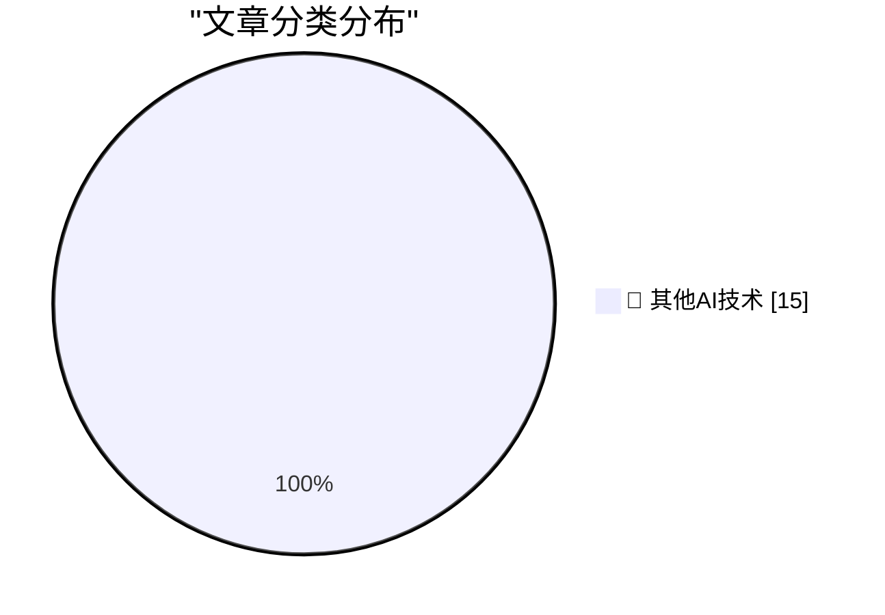

# 📰 AI 博客每日精选 — 2026-08-28

> 来自 98 个技术博客和社交媒体源，AI 精选 Top 15

## 🏆 今日必读

🥇 **U.S. Judge Blocks Trump Defense Department’s Anthropic Blacklisting**

[U.S. Judge Blocks Trump Defense Department’s Anthropic Blacklisting](https://www.reuters.com/legal/government/us-judge-blocks-pentagons-anthropic-blacklisting-2026-08-28/) — daringfireball.net · 2 小时前 · 🔬 其他AI技术

> U.S. Judge Blocks Trump Defense Department’s Anthropic Blacklisting

🥈 **Afterglow — Classic After Dark Screen Savers on Today’s MacOS**

[Afterglow — Classic After Dark Screen Savers on Today’s MacOS](https://morphing.cloud/afterglow/) — daringfireball.net · 7 小时前 · 🔬 其他AI技术

> Afterglow — Classic After Dark Screen Savers on Today’s MacOS

🥉 **The Load-Bearing Vocabulary of Claude**

[The Load-Bearing Vocabulary of Claude](https://louisabraham.github.io/load-bearing/) — daringfireball.net · 7 小时前 · 🔬 其他AI技术

> The Load-Bearing Vocabulary of Claude

4️⃣ **Elizabeth Warren’s Incoherent Outrage Regarding Apple’s Tariff Refund**

[Elizabeth Warren’s Incoherent Outrage Regarding Apple’s Tariff Refund](https://www.warren.senate.gov/newsroom/press-releases/warren-pushes-giant-corporations-to-give-billions-in-tariff-refunds-back-to-consumers/) — daringfireball.net · 8 小时前 · 🔬 其他AI技术

> Elizabeth Warren’s Incoherent Outrage Regarding Apple’s Tariff Refund

5️⃣ **Panic Is Refunding Tariff Fees to Playdate Buyers**

[Panic Is Refunding Tariff Fees to Playdate Buyers](https://www.gamedeveloper.com/business/playdate-maker-is-refunding-tariff-fees-to-customers) — daringfireball.net · 8 小时前 · 🔬 其他AI技术

> Panic Is Refunding Tariff Fees to Playdate Buyers

---

## 📊 数据概览

| 扫描源 | 抓取文章 | 时间范围 | 精选 |
|:---:|:---:|:---:|:---:|
| 77/98 | 2737 篇 → 34 篇 | 24h | **15 篇** |

### 分类分布

---

====================

## 🔬 其他AI技术

### 1. U.S. Judge Blocks Trump Defense Department’s Anthropic Blacklisting

[U.S. Judge Blocks Trump Defense Department’s Anthropic Blacklisting](https://www.reuters.com/legal/government/us-judge-blocks-pentagons-anthropic-blacklisting-2026-08-28/) — **daringfireball.net** · 2 小时前 · ⭐ 15/25

> U.S. Judge Blocks Trump Defense Department’s Anthropic Blacklisting

📌 其他AI技术

---

### 2. Afterglow — Classic After Dark Screen Savers on Today’s MacOS

[Afterglow — Classic After Dark Screen Savers on Today’s MacOS](https://morphing.cloud/afterglow/) — **daringfireball.net** · 7 小时前 · ⭐ 15/25

> Afterglow — Classic After Dark Screen Savers on Today’s MacOS

📌 其他AI技术

---

### 3. The Load-Bearing Vocabulary of Claude

[The Load-Bearing Vocabulary of Claude](https://louisabraham.github.io/load-bearing/) — **daringfireball.net** · 7 小时前 · ⭐ 15/25

> The Load-Bearing Vocabulary of Claude

📌 其他AI技术

---

### 4. Elizabeth Warren’s Incoherent Outrage Regarding Apple’s Tariff Refund

[Elizabeth Warren’s Incoherent Outrage Regarding Apple’s Tariff Refund](https://www.warren.senate.gov/newsroom/press-releases/warren-pushes-giant-corporations-to-give-billions-in-tariff-refunds-back-to-consumers/) — **daringfireball.net** · 8 小时前 · ⭐ 15/25

> Elizabeth Warren’s Incoherent Outrage Regarding Apple’s Tariff Refund

📌 其他AI技术

---

### 5. Panic Is Refunding Tariff Fees to Playdate Buyers

[Panic Is Refunding Tariff Fees to Playdate Buyers](https://www.gamedeveloper.com/business/playdate-maker-is-refunding-tariff-fees-to-customers) — **daringfireball.net** · 8 小时前 · ⭐ 15/25

> Panic Is Refunding Tariff Fees to Playdate Buyers

📌 其他AI技术

---

### 6. Ads in Apple Maps Have Now Launched

[Ads in Apple Maps Have Now Launched](https://9to5mac.com/2026/08/25/apple-maps-launches-ads-on-iphone-heres-whats-new/) — **daringfireball.net** · 9 小时前 · ⭐ 15/25

> Ads in Apple Maps Have Now Launched

📌 其他AI技术

---

### 7. ‘How Europe Is Killing Makers and Micro-Entrepreneurs’

[‘How Europe Is Killing Makers and Micro-Entrepreneurs’](https://lectronz.com/u/lectronz/articles/how-europe-is-killing-makers-and-micro-entrepreneurs) — **daringfireball.net** · 9 小时前 · ⭐ 15/25

> ‘How Europe Is Killing Makers and Micro-Entrepreneurs’

📌 其他AI技术

---

### 8. Book Review: The Infinite Sadness of Small Appliances by Glenn Dixon ★★★★☆

[Book Review: The Infinite Sadness of Small Appliances by Glenn Dixon ★★★★☆](https://shkspr.mobi/blog/2026/08/book-review-the-infinite-sadness-of-small-appliances-by-glenn-dixon/) — **shkspr.mobi** · 17 小时前 · ⭐ 15/25

> Book Review: The Infinite Sadness of Small Appliances by Glenn Dixon ★★★★☆

📌 其他AI技术

---

### 9. Why do OpenAI's GPT-2 weights beat mine?  Part four: digging into dropout

[Why do OpenAI's GPT-2 weights beat mine?  Part four: digging into dropout](https://www.gilesthomas.com/2026/08/why-do-openai-gpt2-weights-beat-mine-4-ift-dropout) — **gilesthomas.com** · 10 小时前 · ⭐ 15/25

> Why do OpenAI's GPT-2 weights beat mine?  Part four: digging into dropout

📌 其他AI技术

---

### 10. Sandboxing coding agents

[Sandboxing coding agents](https://micahflee.com/sandboxing-coding-agents/) — **micahflee.com** · 9 小时前 · ⭐ 15/25

> Sandboxing coding agents

📌 其他AI技术

---

### 11. Bazel Module Versions Aren’t SemVer

[Bazel Module Versions Aren’t SemVer](https://nesbitt.io/2026/08/27/bazel-module-versions-arent-semver.html) — **nesbitt.io** · 19 小时前 · ⭐ 15/25

> Bazel Module Versions Aren’t SemVer

📌 其他AI技术

---

### 12. A Calendar View For My Blog

[A Calendar View For My Blog](https://blog.jim-nielsen.com/2026/blog-calendar-view/) — **blog.jim-nielsen.com** · 10 小时前 · ⭐ 15/25

> A Calendar View For My Blog

📌 其他AI技术

---

### 13. TEAC founded in 1953, sort of

[TEAC founded in 1953, sort of](https://dfarq.homeip.net/teac-founded-in-1953-sort-of/?utm_source=rss&#038;utm_medium=rss&#038;utm_campaign=teac-founded-in-1953-sort-of) — **dfarq.homeip.net** · 18 小时前 · ⭐ 15/25

> TEAC founded in 1953, sort of

📌 其他AI技术

---

### 14. How big are factorials?

[How big are factorials?](https://eli.thegreenplace.net/2026/how-big-are-factorials/) — **eli.thegreenplace.net** · 3 小时前 · ⭐ 15/25

> How big are factorials?

📌 其他AI技术

---

### 15. Nieuwe wet Inlichtingen- en veiligheidsdiensten: wat mogen ze nu al en waar zijn ze voor

[Nieuwe wet Inlichtingen- en veiligheidsdiensten: wat mogen ze nu al en waar zijn ze voor](https://berthub.eu/articles/posts/geheime-veiligheids-en-inlichtingendiensten/) — **berthub.eu** · 18 小时前 · ⭐ 15/25

> Nieuwe wet Inlichtingen- en veiligheidsdiensten: wat mogen ze nu al en waar zijn ze voor

📌 其他AI技术

---

====================

*生成于 2026-08-28 05:05 | 扫描 77 源 → 获取 2737 篇 → 精选 15 篇*
*基于 [Hacker News Popularity Contest 2025](https://refactoringenglish.com/tools/hn-popularity/) RSS 源列表，由 [Andrej Karpathy](https://x.com/karpathy) 推荐*
*由「懂点儿AI」制作，欢迎关注同名微信公众号获取更多 AI 实用技巧 💡*
