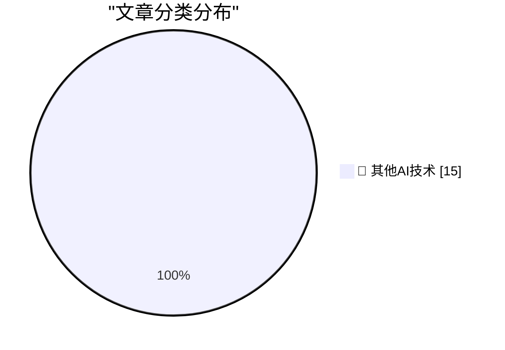

# 📰 AI 博客每日精选 — 2026-08-29

> 来自 98 个技术博客和社交媒体源，AI 精选 Top 15

## 🏆 今日必读

🥇 **Building a mini Homelab that fits in my carry-on**

[Building a mini Homelab that fits in my carry-on](https://www.jeffgeerling.com/blog/2026/mini-homelab-network-fits-in-carry-on/) — jeffgeerling.com · 12 小时前 · 🔬 其他AI技术

> Building a mini Homelab that fits in my carry-on

🥈 **Apple Announces Price Increase for Apple TV and Apple One Subscriptions**

[Apple Announces Price Increase for Apple TV and Apple One Subscriptions](https://9to5mac.com/2026/08/28/apple-announces-price-increase-for-apple-tv-and-apple-one-subscriptions/) — daringfireball.net · 5 小时前 · 🔬 其他AI技术

> Apple Announces Price Increase for Apple TV and Apple One Subscriptions

🥉 **‘I’m the Guy Who Destroys Antique Books After We Scan Them Into Our Company’s Insatiable AI Platform’**

[‘I’m the Guy Who Destroys Antique Books After We Scan Them Into Our Company’s Insatiable AI Platform’](https://www.mcsweeneys.net/articles/im-the-guy-who-destroys-antique-books-after-we-scan-them-into-our-companys-insatiable-ai-platform) — daringfireball.net · 5 小时前 · 🔬 其他AI技术

> ‘I’m the Guy Who Destroys Antique Books After We Scan Them Into Our Company’s Insatiable AI Platform’

4️⃣ **‘How Americans See E.U. Tech’**

[‘How Americans See E.U. Tech’](https://www.youtube.com/watch?v=gGlpBuW6ZFc) — daringfireball.net · 5 小时前 · 🔬 其他AI技术

> ‘How Americans See E.U. Tech’

5️⃣ **We Certainly Have Made a Hames Out of This**

[We Certainly Have Made a Hames Out of This](https://daringfireball.net/linked/2026/08/28/trump-lake-ontario) — daringfireball.net · 7 小时前 · 🔬 其他AI技术

> We Certainly Have Made a Hames Out of This

---

## 📊 数据概览

| 扫描源 | 抓取文章 | 时间范围 | 精选 |
|:---:|:---:|:---:|:---:|
| 75/98 | 2694 篇 → 22 篇 | 24h | **15 篇** |

### 分类分布

---

====================

## 🔬 其他AI技术

### 1. Building a mini Homelab that fits in my carry-on

[Building a mini Homelab that fits in my carry-on](https://www.jeffgeerling.com/blog/2026/mini-homelab-network-fits-in-carry-on/) — **jeffgeerling.com** · 12 小时前 · ⭐ 15/25

> Building a mini Homelab that fits in my carry-on

📌 其他AI技术

---

### 2. Apple Announces Price Increase for Apple TV and Apple One Subscriptions

[Apple Announces Price Increase for Apple TV and Apple One Subscriptions](https://9to5mac.com/2026/08/28/apple-announces-price-increase-for-apple-tv-and-apple-one-subscriptions/) — **daringfireball.net** · 5 小时前 · ⭐ 15/25

> Apple Announces Price Increase for Apple TV and Apple One Subscriptions

📌 其他AI技术

---

### 3. ‘I’m the Guy Who Destroys Antique Books After We Scan Them Into Our Company’s Insatiable AI Platform’

[‘I’m the Guy Who Destroys Antique Books After We Scan Them Into Our Company’s Insatiable AI Platform’](https://www.mcsweeneys.net/articles/im-the-guy-who-destroys-antique-books-after-we-scan-them-into-our-companys-insatiable-ai-platform) — **daringfireball.net** · 5 小时前 · ⭐ 15/25

> ‘I’m the Guy Who Destroys Antique Books After We Scan Them Into Our Company’s Insatiable AI Platform’

📌 其他AI技术

---

### 4. ‘How Americans See E.U. Tech’

[‘How Americans See E.U. Tech’](https://www.youtube.com/watch?v=gGlpBuW6ZFc) — **daringfireball.net** · 5 小时前 · ⭐ 15/25

> ‘How Americans See E.U. Tech’

📌 其他AI技术

---

### 5. We Certainly Have Made a Hames Out of This

[We Certainly Have Made a Hames Out of This](https://daringfireball.net/linked/2026/08/28/trump-lake-ontario) — **daringfireball.net** · 7 小时前 · ⭐ 15/25

> We Certainly Have Made a Hames Out of This

📌 其他AI技术

---

### 6. ‘Not Sure How You Own Canada by Deleting Your Own History’

[‘Not Sure How You Own Canada by Deleting Your Own History’](https://x.com/MattWalshBlog/status/2093060290371870948) — **daringfireball.net** · 10 小时前 · ⭐ 15/25

> ‘Not Sure How You Own Canada by Deleting Your Own History’

📌 其他AI技术

---

### 7. From the DF Archive: ‘Golfo Del Gringo Loco’

[From the DF Archive: ‘Golfo Del Gringo Loco’](https://daringfireball.net/2025/02/golfo_del_gringo_loco) — **daringfireball.net** · 12 小时前 · ⭐ 15/25

> From the DF Archive: ‘Golfo Del Gringo Loco’

📌 其他AI技术

---

### 8. Trump Declares That Lake Ontario Is Now ‘Lake America’

[Trump Declares That Lake Ontario Is Now ‘Lake America’](https://www.notus.org/trump-white-house/lake-america-ontario-canada-trade-war-trump-executive-order-rename) — **daringfireball.net** · 13 小时前 · ⭐ 15/25

> Trump Declares That Lake Ontario Is Now ‘Lake America’

📌 其他AI技术

---

### 9. "iT woRKs BeTter in THe aPp!!"

["iT woRKs BeTter in THe aPp!!"](https://shkspr.mobi/blog/2026/08/it-works-better-in-the-app/) — **shkspr.mobi** · 15 小时前 · ⭐ 15/25

> "iT woRKs BeTter in THe aPp!!"

📌 其他AI技术

---

### 10. Now Hiring: Senior Open Source Maintainer

[Now Hiring: Senior Open Source Maintainer](https://nesbitt.io/2026/08/28/now-hiring-senior-open-source-maintainer.html) — **nesbitt.io** · 17 小时前 · ⭐ 15/25

> Now Hiring: Senior Open Source Maintainer

📌 其他AI技术

---

### 11. Premium: The Hater's Guide To Circular Financing (Part One)

[Premium: The Hater's Guide To Circular Financing (Part One)](https://www.wheresyoured.at/premium-the-haters-guide-to-circular-financing-part-one/) — **wheresyoured.at** · 11 小时前 · ⭐ 15/25

> Premium: The Hater's Guide To Circular Financing (Part One)

📌 其他AI技术

---

### 12. Anandtech shut down abruptly, August 30, 2024

[Anandtech shut down abruptly, August 30, 2024](https://dfarq.homeip.net/anandtech-shut-down-abruptly-august-30-2024/?utm_source=rss&#038;utm_medium=rss&#038;utm_campaign=anandtech-shut-down-abruptly-august-30-2024) — **dfarq.homeip.net** · 16 小时前 · ⭐ 15/25

> Anandtech shut down abruptly, August 30, 2024

📌 其他AI技术

---

### 13. You Know GDPR Is Good Based on Who Hates It

[You Know GDPR Is Good Based on Who Hates It](https://matduggan.com/you-know-gdpr-is-good-based-on-who-hates-it/) — **matduggan.com** · 15 小时前 · ⭐ 15/25

> You Know GDPR Is Good Based on Who Hates It

📌 其他AI技术

---

### 14. What GLM-5.3 Flash running on Chinese hardware actually means

[What GLM-5.3 Flash running on Chinese hardware actually means](https://martinalderson.com/posts/glm-5-3-flash-chinese-hardware/?utm_source=rss&amp;utm_medium=rss&amp;utm_campaign=feed) — **martinalderson.com** · 3 小时前 · ⭐ 15/25

> What GLM-5.3 Flash running on Chinese hardware actually means

📌 其他AI技术

---

### 15. We’re ending our partnership with Cursor following its acquisition by SpaceX. Under our proposal, Cursor’s direct access to our models would end on ...

[We’re ending our partnership with Cursor following its acquisition by SpaceX. Under our proposal, Cursor’s direct access to our models would end on ...](https://x.com/OpenAI/status/2093515564786540695) — **𝕏 @OpenAI** · 1 小时前 · ⭐ 15/25

> We’re ending our partnership with Cursor following its acquisition by SpaceX. Under our proposal, Cursor’s direct access to our models would end on ...

📌 其他AI技术

---

====================

*生成于 2026-08-29 03:04 | 扫描 75 源 → 获取 2694 篇 → 精选 15 篇*
*基于 [Hacker News Popularity Contest 2025](https://refactoringenglish.com/tools/hn-popularity/) RSS 源列表，由 [Andrej Karpathy](https://x.com/karpathy) 推荐*
*由「懂点儿AI」制作，欢迎关注同名微信公众号获取更多 AI 实用技巧 💡*
