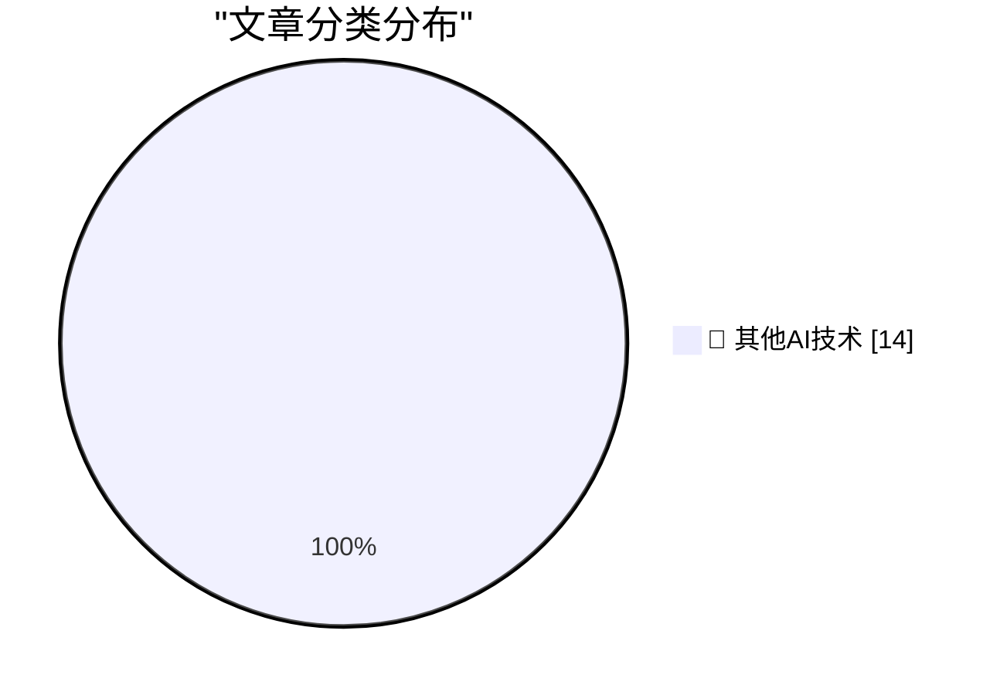

# 📰 AI 博客每日精选 — 2026-08-29

> 来自 98 个技术博客和社交媒体源，AI 精选 Top 14

## 🏆 今日必读

🥇 **★ Thoughts and Observations on Apple’s First Immersive MLB Broadcast, a Yankees 1-0 Win Over the Red Sox**

[★ Thoughts and Observations on Apple’s First Immersive MLB Broadcast, a Yankees 1-0 Win Over the Red Sox](https://daringfireball.net/2026/08/thoughts_and_observations_apple_immersive_mlb_broadcast) — daringfireball.net · 5 小时前 · 🔬 其他AI技术

> ★ Thoughts and Observations on Apple’s First Immersive MLB Broadcast, a Yankees 1-0 Win Over the Red Sox

🥈 **Technical note: transfer files over an ethernet patch cable**

[Technical note: transfer files over an ethernet patch cable](https://maurycyz.com/misc/etherfiles/) — maurycyz.com · 22 小时前 · 🔬 其他AI技术

> Technical note: transfer files over an ethernet patch cable

🥉 **A simple "copy this code" button in JavaScript**

[A simple "copy this code" button in JavaScript](https://shkspr.mobi/blog/2026/08/a-simple-copy-this-code-button-in-javascript/) — shkspr.mobi · 11 小时前 · 🔬 其他AI技术

> A simple "copy this code" button in JavaScript

4️⃣ **The Server Called Paranoia: Defend Autistici/Inventati**

[The Server Called Paranoia: Defend Autistici/Inventati](https://micahflee.com/the-server-called-paranoia-defend-autistici-inventati/) — micahflee.com · 3 小时前 · 🔬 其他AI技术

> The Server Called Paranoia: Defend Autistici/Inventati

5️⃣ **This Week in Package Management: 29 August 2026**

[This Week in Package Management: 29 August 2026](https://nesbitt.io/2026/08/29/this-week-in-package-management.html) — nesbitt.io · 12 小时前 · 🔬 其他AI技术

> This Week in Package Management: 29 August 2026

---

## 📊 数据概览

| 扫描源 | 抓取文章 | 时间范围 | 精选 |
|:---:|:---:|:---:|:---:|
| 78/98 | 2757 篇 → 14 篇 | 24h | **14 篇** |

### 分类分布

---

====================

## 🔬 其他AI技术

### 1. ★ Thoughts and Observations on Apple’s First Immersive MLB Broadcast, a Yankees 1-0 Win Over the Red Sox

[★ Thoughts and Observations on Apple’s First Immersive MLB Broadcast, a Yankees 1-0 Win Over the Red Sox](https://daringfireball.net/2026/08/thoughts_and_observations_apple_immersive_mlb_broadcast) — **daringfireball.net** · 5 小时前 · ⭐ 15/25

> ★ Thoughts and Observations on Apple’s First Immersive MLB Broadcast, a Yankees 1-0 Win Over the Red Sox

📌 其他AI技术

---

### 2. Technical note: transfer files over an ethernet patch cable

[Technical note: transfer files over an ethernet patch cable](https://maurycyz.com/misc/etherfiles/) — **maurycyz.com** · 22 小时前 · ⭐ 15/25

> Technical note: transfer files over an ethernet patch cable

📌 其他AI技术

---

### 3. A simple "copy this code" button in JavaScript

[A simple "copy this code" button in JavaScript](https://shkspr.mobi/blog/2026/08/a-simple-copy-this-code-button-in-javascript/) — **shkspr.mobi** · 11 小时前 · ⭐ 15/25

> A simple "copy this code" button in JavaScript

📌 其他AI技术

---

### 4. The Server Called Paranoia: Defend Autistici/Inventati

[The Server Called Paranoia: Defend Autistici/Inventati](https://micahflee.com/the-server-called-paranoia-defend-autistici-inventati/) — **micahflee.com** · 3 小时前 · ⭐ 15/25

> The Server Called Paranoia: Defend Autistici/Inventati

📌 其他AI技术

---

### 5. This Week in Package Management: 29 August 2026

[This Week in Package Management: 29 August 2026](https://nesbitt.io/2026/08/29/this-week-in-package-management.html) — **nesbitt.io** · 12 小时前 · ⭐ 15/25

> This Week in Package Management: 29 August 2026

📌 其他AI技术

---

### 6. The Rise and Fall of Agent Civilizations

[The Rise and Fall of Agent Civilizations](https://www.dwarkesh.com/p/openai-huggingface) — **dwarkesh.com** · 11 分钟前 · ⭐ 15/25

> The Rise and Fall of Agent Civilizations

📌 其他AI技术

---

### 7. A Roku alternative streaming device

[A Roku alternative streaming device](https://dfarq.homeip.net/a-roku-alternative-streaming-device/?utm_source=rss&#038;utm_medium=rss&#038;utm_campaign=a-roku-alternative-streaming-device) — **dfarq.homeip.net** · 6 小时前 · ⭐ 15/25

> A Roku alternative streaming device

📌 其他AI技术

---

### 8. Dell Optiplex 3040 and 3050 micro

[Dell Optiplex 3040 and 3050 micro](https://dfarq.homeip.net/dell-optiplex-3040-and-3050-micro/?utm_source=rss&#038;utm_medium=rss&#038;utm_campaign=dell-optiplex-3040-and-3050-micro) — **dfarq.homeip.net** · 11 小时前 · ⭐ 15/25

> Dell Optiplex 3040 and 3050 micro

📌 其他AI技术

---

### 9. What GLM-5.3 Flash running on Chinese hardware actually means

[What GLM-5.3 Flash running on Chinese hardware actually means](https://martinalderson.com/posts/glm-5-3-flash-chinese-hardware/?utm_source=rss&amp;utm_medium=rss&amp;utm_campaign=feed) — **martinalderson.com** · 22 小时前 · ⭐ 15/25

> What GLM-5.3 Flash running on Chinese hardware actually means

📌 其他AI技术

---

### 10. We’re ending our partnership with Cursor following its acquisition by SpaceX. Under our proposal, Cursor’s direct access to our models would end on ...

[We’re ending our partnership with Cursor following its acquisition by SpaceX. Under our proposal, Cursor’s direct access to our models would end on ...](https://x.com/OpenAI/status/2093515564786540695) — **𝕏 @OpenAI** · 21 小时前 · ⭐ 15/25

> We’re ending our partnership with Cursor following its acquisition by SpaceX. Under our proposal, Cursor’s direct access to our models would end on ...

📌 其他AI技术

---

### 11. 🚀 New updates in GitHub Issues • Pin views in the Issues sidebar • See profile avatars for reactions • Adjust dashboard density • Hide closed s...

[🚀 New updates in GitHub Issues • Pin views in the Issues sidebar • See profile avatars for reactions • Adjust dashboard density • Hide closed s...](https://x.com/github/status/2093825400178917519) — **𝕏 @GitHub** · 41 分钟前 · ⭐ 15/25

> 🚀 New updates in GitHub Issues • Pin views in the Issues sidebar • See profile avatars for reactions • Adjust dashboard density • Hide closed s...

📌 其他AI技术

---

### 12. Grab your pass to join us for #GitHubUniverse in San Francisco October 28-29 🌁 https://githubuniverse.com/?utm_source=Twitter&utm_medium=Social&utm...

[Grab your pass to join us for #GitHubUniverse in San Francisco October 28-29 🌁 https://githubuniverse.com/?utm_source=Twitter&utm_medium=Social&utm...](https://x.com/github/status/2093474503988801605) — **𝕏 @GitHub** · 23 小时前 · ⭐ 15/25

> Grab your pass to join us for #GitHubUniverse in San Francisco October 28-29 🌁 https://githubuniverse.com/?utm_source=Twitter&utm_medium=Social&utm...

📌 其他AI技术

---

### 13. RT Rhys: finally found a decent 'life management' approach is a notion board w/ 'backlog', 'block on me', 'waiting', 'complete', agents update it as t...

[RT Rhys: finally found a decent 'life management' approach is a notion board w/ 'backlog', 'block on me', 'waiting', 'complete', agents update it as t...](https://x.com/NotionHQ/status/2093803909513175145) — **𝕏 @NotionHQ** · 4 小时前 · ⭐ 15/25

> RT Rhys: finally found a decent 'life management' approach is a notion board w/ 'backlog', 'block on me', 'waiting', 'complete', agents update it as t...

📌 其他AI技术

---

### 14. RT Gabri: I have some free time this afternoon and was thinking I could review some intern and early career eng applications! I’ll start with reviewi...

[RT Gabri: I have some free time this afternoon and was thinking I could review some intern and early career eng applications! I’ll start with reviewi...](https://x.com/NotionHQ/status/2093481850861920614) — **𝕏 @NotionHQ** · 23 小时前 · ⭐ 15/25

> RT Gabri: I have some free time this afternoon and was thinking I could review some intern and early career eng applications! I’ll start with reviewi...

📌 其他AI技术

---

====================

*生成于 2026-08-29 22:59 | 扫描 78 源 → 获取 2757 篇 → 精选 14 篇*
*基于 [Hacker News Popularity Contest 2025](https://refactoringenglish.com/tools/hn-popularity/) RSS 源列表，由 [Andrej Karpathy](https://x.com/karpathy) 推荐*
*由「懂点儿AI」制作，欢迎关注同名微信公众号获取更多 AI 实用技巧 💡*
