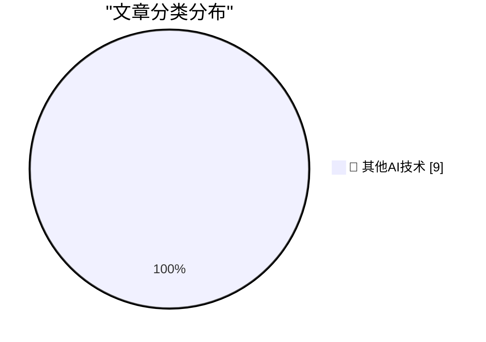

# 📰 AI 博客每日精选 — 2026-08-30

> 来自 98 个技术博客和社交媒体源，AI 精选 Top 9

## 🏆 今日必读

🥇 **Before NTP there were Time and Daytime**

[Before NTP there were Time and Daytime](https://www.jeffgeerling.com/blog/2026/rfc-867-868-time/) — jeffgeerling.com · 58 分钟前 · 🔬 其他AI技术

> Before NTP there were Time and Daytime

🥈 **You have to beat the models at something**

[You have to beat the models at something](https://seangoedecke.com/you-have-to-beat-the-models-at-something/) — seangoedecke.com · 23 小时前 · 🔬 其他AI技术

> You have to beat the models at something

🥉 **Finalist 4**

[Finalist 4](https://www.finalist.works/?utm_source=df-aug-2026) — daringfireball.net · 4 小时前 · 🔬 其他AI技术

> Finalist 4

4️⃣ **New Pebble Weather App + Software Updates**

[New Pebble Weather App + Software Updates](https://repebble.com/blog/new-pebble-weather-app-software-updates) — ericmigi.com · 23 小时前 · 🔬 其他AI技术

> New Pebble Weather App + Software Updates

5️⃣ **ActivityBot is the recipient of an NLnet grant!**

[ActivityBot is the recipient of an NLnet grant!](https://shkspr.mobi/blog/2026/08/activitybot-is-the-recipient-of-an-nlnet-grant/) — shkspr.mobi · 11 小时前 · 🔬 其他AI技术

> ActivityBot is the recipient of an NLnet grant!

---

## 📊 数据概览

| 扫描源 | 抓取文章 | 时间范围 | 精选 |
|:---:|:---:|:---:|:---:|
| 79/98 | 2769 篇 → 9 篇 | 24h | **9 篇** |

### 分类分布

---

====================

## 🔬 其他AI技术

### 1. Before NTP there were Time and Daytime

[Before NTP there were Time and Daytime](https://www.jeffgeerling.com/blog/2026/rfc-867-868-time/) — **jeffgeerling.com** · 58 分钟前 · ⭐ 15/25

> Before NTP there were Time and Daytime

📌 其他AI技术

---

### 2. You have to beat the models at something

[You have to beat the models at something](https://seangoedecke.com/you-have-to-beat-the-models-at-something/) — **seangoedecke.com** · 23 小时前 · ⭐ 15/25

> You have to beat the models at something

📌 其他AI技术

---

### 3. Finalist 4

[Finalist 4](https://www.finalist.works/?utm_source=df-aug-2026) — **daringfireball.net** · 4 小时前 · ⭐ 15/25

> Finalist 4

📌 其他AI技术

---

### 4. New Pebble Weather App + Software Updates

[New Pebble Weather App + Software Updates](https://repebble.com/blog/new-pebble-weather-app-software-updates) — **ericmigi.com** · 23 小时前 · ⭐ 15/25

> New Pebble Weather App + Software Updates

📌 其他AI技术

---

### 5. ActivityBot is the recipient of an NLnet grant!

[ActivityBot is the recipient of an NLnet grant!](https://shkspr.mobi/blog/2026/08/activitybot-is-the-recipient-of-an-nlnet-grant/) — **shkspr.mobi** · 11 小时前 · ⭐ 15/25

> ActivityBot is the recipient of an NLnet grant!

📌 其他AI技术

---

### 6. Recreating a 2010 Experiment

[Recreating a 2010 Experiment](http://xania.org/202608/recreating-a-2010-experiment?utm_source=feed&amp;utm_medium=rss) — **xania.org** · 3 小时前 · ⭐ 15/25

> Recreating a 2010 Experiment

📌 其他AI技术

---

### 7. Apple prevails over Franklin, August 30, 1983

[Apple prevails over Franklin, August 30, 1983](https://dfarq.homeip.net/apple-prevails-over-franklin-august-30-1983/?utm_source=rss&#038;utm_medium=rss&#038;utm_campaign=apple-prevails-over-franklin-august-30-1983) — **dfarq.homeip.net** · 12 小时前 · ⭐ 15/25

> Apple prevails over Franklin, August 30, 1983

📌 其他AI技术

---

### 8. Forgejo Hack #2: Integration with Read The Docs

[Forgejo Hack #2: Integration with Read The Docs](https://blog.miguelgrinberg.com/post/forgejo-hack-2-integration-with-read-the-docs) — **miguelgrinberg.com** · 7 小时前 · ⭐ 15/25

> Forgejo Hack #2: Integration with Read The Docs

📌 其他AI技术

---

### 9. A dozen Dependabot pull requests on a Monday morning is how important updates get ignored. On Microsoft's GCToolkit, roughly one in six commits were s...

[A dozen Dependabot pull requests on a Monday morning is how important updates get ignored. On Microsoft's GCToolkit, roughly one in six commits were s...](https://x.com/github/status/2094141607083716809) — **𝕏 @GitHub** · 3 小时前 · ⭐ 15/25

> A dozen Dependabot pull requests on a Monday morning is how important updates get ignored. On Microsoft's GCToolkit, roughly one in six commits were s...

📌 其他AI技术

---

====================

*生成于 2026-08-30 23:07 | 扫描 79 源 → 获取 2769 篇 → 精选 9 篇*
*基于 [Hacker News Popularity Contest 2025](https://refactoringenglish.com/tools/hn-popularity/) RSS 源列表，由 [Andrej Karpathy](https://x.com/karpathy) 推荐*
*由「懂点儿AI」制作，欢迎关注同名微信公众号获取更多 AI 实用技巧 💡*
