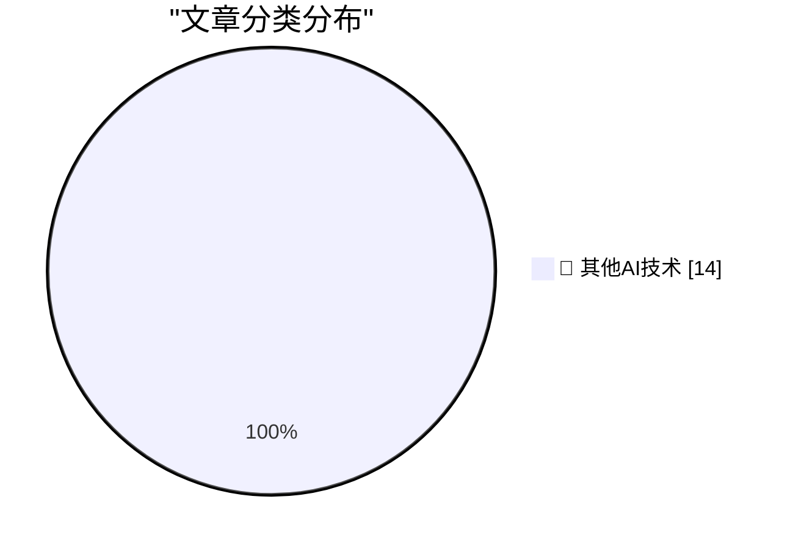

# 📰 AI 博客每日精选 — 2026-09-01

> 来自 98 个技术博客和社交媒体源，AI 精选 Top 14

## 🏆 今日必读

🥇 **Here's a good way to present AI videos**

[Here's a good way to present AI videos](https://idiallo.com/blog/a-good-way-to-present-ai-videos-on-youtube) — idiallo.com · 16 小时前 · 🔬 其他AI技术

> Here's a good way to present AI videos

🥈 **Review: Ruined Theatre's A Midsummer Night's Dream ★★★★☆**

[Review: Ruined Theatre's A Midsummer Night's Dream ★★★★☆](https://shkspr.mobi/blog/2026/08/review-ruined-theatres-a-midsummer-nights-dream/) — shkspr.mobi · 12 小时前 · 🔬 其他AI技术

> Review: Ruined Theatre's A Midsummer Night's Dream ★★★★☆

🥉 **Notes from August 2026**

[Notes from August 2026](https://evanhahn.com/notes-from-august-2026/) — evanhahn.com · 18 小时前 · 🔬 其他AI技术

> Notes from August 2026

4️⃣ **The rise and fall of agent civilizations**

[The rise and fall of agent civilizations](https://www.dwarkesh.com/p/openai-huggingface-narration) — dwarkesh.com · 3 小时前 · 🔬 其他AI技术

> The rise and fall of agent civilizations

5️⃣ **My Experience Has Nuance, Yours Is a Data Point**

[My Experience Has Nuance, Yours Is a Data Point](https://blog.jim-nielsen.com/2026/nuance-for-me-none-for-you/) — blog.jim-nielsen.com · 5 小时前 · 🔬 其他AI技术

> My Experience Has Nuance, Yours Is a Data Point

---

## 📊 数据概览

| 扫描源 | 抓取文章 | 时间范围 | 精选 |
|:---:|:---:|:---:|:---:|
| 78/98 | 2754 篇 → 14 篇 | 24h | **14 篇** |

### 分类分布

---

====================

## 🔬 其他AI技术

### 1. Here's a good way to present AI videos

[Here's a good way to present AI videos](https://idiallo.com/blog/a-good-way-to-present-ai-videos-on-youtube) — **idiallo.com** · 16 小时前 · ⭐ 15/25

> Here's a good way to present AI videos

📌 其他AI技术

---

### 2. Review: Ruined Theatre's A Midsummer Night's Dream ★★★★☆

[Review: Ruined Theatre's A Midsummer Night's Dream ★★★★☆](https://shkspr.mobi/blog/2026/08/review-ruined-theatres-a-midsummer-nights-dream/) — **shkspr.mobi** · 12 小时前 · ⭐ 15/25

> Review: Ruined Theatre's A Midsummer Night's Dream ★★★★☆

📌 其他AI技术

---

### 3. Notes from August 2026

[Notes from August 2026](https://evanhahn.com/notes-from-august-2026/) — **evanhahn.com** · 18 小时前 · ⭐ 15/25

> Notes from August 2026

📌 其他AI技术

---

### 4. The rise and fall of agent civilizations

[The rise and fall of agent civilizations](https://www.dwarkesh.com/p/openai-huggingface-narration) — **dwarkesh.com** · 3 小时前 · ⭐ 15/25

> The rise and fall of agent civilizations

📌 其他AI技术

---

### 5. My Experience Has Nuance, Yours Is a Data Point

[My Experience Has Nuance, Yours Is a Data Point](https://blog.jim-nielsen.com/2026/nuance-for-me-none-for-you/) — **blog.jim-nielsen.com** · 5 小时前 · ⭐ 15/25

> My Experience Has Nuance, Yours Is a Data Point

📌 其他AI技术

---

### 6. Adobe’s August 1994 acquisition of Aldus

[Adobe’s August 1994 acquisition of Aldus](https://dfarq.homeip.net/adobes-august-1994-acquisition-of-aldus/?utm_source=rss&#038;utm_medium=rss&#038;utm_campaign=adobes-august-1994-acquisition-of-aldus) — **dfarq.homeip.net** · 13 小时前 · ⭐ 15/25

> Adobe’s August 1994 acquisition of Aldus

📌 其他AI技术

---

### 7. 🦞 @openclaw 2.0 has arrived! But what did it take to get here? 👀 Find out how creator @steipete and its maintainers built, scaled, and secured t...

[🦞 @openclaw 2.0 has arrived! But what did it take to get here? 👀 Find out how creator @steipete and its maintainers built, scaled, and secured t...](https://x.com/github/status/2094532695544193179) — **𝕏 @GitHub** · 3 小时前 · ⭐ 15/25

> 🦞 @openclaw 2.0 has arrived! But what did it take to get here? 👀 Find out how creator @steipete and its maintainers built, scaled, and secured t...

📌 其他AI技术

---

### 8. GitHub wants to learn about the tools, product settings, and personal adaptations developers use to do their best work. You don't need to identify as ...

[GitHub wants to learn about the tools, product settings, and personal adaptations developers use to do their best work. You don't need to identify as ...](https://x.com/github/status/2094492960268116217) — **𝕏 @GitHub** · 5 小时前 · ⭐ 15/25

> GitHub wants to learn about the tools, product settings, and personal adaptations developers use to do their best work. You don't need to identify as ...

📌 其他AI技术

---

### 9. Stop playing calendar Tetris.

[Stop playing calendar Tetris.](https://x.com/NotionHQ/status/2094530636568801420) — **𝕏 @NotionHQ** · 3 小时前 · ⭐ 15/25

> Stop playing calendar Tetris.

📌 其他AI技术

---

### 10. RT Kim Currier: Got access to @NotionHQ's AI Agents again today. I will be talking out loud and crushing work all day long. Truly makes me so much mor...

[RT Kim Currier: Got access to @NotionHQ's AI Agents again today. I will be talking out loud and crushing work all day long. Truly makes me so much mor...](https://x.com/NotionHQ/status/2094521362572533951) — **𝕏 @NotionHQ** · 4 小时前 · ⭐ 15/25

> RT Kim Currier: Got access to @NotionHQ's AI Agents again today. I will be talking out loud and crushing work all day long. Truly makes me so much mor...

📌 其他AI技术

---

### 11. Your library’s got a new section: Skills. Find every AI skill your team’s shared, in one place.

[Your library’s got a new section: Skills. Find every AI skill your team’s shared, in one place.](https://x.com/NotionHQ/status/2094468025806463347) — **𝕏 @NotionHQ** · 7 小时前 · ⭐ 15/25

> Your library’s got a new section: Skills. Find every AI skill your team’s shared, in one place.

📌 其他AI技术

---

### 12. RT Katsu Nishi | Notion, General Manager APAC: Notion Think together

[RT Katsu Nishi | Notion, General Manager APAC: Notion Think together](https://x.com/NotionHQ/status/2094455521898270754) — **𝕏 @NotionHQ** · 11 小时前 · ⭐ 15/25

> RT Katsu Nishi | Notion, General Manager APAC: Notion Think together

📌 其他AI技术

---

### 13. RT Emmett: Re @AmandaMashburn Anything @bot generates other than code I have it create in @NotionHQ by default. The speed it works with the plugin is ...

[RT Emmett: Re @AmandaMashburn Anything @bot generates other than code I have it create in @NotionHQ by default. The speed it works with the plugin is ...](https://x.com/NotionHQ/status/2094520576597741764) — **𝕏 @NotionHQ** · 13 小时前 · ⭐ 15/25

> RT Emmett: Re @AmandaMashburn Anything @bot generates other than code I have it create in @NotionHQ by default. The speed it works with the plugin is ...

📌 其他AI技术

---

### 14. Move projects forward faster with Google Vids! 🚀 Record walkthroughs, share feedback, and remove ‘ums’ + ‘ahs’ with one click. 🎥 Get started...

[Move projects forward faster with Google Vids! 🚀 Record walkthroughs, share feedback, and remove ‘ums’ + ‘ahs’ with one click. 🎥 Get started...](https://x.com/GoogleWorkspace/status/2094425726476808507) — **𝕏 @GoogleWorkspace** · 10 小时前 · ⭐ 15/25

> Move projects forward faster with Google Vids! 🚀 Record walkthroughs, share feedback, and remove ‘ums’ + ‘ahs’ with one click. 🎥 Get started...

📌 其他AI技术

---

====================

*生成于 2026-09-01 00:21 | 扫描 78 源 → 获取 2754 篇 → 精选 14 篇*
*基于 [Hacker News Popularity Contest 2025](https://refactoringenglish.com/tools/hn-popularity/) RSS 源列表，由 [Andrej Karpathy](https://x.com/karpathy) 推荐*
*由「懂点儿AI」制作，欢迎关注同名微信公众号获取更多 AI 实用技巧 💡*
