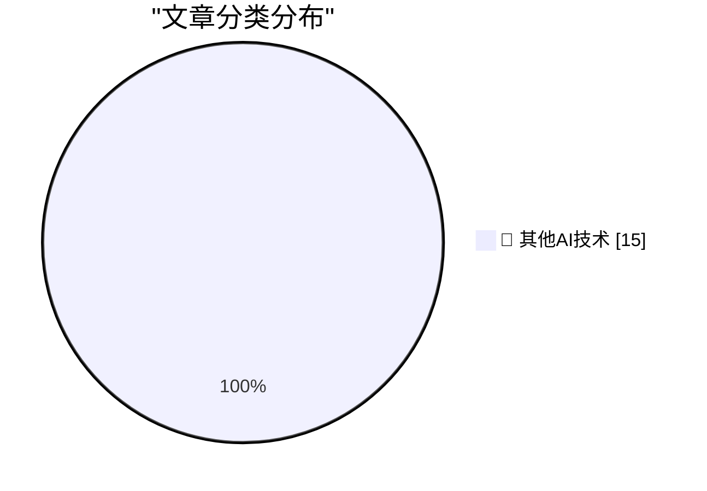

# 📰 AI 博客每日精选 — 2026-09-01

> 来自 98 个技术博客和社交媒体源，AI 精选 Top 15

## 🏆 今日必读

🥇 **Tim Cook’s Departure Memo on His Last Day as CEO**

[Tim Cook’s Departure Memo on His Last Day as CEO](https://9to5mac.com/2026/08/31/read-tim-cooks-full-memo-to-apple-employees-on-his-last-day-as-ceo/) — daringfireball.net · 4 小时前 · 🔬 其他AI技术

> Tim Cook’s Departure Memo on His Last Day as CEO

🥈 **Apple Reveals Forensic Evidence From Chang Liu’s MacBook in OpenAI Lawsuit**

[Apple Reveals Forensic Evidence From Chang Liu’s MacBook in OpenAI Lawsuit](https://9to5mac.com/2026/08/31/apple-openai-forensic-macbook-evidence/) — daringfireball.net · 5 小时前 · 🔬 其他AI技术

> Apple Reveals Forensic Evidence From Chang Liu’s MacBook in OpenAI Lawsuit

🥉 **[Sponsor] WorkOS: How to Give an Agent a Task Instead of a Token**

[[Sponsor] WorkOS: How to Give an Agent a Task Instead of a Token](https://workos.com/blog/delegated-access-for-ai-agents?utm_source=daringfireball&amp;utm_medium=newsletter&amp;utm_campaign=q32026) — daringfireball.net · 14 小时前 · 🔬 其他AI技术

> [Sponsor] WorkOS: How to Give an Agent a Task Instead of a Token

4️⃣ **Git Submodules as a Package Manager**

[Git Submodules as a Package Manager](https://nesbitt.io/2026/09/01/git-submodules-as-a-package-manager.html) — nesbitt.io · 13 小时前 · 🔬 其他AI技术

> Git Submodules as a Package Manager

5️⃣ **New Post: A Crash Course in Predicate Logic**

[New Post: A Crash Course in Predicate Logic](https://buttondown.com/hillelwayne/archive/new-post-a-crash-course-in-predicate-logic/) — buttondown.com/hillelwayne · 4 小时前 · 🔬 其他AI技术

> New Post: A Crash Course in Predicate Logic

---

## 📊 数据概览

| 扫描源 | 抓取文章 | 时间范围 | 精选 |
|:---:|:---:|:---:|:---:|
| 77/98 | 2754 篇 → 20 篇 | 24h | **15 篇** |

### 分类分布

---

====================

## 🔬 其他AI技术

### 1. Tim Cook’s Departure Memo on His Last Day as CEO

[Tim Cook’s Departure Memo on His Last Day as CEO](https://9to5mac.com/2026/08/31/read-tim-cooks-full-memo-to-apple-employees-on-his-last-day-as-ceo/) — **daringfireball.net** · 4 小时前 · ⭐ 15/25

> Tim Cook’s Departure Memo on His Last Day as CEO

📌 其他AI技术

---

### 2. Apple Reveals Forensic Evidence From Chang Liu’s MacBook in OpenAI Lawsuit

[Apple Reveals Forensic Evidence From Chang Liu’s MacBook in OpenAI Lawsuit](https://9to5mac.com/2026/08/31/apple-openai-forensic-macbook-evidence/) — **daringfireball.net** · 5 小时前 · ⭐ 15/25

> Apple Reveals Forensic Evidence From Chang Liu’s MacBook in OpenAI Lawsuit

📌 其他AI技术

---

### 3. [Sponsor] WorkOS: How to Give an Agent a Task Instead of a Token

[[Sponsor] WorkOS: How to Give an Agent a Task Instead of a Token](https://workos.com/blog/delegated-access-for-ai-agents?utm_source=daringfireball&amp;utm_medium=newsletter&amp;utm_campaign=q32026) — **daringfireball.net** · 14 小时前 · ⭐ 15/25

> [Sponsor] WorkOS: How to Give an Agent a Task Instead of a Token

📌 其他AI技术

---

### 4. Git Submodules as a Package Manager

[Git Submodules as a Package Manager](https://nesbitt.io/2026/09/01/git-submodules-as-a-package-manager.html) — **nesbitt.io** · 13 小时前 · ⭐ 15/25

> Git Submodules as a Package Manager

📌 其他AI技术

---

### 5. New Post: A Crash Course in Predicate Logic

[New Post: A Crash Course in Predicate Logic](https://buttondown.com/hillelwayne/archive/new-post-a-crash-course-in-predicate-logic/) — **buttondown.com/hillelwayne** · 4 小时前 · ⭐ 15/25

> New Post: A Crash Course in Predicate Logic

📌 其他AI技术

---

### 6. Ajeya Cotra – Inside the OpenAI agent swarm that hacked Hugging Face

[Ajeya Cotra – Inside the OpenAI agent swarm that hacked Hugging Face](https://www.dwarkesh.com/p/ajeya-cotra) — **dwarkesh.com** · 7 小时前 · ⭐ 15/25

> Ajeya Cotra – Inside the OpenAI agent swarm that hacked Hugging Face

📌 其他AI技术

---

### 7. Hyperscale Normalization

[Hyperscale Normalization](https://www.wheresyoured.at/hyperscale-normalization/) — **wheresyoured.at** · 5 小时前 · ⭐ 15/25

> Hyperscale Normalization

📌 其他AI技术

---

### 8. Commodore 64 released September 1, 1982

[Commodore 64 released September 1, 1982](https://dfarq.homeip.net/commodore-64-released-september-1-1982/?utm_source=rss&#038;utm_medium=rss&#038;utm_campaign=commodore-64-released-september-1-1982) — **dfarq.homeip.net** · 11 小时前 · ⭐ 15/25

> Commodore 64 released September 1, 1982

📌 其他AI技术

---

### 9. As we prepare to release Astra, we’re focused on making increasingly capable AI safe and broadly accessible. Astra represents a significant advance i...

[As we prepare to release Astra, we’re focused on making increasingly capable AI safe and broadly accessible. Astra represents a significant advance i...](https://x.com/OpenAI/status/2094885578173260259) — **𝕏 @OpenAI** · 2 小时前 · ⭐ 15/25

> As we prepare to release Astra, we’re focused on making increasingly capable AI safe and broadly accessible. Astra represents a significant advance i...

📌 其他AI技术

---

### 10. RT Karan Singhal: Today, we’re bringing ChatGPT closer to the systems, information, and workflows healthcare teams already rely on. ♥️ We’re intro...

[RT Karan Singhal: Today, we’re bringing ChatGPT closer to the systems, information, and workflows healthcare teams already rely on. ♥️ We’re intro...](https://x.com/OpenAI/status/2094859422577332541) — **𝕏 @OpenAI** · 5 小时前 · ⭐ 15/25

> RT Karan Singhal: Today, we’re bringing ChatGPT closer to the systems, information, and workflows healthcare teams already rely on. ♥️ We’re intro...

📌 其他AI技术

---

### 11. RT Feitong Yang: Another Update: in openai, we ARE continuously working on Prism, the scientific/technical writing surface. It is owned by a small tea...

[RT Feitong Yang: Another Update: in openai, we ARE continuously working on Prism, the scientific/technical writing surface. It is owned by a small tea...](https://x.com/OpenAI/status/2094847603234251097) — **𝕏 @OpenAI** · 21 小时前 · ⭐ 15/25

> RT Feitong Yang: Another Update: in openai, we ARE continuously working on Prism, the scientific/technical writing surface. It is owned by a small tea...

📌 其他AI技术

---

### 12. Sometimes it's easier to show than tell. We're sure this update will help with that. 👀 GitHub CLI now has a repeatable --attach flag that uploads a...

[Sometimes it's easier to show than tell. We're sure this update will help with that. 👀 GitHub CLI now has a repeatable --attach flag that uploads a...](https://x.com/github/status/2094891879959539773) — **𝕏 @GitHub** · 2 小时前 · ⭐ 15/25

> Sometimes it's easier to show than tell. We're sure this update will help with that. 👀 GitHub CLI now has a repeatable --attach flag that uploads a...

📌 其他AI技术

---

### 13. So you've opened another chat to talk to AI. Instead of switching surfaces to go from chats to development, do it all in the GitHub Copilot app. You c...

[So you've opened another chat to talk to AI. Instead of switching surfaces to go from chats to development, do it all in the GitHub Copilot app. You c...](https://x.com/github/status/2094608833255493900) — **𝕏 @GitHub** · 20 小时前 · ⭐ 15/25

> So you've opened another chat to talk to AI. Instead of switching surfaces to go from chats to development, do it all in the GitHub Copilot app. You c...

📌 其他AI技术

---

### 14. Re By default, Notion uses LLMs that don’t retain data. Anthropic retains data for Fable 5 and 5.1 to catch risks that only appear across many reques...

[Re By default, Notion uses LLMs that don’t retain data. Anthropic retains data for Fable 5 and 5.1 to catch risks that only appear across many reques...](https://x.com/NotionHQ/status/2094849377269592075) — **𝕏 @NotionHQ** · 4 小时前 · ⭐ 15/25

> Re By default, Notion uses LLMs that don’t retain data. Anthropic retains data for Fable 5 and 5.1 to catch risks that only appear across many reques...

📌 其他AI技术

---

### 15. RT Arman Hezarkhani: I think @NotionHQ might be one of the best application-layer AI companies in the world right now If you still think of them as a ...

[RT Arman Hezarkhani: I think @NotionHQ might be one of the best application-layer AI companies in the world right now If you still think of them as a ...](https://x.com/NotionHQ/status/2094799387092512907) — **𝕏 @NotionHQ** · 10 小时前 · ⭐ 15/25

> RT Arman Hezarkhani: I think @NotionHQ might be one of the best application-layer AI companies in the world right now If you still think of them as a ...

📌 其他AI技术

---

====================

*生成于 2026-09-01 22:58 | 扫描 77 源 → 获取 2754 篇 → 精选 15 篇*
*基于 [Hacker News Popularity Contest 2025](https://refactoringenglish.com/tools/hn-popularity/) RSS 源列表，由 [Andrej Karpathy](https://x.com/karpathy) 推荐*
*由「懂点儿AI」制作，欢迎关注同名微信公众号获取更多 AI 实用技巧 💡*
