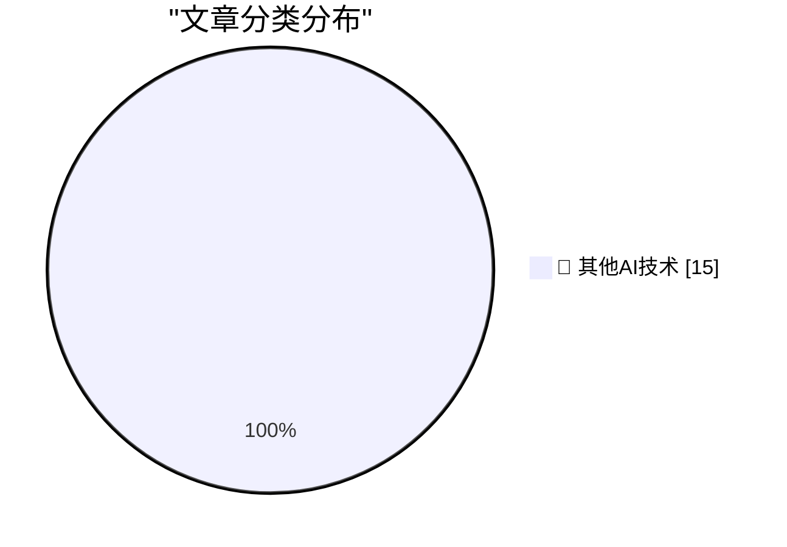

# 📰 AI 博客每日精选 — 2026-09-02

> 来自 98 个技术博客和社交媒体源，AI 精选 Top 15

## 🏆 今日必读

🥇 **How to protect yourself from workslop**

[How to protect yourself from workslop](https://seangoedecke.com/how-to-protect-yourself-from-workslop/) — seangoedecke.com · 22 小时前 · 🔬 其他AI技术

> How to protect yourself from workslop

🥈 **iOS 27 Introduces New ‘iPhone Handoff’ Feature**

[iOS 27 Introduces New ‘iPhone Handoff’ Feature](https://www.macrumors.com/2026/09/02/ios-27-iphone-handoff-feature/) — daringfireball.net · 1 小时前 · 🔬 其他AI技术

> iOS 27 Introduces New ‘iPhone Handoff’ Feature

🥉 **Pluralistic: Unpermissioned research (02 Sep 2026)**

[Pluralistic: Unpermissioned research (02 Sep 2026)](https://pluralistic.net/2026/09/02/scrape-scrope-scrap/) — pluralistic.net · 12 小时前 · 🔬 其他AI技术

> Pluralistic: Unpermissioned research (02 Sep 2026)

4️⃣ **Static Allocation, Constant Work**

[Static Allocation, Constant Work](https://matklad.github.io/2026/09/02/static-allocation-constant-work.html) — matklad.github.io · 22 小时前 · 🔬 其他AI技术

> Static Allocation, Constant Work

5️⃣ **Atari Lynx: The first color handheld game console**

[Atari Lynx: The first color handheld game console](https://dfarq.homeip.net/atari-lynx-the-first-color-handheld-game-console/?utm_source=rss&#038;utm_medium=rss&#038;utm_campaign=atari-lynx-the-first-color-handheld-game-console) — dfarq.homeip.net · 11 小时前 · 🔬 其他AI技术

> Atari Lynx: The first color handheld game console

---

## 📊 数据概览

| 扫描源 | 抓取文章 | 时间范围 | 精选 |
|:---:|:---:|:---:|:---:|
| 79/98 | 2786 篇 → 20 篇 | 24h | **15 篇** |

### 分类分布

---

====================

## 🔬 其他AI技术

### 1. How to protect yourself from workslop

[How to protect yourself from workslop](https://seangoedecke.com/how-to-protect-yourself-from-workslop/) — **seangoedecke.com** · 22 小时前 · ⭐ 15/25

> How to protect yourself from workslop

📌 其他AI技术

---

### 2. iOS 27 Introduces New ‘iPhone Handoff’ Feature

[iOS 27 Introduces New ‘iPhone Handoff’ Feature](https://www.macrumors.com/2026/09/02/ios-27-iphone-handoff-feature/) — **daringfireball.net** · 1 小时前 · ⭐ 15/25

> iOS 27 Introduces New ‘iPhone Handoff’ Feature

📌 其他AI技术

---

### 3. Pluralistic: Unpermissioned research (02 Sep 2026)

[Pluralistic: Unpermissioned research (02 Sep 2026)](https://pluralistic.net/2026/09/02/scrape-scrope-scrap/) — **pluralistic.net** · 12 小时前 · ⭐ 15/25

> Pluralistic: Unpermissioned research (02 Sep 2026)

📌 其他AI技术

---

### 4. Static Allocation, Constant Work

[Static Allocation, Constant Work](https://matklad.github.io/2026/09/02/static-allocation-constant-work.html) — **matklad.github.io** · 22 小时前 · ⭐ 15/25

> Static Allocation, Constant Work

📌 其他AI技术

---

### 5. Atari Lynx: The first color handheld game console

[Atari Lynx: The first color handheld game console](https://dfarq.homeip.net/atari-lynx-the-first-color-handheld-game-console/?utm_source=rss&#038;utm_medium=rss&#038;utm_campaign=atari-lynx-the-first-color-handheld-game-console) — **dfarq.homeip.net** · 11 小时前 · ⭐ 15/25

> Atari Lynx: The first color handheld game console

📌 其他AI技术

---

### 6. VC isn’t VC anymore — understanding the rise of Cancer Capital

[VC isn’t VC anymore — understanding the rise of Cancer Capital](https://anildash.com/2026/09/02/cancer-capital/) — **anildash.com** · 22 小时前 · ⭐ 15/25

> VC isn’t VC anymore — understanding the rise of Cancer Capital

📌 其他AI技术

---

### 7. RT Ashley Kramer: Excited to share that I've joined @ElevenLabs as Chief Revenue Officer. Intelligence alone isn’t enough to drive AI adoption. The n...

[RT Ashley Kramer: Excited to share that I've joined @ElevenLabs as Chief Revenue Officer. Intelligence alone isn’t enough to drive AI adoption. The n...](https://x.com/ElevenLabs/status/2095146588993622500) — **𝕏 @ElevenLabs** · 9 小时前 · ⭐ 15/25

> RT Ashley Kramer: Excited to share that I've joined @ElevenLabs as Chief Revenue Officer. Intelligence alone isn’t enough to drive AI adoption. The n...

📌 其他AI技术

---

### 8. What’s new in GitHub? 👀 GitHub Copilot is now in Slack and Microsoft Teams, new models are available, code review has a new Balanced depth, and mo...

[What’s new in GitHub? 👀 GitHub Copilot is now in Slack and Microsoft Teams, new models are available, code review has a new Balanced depth, and mo...](https://x.com/github/status/2095248954133016876) — **𝕏 @GitHub** · 2 小时前 · ⭐ 15/25

> What’s new in GitHub? 👀 GitHub Copilot is now in Slack and Microsoft Teams, new models are available, code review has a new Balanced depth, and mo...

📌 其他AI技术

---

### 9. If you’re not using a harness with your squad to do loop engineering, are you falling behind? If that sentence made you go 🤯, you’ll want to chec...

[If you’re not using a harness with your squad to do loop engineering, are you falling behind? If that sentence made you go 🤯, you’ll want to chec...](https://x.com/github/status/2095240769669902567) — **𝕏 @GitHub** · 2 小时前 · ⭐ 15/25

> If you’re not using a harness with your squad to do loop engineering, are you falling behind? If that sentence made you go 🤯, you’ll want to chec...

📌 其他AI技术

---

### 10. Just shipped: New model controls for Notion AI. Workspace admins can choose which models are available in Notion Agent and Custom Agents, and set a de...

[Just shipped: New model controls for Notion AI. Workspace admins can choose which models are available in Notion Agent and Custom Agents, and set a de...](https://x.com/NotionHQ/status/2095279036759249054) — **𝕏 @NotionHQ** · 24 分钟前 · ⭐ 15/25

> Just shipped: New model controls for Notion AI. Workspace admins can choose which models are available in Notion Agent and Custom Agents, and set a de...

📌 其他AI技术

---

### 11. 🕺🪩

[🕺🪩](https://x.com/NotionHQ/status/2095267941512343881) — **𝕏 @NotionHQ** · 1 小时前 · ⭐ 15/25

> 🕺🪩

📌 其他AI技术

---

### 12. Speed boost for workspace exports!

[Speed boost for workspace exports!](https://x.com/NotionHQ/status/2095227844272251164) — **𝕏 @NotionHQ** · 3 小时前 · ⭐ 15/25

> Speed boost for workspace exports!

📌 其他AI技术

---

### 13. Customizable sidebars 🔜

[Customizable sidebars 🔜](https://x.com/NotionHQ/status/2095203844292747414) — **𝕏 @NotionHQ** · 5 小时前 · ⭐ 15/25

> Customizable sidebars 🔜

📌 其他AI技术

---

### 14. RT Greg Karelitz: If there’s one thing to know about me, it’s that I’m obsessed with productivity, efficiency, and scale. When I see someone using ...

[RT Greg Karelitz: If there’s one thing to know about me, it’s that I’m obsessed with productivity, efficiency, and scale. When I see someone using ...](https://x.com/NotionHQ/status/2095257146254586202) — **𝕏 @NotionHQ** · 9 小时前 · ⭐ 15/25

> RT Greg Karelitz: If there’s one thing to know about me, it’s that I’m obsessed with productivity, efficiency, and scale. When I see someone using ...

📌 其他AI技术

---

### 15. Open the front door to the Agentic Enterprise. ✨ Catch @bcherny, creator & head of Claude Code at @AnthropicAI on the Slack keynote stage at Dreamfor...

[Open the front door to the Agentic Enterprise. ✨ Catch @bcherny, creator & head of Claude Code at @AnthropicAI on the Slack keynote stage at Dreamfor...](https://x.com/SlackHQ/status/2095263773774807270) — **𝕏 @SlackHQ** · 1 小时前 · ⭐ 15/25

> Open the front door to the Agentic Enterprise. ✨ Catch @bcherny, creator & head of Claude Code at @AnthropicAI on the Slack keynote stage at Dreamfor...

📌 其他AI技术

---

====================

*生成于 2026-09-02 22:58 | 扫描 79 源 → 获取 2786 篇 → 精选 15 篇*
*基于 [Hacker News Popularity Contest 2025](https://refactoringenglish.com/tools/hn-popularity/) RSS 源列表，由 [Andrej Karpathy](https://x.com/karpathy) 推荐*
*由「懂点儿AI」制作，欢迎关注同名微信公众号获取更多 AI 实用技巧 💡*
