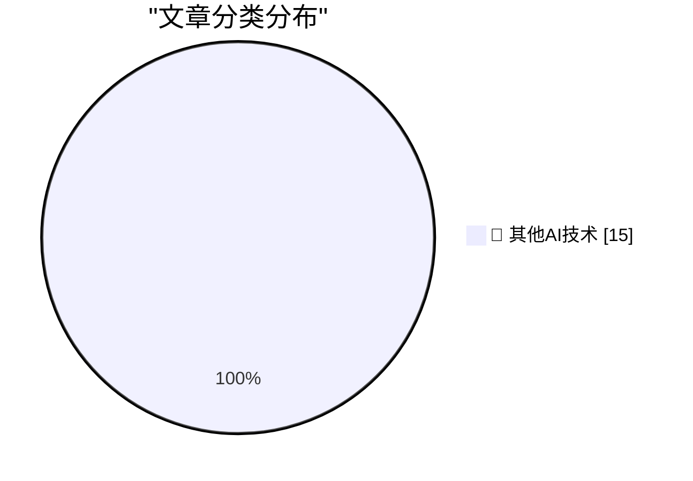

# 📰 AI 博客每日精选 — 2026-09-04

> 来自 98 个技术博客和社交媒体源，AI 精选 Top 15

## 🏆 今日必读

🥇 **Rebuilding a 1995 GPS Time Server so I don't get Telstra'd**

[Rebuilding a 1995 GPS Time Server so I don't get Telstra'd](https://www.jeffgeerling.com/blog/2026/truetime-xl-gps-time-server-restomod/) — jeffgeerling.com · 8 小时前 · 🔬 其他AI技术

> Rebuilding a 1995 GPS Time Server so I don't get Telstra'd

🥈 **Radical responsibility means treating people like tools**

[Radical responsibility means treating people like tools](https://seangoedecke.com/radical-responsibility-means-treating-people-like-tools/) — seangoedecke.com · 22 小时前 · 🔬 其他AI技术

> Radical responsibility means treating people like tools

🥉 **Apple Fixed ‎TestFlight’s Screwy Sort Order**

[Apple Fixed ‎TestFlight’s Screwy Sort Order](https://apps.apple.com/us/app/testflight/id899247664) — daringfireball.net · 2 小时前 · 🔬 其他AI技术

> Apple Fixed ‎TestFlight’s Screwy Sort Order

4️⃣ **Vinted**

[Vinted](https://www.vinted.com/) — daringfireball.net · 2 小时前 · 🔬 其他AI技术

> Vinted

5️⃣ **★ Writing With Unnatural Constraints**

[★ Writing With Unnatural Constraints](https://daringfireball.net/2026/09/writing_with_unnatural_constraints) — daringfireball.net · 4 小时前 · 🔬 其他AI技术

> ★ Writing With Unnatural Constraints

---

## 📊 数据概览

| 扫描源 | 抓取文章 | 时间范围 | 精选 |
|:---:|:---:|:---:|:---:|
| 78/98 | 2768 篇 → 31 篇 | 24h | **15 篇** |

### 分类分布

---

====================

## 🔬 其他AI技术

### 1. Rebuilding a 1995 GPS Time Server so I don't get Telstra'd

[Rebuilding a 1995 GPS Time Server so I don't get Telstra'd](https://www.jeffgeerling.com/blog/2026/truetime-xl-gps-time-server-restomod/) — **jeffgeerling.com** · 8 小时前 · ⭐ 15/25

> Rebuilding a 1995 GPS Time Server so I don't get Telstra'd

📌 其他AI技术

---

### 2. Radical responsibility means treating people like tools

[Radical responsibility means treating people like tools](https://seangoedecke.com/radical-responsibility-means-treating-people-like-tools/) — **seangoedecke.com** · 22 小时前 · ⭐ 15/25

> Radical responsibility means treating people like tools

📌 其他AI技术

---

### 3. Apple Fixed ‎TestFlight’s Screwy Sort Order

[Apple Fixed ‎TestFlight’s Screwy Sort Order](https://apps.apple.com/us/app/testflight/id899247664) — **daringfireball.net** · 2 小时前 · ⭐ 15/25

> Apple Fixed ‎TestFlight’s Screwy Sort Order

📌 其他AI技术

---

### 4. Vinted

[Vinted](https://www.vinted.com/) — **daringfireball.net** · 2 小时前 · ⭐ 15/25

> Vinted

📌 其他AI技术

---

### 5. ★ Writing With Unnatural Constraints

[★ Writing With Unnatural Constraints](https://daringfireball.net/2026/09/writing_with_unnatural_constraints) — **daringfireball.net** · 4 小时前 · ⭐ 15/25

> ★ Writing With Unnatural Constraints

📌 其他AI技术

---

### 6. FBI Probes Service Selling 153M+ Drivers Licenses

[FBI Probes Service Selling 153M+ Drivers Licenses](https://krebsonsecurity.com/2026/09/fbi-probes-service-selling-153m-drivers-licenses/) — **daringfireball.net** · 6 小时前 · ⭐ 15/25

> FBI Probes Service Selling 153M+ Drivers Licenses

📌 其他AI技术

---

### 7. OpenAI Soft-Releases GPT‑6 Astra

[OpenAI Soft-Releases GPT‑6 Astra](https://simonwillison.net/2026/Sep/3/gpt6-astra/) — **daringfireball.net** · 21 小时前 · ⭐ 15/25

> OpenAI Soft-Releases GPT‑6 Astra

📌 其他AI技术

---

### 8. Pluralistic: Amazon achieves enshittification inception (04 Sep 2026)

[Pluralistic: Amazon achieves enshittification inception (04 Sep 2026)](https://pluralistic.net/2026/09/04/cheating-at-fraud/) — **pluralistic.net** · 13 小时前 · ⭐ 15/25

> Pluralistic: Amazon achieves enshittification inception (04 Sep 2026)

📌 其他AI技术

---

### 9. How much should you trust your OSS data?

[How much should you trust your OSS data?](https://nesbitt.io/2026/09/04/how-much-should-you-trust-your-oss-data.html) — **nesbitt.io** · 13 小时前 · ⭐ 15/25

> How much should you trust your OSS data?

📌 其他AI技术

---

### 10. Premium: The Hater's Guide To Circular Financing (Part Two)

[Premium: The Hater's Guide To Circular Financing (Part Two)](https://www.wheresyoured.at/premium-the-haters-guide-to-circular-financing-part-two/) — **wheresyoured.at** · 6 小时前 · ⭐ 15/25

> Premium: The Hater's Guide To Circular Financing (Part Two)

📌 其他AI技术

---

### 11. Porsche Unleashed

[Porsche Unleashed](https://www.filfre.net/2026/09/porsche-unleashed/) — **filfre.net** · 6 小时前 · ⭐ 15/25

> Porsche Unleashed

📌 其他AI技术

---

### 12. The September that Never Ended

[The September that Never Ended](https://dfarq.homeip.net/the-september-that-never-ended/?utm_source=rss&#038;utm_medium=rss&#038;utm_campaign=the-september-that-never-ended) — **dfarq.homeip.net** · 11 小时前 · ⭐ 15/25

> The September that Never Ended

📌 其他AI技术

---

### 13. we have a year to fix security everywhere

[we have a year to fix security everywhere](https://jyn.dev/a-year-to-fix-security/) — **jyn.dev** · 22 小时前 · ⭐ 15/25

> we have a year to fix security everywhere

📌 其他AI技术

---

### 14. Support Local Variables

[Support Local Variables](https://bernsteinbear.com/blog/support-local-variables/?utm_source=rss) — **bernsteinbear.com** · 22 小时前 · ⭐ 15/25

> Support Local Variables

📌 其他AI技术

---

### 15. Cancer Capital: VC didn’t use to work like this

[Cancer Capital: VC didn’t use to work like this](https://anildash.com/2026/09/04/vc-didnt-use-to-work-like-this/) — **anildash.com** · 22 小时前 · ⭐ 15/25

> Cancer Capital: VC didn’t use to work like this

📌 其他AI技术

---

====================

*生成于 2026-09-04 22:45 | 扫描 78 源 → 获取 2768 篇 → 精选 15 篇*
*基于 [Hacker News Popularity Contest 2025](https://refactoringenglish.com/tools/hn-popularity/) RSS 源列表，由 [Andrej Karpathy](https://x.com/karpathy) 推荐*
*由「懂点儿AI」制作，欢迎关注同名微信公众号获取更多 AI 实用技巧 💡*
