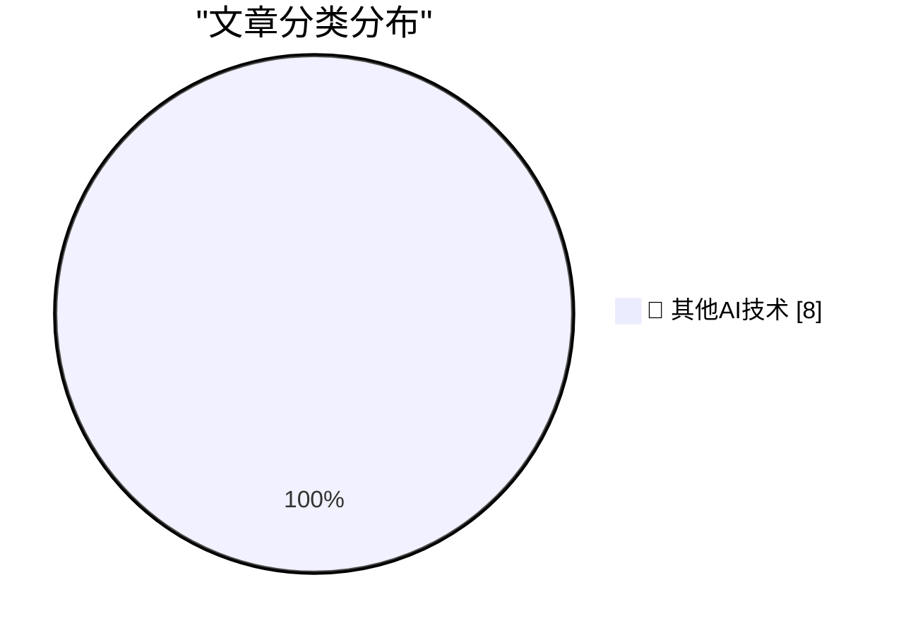

# 📰 AI 博客每日精选 — 2026-09-05

> 来自 98 个技术博客和社交媒体源，AI 精选 Top 8

## 🏆 今日必读

🥇 **Gloria Steinem’s Final Essay**

[Gloria Steinem’s Final Essay](https://www.newyorker.com/culture/life-and-letters/gloria-steinems-final-essay?cndid=66114350) — daringfireball.net · 2 小时前 · 🔬 其他AI技术

> Gloria Steinem’s Final Essay

🥈 **‘Bob and Van’**

[‘Bob and Van’](https://marco.org/2026/09/04/bob-and-van) — daringfireball.net · 6 小时前 · 🔬 其他AI技术

> ‘Bob and Van’

🥉 **Adobe Names Anil Chakravarthy as CEO, Replacing Shantanu Narayen**

[Adobe Names Anil Chakravarthy as CEO, Replacing Shantanu Narayen](https://www.cnbc.com/2026/09/03/adobe-anil-chakravarthy-ceo.html) — daringfireball.net · 22 小时前 · 🔬 其他AI技术

> Adobe Names Anil Chakravarthy as CEO, Replacing Shantanu Narayen

4️⃣ **NBA Brings the Hammer on the Clippers — $30 Million Fine, 5 First-Round Draft Picks, and Steve Ballmer Is Banned for a Year**

[NBA Brings the Hammer on the Clippers — $30 Million Fine, 5 First-Round Draft Picks, and Steve Ballmer Is Banned for a Year](https://www.nytimes.com/athletic/7513882/2026/09/02/clippers-kawhi-leonard-punishment-fine-suspensions-nba-investigation/?unlocked_article_code=1.-lA.wcSN.awOHwzojR5nR) — daringfireball.net · 23 小时前 · 🔬 其他AI技术

> NBA Brings the Hammer on the Clippers — $30 Million Fine, 5 First-Round Draft Picks, and Steve Ballmer Is Banned for a Year

5️⃣ **Pluralistic: Google skates (05 Sep 2026)**

[Pluralistic: Google skates (05 Sep 2026)](https://pluralistic.net/2026/09/05/divorce-court/) — pluralistic.net · 14 小时前 · 🔬 其他AI技术

> Pluralistic: Google skates (05 Sep 2026)

---

## 📊 数据概览

| 扫描源 | 抓取文章 | 时间范围 | 精选 |
|:---:|:---:|:---:|:---:|
| 65/98 | 2014 篇 → 8 篇 | 24h | **8 篇** |

### 分类分布

---

====================

## 🔬 其他AI技术

### 1. Gloria Steinem’s Final Essay

[Gloria Steinem’s Final Essay](https://www.newyorker.com/culture/life-and-letters/gloria-steinems-final-essay?cndid=66114350) — **daringfireball.net** · 2 小时前 · ⭐ 15/25

> Gloria Steinem’s Final Essay

📌 其他AI技术

---

### 2. ‘Bob and Van’

[‘Bob and Van’](https://marco.org/2026/09/04/bob-and-van) — **daringfireball.net** · 6 小时前 · ⭐ 15/25

> ‘Bob and Van’

📌 其他AI技术

---

### 3. Adobe Names Anil Chakravarthy as CEO, Replacing Shantanu Narayen

[Adobe Names Anil Chakravarthy as CEO, Replacing Shantanu Narayen](https://www.cnbc.com/2026/09/03/adobe-anil-chakravarthy-ceo.html) — **daringfireball.net** · 22 小时前 · ⭐ 15/25

> Adobe Names Anil Chakravarthy as CEO, Replacing Shantanu Narayen

📌 其他AI技术

---

### 4. NBA Brings the Hammer on the Clippers — $30 Million Fine, 5 First-Round Draft Picks, and Steve Ballmer Is Banned for a Year

[NBA Brings the Hammer on the Clippers — $30 Million Fine, 5 First-Round Draft Picks, and Steve Ballmer Is Banned for a Year](https://www.nytimes.com/athletic/7513882/2026/09/02/clippers-kawhi-leonard-punishment-fine-suspensions-nba-investigation/?unlocked_article_code=1.-lA.wcSN.awOHwzojR5nR) — **daringfireball.net** · 23 小时前 · ⭐ 15/25

> NBA Brings the Hammer on the Clippers — $30 Million Fine, 5 First-Round Draft Picks, and Steve Ballmer Is Banned for a Year

📌 其他AI技术

---

### 5. Pluralistic: Google skates (05 Sep 2026)

[Pluralistic: Google skates (05 Sep 2026)](https://pluralistic.net/2026/09/05/divorce-court/) — **pluralistic.net** · 14 小时前 · ⭐ 15/25

> Pluralistic: Google skates (05 Sep 2026)

📌 其他AI技术

---

### 6. Book Review: The Passing of the Dragon and Other Stories by Ken Liu ★★★★☆

[Book Review: The Passing of the Dragon and Other Stories by Ken Liu ★★★★☆](https://shkspr.mobi/blog/2026/09/book-review-the-passing-of-the-dragon-and-other-stories-by-ken-liu/) — **shkspr.mobi** · 11 小时前 · ⭐ 15/25

> Book Review: The Passing of the Dragon and Other Stories by Ken Liu ★★★★☆

📌 其他AI技术

---

### 7. Latent Powers

[Latent Powers](https://lucumr.pocoo.org/2026/9/5/latent-powers/) — **lucumr.pocoo.org** · 22 小时前 · ⭐ 15/25

> Latent Powers

📌 其他AI技术

---

### 8. This Week in Package Management: 5 September 2026

[This Week in Package Management: 5 September 2026](https://nesbitt.io/2026/09/05/this-week-in-package-management.html) — **nesbitt.io** · 12 小时前 · ⭐ 15/25

> This Week in Package Management: 5 September 2026

📌 其他AI技术

---

====================

*生成于 2026-09-05 22:38 | 扫描 65 源 → 获取 2014 篇 → 精选 8 篇*
*基于 [Hacker News Popularity Contest 2025](https://refactoringenglish.com/tools/hn-popularity/) RSS 源列表，由 [Andrej Karpathy](https://x.com/karpathy) 推荐*
*由「懂点儿AI」制作，欢迎关注同名微信公众号获取更多 AI 实用技巧 💡*
