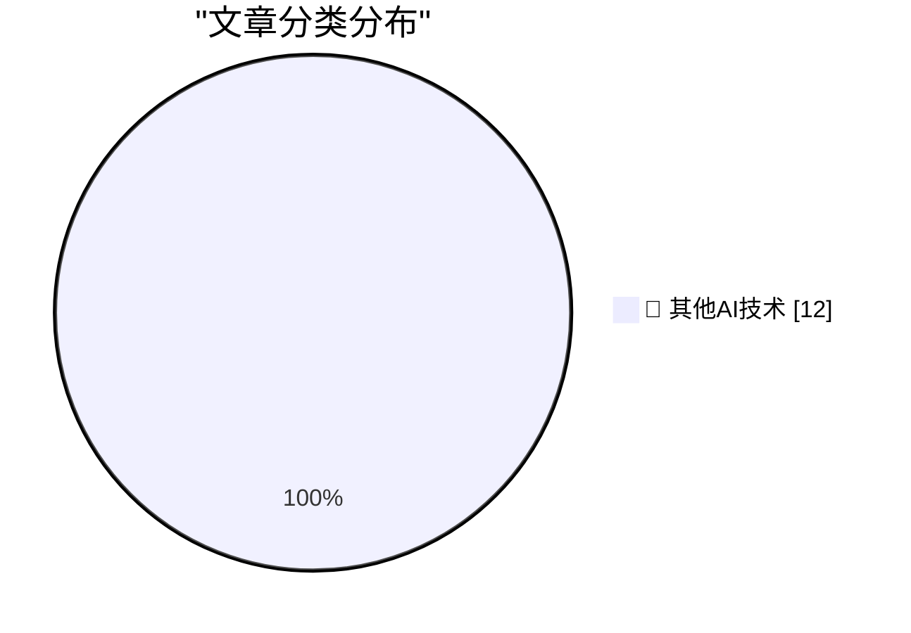

# 📰 AI 博客每日精选 — 2026-09-08

> 来自 98 个技术博客和社交媒体源，AI 精选 Top 12

## 🏆 今日必读

🥇 **OpenNMC is an open replacement for expensive APC management cards**

[OpenNMC is an open replacement for expensive APC management cards](https://www.jeffgeerling.com/blog/2026/opennmc-apc-ups-replacement-card/) — jeffgeerling.com · 7 小时前 · 🔬 其他AI技术

> OpenNMC is an open replacement for expensive APC management cards

🥈 **Automatically detecting AI text in my browser**

[Automatically detecting AI text in my browser](https://seangoedecke.com/deckard/) — seangoedecke.com · 23 小时前 · 🔬 其他AI技术

> Automatically detecting AI text in my browser

🥉 **‘Modern Day Typographer’**

[‘Modern Day Typographer’](https://www.youtube.com/watch?v=0Ck-NPqf2c8) — daringfireball.net · 13 分钟前 · 🔬 其他AI技术

> ‘Modern Day Typographer’

4️⃣ **★ SuperDuper 4**

[★ SuperDuper 4](https://daringfireball.net/2026/09/superduper_4) — daringfireball.net · 8 小时前 · 🔬 其他AI技术

> ★ SuperDuper 4

5️⃣ **I found an old interview mine (2017)**

[I found an old interview mine (2017)](https://idiallo.com/byte-size/interviewing-with-thatsoftware-dude) — idiallo.com · 23 小时前 · 🔬 其他AI技术

> I found an old interview mine (2017)

---

## 📊 数据概览

| 扫描源 | 抓取文章 | 时间范围 | 精选 |
|:---:|:---:|:---:|:---:|
| 65/98 | 2016 篇 → 12 篇 | 24h | **12 篇** |

### 分类分布

---

====================

## 🔬 其他AI技术

### 1. OpenNMC is an open replacement for expensive APC management cards

[OpenNMC is an open replacement for expensive APC management cards](https://www.jeffgeerling.com/blog/2026/opennmc-apc-ups-replacement-card/) — **jeffgeerling.com** · 7 小时前 · ⭐ 15/25

> OpenNMC is an open replacement for expensive APC management cards

📌 其他AI技术

---

### 2. Automatically detecting AI text in my browser

[Automatically detecting AI text in my browser](https://seangoedecke.com/deckard/) — **seangoedecke.com** · 23 小时前 · ⭐ 15/25

> Automatically detecting AI text in my browser

📌 其他AI技术

---

### 3. ‘Modern Day Typographer’

[‘Modern Day Typographer’](https://www.youtube.com/watch?v=0Ck-NPqf2c8) — **daringfireball.net** · 13 分钟前 · ⭐ 15/25

> ‘Modern Day Typographer’

📌 其他AI技术

---

### 4. ★ SuperDuper 4

[★ SuperDuper 4](https://daringfireball.net/2026/09/superduper_4) — **daringfireball.net** · 8 小时前 · ⭐ 15/25

> ★ SuperDuper 4

📌 其他AI技术

---

### 5. I found an old interview mine (2017)

[I found an old interview mine (2017)](https://idiallo.com/byte-size/interviewing-with-thatsoftware-dude) — **idiallo.com** · 23 小时前 · ⭐ 15/25

> I found an old interview mine (2017)

📌 其他AI技术

---

### 6. ActivityPub - Is it worth defending against replay attacks and message/signature time skew?

[ActivityPub - Is it worth defending against replay attacks and message/signature time skew?](https://shkspr.mobi/blog/2026/09/activitypub-is-it-worth-defending-against-replay-attacks-and-message-signature-time-skew/) — **shkspr.mobi** · 11 小时前 · ⭐ 15/25

> ActivityPub - Is it worth defending against replay attacks and message/signature time skew?

📌 其他AI技术

---

### 7. A sample use of the winstart.bat file in Windows 95

[A sample use of the winstart.bat file in Windows 95](https://devblogs.microsoft.com/oldnewthing/20260908-00/?p=112679) — **devblogs.microsoft.com/oldnewthing** · 9 小时前 · ⭐ 15/25

> A sample use of the winstart.bat file in Windows 95

📌 其他AI技术

---

### 8. What’s new in git-pkgs

[What’s new in git-pkgs](https://nesbitt.io/2026/09/08/whats-new-in-git-pkgs.html) — **nesbitt.io** · 14 小时前 · ⭐ 15/25

> What’s new in git-pkgs

📌 其他AI技术

---

### 9. Pretraining progress is mostly coming from data

[Pretraining progress is mostly coming from data](https://www.dwarkesh.com/p/pretraining-progress-is-mostly-data) — **dwarkesh.com** · 6 小时前 · ⭐ 15/25

> Pretraining progress is mostly coming from data

📌 其他AI技术

---

### 10. Concentration Risk

[Concentration Risk](https://www.wheresyoured.at/concentration-risk/) — **wheresyoured.at** · 8 小时前 · ⭐ 15/25

> Concentration Risk

📌 其他AI技术

---

### 11. The Bulldozing of an Interface

[The Bulldozing of an Interface](https://blog.jim-nielsen.com/2026/bulldoze-ui/) — **blog.jim-nielsen.com** · 4 小时前 · ⭐ 15/25

> The Bulldozing of an Interface

📌 其他AI技术

---

### 12. What happened to Compuserve?

[What happened to Compuserve?](https://dfarq.homeip.net/what-happened-to-compuserve/?utm_source=rss&#038;utm_medium=rss&#038;utm_campaign=what-happened-to-compuserve) — **dfarq.homeip.net** · 12 小时前 · ⭐ 15/25

> What happened to Compuserve?

📌 其他AI技术

---

====================

*生成于 2026-09-08 23:10 | 扫描 65 源 → 获取 2016 篇 → 精选 12 篇*
*基于 [Hacker News Popularity Contest 2025](https://refactoringenglish.com/tools/hn-popularity/) RSS 源列表，由 [Andrej Karpathy](https://x.com/karpathy) 推荐*
*由「懂点儿AI」制作，欢迎关注同名微信公众号获取更多 AI 实用技巧 💡*
