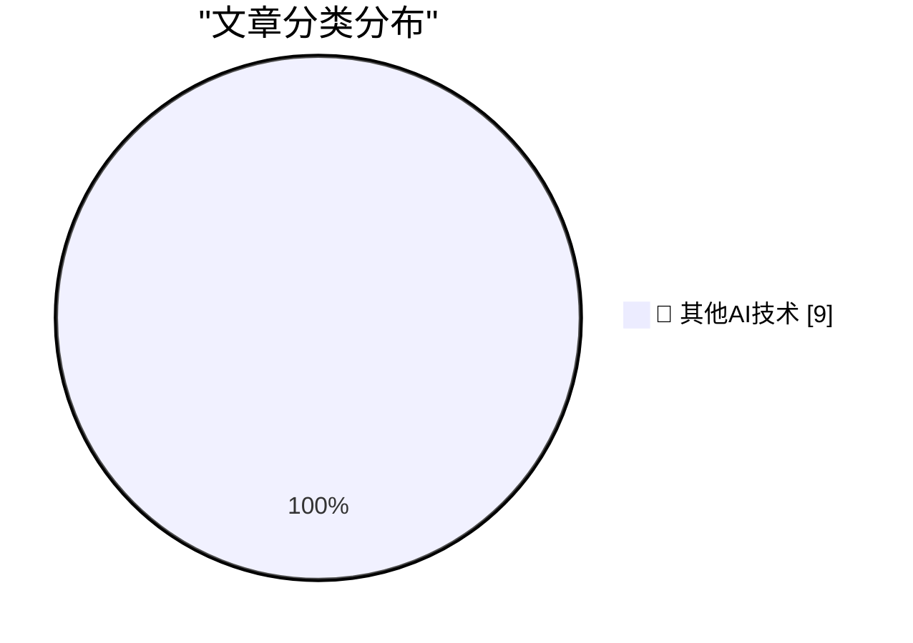

# 📰 AI 博客每日精选 — 2026-09-09

> 来自 98 个技术博客和社交媒体源，AI 精选 Top 9

## 🏆 今日必读

🥇 **Why we should anthropomorphize AI agents**

[Why we should anthropomorphize AI agents](https://seangoedecke.com/why-we-should-anthropomorphize-ai-agents/) — seangoedecke.com · 22 小时前 · 🔬 其他AI技术

> Why we should anthropomorphize AI agents

🥈 **★ The iPhone Air and iPhone 17 Pro**

[★ The iPhone Air and iPhone 17 Pro](https://daringfireball.net/2026/09/the_iphone_air_and_iphone_17_pro) — daringfireball.net · 21 小时前 · 🔬 其他AI技术

> ★ The iPhone Air and iPhone 17 Pro

🥉 **‘Modern Day Typographer’**

[‘Modern Day Typographer’](https://www.youtube.com/watch?v=0Ck-NPqf2c8) — daringfireball.net · 23 小时前 · 🔬 其他AI技术

> ‘Modern Day Typographer’

4️⃣ **We own the Glass**

[We own the Glass](https://idiallo.com/byte-size/) — idiallo.com · 1 小时前 · 🔬 其他AI技术

> We own the Glass

5️⃣ **Pluralistic: Anti-vax/anti-trust (09 Sep 2026)**

[Pluralistic: Anti-vax/anti-trust (09 Sep 2026)](https://pluralistic.net/2026/09/09/when-it-dont-rain/) — pluralistic.net · 12 小时前 · 🔬 其他AI技术

> Pluralistic: Anti-vax/anti-trust (09 Sep 2026)

---

## 📊 数据概览

| 扫描源 | 抓取文章 | 时间范围 | 精选 |
|:---:|:---:|:---:|:---:|
| 65/98 | 2017 篇 → 9 篇 | 24h | **9 篇** |

### 分类分布

---

====================

## 🔬 其他AI技术

### 1. Why we should anthropomorphize AI agents

[Why we should anthropomorphize AI agents](https://seangoedecke.com/why-we-should-anthropomorphize-ai-agents/) — **seangoedecke.com** · 22 小时前 · ⭐ 15/25

> Why we should anthropomorphize AI agents

📌 其他AI技术

---

### 2. ★ The iPhone Air and iPhone 17 Pro

[★ The iPhone Air and iPhone 17 Pro](https://daringfireball.net/2026/09/the_iphone_air_and_iphone_17_pro) — **daringfireball.net** · 21 小时前 · ⭐ 15/25

> ★ The iPhone Air and iPhone 17 Pro

📌 其他AI技术

---

### 3. ‘Modern Day Typographer’

[‘Modern Day Typographer’](https://www.youtube.com/watch?v=0Ck-NPqf2c8) — **daringfireball.net** · 23 小时前 · ⭐ 15/25

> ‘Modern Day Typographer’

📌 其他AI技术

---

### 4. We own the Glass

[We own the Glass](https://idiallo.com/byte-size/) — **idiallo.com** · 1 小时前 · ⭐ 15/25

> We own the Glass

📌 其他AI技术

---

### 5. Pluralistic: Anti-vax/anti-trust (09 Sep 2026)

[Pluralistic: Anti-vax/anti-trust (09 Sep 2026)](https://pluralistic.net/2026/09/09/when-it-dont-rain/) — **pluralistic.net** · 12 小时前 · ⭐ 15/25

> Pluralistic: Anti-vax/anti-trust (09 Sep 2026)

📌 其他AI技术

---

### 6. Don’t Let Anyone Take Away Your Big Box of Cables

[Don’t Let Anyone Take Away Your Big Box of Cables](https://blog.jim-nielsen.com/2026/hands-off-my-cables/) — **blog.jim-nielsen.com** · 3 小时前 · ⭐ 15/25

> Don’t Let Anyone Take Away Your Big Box of Cables

📌 其他AI技术

---

### 7. The first VHS VCR: JVC HR-3300

[The first VHS VCR: JVC HR-3300](https://dfarq.homeip.net/the-first-vhs-vcr-jvc-hr-3300/?utm_source=rss&#038;utm_medium=rss&#038;utm_campaign=the-first-vhs-vcr-jvc-hr-3300) — **dfarq.homeip.net** · 11 小时前 · ⭐ 15/25

> The first VHS VCR: JVC HR-3300

📌 其他AI技术

---

### 8. Analysing 2048 on a 3×3 board

[Analysing 2048 on a 3×3 board](https://www.chiark.greenend.org.uk/~sgtatham/quasiblog/small2048/) — **chiark.greenend.org.uk/~sgtatham** · 22 小时前 · ⭐ 15/25

> Analysing 2048 on a 3×3 board

📌 其他AI技术

---

### 9. Cancer Capital: It sucks for founders, too!

[Cancer Capital: It sucks for founders, too!](https://anildash.com/2026/09/09/cancer-capital-founders/) — **anildash.com** · 22 小时前 · ⭐ 15/25

> Cancer Capital: It sucks for founders, too!

📌 其他AI技术

---

====================

*生成于 2026-09-09 22:54 | 扫描 65 源 → 获取 2017 篇 → 精选 9 篇*
*基于 [Hacker News Popularity Contest 2025](https://refactoringenglish.com/tools/hn-popularity/) RSS 源列表，由 [Andrej Karpathy](https://x.com/karpathy) 推荐*
*由「懂点儿AI」制作，欢迎关注同名微信公众号获取更多 AI 实用技巧 💡*
