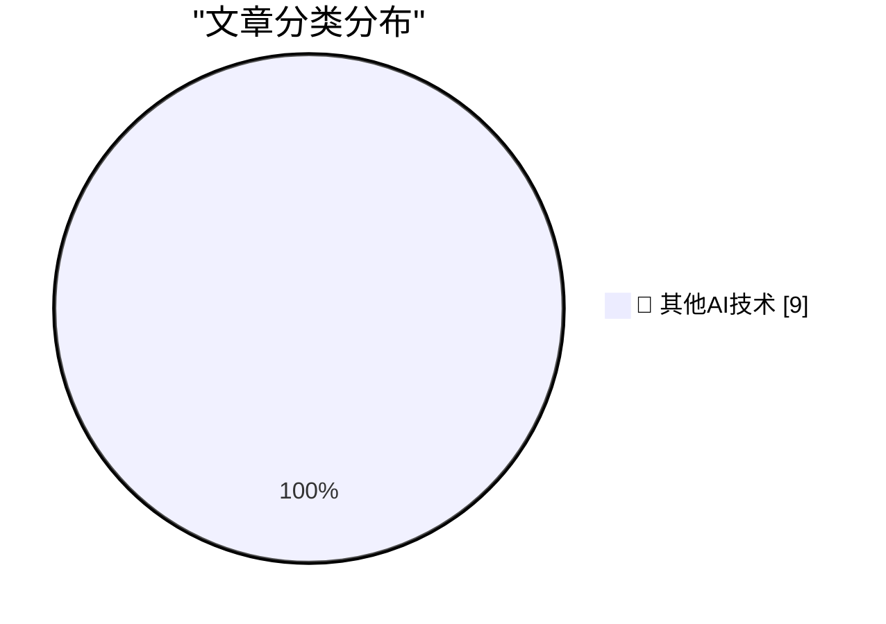

# 📰 AI 博客每日精选 — 2026-09-10

> 来自 98 个技术博客和社交媒体源，AI 精选 Top 9

## 🏆 今日必读

🥇 **They really do think AI might kill everyone**

[They really do think AI might kill everyone](https://seangoedecke.com/they-really-do-think-ai-might-kill-everyone/) — seangoedecke.com · 22 小时前 · 🔬 其他AI技术

> They really do think AI might kill everyone

🥈 **Apple’s OS 27 Updates Will Be Released on Monday, 14 September**

[Apple’s OS 27 Updates Will Be Released on Monday, 14 September](https://9to5mac.com/2026/09/09/apple-confirms-macos-27-golden-gate-launch-date-september-14/) — daringfireball.net · 2 小时前 · 🔬 其他AI技术

> Apple’s OS 27 Updates Will Be Released on Monday, 14 September

🥉 **Joanna Stern on the iPhone Duo**

[Joanna Stern on the iPhone Duo](https://youtu.be/VNzl-q0EGfg) — daringfireball.net · 5 小时前 · 🔬 其他AI技术

> Joanna Stern on the iPhone Duo

4️⃣ **Put an AV test at the start of your slides**

[Put an AV test at the start of your slides](https://shkspr.mobi/blog/2026/09/put-an-av-test-at-the-start-of-your-slides/) — shkspr.mobi · 11 小时前 · 🔬 其他AI技术

> Put an AV test at the start of your slides

5️⃣ **Extending Raschka's GPT-2: an MoE trained from scratch on an RTX 3090**

[Extending Raschka's GPT-2: an MoE trained from scratch on an RTX 3090](https://www.gilesthomas.com/2026/09/gpt-2-to-moe) — gilesthomas.com · 4 小时前 · 🔬 其他AI技术

> Extending Raschka's GPT-2: an MoE trained from scratch on an RTX 3090

---

## 📊 数据概览

| 扫描源 | 抓取文章 | 时间范围 | 精选 |
|:---:|:---:|:---:|:---:|
| 64/98 | 1987 篇 → 9 篇 | 24h | **9 篇** |

### 分类分布

---

====================

## 🔬 其他AI技术

### 1. They really do think AI might kill everyone

[They really do think AI might kill everyone](https://seangoedecke.com/they-really-do-think-ai-might-kill-everyone/) — **seangoedecke.com** · 22 小时前 · ⭐ 15/25

> They really do think AI might kill everyone

📌 其他AI技术

---

### 2. Apple’s OS 27 Updates Will Be Released on Monday, 14 September

[Apple’s OS 27 Updates Will Be Released on Monday, 14 September](https://9to5mac.com/2026/09/09/apple-confirms-macos-27-golden-gate-launch-date-september-14/) — **daringfireball.net** · 2 小时前 · ⭐ 15/25

> Apple’s OS 27 Updates Will Be Released on Monday, 14 September

📌 其他AI技术

---

### 3. Joanna Stern on the iPhone Duo

[Joanna Stern on the iPhone Duo](https://youtu.be/VNzl-q0EGfg) — **daringfireball.net** · 5 小时前 · ⭐ 15/25

> Joanna Stern on the iPhone Duo

📌 其他AI技术

---

### 4. Put an AV test at the start of your slides

[Put an AV test at the start of your slides](https://shkspr.mobi/blog/2026/09/put-an-av-test-at-the-start-of-your-slides/) — **shkspr.mobi** · 11 小时前 · ⭐ 15/25

> Put an AV test at the start of your slides

📌 其他AI技术

---

### 5. Extending Raschka's GPT-2: an MoE trained from scratch on an RTX 3090

[Extending Raschka's GPT-2: an MoE trained from scratch on an RTX 3090](https://www.gilesthomas.com/2026/09/gpt-2-to-moe) — **gilesthomas.com** · 4 小时前 · ⭐ 15/25

> Extending Raschka's GPT-2: an MoE trained from scratch on an RTX 3090

📌 其他AI技术

---

### 6. AI Is Breaking This Thing We Call Trust

[AI Is Breaking This Thing We Call Trust](https://terriblesoftware.org/2026/09/10/ai-is-breaking-this-thing-we-call-trust/) — **terriblesoftware.org** · 8 小时前 · ⭐ 15/25

> AI Is Breaking This Thing We Call Trust

📌 其他AI技术

---

### 7. Package Manager Trends

[Package Manager Trends](https://nesbitt.io/2026/09/10/package-manager-trends.html) — **nesbitt.io** · 12 小时前 · ⭐ 15/25

> Package Manager Trends

📌 其他AI技术

---

### 8. An Ode to Links

[An Ode to Links](https://blog.jim-nielsen.com/2026/ode-to-links/) — **blog.jim-nielsen.com** · 3 小时前 · ⭐ 15/25

> An Ode to Links

📌 其他AI技术

---

### 9. When the RIAA sued a 12-year-old for MP3 piracy

[When the RIAA sued a 12-year-old for MP3 piracy](https://dfarq.homeip.net/that-time-the-riaa-sued-a-12-year-old-for-mp3-usage/?utm_source=rss&#038;utm_medium=rss&#038;utm_campaign=that-time-the-riaa-sued-a-12-year-old-for-mp3-usage) — **dfarq.homeip.net** · 11 小时前 · ⭐ 15/25

> When the RIAA sued a 12-year-old for MP3 piracy

📌 其他AI技术

---

====================

*生成于 2026-09-10 22:55 | 扫描 64 源 → 获取 1987 篇 → 精选 9 篇*
*基于 [Hacker News Popularity Contest 2025](https://refactoringenglish.com/tools/hn-popularity/) RSS 源列表，由 [Andrej Karpathy](https://x.com/karpathy) 推荐*
*由「懂点儿AI」制作，欢迎关注同名微信公众号获取更多 AI 实用技巧 💡*
