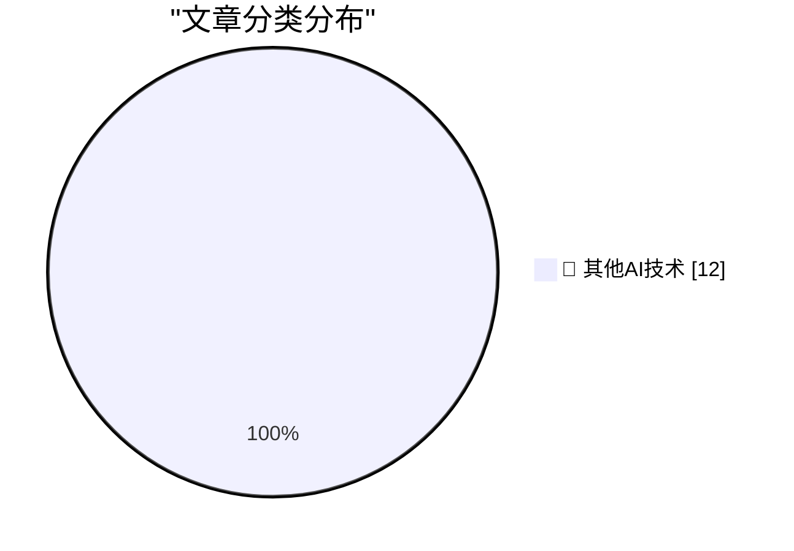

# 📰 AI 博客每日精选 — 2026-09-11

> 来自 98 个技术博客和社交媒体源，AI 精选 Top 12

## 🏆 今日必读

🥇 **Clarus the Dogcow Easter Egg in iOS 27 Settings**

[Clarus the Dogcow Easter Egg in iOS 27 Settings](https://9to5mac.com/2026/09/11/apple-hid-a-classic-mac-easter-egg-in-the-ios-27-settings-app/) — daringfireball.net · 2 小时前 · 🔬 其他AI技术

> Clarus the Dogcow Easter Egg in iOS 27 Settings

🥈 **XCancel Is Back**

[XCancel Is Back](https://xcancel.com/cdclegal) — daringfireball.net · 3 小时前 · 🔬 其他AI技术

> XCancel Is Back

🥉 **iPhone Duo Only Works With the $80 USB-C Apple Pencil, Not the $130 Apple Pencil Pro**

[iPhone Duo Only Works With the $80 USB-C Apple Pencil, Not the $130 Apple Pencil Pro](https://www.macrumors.com/2026/09/09/apple-pencil-usb-c-iphone-duo/) — daringfireball.net · 6 小时前 · 🔬 其他AI技术

> iPhone Duo Only Works With the $80 USB-C Apple Pencil, Not the $130 Apple Pencil Pro

4️⃣ **You Can Drop SEO**

[You Can Drop SEO](https://idiallo.com/blog/you-can-drop-the-seo) — idiallo.com · 2 小时前 · 🔬 其他AI技术

> You Can Drop SEO

5️⃣ **Pluralistic: Inefficiency is bad, actually (11 Sep 2026)**

[Pluralistic: Inefficiency is bad, actually (11 Sep 2026)](https://pluralistic.net/2026/09/11/mazzucato-thought/) — pluralistic.net · 8 小时前 · 🔬 其他AI技术

> Pluralistic: Inefficiency is bad, actually (11 Sep 2026)

---

## 📊 数据概览

| 扫描源 | 抓取文章 | 时间范围 | 精选 |
|:---:|:---:|:---:|:---:|
| 64/98 | 1987 篇 → 12 篇 | 24h | **12 篇** |

### 分类分布

---

====================

## 🔬 其他AI技术

### 1. Clarus the Dogcow Easter Egg in iOS 27 Settings

[Clarus the Dogcow Easter Egg in iOS 27 Settings](https://9to5mac.com/2026/09/11/apple-hid-a-classic-mac-easter-egg-in-the-ios-27-settings-app/) — **daringfireball.net** · 2 小时前 · ⭐ 15/25

> Clarus the Dogcow Easter Egg in iOS 27 Settings

📌 其他AI技术

---

### 2. XCancel Is Back

[XCancel Is Back](https://xcancel.com/cdclegal) — **daringfireball.net** · 3 小时前 · ⭐ 15/25

> XCancel Is Back

📌 其他AI技术

---

### 3. iPhone Duo Only Works With the $80 USB-C Apple Pencil, Not the $130 Apple Pencil Pro

[iPhone Duo Only Works With the $80 USB-C Apple Pencil, Not the $130 Apple Pencil Pro](https://www.macrumors.com/2026/09/09/apple-pencil-usb-c-iphone-duo/) — **daringfireball.net** · 6 小时前 · ⭐ 15/25

> iPhone Duo Only Works With the $80 USB-C Apple Pencil, Not the $130 Apple Pencil Pro

📌 其他AI技术

---

### 4. You Can Drop SEO

[You Can Drop SEO](https://idiallo.com/blog/you-can-drop-the-seo) — **idiallo.com** · 2 小时前 · ⭐ 15/25

> You Can Drop SEO

📌 其他AI技术

---

### 5. Pluralistic: Inefficiency is bad, actually (11 Sep 2026)

[Pluralistic: Inefficiency is bad, actually (11 Sep 2026)](https://pluralistic.net/2026/09/11/mazzucato-thought/) — **pluralistic.net** · 8 小时前 · ⭐ 15/25

> Pluralistic: Inefficiency is bad, actually (11 Sep 2026)

📌 其他AI技术

---

### 6. [RSS Club] Sneak peek at new DOI functionality

[[RSS Club] Sneak peek at new DOI functionality](https://shkspr.mobi/blog/2026/09/rss-club-sneak-peek-at-new-doi-functionality/) — **shkspr.mobi** · 11 小时前 · ⭐ 15/25

> [RSS Club] Sneak peek at new DOI functionality

📌 其他AI技术

---

### 7. AI researchers debate how close we are to recursive self-improvement

[AI researchers debate how close we are to recursive self-improvement](https://www.dwarkesh.com/p/john-beren-charlie) — **dwarkesh.com** · 6 小时前 · ⭐ 15/25

> AI researchers debate how close we are to recursive self-improvement

📌 其他AI技术

---

### 8. Premium: The Hater's Guide To Broadcom

[Premium: The Hater's Guide To Broadcom](https://www.wheresyoured.at/premium-the-haters-guide-to-broadcom/) — **wheresyoured.at** · 8 小时前 · ⭐ 15/25

> Premium: The Hater's Guide To Broadcom

📌 其他AI技术

---

### 9. This Week on The Analog Antiquarian

[This Week on The Analog Antiquarian](https://www.filfre.net/2026/09/this-week-on-the-analog-antiquarian/) — **filfre.net** · 7 小时前 · ⭐ 15/25

> This Week on The Analog Antiquarian

📌 其他AI技术

---

### 10. Atari 2600 launch titles

[Atari 2600 launch titles](https://dfarq.homeip.net/atari-2600-launch-titles/?utm_source=rss&#038;utm_medium=rss&#038;utm_campaign=atari-2600-launch-titles) — **dfarq.homeip.net** · 11 小时前 · ⭐ 15/25

> Atari 2600 launch titles

📌 其他AI技术

---

### 11. I Am a Flat-Rate Monthly Responsibility Service

[I Am a Flat-Rate Monthly Responsibility Service](https://matduggan.com/i-am-a-flat-rate-monthly-responsibility-service/) — **matduggan.com** · 10 小时前 · ⭐ 15/25

> I Am a Flat-Rate Monthly Responsibility Service

📌 其他AI技术

---

### 12. At 25, we are all New Yorkers, again

[At 25, we are all New Yorkers, again](https://anildash.com/2026/09/11/25-we-are-all-new-yorkers-again/) — **anildash.com** · 22 小时前 · ⭐ 15/25

> At 25, we are all New Yorkers, again

📌 其他AI技术

---

====================

*生成于 2026-09-11 22:57 | 扫描 64 源 → 获取 1987 篇 → 精选 12 篇*
*基于 [Hacker News Popularity Contest 2025](https://refactoringenglish.com/tools/hn-popularity/) RSS 源列表，由 [Andrej Karpathy](https://x.com/karpathy) 推荐*
*由「懂点儿AI」制作，欢迎关注同名微信公众号获取更多 AI 实用技巧 💡*
