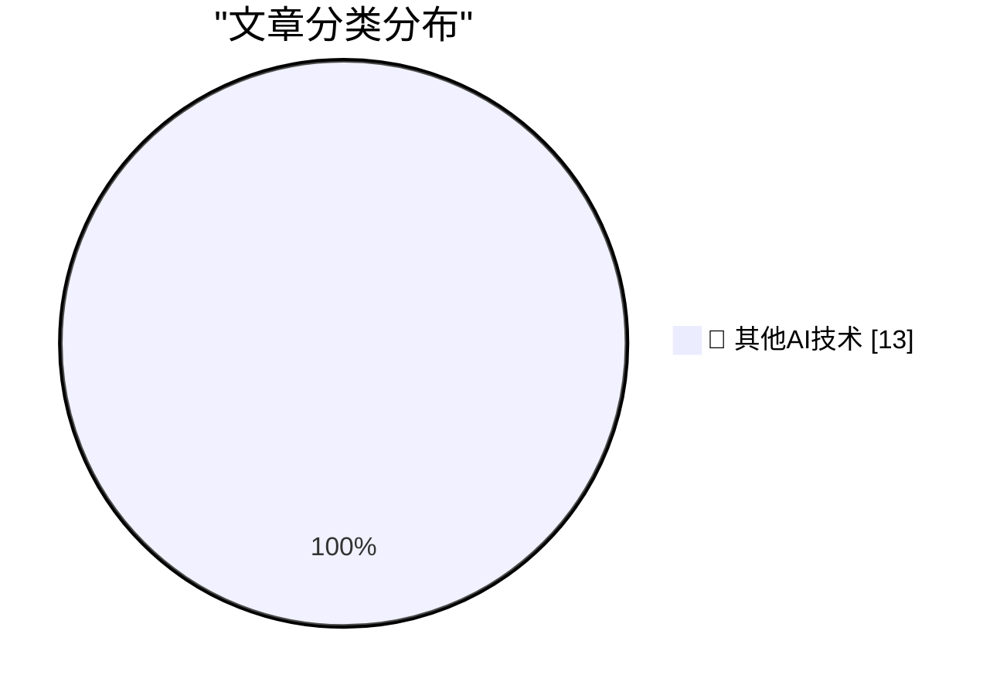

# 📰 AI 博客每日精选 — 2026-09-12

> 来自 98 个技术博客和社交媒体源，AI 精选 Top 13

## 🏆 今日必读

🥇 **Don't build tools for AI agents**

[Don't build tools for AI agents](https://seangoedecke.com/dont-build-tools-for-ai-agents/) — seangoedecke.com · 22 小时前 · 🔬 其他AI技术

> Don't build tools for AI agents

🥈 **Unread 5.0**

[Unread 5.0](https://www.goldenhillsoftware.com/2026/09/unread-50/) — daringfireball.net · 3 小时前 · 🔬 其他AI技术

> Unread 5.0

🥉 **Post Peek — Litterbox-Inspired Tweet Viewing Extension for Chrome**

[Post Peek — Litterbox-Inspired Tweet Viewing Extension for Chrome](https://github.com/tsvb/post-peek) — daringfireball.net · 4 小时前 · 🔬 其他AI技术

> Post Peek — Litterbox-Inspired Tweet Viewing Extension for Chrome

4️⃣ **Where Are the AI-Generated Killer Apps?**

[Where Are the AI-Generated Killer Apps?](https://www.nytimes.com/2026/09/12/opinion/ai-software-coding-apps.html?unlocked_article_code=1.AlE.C9EE.H2j5a1eHFUbQ&amp;smid=nytcore-ios-share) — daringfireball.net · 6 小时前 · 🔬 其他AI技术

> Where Are the AI-Generated Killer Apps?

5️⃣ **Yours Truly on Off Protocol With Jim Ray**

[Yours Truly on Off Protocol With Jim Ray](https://atproto.com/off-protocol/2026-09-11-make-your-own-thing-john-gruber) — daringfireball.net · 7 小时前 · 🔬 其他AI技术

> Yours Truly on Off Protocol With Jim Ray

---

## 📊 数据概览

| 扫描源 | 抓取文章 | 时间范围 | 精选 |
|:---:|:---:|:---:|:---:|
| 62/98 | 1952 篇 → 13 篇 | 24h | **13 篇** |

### 分类分布

---

====================

## 🔬 其他AI技术

### 1. Don't build tools for AI agents

[Don't build tools for AI agents](https://seangoedecke.com/dont-build-tools-for-ai-agents/) — **seangoedecke.com** · 22 小时前 · ⭐ 15/25

> Don't build tools for AI agents

📌 其他AI技术

---

### 2. Unread 5.0

[Unread 5.0](https://www.goldenhillsoftware.com/2026/09/unread-50/) — **daringfireball.net** · 3 小时前 · ⭐ 15/25

> Unread 5.0

📌 其他AI技术

---

### 3. Post Peek — Litterbox-Inspired Tweet Viewing Extension for Chrome

[Post Peek — Litterbox-Inspired Tweet Viewing Extension for Chrome](https://github.com/tsvb/post-peek) — **daringfireball.net** · 4 小时前 · ⭐ 15/25

> Post Peek — Litterbox-Inspired Tweet Viewing Extension for Chrome

📌 其他AI技术

---

### 4. Where Are the AI-Generated Killer Apps?

[Where Are the AI-Generated Killer Apps?](https://www.nytimes.com/2026/09/12/opinion/ai-software-coding-apps.html?unlocked_article_code=1.AlE.C9EE.H2j5a1eHFUbQ&amp;smid=nytcore-ios-share) — **daringfireball.net** · 6 小时前 · ⭐ 15/25

> Where Are the AI-Generated Killer Apps?

📌 其他AI技术

---

### 5. Yours Truly on Off Protocol With Jim Ray

[Yours Truly on Off Protocol With Jim Ray](https://atproto.com/off-protocol/2026-09-11-make-your-own-thing-john-gruber) — **daringfireball.net** · 7 小时前 · ⭐ 15/25

> Yours Truly on Off Protocol With Jim Ray

📌 其他AI技术

---

### 6. T-Mobile Is Charging $5/Month for iPhone Handoff

[T-Mobile Is Charging $5/Month for iPhone Handoff](https://www.t-mobile.com/news/devices/iphone-18-pro-iphone-duo-apple-watch-release) — **daringfireball.net** · 7 小时前 · ⭐ 15/25

> T-Mobile Is Charging $5/Month for iPhone Handoff

📌 其他AI技术

---

### 7. Tristan Buckmaster’s Statement on Getting Scooped by OpenAI on the Navier-Stokes Problem

[Tristan Buckmaster’s Statement on Getting Scooped by OpenAI on the Navier-Stokes Problem](https://cims.nyu.edu/~tristanb/statement.pdf) — **daringfireball.net** · 7 小时前 · ⭐ 15/25

> Tristan Buckmaster’s Statement on Getting Scooped by OpenAI on the Navier-Stokes Problem

📌 其他AI技术

---

### 8. Gary Marcus on This Week in AI Drama

[Gary Marcus on This Week in AI Drama](https://garymarcus.substack.com/p/two-dire-warnings-one-from-terence) — **daringfireball.net** · 8 小时前 · ⭐ 15/25

> Gary Marcus on This Week in AI Drama

📌 其他AI技术

---

### 9. Last Year’s iPhone Share Amongst Users of Widgetsmith

[Last Year’s iPhone Share Amongst Users of Widgetsmith](https://mastodon.social/@_Davidsmith/117253170115740653) — **daringfireball.net** · 22 小时前 · ⭐ 15/25

> Last Year’s iPhone Share Amongst Users of Widgetsmith

📌 其他AI技术

---

### 10. Pluralistic: LLMs are real, AI is fake (12 Sep 2026)

[Pluralistic: LLMs are real, AI is fake (12 Sep 2026)](https://pluralistic.net/2026/09/12/god-in-the-box/) — **pluralistic.net** · 11 小时前 · ⭐ 15/25

> Pluralistic: LLMs are real, AI is fake (12 Sep 2026)

📌 其他AI技术

---

### 11. ActivityPub - How to send an updated user profile to Mastodon and the Fediverse

[ActivityPub - How to send an updated user profile to Mastodon and the Fediverse](https://shkspr.mobi/blog/2026/09/activitypub-how-to-send-an-updated-user-profile-to-mastodon-and-the-fediverse/) — **shkspr.mobi** · 11 小时前 · ⭐ 15/25

> ActivityPub - How to send an updated user profile to Mastodon and the Fediverse

📌 其他AI技术

---

### 12. P(doom)

[P(doom)](https://lucumr.pocoo.org/2026/9/12/pdoom/) — **lucumr.pocoo.org** · 22 小时前 · ⭐ 15/25

> P(doom)

📌 其他AI技术

---

### 13. This Week in Package Management: 12 September 2026

[This Week in Package Management: 12 September 2026](https://nesbitt.io/2026/09/12/this-week-in-package-management.html) — **nesbitt.io** · 12 小时前 · ⭐ 15/25

> This Week in Package Management: 12 September 2026

📌 其他AI技术

---

====================

*生成于 2026-09-12 22:49 | 扫描 62 源 → 获取 1952 篇 → 精选 13 篇*
*基于 [Hacker News Popularity Contest 2025](https://refactoringenglish.com/tools/hn-popularity/) RSS 源列表，由 [Andrej Karpathy](https://x.com/karpathy) 推荐*
*由「懂点儿AI」制作，欢迎关注同名微信公众号获取更多 AI 实用技巧 💡*
