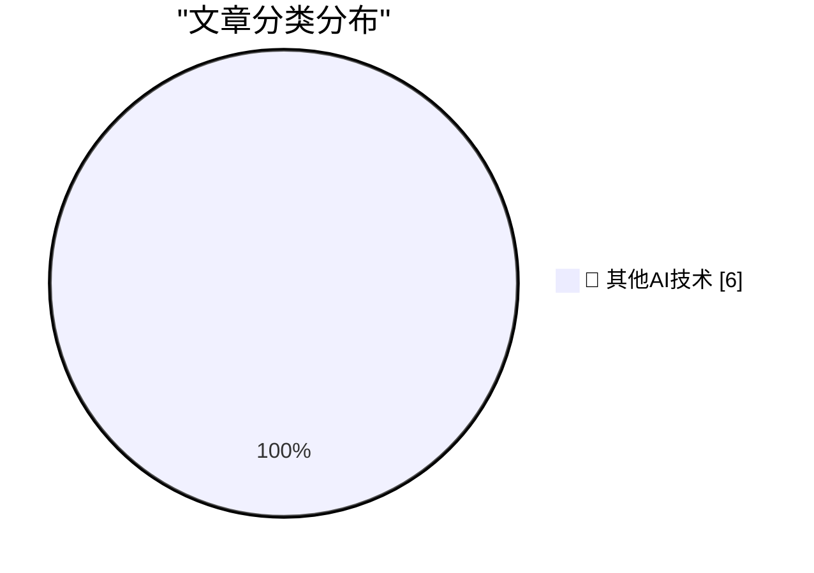

# 📰 AI 博客每日精选 — 2026-09-13

> 来自 98 个技术博客和社交媒体源，AI 精选 Top 6

## 🏆 今日必读

🥇 **AI is breaking our proxies for expertise**

[AI is breaking our proxies for expertise](https://seangoedecke.com/ai-is-breaking-our-proxies-for-expertise/) — seangoedecke.com · 22 小时前 · 🔬 其他AI技术

> AI is breaking our proxies for expertise

🥈 **Glyphs 4**

[Glyphs 4](https://glyphsapp.com/) — daringfireball.net · 1 小时前 · 🔬 其他AI技术

> Glyphs 4

🥉 **AI Forces You to Commit to Your Initial Belief**

[AI Forces You to Commit to Your Initial Belief](https://idiallo.com/blog/making-changes-mid-sentence) — idiallo.com · 2 小时前 · 🔬 其他AI技术

> AI Forces You to Commit to Your Initial Belief

4️⃣ **The expectations of privacy in driverless cars**

[The expectations of privacy in driverless cars](https://shkspr.mobi/blog/2026/09/the-expectations-of-privacy-in-driverless-cars/) — shkspr.mobi · 11 小时前 · 🔬 其他AI技术

> The expectations of privacy in driverless cars

5️⃣ **Anecdotally, programmers dislike "reduce"**

[Anecdotally, programmers dislike "reduce"](https://evanhahn.com/posts/2026-09-13-programmers-dislike-reduce/) — evanhahn.com · 22 小时前 · 🔬 其他AI技术

> Anecdotally, programmers dislike "reduce"

---

## 📊 数据概览

| 扫描源 | 抓取文章 | 时间范围 | 精选 |
|:---:|:---:|:---:|:---:|
| 64/98 | 1987 篇 → 6 篇 | 24h | **6 篇** |

### 分类分布

---

====================

## 🔬 其他AI技术

### 1. AI is breaking our proxies for expertise

[AI is breaking our proxies for expertise](https://seangoedecke.com/ai-is-breaking-our-proxies-for-expertise/) — **seangoedecke.com** · 22 小时前 · ⭐ 15/25

> AI is breaking our proxies for expertise

📌 其他AI技术

---

### 2. Glyphs 4

[Glyphs 4](https://glyphsapp.com/) — **daringfireball.net** · 1 小时前 · ⭐ 15/25

> Glyphs 4

📌 其他AI技术

---

### 3. AI Forces You to Commit to Your Initial Belief

[AI Forces You to Commit to Your Initial Belief](https://idiallo.com/blog/making-changes-mid-sentence) — **idiallo.com** · 2 小时前 · ⭐ 15/25

> AI Forces You to Commit to Your Initial Belief

📌 其他AI技术

---

### 4. The expectations of privacy in driverless cars

[The expectations of privacy in driverless cars](https://shkspr.mobi/blog/2026/09/the-expectations-of-privacy-in-driverless-cars/) — **shkspr.mobi** · 11 小时前 · ⭐ 15/25

> The expectations of privacy in driverless cars

📌 其他AI技术

---

### 5. Anecdotally, programmers dislike "reduce"

[Anecdotally, programmers dislike "reduce"](https://evanhahn.com/posts/2026-09-13-programmers-dislike-reduce/) — **evanhahn.com** · 22 小时前 · ⭐ 15/25

> Anecdotally, programmers dislike "reduce"

📌 其他AI技术

---

### 6. The spy in your living room

[The spy in your living room](https://dfarq.homeip.net/the-spy-in-your-living-room/?utm_source=rss&#038;utm_medium=rss&#038;utm_campaign=the-spy-in-your-living-room) — **dfarq.homeip.net** · 6 小时前 · ⭐ 15/25

> The spy in your living room

📌 其他AI技术

---

====================

*生成于 2026-09-13 22:50 | 扫描 64 源 → 获取 1987 篇 → 精选 6 篇*
*基于 [Hacker News Popularity Contest 2025](https://refactoringenglish.com/tools/hn-popularity/) RSS 源列表，由 [Andrej Karpathy](https://x.com/karpathy) 推荐*
*由「懂点儿AI」制作，欢迎关注同名微信公众号获取更多 AI 实用技巧 💡*
