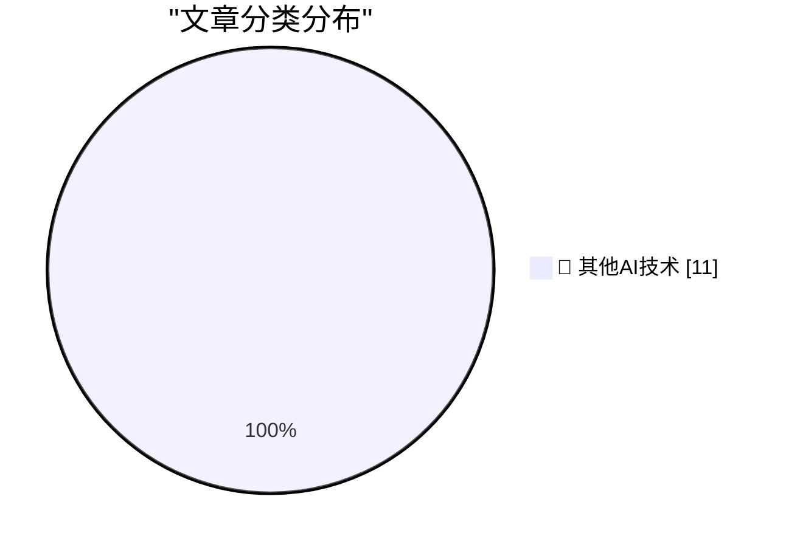

# 📰 AI 博客每日精选 — 2026-09-14

> 来自 98 个技术博客和社交媒体源，AI 精选 Top 11

## 🏆 今日必读

🥇 **Slow developer experience will bottleneck fast models**

[Slow developer experience will bottleneck fast models](https://seangoedecke.com/slow-devex-will-bottleneck-fast-models/) — seangoedecke.com · 23 小时前 · 🔬 其他AI技术

> Slow developer experience will bottleneck fast models

🥈 **Apple’s 27.0 OS Updates**

[Apple’s 27.0 OS Updates](https://scriptingosx.com/2026/09/apple-27-platform-updates-september-2026/) — daringfireball.net · 3 小时前 · 🔬 其他AI技术

> Apple’s 27.0 OS Updates

🥉 **Dumpster Fire – Litterbox-Inspired Extension for Firefox**

[Dumpster Fire – Litterbox-Inspired Extension for Firefox](https://addons.mozilla.org/en-US/firefox/addon/dumpster-fire/) — daringfireball.net · 8 小时前 · 🔬 其他AI技术

> Dumpster Fire – Litterbox-Inspired Extension for Firefox

4️⃣ **XCancel Shuts Down Again**

[XCancel Shuts Down Again](https://xcancel.com/) — daringfireball.net · 10 小时前 · 🔬 其他AI技术

> XCancel Shuts Down Again

5️⃣ **Pluralistic: But do you use keyboard shortcuts? (14 Sep 2026)**

[Pluralistic: But do you use keyboard shortcuts? (14 Sep 2026)](https://pluralistic.net/2026/09/14/cult-taylorism/) — pluralistic.net · 12 小时前 · 🔬 其他AI技术

> Pluralistic: But do you use keyboard shortcuts? (14 Sep 2026)

---

## 📊 数据概览

| 扫描源 | 抓取文章 | 时间范围 | 精选 |
|:---:|:---:|:---:|:---:|
| 65/98 | 2018 篇 → 11 篇 | 24h | **11 篇** |

### 分类分布

---

====================

## 🔬 其他AI技术

### 1. Slow developer experience will bottleneck fast models

[Slow developer experience will bottleneck fast models](https://seangoedecke.com/slow-devex-will-bottleneck-fast-models/) — **seangoedecke.com** · 23 小时前 · ⭐ 15/25

> Slow developer experience will bottleneck fast models

📌 其他AI技术

---

### 2. Apple’s 27.0 OS Updates

[Apple’s 27.0 OS Updates](https://scriptingosx.com/2026/09/apple-27-platform-updates-september-2026/) — **daringfireball.net** · 3 小时前 · ⭐ 15/25

> Apple’s 27.0 OS Updates

📌 其他AI技术

---

### 3. Dumpster Fire – Litterbox-Inspired Extension for Firefox

[Dumpster Fire – Litterbox-Inspired Extension for Firefox](https://addons.mozilla.org/en-US/firefox/addon/dumpster-fire/) — **daringfireball.net** · 8 小时前 · ⭐ 15/25

> Dumpster Fire – Litterbox-Inspired Extension for Firefox

📌 其他AI技术

---

### 4. XCancel Shuts Down Again

[XCancel Shuts Down Again](https://xcancel.com/) — **daringfireball.net** · 10 小时前 · ⭐ 15/25

> XCancel Shuts Down Again

📌 其他AI技术

---

### 5. Pluralistic: But do you use keyboard shortcuts? (14 Sep 2026)

[Pluralistic: But do you use keyboard shortcuts? (14 Sep 2026)](https://pluralistic.net/2026/09/14/cult-taylorism/) — **pluralistic.net** · 12 小时前 · ⭐ 15/25

> Pluralistic: But do you use keyboard shortcuts? (14 Sep 2026)

📌 其他AI技术

---

### 6. Esoteric HTML - ismap vs CSS

[Esoteric HTML - ismap vs CSS](https://shkspr.mobi/blog/2026/09/esoteric-html-ismap-vs-css/) — **shkspr.mobi** · 12 小时前 · ⭐ 15/25

> Esoteric HTML - ismap vs CSS

📌 其他AI技术

---

### 7. Why didn’t Read­Directory­ChangesW provide a way to correlate the two sides of a rename operation?

[Why didn’t Read­Directory­ChangesW provide a way to correlate the two sides of a rename operation?](https://devblogs.microsoft.com/oldnewthing/20260914-00/?p=112696) — **devblogs.microsoft.com/oldnewthing** · 9 小时前 · ⭐ 15/25

> Why didn’t Read­Directory­ChangesW provide a way to correlate the two sides of a rename operation?

📌 其他AI技术

---

### 8. Interpreting Pangram

[Interpreting Pangram](https://lucumr.pocoo.org/2026/9/14/interpreting-pangram/) — **lucumr.pocoo.org** · 23 小时前 · ⭐ 15/25

> Interpreting Pangram

📌 其他AI技术

---

### 9. AI Is Already In Dangerous Hands

[AI Is Already In Dangerous Hands](https://www.wheresyoured.at/ai-is-already-in-dangerous-hands/) — **wheresyoured.at** · 7 小时前 · ⭐ 15/25

> AI Is Already In Dangerous Hands

📌 其他AI技术

---

### 10. Osborne Computer’s bankruptcy and the Osborne Effect

[Osborne Computer’s bankruptcy and the Osborne Effect](https://dfarq.homeip.net/osborne-computers-bankruptcy-and-the-osborne-effect/?utm_source=rss&#038;utm_medium=rss&#038;utm_campaign=osborne-computers-bankruptcy-and-the-osborne-effect) — **dfarq.homeip.net** · 12 小时前 · ⭐ 15/25

> Osborne Computer’s bankruptcy and the Osborne Effect

📌 其他AI技术

---

### 11. Hoe wordt de overheid weer 'van de IT'?

[Hoe wordt de overheid weer 'van de IT'?](https://berthub.eu/articles/posts/hoe-word-je-weer-van-de-it/) — **berthub.eu** · 10 小时前 · ⭐ 15/25

> Hoe wordt de overheid weer 'van de IT'?

📌 其他AI技术

---

====================

*生成于 2026-09-14 23:41 | 扫描 65 源 → 获取 2018 篇 → 精选 11 篇*
*基于 [Hacker News Popularity Contest 2025](https://refactoringenglish.com/tools/hn-popularity/) RSS 源列表，由 [Andrej Karpathy](https://x.com/karpathy) 推荐*
*由「懂点儿AI」制作，欢迎关注同名微信公众号获取更多 AI 实用技巧 💡*
