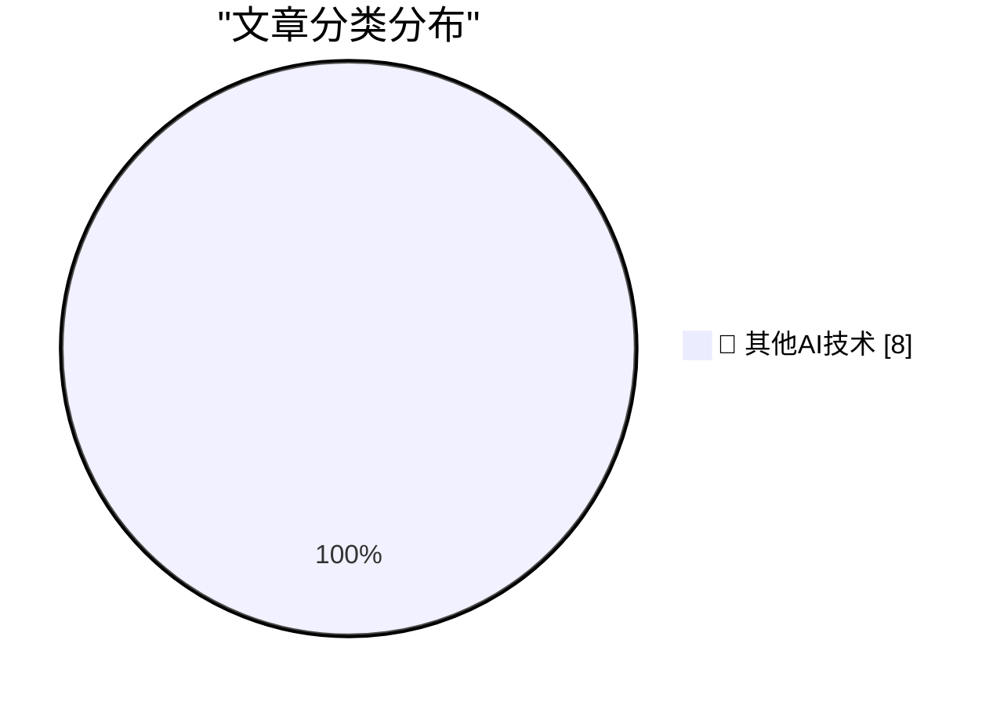

# 📰 AI 博客每日精选 — 2026-09-15

> 来自 98 个技术博客和社交媒体源，AI 精选 Top 8

## 🏆 今日必读

🥇 **Tell agents the why, not just the how**

[Tell agents the why, not just the how](https://seangoedecke.com/tell-agents-the-why/) — seangoedecke.com · 23 小时前 · 🔬 其他AI技术

> Tell agents the why, not just the how

🥈 **FT: ‘Steve Bannon and Bernie Sanders Unite in AI Safety Call’**

[FT: ‘Steve Bannon and Bernie Sanders Unite in AI Safety Call’](https://www.ft.com/content/bab5c4c5-5377-4dd0-8b46-d8c4ce9a36d5?syn-25a6b1a6=1) — daringfireball.net · 4 小时前 · 🔬 其他AI技术

> FT: ‘Steve Bannon and Bernie Sanders Unite in AI Safety Call’

🥉 **★ Thoughts and Observations on Apple’s ‘Surprise and Shine’ Event; the Announcements of the iPhones 18 Pro, AirPods 5, Apple Watches Series 12 and Ultra 4, and the iPhone Duo; and the Dawn of the Ternus, John Ternus Era at Apple**

[★ Thoughts and Observations on Apple’s ‘Surprise and Shine’ Event; the Announcements of the iPhones 18 Pro, AirPods 5, Apple Watches Series 12 and Ultra 4, and the iPhone Duo; and the Dawn of the Ternus, John Ternus Era at Apple](https://daringfireball.net/2026/09/thoughts_and_observations_on_apples_surprise_and_shine_event) — daringfireball.net · 5 小时前 · 🔬 其他AI技术

> ★ Thoughts and Observations on Apple’s ‘Surprise and Shine’ Event; the Announcements of the iPhones 18 Pro, AirPods 5, Apple Watches Series 12 and Ultra 4, and the iPhone Duo; and the Dawn of the Ternus, John Ternus Era at Apple

4️⃣ **[Sponsor] WorkOS: How SSO Works and the Fastest Way to Add It**

[[Sponsor] WorkOS: How SSO Works and the Fastest Way to Add It](https://workos.com/guide/the-developers-guide-to-sso?utm_source=daringfireball&amp;utm_medium=newsletter&amp;utm_campaign=q32026) — daringfireball.net · 7 小时前 · 🔬 其他AI技术

> [Sponsor] WorkOS: How SSO Works and the Fastest Way to Add It

5️⃣ **Pluralistic: Everybody pees (15 Sep 2026)**

[Pluralistic: Everybody pees (15 Sep 2026)](https://pluralistic.net/2026/09/15/bitter-lemon-energy-drink/) — pluralistic.net · 15 小时前 · 🔬 其他AI技术

> Pluralistic: Everybody pees (15 Sep 2026)

---

## 📊 数据概览

| 扫描源 | 抓取文章 | 时间范围 | 精选 |
|:---:|:---:|:---:|:---:|
| 65/98 | 2018 篇 → 8 篇 | 24h | **8 篇** |

### 分类分布

---

====================

## 🔬 其他AI技术

### 1. Tell agents the why, not just the how

[Tell agents the why, not just the how](https://seangoedecke.com/tell-agents-the-why/) — **seangoedecke.com** · 23 小时前 · ⭐ 15/25

> Tell agents the why, not just the how

📌 其他AI技术

---

### 2. FT: ‘Steve Bannon and Bernie Sanders Unite in AI Safety Call’

[FT: ‘Steve Bannon and Bernie Sanders Unite in AI Safety Call’](https://www.ft.com/content/bab5c4c5-5377-4dd0-8b46-d8c4ce9a36d5?syn-25a6b1a6=1) — **daringfireball.net** · 4 小时前 · ⭐ 15/25

> FT: ‘Steve Bannon and Bernie Sanders Unite in AI Safety Call’

📌 其他AI技术

---

### 3. ★ Thoughts and Observations on Apple’s ‘Surprise and Shine’ Event; the Announcements of the iPhones 18 Pro, AirPods 5, Apple Watches Series 12 and Ultra 4, and the iPhone Duo; and the Dawn of the Ternus, John Ternus Era at Apple

[★ Thoughts and Observations on Apple’s ‘Surprise and Shine’ Event; the Announcements of the iPhones 18 Pro, AirPods 5, Apple Watches Series 12 and Ultra 4, and the iPhone Duo; and the Dawn of the Ternus, John Ternus Era at Apple](https://daringfireball.net/2026/09/thoughts_and_observations_on_apples_surprise_and_shine_event) — **daringfireball.net** · 5 小时前 · ⭐ 15/25

> ★ Thoughts and Observations on Apple’s ‘Surprise and Shine’ Event; the Announcements of the iPhones 18 Pro, AirPods 5, Apple Watches Series 12 and Ultra 4, and the iPhone Duo; and the Dawn of the Ternus, John Ternus Era at Apple

📌 其他AI技术

---

### 4. [Sponsor] WorkOS: How SSO Works and the Fastest Way to Add It

[[Sponsor] WorkOS: How SSO Works and the Fastest Way to Add It](https://workos.com/guide/the-developers-guide-to-sso?utm_source=daringfireball&amp;utm_medium=newsletter&amp;utm_campaign=q32026) — **daringfireball.net** · 7 小时前 · ⭐ 15/25

> [Sponsor] WorkOS: How SSO Works and the Fastest Way to Add It

📌 其他AI技术

---

### 5. Pluralistic: Everybody pees (15 Sep 2026)

[Pluralistic: Everybody pees (15 Sep 2026)](https://pluralistic.net/2026/09/15/bitter-lemon-energy-drink/) — **pluralistic.net** · 15 小时前 · ⭐ 15/25

> Pluralistic: Everybody pees (15 Sep 2026)

📌 其他AI技术

---

### 6. [RSS Club] Sorry for breaking your feed readers!

[[RSS Club] Sorry for breaking your feed readers!](https://shkspr.mobi/blog/2026/09/rss-club-sorry-for-breaking-your-feed-readers/) — **shkspr.mobi** · 11 小时前 · ⭐ 15/25

> [RSS Club] Sorry for breaking your feed readers!

📌 其他AI技术

---

### 7. Shadowing the Standard Library

[Shadowing the Standard Library](https://nesbitt.io/2026/09/15/shadowing-the-standard-library.html) — **nesbitt.io** · 14 小时前 · ⭐ 15/25

> Shadowing the Standard Library

📌 其他AI技术

---

### 8. Diamond Rio PMP300

[Diamond Rio PMP300](https://dfarq.homeip.net/diamond-rio-pmp300/?utm_source=rss&#038;utm_medium=rss&#038;utm_campaign=diamond-rio-pmp300) — **dfarq.homeip.net** · 12 小时前 · ⭐ 15/25

> Diamond Rio PMP300

📌 其他AI技术

---

====================

*生成于 2026-09-15 23:23 | 扫描 65 源 → 获取 2018 篇 → 精选 8 篇*
*基于 [Hacker News Popularity Contest 2025](https://refactoringenglish.com/tools/hn-popularity/) RSS 源列表，由 [Andrej Karpathy](https://x.com/karpathy) 推荐*
*由「懂点儿AI」制作，欢迎关注同名微信公众号获取更多 AI 实用技巧 💡*
