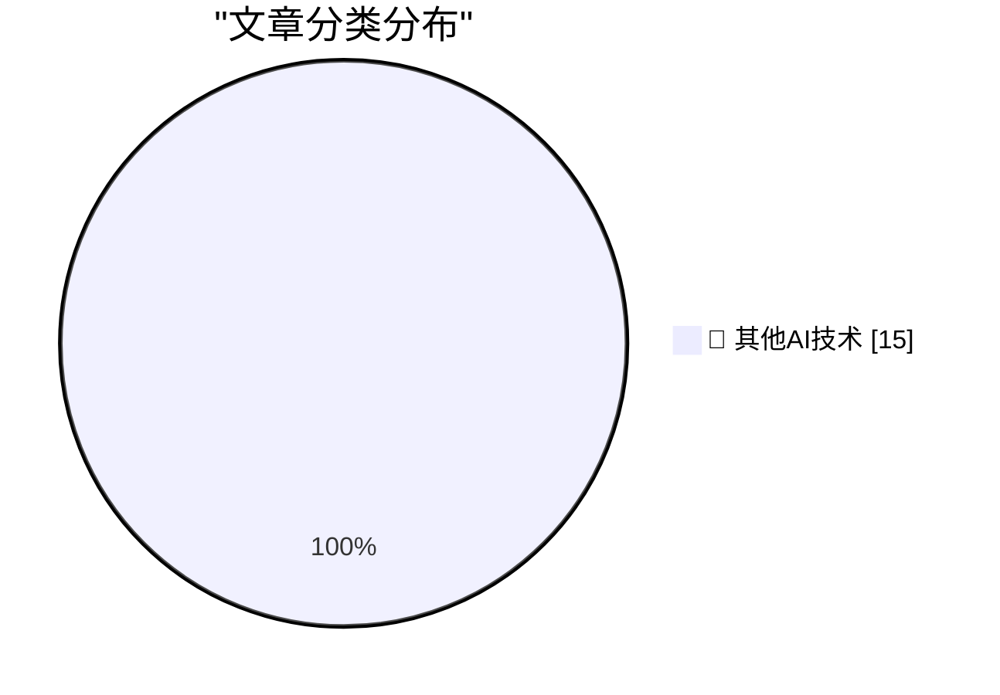

# 📰 AI 博客每日精选 — 2026-09-16

> 来自 98 个技术博客和社交媒体源，AI 精选 Top 15

## 🏆 今日必读

🥇 **Jev means structured output is interesting again**

[Jev means structured output is interesting again](https://seangoedecke.com/jev-means-structured-output-is-interesting-again/) — seangoedecke.com · 23 小时前 · 🔬 其他AI技术

> Jev means structured output is interesting again

🥈 **Xcode 27.2 Is Out, but 27.1 Is Not, Which Means Developers Still Can’t Get Started on Duo-Adapted Apps**

[Xcode 27.2 Is Out, but 27.1 Is Not, Which Means Developers Still Can’t Get Started on Duo-Adapted Apps](https://developer.apple.com/documentation/xcode-release-notes/xcode-27_2-release-notes) — daringfireball.net · 50 分钟前 · 🔬 其他AI技术

> Xcode 27.2 Is Out, but 27.1 Is Not, Which Means Developers Still Can’t Get Started on Duo-Adapted Apps

🥉 **Is That a Duo in Ternus’s Pocket or Was He Just Happy That Apple TV Shows Won 28 Emmys?**

[Is That a Duo in Ternus’s Pocket or Was He Just Happy That Apple TV Shows Won 28 Emmys?](https://x.com/DEADLINE/status/2099645816361332775) — daringfireball.net · 1 小时前 · 🔬 其他AI技术

> Is That a Duo in Ternus’s Pocket or Was He Just Happy That Apple TV Shows Won 28 Emmys?

4️⃣ **Woz Launches Merch Store**

[Woz Launches Merch Store](https://x.com/stevewoz/status/2100074363605397658) — daringfireball.net · 1 小时前 · 🔬 其他AI技术

> Woz Launches Merch Store

5️⃣ **Apple OS 27.2 Betas Are Out; Version 27.1 Is the Duo-Exclusive iOS Fork**

[Apple OS 27.2 Betas Are Out; Version 27.1 Is the Duo-Exclusive iOS Fork](https://www.macrumors.com/2026/09/16/heres-why-apple-released-ios-27-2-beta/) — daringfireball.net · 4 小时前 · 🔬 其他AI技术

> Apple OS 27.2 Betas Are Out; Version 27.1 Is the Duo-Exclusive iOS Fork

---

## 📊 数据概览

| 扫描源 | 抓取文章 | 时间范围 | 精选 |
|:---:|:---:|:---:|:---:|
| 78/98 | 2696 篇 → 23 篇 | 24h | **15 篇** |

### 分类分布

---

====================

## 🔬 其他AI技术

### 1. Jev means structured output is interesting again

[Jev means structured output is interesting again](https://seangoedecke.com/jev-means-structured-output-is-interesting-again/) — **seangoedecke.com** · 23 小时前 · ⭐ 15/25

> Jev means structured output is interesting again

📌 其他AI技术

---

### 2. Xcode 27.2 Is Out, but 27.1 Is Not, Which Means Developers Still Can’t Get Started on Duo-Adapted Apps

[Xcode 27.2 Is Out, but 27.1 Is Not, Which Means Developers Still Can’t Get Started on Duo-Adapted Apps](https://developer.apple.com/documentation/xcode-release-notes/xcode-27_2-release-notes) — **daringfireball.net** · 50 分钟前 · ⭐ 15/25

> Xcode 27.2 Is Out, but 27.1 Is Not, Which Means Developers Still Can’t Get Started on Duo-Adapted Apps

📌 其他AI技术

---

### 3. Is That a Duo in Ternus’s Pocket or Was He Just Happy That Apple TV Shows Won 28 Emmys?

[Is That a Duo in Ternus’s Pocket or Was He Just Happy That Apple TV Shows Won 28 Emmys?](https://x.com/DEADLINE/status/2099645816361332775) — **daringfireball.net** · 1 小时前 · ⭐ 15/25

> Is That a Duo in Ternus’s Pocket or Was He Just Happy That Apple TV Shows Won 28 Emmys?

📌 其他AI技术

---

### 4. Woz Launches Merch Store

[Woz Launches Merch Store](https://x.com/stevewoz/status/2100074363605397658) — **daringfireball.net** · 1 小时前 · ⭐ 15/25

> Woz Launches Merch Store

📌 其他AI技术

---

### 5. Apple OS 27.2 Betas Are Out; Version 27.1 Is the Duo-Exclusive iOS Fork

[Apple OS 27.2 Betas Are Out; Version 27.1 Is the Duo-Exclusive iOS Fork](https://www.macrumors.com/2026/09/16/heres-why-apple-released-ios-27-2-beta/) — **daringfireball.net** · 4 小时前 · ⭐ 15/25

> Apple OS 27.2 Betas Are Out; Version 27.1 Is the Duo-Exclusive iOS Fork

📌 其他AI技术

---

### 6. AirPods 5 With Wireless Charging Case Works With MagSafe, But Not Magnetically

[AirPods 5 With Wireless Charging Case Works With MagSafe, But Not Magnetically](https://www.apple.com/airpods-5/specs/) — **daringfireball.net** · 8 小时前 · ⭐ 15/25

> AirPods 5 With Wireless Charging Case Works With MagSafe, But Not Magnetically

📌 其他AI技术

---

### 7. ‘Apple Reference Image: A New Approach for Verified Photography’

[‘Apple Reference Image: A New Approach for Verified Photography’](https://security.apple.com/blog/apple-reference-image/) — **daringfireball.net** · 20 小时前 · ⭐ 15/25

> ‘Apple Reference Image: A New Approach for Verified Photography’

📌 其他AI技术

---

### 8. Pluralistic: How an AI moratorium can save AI bosses (16 Sep 2026)

[Pluralistic: How an AI moratorium can save AI bosses (16 Sep 2026)](https://pluralistic.net/2026/09/16/beggar-thy-neighbor/) — **pluralistic.net** · 15 小时前 · ⭐ 15/25

> Pluralistic: How an AI moratorium can save AI bosses (16 Sep 2026)

📌 其他AI技术

---

### 9. How to get a DOI for your blog posts

[How to get a DOI for your blog posts](https://shkspr.mobi/blog/2026/09/how-to-get-a-doi-for-your-blog-posts/) — **shkspr.mobi** · 11 小时前 · ⭐ 15/25

> How to get a DOI for your blog posts

📌 其他AI技术

---

### 10. Flock cameras are riddled with security vulnerabilities and hard-coded credentials

[Flock cameras are riddled with security vulnerabilities and hard-coded credentials](https://micahflee.com/flock-cameras-are-riddled-with-security-vulnerabilities-and-hard-coded-credentials/) — **micahflee.com** · 2 小时前 · ⭐ 15/25

> Flock cameras are riddled with security vulnerabilities and hard-coded credentials

📌 其他AI技术

---

### 11. The LLMs yearn for the spines

[The LLMs yearn for the spines](https://buttondown.com/hillelwayne/archive/the-llms-yearn-for-the-spines/) — **buttondown.com/hillelwayne** · 3 小时前 · ⭐ 15/25

> The LLMs yearn for the spines

📌 其他AI技术

---

### 12. The 6502 CPU’s odd debut

[The 6502 CPU’s odd debut](https://dfarq.homeip.net/the-6502-cpus-odd-debut/?utm_source=rss&#038;utm_medium=rss&#038;utm_campaign=the-6502-cpus-odd-debut) — **dfarq.homeip.net** · 12 小时前 · ⭐ 15/25

> The 6502 CPU’s odd debut

📌 其他AI技术

---

### 13. We're sharing our new framework for tracking, investigating, and disclosing instances of model misalignment at OpenAI. The framework sets criteria and...

[We're sharing our new framework for tracking, investigating, and disclosing instances of model misalignment at OpenAI. The framework sets criteria and...](https://x.com/OpenAI/status/2100344867507327087) — **𝕏 @OpenAI** · 1 小时前 · ⭐ 15/25

> We're sharing our new framework for tracking, investigating, and disclosing instances of model misalignment at OpenAI. The framework sets criteria and...

📌 其他AI技术

---

### 14. Notion desktop now opens in under a second ⚡️

[Notion desktop now opens in under a second ⚡️](https://x.com/NotionHQ/status/2100346191515111746) — **𝕏 @NotionHQ** · 1 小时前 · ⭐ 15/25

> Notion desktop now opens in under a second ⚡️

📌 其他AI技术

---

### 15. RT Ji Pei: I made a promise when I joined Notion: Get our median desktop cold-start under 1s. We did it this week after 9 major optimizations and fixi...

[RT Ji Pei: I made a promise when I joined Notion: Get our median desktop cold-start under 1s. We did it this week after 9 major optimizations and fixi...](https://x.com/NotionHQ/status/2100341350252355742) — **𝕏 @NotionHQ** · 1 小时前 · ⭐ 15/25

> RT Ji Pei: I made a promise when I joined Notion: Get our median desktop cold-start under 1s. We did it this week after 9 major optimizations and fixi...

📌 其他AI技术

---

====================

*生成于 2026-09-16 23:30 | 扫描 78 源 → 获取 2696 篇 → 精选 15 篇*
*基于 [Hacker News Popularity Contest 2025](https://refactoringenglish.com/tools/hn-popularity/) RSS 源列表，由 [Andrej Karpathy](https://x.com/karpathy) 推荐*
*由「懂点儿AI」制作，欢迎关注同名微信公众号获取更多 AI 实用技巧 💡*
