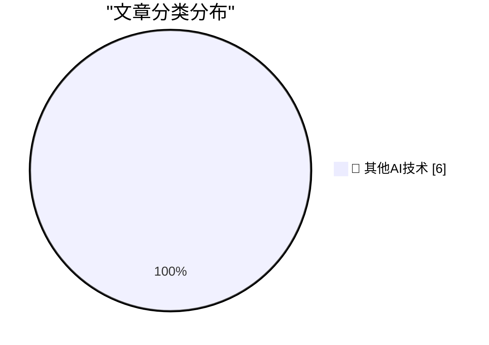

# 📰 AI 博客每日精选 — 2026-09-17

> 来自 98 个技术博客和社交媒体源，AI 精选 Top 6

## 🏆 今日必读

🥇 **Why Do U.S. Models of the iPhone 18 Pro Max, and Only U.S. Models of the 18 Pro Max, Use Qualcomm Cellular Modems Instead of Apple’s Own Superior C2 Modem?**

[Why Do U.S. Models of the iPhone 18 Pro Max, and Only U.S. Models of the 18 Pro Max, Use Qualcomm Cellular Modems Instead of Apple’s Own Superior C2 Modem?](https://www.macrumors.com/2026/09/12/iphone-18-pro-max-us-model-difference/) — daringfireball.net · 8 小时前 · 🔬 其他AI技术

> Why Do U.S. Models of the iPhone 18 Pro Max, and Only U.S. Models of the 18 Pro Max, Use Qualcomm Cellular Modems Instead of Apple’s Own Superior C2 Modem?

🥈 **Pluralistic: On the sincerity of AI bosses (17 Sep 2026)**

[Pluralistic: On the sincerity of AI bosses (17 Sep 2026)](https://pluralistic.net/2026/09/17/porque-no-los-dos/) — pluralistic.net · 15 小时前 · 🔬 其他AI技术

> Pluralistic: On the sincerity of AI bosses (17 Sep 2026)

🥉 **std::call_once vs. std::async**

[std::call_once vs. std::async](https://devblogs.microsoft.com/oldnewthing/20260917-00/?p=112706) — devblogs.microsoft.com/oldnewthing · 9 小时前 · 🔬 其他AI技术

> std::call_once vs. std::async

4️⃣ **Good Morning, Your Toaster Is Compromised**

[Good Morning, Your Toaster Is Compromised](https://nesbitt.io/2026/09/17/good-morning-your-toaster-is-compromised.html) — nesbitt.io · 14 小时前 · 🔬 其他AI技术

> Good Morning, Your Toaster Is Compromised

5️⃣ **Noam Brown – Agent swarms, alignment, & recursive self-improvement**

[Noam Brown – Agent swarms, alignment, & recursive self-improvement](https://www.dwarkesh.com/p/noam-brown) — dwarkesh.com · 7 小时前 · 🔬 其他AI技术

> Noam Brown – Agent swarms, alignment, & recursive self-improvement

---

## 📊 数据概览

| 扫描源 | 抓取文章 | 时间范围 | 精选 |
|:---:|:---:|:---:|:---:|
| 65/98 | 2018 篇 → 6 篇 | 24h | **6 篇** |

### 分类分布

---

====================

## 🔬 其他AI技术

### 1. Why Do U.S. Models of the iPhone 18 Pro Max, and Only U.S. Models of the 18 Pro Max, Use Qualcomm Cellular Modems Instead of Apple’s Own Superior C2 Modem?

[Why Do U.S. Models of the iPhone 18 Pro Max, and Only U.S. Models of the 18 Pro Max, Use Qualcomm Cellular Modems Instead of Apple’s Own Superior C2 Modem?](https://www.macrumors.com/2026/09/12/iphone-18-pro-max-us-model-difference/) — **daringfireball.net** · 8 小时前 · ⭐ 15/25

> Why Do U.S. Models of the iPhone 18 Pro Max, and Only U.S. Models of the 18 Pro Max, Use Qualcomm Cellular Modems Instead of Apple’s Own Superior C2 Modem?

📌 其他AI技术

---

### 2. Pluralistic: On the sincerity of AI bosses (17 Sep 2026)

[Pluralistic: On the sincerity of AI bosses (17 Sep 2026)](https://pluralistic.net/2026/09/17/porque-no-los-dos/) — **pluralistic.net** · 15 小时前 · ⭐ 15/25

> Pluralistic: On the sincerity of AI bosses (17 Sep 2026)

📌 其他AI技术

---

### 3. std::call_once vs. std::async

[std::call_once vs. std::async](https://devblogs.microsoft.com/oldnewthing/20260917-00/?p=112706) — **devblogs.microsoft.com/oldnewthing** · 9 小时前 · ⭐ 15/25

> std::call_once vs. std::async

📌 其他AI技术

---

### 4. Good Morning, Your Toaster Is Compromised

[Good Morning, Your Toaster Is Compromised](https://nesbitt.io/2026/09/17/good-morning-your-toaster-is-compromised.html) — **nesbitt.io** · 14 小时前 · ⭐ 15/25

> Good Morning, Your Toaster Is Compromised

📌 其他AI技术

---

### 5. Noam Brown – Agent swarms, alignment, & recursive self-improvement

[Noam Brown – Agent swarms, alignment, & recursive self-improvement](https://www.dwarkesh.com/p/noam-brown) — **dwarkesh.com** · 7 小时前 · ⭐ 15/25

> Noam Brown – Agent swarms, alignment, & recursive self-improvement

📌 其他AI技术

---

### 6. Computer Reset, Dallas

[Computer Reset, Dallas](https://dfarq.homeip.net/computer-reset-dallas/?utm_source=rss&#038;utm_medium=rss&#038;utm_campaign=computer-reset-dallas) — **dfarq.homeip.net** · 12 小时前 · ⭐ 15/25

> Computer Reset, Dallas

📌 其他AI技术

---

====================

*生成于 2026-09-17 23:21 | 扫描 65 源 → 获取 2018 篇 → 精选 6 篇*
*基于 [Hacker News Popularity Contest 2025](https://refactoringenglish.com/tools/hn-popularity/) RSS 源列表，由 [Andrej Karpathy](https://x.com/karpathy) 推荐*
*由「懂点儿AI」制作，欢迎关注同名微信公众号获取更多 AI 实用技巧 💡*
