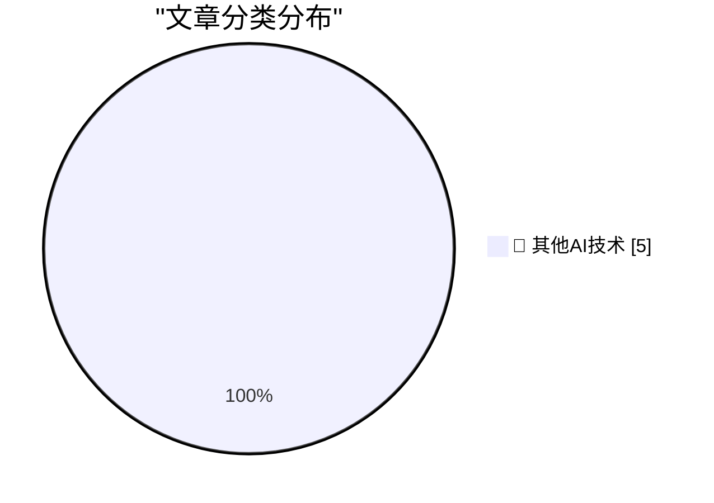

# 📰 AI 博客每日精选 — 2026-09-19

> 来自 98 个技术博客和社交媒体源，AI 精选 Top 5

## 🏆 今日必读

🥇 **Tyler Stalman’s iPhone 18 Pro Camera Review**

[Tyler Stalman’s iPhone 18 Pro Camera Review](https://www.youtube.com/watch?v=m6cDErtCKAc) — daringfireball.net · 6 小时前 · 🔬 其他AI技术

> Tyler Stalman’s iPhone 18 Pro Camera Review

🥈 **Austin Mann’s iPhone 18 Pro Camera Review, From Dunton, Colorado**

[Austin Mann’s iPhone 18 Pro Camera Review, From Dunton, Colorado](https://www.austinmann.com/trek/iphone-18-pro-camera-review-dunton) — daringfireball.net · 7 小时前 · 🔬 其他AI技术

> Austin Mann’s iPhone 18 Pro Camera Review, From Dunton, Colorado

🥉 **Finding Bugs**

[Finding Bugs](https://matklad.github.io/2026/09/19/finding-bugs.html) — matklad.github.io · 22 小时前 · 🔬 其他AI技术

> Finding Bugs

4️⃣ **This Week in Package Management: 19 September 2026**

[This Week in Package Management: 19 September 2026](https://nesbitt.io/2026/09/19/this-week-in-package-management.html) — nesbitt.io · 12 小时前 · 🔬 其他AI技术

> This Week in Package Management: 19 September 2026

5️⃣ **Notes on discrete-time Fourier series and transform**

[Notes on discrete-time Fourier series and transform](https://eli.thegreenplace.net/2026/notes-on-discrete-time-fourier-series-and-transform/) — eli.thegreenplace.net · 6 小时前 · 🔬 其他AI技术

> Notes on discrete-time Fourier series and transform

---

## 📊 数据概览

| 扫描源 | 抓取文章 | 时间范围 | 精选 |
|:---:|:---:|:---:|:---:|
| 65/98 | 2020 篇 → 5 篇 | 24h | **5 篇** |

### 分类分布

---

====================

## 🔬 其他AI技术

### 1. Tyler Stalman’s iPhone 18 Pro Camera Review

[Tyler Stalman’s iPhone 18 Pro Camera Review](https://www.youtube.com/watch?v=m6cDErtCKAc) — **daringfireball.net** · 6 小时前 · ⭐ 15/25

> Tyler Stalman’s iPhone 18 Pro Camera Review

📌 其他AI技术

---

### 2. Austin Mann’s iPhone 18 Pro Camera Review, From Dunton, Colorado

[Austin Mann’s iPhone 18 Pro Camera Review, From Dunton, Colorado](https://www.austinmann.com/trek/iphone-18-pro-camera-review-dunton) — **daringfireball.net** · 7 小时前 · ⭐ 15/25

> Austin Mann’s iPhone 18 Pro Camera Review, From Dunton, Colorado

📌 其他AI技术

---

### 3. Finding Bugs

[Finding Bugs](https://matklad.github.io/2026/09/19/finding-bugs.html) — **matklad.github.io** · 22 小时前 · ⭐ 15/25

> Finding Bugs

📌 其他AI技术

---

### 4. This Week in Package Management: 19 September 2026

[This Week in Package Management: 19 September 2026](https://nesbitt.io/2026/09/19/this-week-in-package-management.html) — **nesbitt.io** · 12 小时前 · ⭐ 15/25

> This Week in Package Management: 19 September 2026

📌 其他AI技术

---

### 5. Notes on discrete-time Fourier series and transform

[Notes on discrete-time Fourier series and transform](https://eli.thegreenplace.net/2026/notes-on-discrete-time-fourier-series-and-transform/) — **eli.thegreenplace.net** · 6 小时前 · ⭐ 15/25

> Notes on discrete-time Fourier series and transform

📌 其他AI技术

---

====================

*生成于 2026-09-19 22:39 | 扫描 65 源 → 获取 2020 篇 → 精选 5 篇*
*基于 [Hacker News Popularity Contest 2025](https://refactoringenglish.com/tools/hn-popularity/) RSS 源列表，由 [Andrej Karpathy](https://x.com/karpathy) 推荐*
*由「懂点儿AI」制作，欢迎关注同名微信公众号获取更多 AI 实用技巧 💡*
