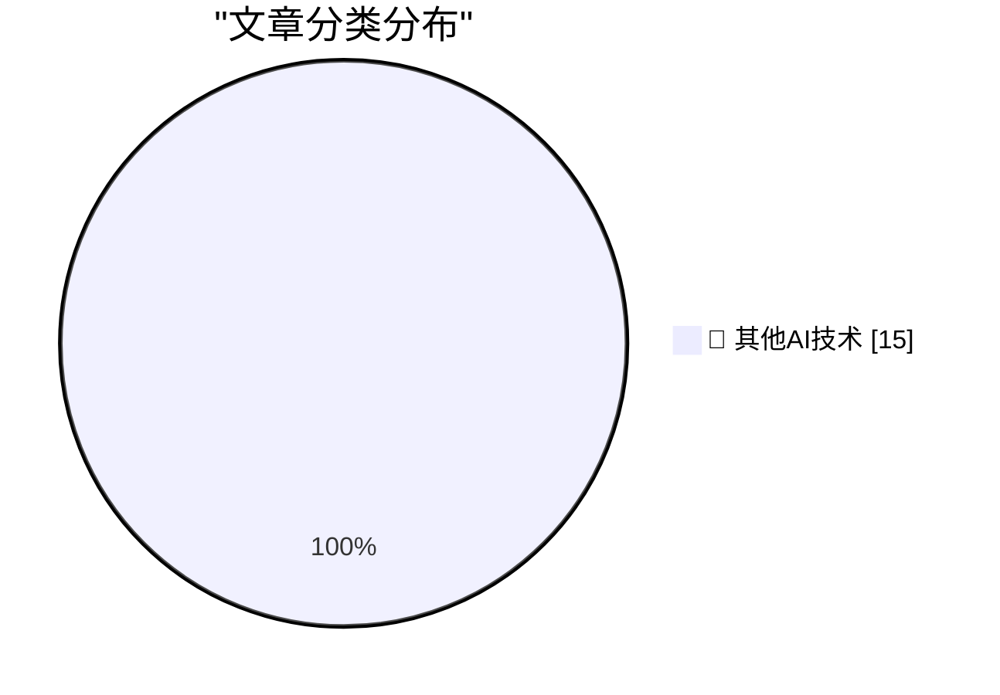

# 📰 AI 博客每日精选 — 2026-09-21

> 来自 98 个技术博客和社交媒体源，AI 精选 Top 15

## 🏆 今日必读

🥇 **Raspberry Pi locks down Pi 5 RAM upgrades in firmware**

[Raspberry Pi locks down Pi 5 RAM upgrades in firmware](https://www.jeffgeerling.com/blog/2026/raspberry-pi-ram-lockdown/) — jeffgeerling.com · 6 小时前 · 🔬 其他AI技术

> Raspberry Pi locks down Pi 5 RAM upgrades in firmware

🥈 **[Sponsor] Mux: Turn Your Video Into Context**

[[Sponsor] Mux: Turn Your Video Into Context](https://www.mux.com/?utm_campaign=fireball&amp;utm_source=DF) — daringfireball.net · 44 分钟前 · 🔬 其他AI技术

> [Sponsor] Mux: Turn Your Video Into Context

🥉 **Lex Friedman Brings Back Strategery**

[Lex Friedman Brings Back Strategery](https://lexontech.org/strategery-is-back-and-im-the-developer) — daringfireball.net · 55 分钟前 · 🔬 其他AI技术

> Lex Friedman Brings Back Strategery

4️⃣ **GM Confirms They’re Still Smoking Crack**

[GM Confirms They’re Still Smoking Crack](https://x.com/JoannaStern/status/2102105565195288859) — daringfireball.net · 1 小时前 · 🔬 其他AI技术

> GM Confirms They’re Still Smoking Crack

5️⃣ **America’s Decline Can Be Measured by the Names of Ballparks and Arenas**

[America’s Decline Can Be Measured by the Names of Ballparks and Arenas](https://www.mlb.com/news/tigers-ballpark-name-changed-to-fifth-third-park) — daringfireball.net · 2 小时前 · 🔬 其他AI技术

> America’s Decline Can Be Measured by the Names of Ballparks and Arenas

---

## 📊 数据概览

| 扫描源 | 抓取文章 | 时间范围 | 精选 |
|:---:|:---:|:---:|:---:|
| 64/98 | 2008 篇 → 17 篇 | 24h | **15 篇** |

### 分类分布

---

====================

## 🔬 其他AI技术

### 1. Raspberry Pi locks down Pi 5 RAM upgrades in firmware

[Raspberry Pi locks down Pi 5 RAM upgrades in firmware](https://www.jeffgeerling.com/blog/2026/raspberry-pi-ram-lockdown/) — **jeffgeerling.com** · 6 小时前 · ⭐ 15/25

> Raspberry Pi locks down Pi 5 RAM upgrades in firmware

📌 其他AI技术

---

### 2. [Sponsor] Mux: Turn Your Video Into Context

[[Sponsor] Mux: Turn Your Video Into Context](https://www.mux.com/?utm_campaign=fireball&amp;utm_source=DF) — **daringfireball.net** · 44 分钟前 · ⭐ 15/25

> [Sponsor] Mux: Turn Your Video Into Context

📌 其他AI技术

---

### 3. Lex Friedman Brings Back Strategery

[Lex Friedman Brings Back Strategery](https://lexontech.org/strategery-is-back-and-im-the-developer) — **daringfireball.net** · 55 分钟前 · ⭐ 15/25

> Lex Friedman Brings Back Strategery

📌 其他AI技术

---

### 4. GM Confirms They’re Still Smoking Crack

[GM Confirms They’re Still Smoking Crack](https://x.com/JoannaStern/status/2102105565195288859) — **daringfireball.net** · 1 小时前 · ⭐ 15/25

> GM Confirms They’re Still Smoking Crack

📌 其他AI技术

---

### 5. America’s Decline Can Be Measured by the Names of Ballparks and Arenas

[America’s Decline Can Be Measured by the Names of Ballparks and Arenas](https://www.mlb.com/news/tigers-ballpark-name-changed-to-fifth-third-park) — **daringfireball.net** · 2 小时前 · ⭐ 15/25

> America’s Decline Can Be Measured by the Names of Ballparks and Arenas

📌 其他AI技术

---

### 6. Ichiro, at 52, Throws 127-Pitch Shutout Against All-Star Girls Team in Japan

[Ichiro, at 52, Throws 127-Pitch Shutout Against All-Star Girls Team in Japan](https://www.seattletimes.com/sports/mariners/ichiro-at-52-throws-127-pitch-shutout-against-all-star-girls-team-in-japan/) — **daringfireball.net** · 6 小时前 · ⭐ 15/25

> Ichiro, at 52, Throws 127-Pitch Shutout Against All-Star Girls Team in Japan

📌 其他AI技术

---

### 7. Glenn Fleishman on the Increasing Impracticality of Shipping From the U.S. to the E.U.

[Glenn Fleishman on the Increasing Impracticality of Shipping From the U.S. to the E.U.](https://glog.glennf.com/blog/2026/09/17/u-s-small-biz-cant-ship-to-the-eu-anymore/) — **daringfireball.net** · 6 小时前 · ⭐ 15/25

> Glenn Fleishman on the Increasing Impracticality of Shipping From the U.S. to the E.U.

📌 其他AI技术

---

### 8. David Pogue: ‘125 Tests of the New AI Siri’

[David Pogue: ‘125 Tests of the New AI Siri’](https://pogueman.substack.com/p/125-tests-of-the-new-ai-siri) — **daringfireball.net** · 6 小时前 · ⭐ 15/25

> David Pogue: ‘125 Tests of the New AI Siri’

📌 其他AI技术

---

### 9. Matthew Butterick: ‘Big AI to Humanity: Drop Dead’

[Matthew Butterick: ‘Big AI to Humanity: Drop Dead’](https://matthewbutterick.com/chron/drop-dead.html) — **daringfireball.net** · 6 小时前 · ⭐ 15/25

> Matthew Butterick: ‘Big AI to Humanity: Drop Dead’

📌 其他AI技术

---

### 10. ‘Measuring Nothing (With Great Accuracy)’

[‘Measuring Nothing (With Great Accuracy)’](https://seths.blog/2014/01/measuring-nothing-with-great-accuracy/) — **daringfireball.net** · 8 小时前 · ⭐ 15/25

> ‘Measuring Nothing (With Great Accuracy)’

📌 其他AI技术

---

### 11. Apple TV to Finally Air ‘The Savant’ in Early 2027, Supposedly

[Apple TV to Finally Air ‘The Savant’ in Early 2027, Supposedly](https://deadline.com/2026/09/jessica-chastain-the-savant-new-release-date-apple-tv-1237108228/) — **daringfireball.net** · 22 小时前 · ⭐ 15/25

> Apple TV to Finally Air ‘The Savant’ in Early 2027, Supposedly

📌 其他AI技术

---

### 12. Yours Truly on CNBC’s ‘Squawk on the Street’ Friday

[Yours Truly on CNBC’s ‘Squawk on the Street’ Friday](https://youtu.be/WrwY_jVaN-w) — **daringfireball.net** · 23 小时前 · ⭐ 15/25

> Yours Truly on CNBC’s ‘Squawk on the Street’ Friday

📌 其他AI技术

---

### 13. Pluralistic: The Claude Delusion (21 Sep 2026)

[Pluralistic: The Claude Delusion (21 Sep 2026)](https://pluralistic.net/2026/09/21/sunsetting/) — **pluralistic.net** · 12 小时前 · ⭐ 15/25

> Pluralistic: The Claude Delusion (21 Sep 2026)

📌 其他AI技术

---

### 14. This is why we play

[This is why we play](https://xeiaso.net/blog/2026/this-is-why-we-play/) — **xeiaso.net** · 23 小时前 · ⭐ 15/25

> This is why we play

📌 其他AI技术

---

### 15. What’s the highest legal FILETIME? Is it safe to use?

[What’s the highest legal FILETIME? Is it safe to use?](https://devblogs.microsoft.com/oldnewthing/20260921-00/?p=112711) — **devblogs.microsoft.com/oldnewthing** · 9 小时前 · ⭐ 15/25

> What’s the highest legal FILETIME? Is it safe to use?

📌 其他AI技术

---

====================

*生成于 2026-09-21 23:48 | 扫描 64 源 → 获取 2008 篇 → 精选 15 篇*
*基于 [Hacker News Popularity Contest 2025](https://refactoringenglish.com/tools/hn-popularity/) RSS 源列表，由 [Andrej Karpathy](https://x.com/karpathy) 推荐*
*由「懂点儿AI」制作，欢迎关注同名微信公众号获取更多 AI 实用技巧 💡*
