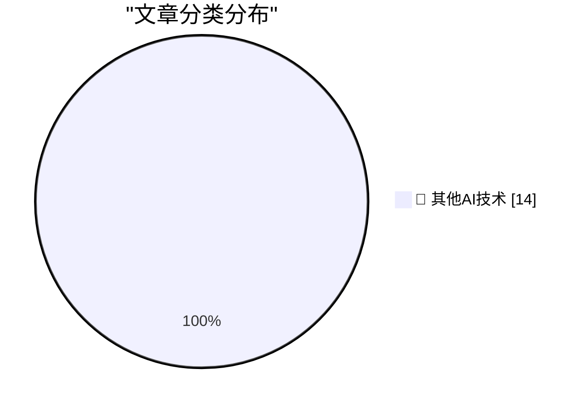

# 📰 AI 博客每日精选 — 2026-09-22

> 来自 98 个技术博客和社交媒体源，AI 精选 Top 14

## 🏆 今日必读

🥇 **Meta’s Muse Logomark, Designed by Jessica Hische**

[Meta’s Muse Logomark, Designed by Jessica Hische](https://thedieline.com/jessica-hische-metas-muse-and-the-ethical-landmines-of-design/) — daringfireball.net · 36 分钟前 · 🔬 其他AI技术

> Meta’s Muse Logomark, Designed by Jessica Hische

🥈 **Meta’s New Muse AI Agent Read Jason Aten’s Messages Database**

[Meta’s New Muse AI Agent Read Jason Aten’s Messages Database](https://www.inc.com/jason-aten/metas-new-muse-ai-agent-read-my-private-messages-i-never-asked-it-to/91408202) — daringfireball.net · 2 小时前 · 🔬 其他AI技术

> Meta’s New Muse AI Agent Read Jason Aten’s Messages Database

🥉 **Why Didn’t Google Build Muse?**

[Why Didn’t Google Build Muse?](https://spyglass.org/why-didnt-google-build-muse/) — daringfireball.net · 2 小时前 · 🔬 其他AI技术

> Why Didn’t Google Build Muse?

4️⃣ **Amazon Blocks Meta’s Muse AI Assistant**

[Amazon Blocks Meta’s Muse AI Assistant](https://www.geekwire.com/2026/amazon-blocks-metas-muse-ai-assistant-in-new-standoff-over-agentic-shopping/) — daringfireball.net · 2 小时前 · 🔬 其他AI技术

> Amazon Blocks Meta’s Muse AI Assistant

5️⃣ **Meta’s New Muse AI Agent App Overtakes ChatGPT as Top iPhone App**

[Meta’s New Muse AI Agent App Overtakes ChatGPT as Top iPhone App](https://9to5mac.com/2026/09/18/metas-new-muse-ai-agent-app-overtakes-chatgpt-as-top-iphone-app/) — daringfireball.net · 3 小时前 · 🔬 其他AI技术

> Meta’s New Muse AI Agent App Overtakes ChatGPT as Top iPhone App

---

## 📊 数据概览

| 扫描源 | 抓取文章 | 时间范围 | 精选 |
|:---:|:---:|:---:|:---:|
| 64/98 | 2011 篇 → 14 篇 | 24h | **14 篇** |

### 分类分布

---

====================

## 🔬 其他AI技术

### 1. Meta’s Muse Logomark, Designed by Jessica Hische

[Meta’s Muse Logomark, Designed by Jessica Hische](https://thedieline.com/jessica-hische-metas-muse-and-the-ethical-landmines-of-design/) — **daringfireball.net** · 36 分钟前 · ⭐ 15/25

> Meta’s Muse Logomark, Designed by Jessica Hische

📌 其他AI技术

---

### 2. Meta’s New Muse AI Agent Read Jason Aten’s Messages Database

[Meta’s New Muse AI Agent Read Jason Aten’s Messages Database](https://www.inc.com/jason-aten/metas-new-muse-ai-agent-read-my-private-messages-i-never-asked-it-to/91408202) — **daringfireball.net** · 2 小时前 · ⭐ 15/25

> Meta’s New Muse AI Agent Read Jason Aten’s Messages Database

📌 其他AI技术

---

### 3. Why Didn’t Google Build Muse?

[Why Didn’t Google Build Muse?](https://spyglass.org/why-didnt-google-build-muse/) — **daringfireball.net** · 2 小时前 · ⭐ 15/25

> Why Didn’t Google Build Muse?

📌 其他AI技术

---

### 4. Amazon Blocks Meta’s Muse AI Assistant

[Amazon Blocks Meta’s Muse AI Assistant](https://www.geekwire.com/2026/amazon-blocks-metas-muse-ai-assistant-in-new-standoff-over-agentic-shopping/) — **daringfireball.net** · 2 小时前 · ⭐ 15/25

> Amazon Blocks Meta’s Muse AI Assistant

📌 其他AI技术

---

### 5. Meta’s New Muse AI Agent App Overtakes ChatGPT as Top iPhone App

[Meta’s New Muse AI Agent App Overtakes ChatGPT as Top iPhone App](https://9to5mac.com/2026/09/18/metas-new-muse-ai-agent-app-overtakes-chatgpt-as-top-iphone-app/) — **daringfireball.net** · 3 小时前 · ⭐ 15/25

> Meta’s New Muse AI Agent App Overtakes ChatGPT as Top iPhone App

📌 其他AI技术

---

### 6. Xcode 27.2 Now Supports a New JSON Project File Format

[Xcode 27.2 Now Supports a New JSON Project File Format](https://developer.apple.com/documentation/xcode-release-notes/xcode-27_2-release-notes) — **daringfireball.net** · 4 小时前 · ⭐ 15/25

> Xcode 27.2 Now Supports a New JSON Project File Format

📌 其他AI技术

---

### 7. Siri AI Class-Action Lawsuit Settlement Website Is Now Live

[Siri AI Class-Action Lawsuit Settlement Website Is Now Live](https://www.macrumors.com/2026/09/20/siri-ai-settlement-website-now-live/) — **daringfireball.net** · 7 小时前 · ⭐ 15/25

> Siri AI Class-Action Lawsuit Settlement Website Is Now Live

📌 其他AI技术

---

### 8. It's Not Just True, It's False

[It's Not Just True, It's False](https://idiallo.com/byte-size/its-not-just-true-its-false) — **idiallo.com** · 21 小时前 · ⭐ 15/25

> It's Not Just True, It's False

📌 其他AI技术

---

### 9. Pluralistic: Bonta sold us out to Trump's oligarchs (22 Sep 2026)

[Pluralistic: Bonta sold us out to Trump's oligarchs (22 Sep 2026)](https://pluralistic.net/2026/09/22/happy-chudmas/) — **pluralistic.net** · 15 小时前 · ⭐ 15/25

> Pluralistic: Bonta sold us out to Trump's oligarchs (22 Sep 2026)

📌 其他AI技术

---

### 10. Are LLMs still surprisingly bad at some simple tasks?

[Are LLMs still surprisingly bad at some simple tasks?](https://shkspr.mobi/blog/2026/09/are-llms-still-surprisingly-bad-at-some-simple-tasks/) — **shkspr.mobi** · 11 小时前 · ⭐ 15/25

> Are LLMs still surprisingly bad at some simple tasks?

📌 其他AI技术

---

### 11. Package Manager Threat Model, Revisited

[Package Manager Threat Model, Revisited](https://nesbitt.io/2026/09/22/package-manager-threat-model-revisited.html) — **nesbitt.io** · 14 小时前 · ⭐ 15/25

> Package Manager Threat Model, Revisited

📌 其他AI技术

---

### 12. Unfinished Work in Package Security

[Unfinished Work in Package Security](https://nesbitt.io/2026/09/22/unfinished-work-in-package-security.html) — **nesbitt.io** · 14 小时前 · ⭐ 15/25

> Unfinished Work in Package Security

📌 其他AI技术

---

### 13. Where're All The AI Chips?

[Where're All The AI Chips?](https://www.wheresyoured.at/wherere-all-the-ai-chips/) — **wheresyoured.at** · 8 小时前 · ⭐ 15/25

> Where're All The AI Chips?

📌 其他AI技术

---

### 14. Athlon 64: How AMD turned the tables on Intel

[Athlon 64: How AMD turned the tables on Intel](https://dfarq.homeip.net/athlon-64-how-amd-turned-the-tables-on-intel/?utm_source=rss&#038;utm_medium=rss&#038;utm_campaign=athlon-64-how-amd-turned-the-tables-on-intel) — **dfarq.homeip.net** · 12 小时前 · ⭐ 15/25

> Athlon 64: How AMD turned the tables on Intel

📌 其他AI技术

---

====================

*生成于 2026-09-22 23:27 | 扫描 64 源 → 获取 2011 篇 → 精选 14 篇*
*基于 [Hacker News Popularity Contest 2025](https://refactoringenglish.com/tools/hn-popularity/) RSS 源列表，由 [Andrej Karpathy](https://x.com/karpathy) 推荐*
*由「懂点儿AI」制作，欢迎关注同名微信公众号获取更多 AI 实用技巧 💡*
