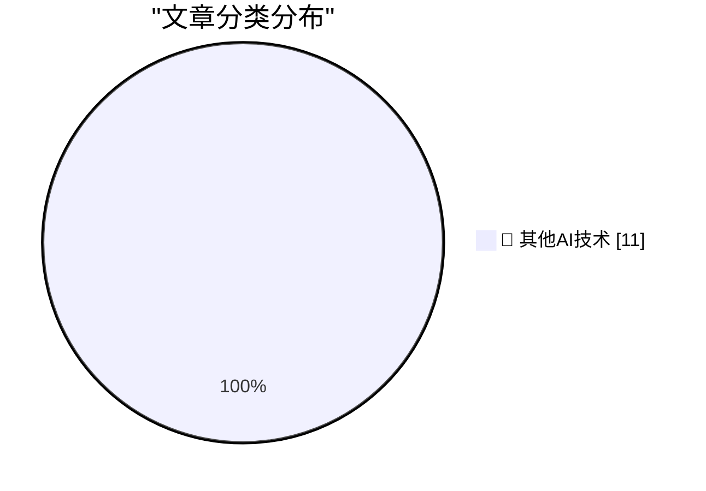

# 📰 AI 博客每日精选 — 2026-09-26

> 来自 98 个技术博客和社交媒体源，AI 精选 Top 11

## 🏆 今日必读

🥇 **Advice to a beginning software engineer**

[Advice to a beginning software engineer](https://seangoedecke.com/advice-to-a-beginning-software-engineer/) — seangoedecke.com · 23 小时前 · 🔬 其他AI技术

> Advice to a beginning software engineer

🥈 **Reelizer Returns**

[Reelizer Returns](https://www.reelizer.com/) — daringfireball.net · 2 小时前 · 🔬 其他AI技术

> Reelizer Returns

🥉 **Alexandr Wang: ‘Why I’m Building Muse’**

[Alexandr Wang: ‘Why I’m Building Muse’](https://x.com/alexandr_wang/status/2103551714536439951) — daringfireball.net · 2 小时前 · 🔬 其他AI技术

> Alexandr Wang: ‘Why I’m Building Muse’

4️⃣ **Apple’s Other Recent ‘Duo’**

[Apple’s Other Recent ‘Duo’](https://support.apple.com/en-us/111812) — daringfireball.net · 3 小时前 · 🔬 其他AI技术

> Apple’s Other Recent ‘Duo’

5️⃣ **International Standard Paper Sizes**

[International Standard Paper Sizes](https://www.cl.cam.ac.uk/~mgk25/iso-paper.html) — daringfireball.net · 4 小时前 · 🔬 其他AI技术

> International Standard Paper Sizes

---

## 📊 数据概览

| 扫描源 | 抓取文章 | 时间范围 | 精选 |
|:---:|:---:|:---:|:---:|
| 64/98 | 1992 篇 → 11 篇 | 24h | **11 篇** |

### 分类分布

---

====================

## 🔬 其他AI技术

### 1. Advice to a beginning software engineer

[Advice to a beginning software engineer](https://seangoedecke.com/advice-to-a-beginning-software-engineer/) — **seangoedecke.com** · 23 小时前 · ⭐ 15/25

> Advice to a beginning software engineer

📌 其他AI技术

---

### 2. Reelizer Returns

[Reelizer Returns](https://www.reelizer.com/) — **daringfireball.net** · 2 小时前 · ⭐ 15/25

> Reelizer Returns

📌 其他AI技术

---

### 3. Alexandr Wang: ‘Why I’m Building Muse’

[Alexandr Wang: ‘Why I’m Building Muse’](https://x.com/alexandr_wang/status/2103551714536439951) — **daringfireball.net** · 2 小时前 · ⭐ 15/25

> Alexandr Wang: ‘Why I’m Building Muse’

📌 其他AI技术

---

### 4. Apple’s Other Recent ‘Duo’

[Apple’s Other Recent ‘Duo’](https://support.apple.com/en-us/111812) — **daringfireball.net** · 3 小时前 · ⭐ 15/25

> Apple’s Other Recent ‘Duo’

📌 其他AI技术

---

### 5. International Standard Paper Sizes

[International Standard Paper Sizes](https://www.cl.cam.ac.uk/~mgk25/iso-paper.html) — **daringfireball.net** · 4 小时前 · ⭐ 15/25

> International Standard Paper Sizes

📌 其他AI技术

---

### 6. Microsoft Took the ‘Copilot+ PC’ Brand Out Behind the Shed

[Microsoft Took the ‘Copilot+ PC’ Brand Out Behind the Shed](https://www.windowscentral.com/microsoft/windows-11/the-copilot-pc-brand-is-dead-microsoft-and-pc-makers-quietly-pull-back-on-tarnished-windows-11-ai-pc-branding) — **daringfireball.net** · 6 小时前 · ⭐ 15/25

> Microsoft Took the ‘Copilot+ PC’ Brand Out Behind the Shed

📌 其他AI技术

---

### 7. The Talk Show: ‘I’m Thinking X, Not X’

[The Talk Show: ‘I’m Thinking X, Not X’](https://daringfireball.net/thetalkshow/2026/09/25/ep-455) — **daringfireball.net** · 7 小时前 · ⭐ 15/25

> The Talk Show: ‘I’m Thinking X, Not X’

📌 其他AI技术

---

### 8. Mr. Choyka Is Apparently Doing Well

[Mr. Choyka Is Apparently Doing Well](https://www.usatoday.com/story/sports/golf/2020/02/02/golf-amateur-gary-choyka-sinks-two-holes-one-same-round/4639969002/) — **daringfireball.net** · 23 小时前 · ⭐ 15/25

> Mr. Choyka Is Apparently Doing Well

📌 其他AI技术

---

### 9. No errors, no warnings, no gods, no masters - HTML Purity is a Fetish

[No errors, no warnings, no gods, no masters - HTML Purity is a Fetish](https://shkspr.mobi/blog/2026/09/no-errors-no-warnings-no-gods-no-masters-html-purity-is-a-fetish/) — **shkspr.mobi** · 11 小时前 · ⭐ 15/25

> No errors, no warnings, no gods, no masters - HTML Purity is a Fetish

📌 其他AI技术

---

### 10. This Week in Package Management: 26 September 2026

[This Week in Package Management: 26 September 2026](https://nesbitt.io/2026/09/26/this-week-in-package-management.html) — **nesbitt.io** · 13 小时前 · ⭐ 15/25

> This Week in Package Management: 26 September 2026

📌 其他AI技术

---

### 11. Rusty thoughts on "Parse, don't validate"

[Rusty thoughts on "Parse, don't validate"](https://eli.thegreenplace.net/2026/rusty-thoughts-on-parse-dont-validate/) — **eli.thegreenplace.net** · 7 小时前 · ⭐ 15/25

> Rusty thoughts on "Parse, don't validate"

📌 其他AI技术

---

====================

*生成于 2026-09-26 23:22 | 扫描 64 源 → 获取 1992 篇 → 精选 11 篇*
*基于 [Hacker News Popularity Contest 2025](https://refactoringenglish.com/tools/hn-popularity/) RSS 源列表，由 [Andrej Karpathy](https://x.com/karpathy) 推荐*
*由「懂点儿AI」制作，欢迎关注同名微信公众号获取更多 AI 实用技巧 💡*
