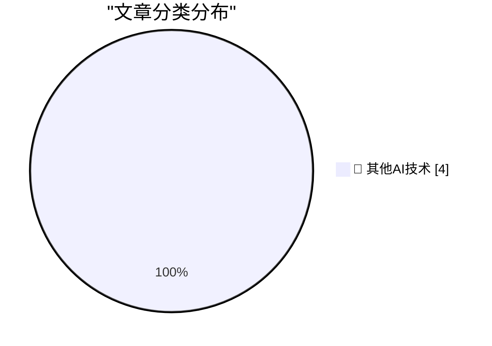

# 📰 AI 博客每日精选 — 2026-09-27

> 来自 98 个技术博客和社交媒体源，AI 精选 Top 4

## 🏆 今日必读

🥇 **Human-AI partnerships are for alignment, not capability**

[Human-AI partnerships are for alignment, not capability](https://seangoedecke.com/human-ai-partnerships-are-for-alignment-not-capability/) — seangoedecke.com · 23 小时前 · 🔬 其他AI技术

> Human-AI partnerships are for alignment, not capability

🥈 **Mux: Turn Your Video Into Context**

[Mux: Turn Your Video Into Context](https://www.mux.com/?utm_campaign=fireball&amp;utm_source=DF) — daringfireball.net · 3 小时前 · 🔬 其他AI技术

> Mux: Turn Your Video Into Context

🥉 **Katie Notopoulos on Alexandr Wang’s ‘Faux-Hallmark Pap’**

[Katie Notopoulos on Alexandr Wang’s ‘Faux-Hallmark Pap’](https://x.com/katienotopoulos/status/2103993429659386026) — daringfireball.net · 3 小时前 · 🔬 其他AI技术

> Katie Notopoulos on Alexandr Wang’s ‘Faux-Hallmark Pap’

4️⃣ **Gig Review: Public Service Broadcasting's Race For Space at Alexandra Palace ★★★★⯪**

[Gig Review: Public Service Broadcasting's Race For Space at Alexandra Palace ★★★★⯪](https://shkspr.mobi/blog/2026/09/gig-review-public-service-broadcastings-race-for-space-at-alexandra-palace/) — shkspr.mobi · 12 小时前 · 🔬 其他AI技术

> Gig Review: Public Service Broadcasting's Race For Space at Alexandra Palace ★★★★⯪

---

## 📊 数据概览

| 扫描源 | 抓取文章 | 时间范围 | 精选 |
|:---:|:---:|:---:|:---:|
| 64/98 | 1992 篇 → 4 篇 | 24h | **4 篇** |

### 分类分布

---

====================

## 🔬 其他AI技术

### 1. Human-AI partnerships are for alignment, not capability

[Human-AI partnerships are for alignment, not capability](https://seangoedecke.com/human-ai-partnerships-are-for-alignment-not-capability/) — **seangoedecke.com** · 23 小时前 · ⭐ 15/25

> Human-AI partnerships are for alignment, not capability

📌 其他AI技术

---

### 2. Mux: Turn Your Video Into Context

[Mux: Turn Your Video Into Context](https://www.mux.com/?utm_campaign=fireball&amp;utm_source=DF) — **daringfireball.net** · 3 小时前 · ⭐ 15/25

> Mux: Turn Your Video Into Context

📌 其他AI技术

---

### 3. Katie Notopoulos on Alexandr Wang’s ‘Faux-Hallmark Pap’

[Katie Notopoulos on Alexandr Wang’s ‘Faux-Hallmark Pap’](https://x.com/katienotopoulos/status/2103993429659386026) — **daringfireball.net** · 3 小时前 · ⭐ 15/25

> Katie Notopoulos on Alexandr Wang’s ‘Faux-Hallmark Pap’

📌 其他AI技术

---

### 4. Gig Review: Public Service Broadcasting's Race For Space at Alexandra Palace ★★★★⯪

[Gig Review: Public Service Broadcasting's Race For Space at Alexandra Palace ★★★★⯪](https://shkspr.mobi/blog/2026/09/gig-review-public-service-broadcastings-race-for-space-at-alexandra-palace/) — **shkspr.mobi** · 12 小时前 · ⭐ 15/25

> Gig Review: Public Service Broadcasting's Race For Space at Alexandra Palace ★★★★⯪

📌 其他AI技术

---

====================

*生成于 2026-09-27 23:35 | 扫描 64 源 → 获取 1992 篇 → 精选 4 篇*
*基于 [Hacker News Popularity Contest 2025](https://refactoringenglish.com/tools/hn-popularity/) RSS 源列表，由 [Andrej Karpathy](https://x.com/karpathy) 推荐*
*由「懂点儿AI」制作，欢迎关注同名微信公众号获取更多 AI 实用技巧 💡*
