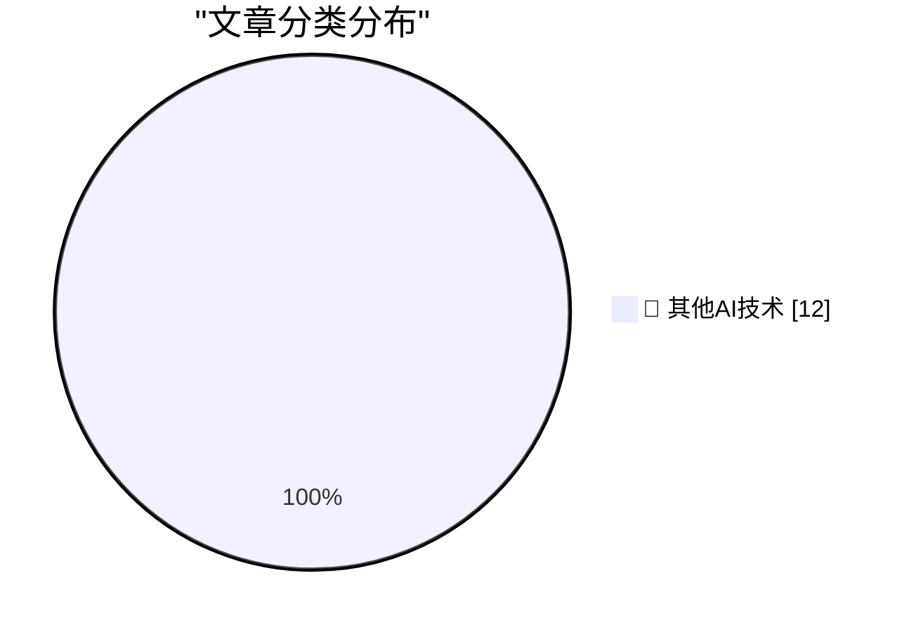

# 📰 AI 博客每日精选 — 2026-09-29

> 来自 98 个技术博客和社交媒体源，AI 精选 Top 12

## 🏆 今日必读

🥇 **Why Stolen Device Protection Makes Passwords Safer**

[Why Stolen Device Protection Makes Passwords Safer](https://sixcolors.com/post/2026/09/stolen-device-protection-passwords-glenn/) — daringfireball.net · 4 分钟前 · 🔬 其他AI技术

> Why Stolen Device Protection Makes Passwords Safer

🥈 **Jeremy Stern’s Profile of Mark Zuckerberg for Colossus**

[Jeremy Stern’s Profile of Mark Zuckerberg for Colossus](https://colossus.com/article/mark-zuckerberg-profile/) — daringfireball.net · 2 小时前 · 🔬 其他AI技术

> Jeremy Stern’s Profile of Mark Zuckerberg for Colossus

🥉 **Muse, Instagram, and VLC Lookalike Rip-Offs in the Mac App Store**

[Muse, Instagram, and VLC Lookalike Rip-Offs in the Mac App Store](https://lapcatsoftware.com/articles/2026/9/8.html) — daringfireball.net · 4 小时前 · 🔬 其他AI技术

> Muse, Instagram, and VLC Lookalike Rip-Offs in the Mac App Store

4️⃣ **★ Spitballing Predictions for Apple’s October**

[★ Spitballing Predictions for Apple’s October](https://daringfireball.net/2026/09/spitballing_predictions_for_apples_october) — daringfireball.net · 6 小时前 · 🔬 其他AI技术

> ★ Spitballing Predictions for Apple’s October

5️⃣ **Duo-Man**

[Duo-Man](https://x.com/viditb/status/2104103592726765722) — daringfireball.net · 8 小时前 · 🔬 其他AI技术

> Duo-Man

---

## 📊 数据概览

| 扫描源 | 抓取文章 | 时间范围 | 精选 |
|:---:|:---:|:---:|:---:|
| 65/98 | 2023 篇 → 12 篇 | 24h | **12 篇** |

### 分类分布

---

====================

## 🔬 其他AI技术

### 1. Why Stolen Device Protection Makes Passwords Safer

[Why Stolen Device Protection Makes Passwords Safer](https://sixcolors.com/post/2026/09/stolen-device-protection-passwords-glenn/) — **daringfireball.net** · 4 分钟前 · ⭐ 15/25

> Why Stolen Device Protection Makes Passwords Safer

📌 其他AI技术

---

### 2. Jeremy Stern’s Profile of Mark Zuckerberg for Colossus

[Jeremy Stern’s Profile of Mark Zuckerberg for Colossus](https://colossus.com/article/mark-zuckerberg-profile/) — **daringfireball.net** · 2 小时前 · ⭐ 15/25

> Jeremy Stern’s Profile of Mark Zuckerberg for Colossus

📌 其他AI技术

---

### 3. Muse, Instagram, and VLC Lookalike Rip-Offs in the Mac App Store

[Muse, Instagram, and VLC Lookalike Rip-Offs in the Mac App Store](https://lapcatsoftware.com/articles/2026/9/8.html) — **daringfireball.net** · 4 小时前 · ⭐ 15/25

> Muse, Instagram, and VLC Lookalike Rip-Offs in the Mac App Store

📌 其他AI技术

---

### 4. ★ Spitballing Predictions for Apple’s October

[★ Spitballing Predictions for Apple’s October](https://daringfireball.net/2026/09/spitballing_predictions_for_apples_october) — **daringfireball.net** · 6 小时前 · ⭐ 15/25

> ★ Spitballing Predictions for Apple’s October

📌 其他AI技术

---

### 5. Duo-Man

[Duo-Man](https://x.com/viditb/status/2104103592726765722) — **daringfireball.net** · 8 小时前 · ⭐ 15/25

> Duo-Man

📌 其他AI技术

---

### 6. Edge Is Pretending to Be Chrome

[Edge Is Pretending to Be Chrome](https://idiallo.com/blog/edge-imitates-chrome) — **idiallo.com** · 17 小时前 · ⭐ 15/25

> Edge Is Pretending to Be Chrome

📌 其他AI技术

---

### 7. Pluralistic: Priceful (28 Sep 2026)

[Pluralistic: Priceful (28 Sep 2026)](https://pluralistic.net/2026/09/28/cost-of-everything/) — **pluralistic.net** · 6 小时前 · ⭐ 15/25

> Pluralistic: Priceful (28 Sep 2026)

📌 其他AI技术

---

### 8. Book Review: Bobiverse Books 1-3 by Dennis E. Taylor ★★★☆☆

[Book Review: Bobiverse Books 1-3 by Dennis E. Taylor ★★★☆☆](https://shkspr.mobi/blog/2026/09/book-review-bobiverse-books-1-3-by-dennis-e-taylor/) — **shkspr.mobi** · 13 小时前 · ⭐ 15/25

> Book Review: Bobiverse Books 1-3 by Dennis E. Taylor ★★★☆☆

📌 其他AI技术

---

### 9. AMD’s IPO, September 27, 1972

[AMD’s IPO, September 27, 1972](https://dfarq.homeip.net/amds-ipo-september-27-1972/?utm_source=rss&#038;utm_medium=rss&#038;utm_campaign=amds-ipo-september-27-1972) — **dfarq.homeip.net** · 13 小时前 · ⭐ 15/25

> AMD’s IPO, September 27, 1972

📌 其他AI技术

---

### 10. Open State praatje: zonder transparantie geen democratie

[Open State praatje: zonder transparantie geen democratie](https://berthub.eu/articles/posts/openstate-zonder-transparantie-geen-democratie/) — **berthub.eu** · 13 小时前 · ⭐ 15/25

> Open State praatje: zonder transparantie geen democratie

📌 其他AI技术

---

### 11. SmartOS: The illumos Way of Thinking About Servers

[SmartOS: The illumos Way of Thinking About Servers](https://it-notes.dragas.net/2026/09/28/smartos-the-illumos-way-of-thinking-about-servers/) — **it-notes.dragas.net** · 16 小时前 · ⭐ 15/25

> SmartOS: The illumos Way of Thinking About Servers

📌 其他AI技术

---

### 12. The World Outside the Classroom Changed, The Class Didn’t

[The World Outside the Classroom Changed, The Class Didn’t](https://steveblank.com/2026/09/28/the-world-outside-the-classroom-changed-the-class-didnt/) — **steveblank.com** · 11 小时前 · ⭐ 15/25

> The World Outside the Classroom Changed, The Class Didn’t

📌 其他AI技术

---

====================

*生成于 2026-09-29 00:48 | 扫描 65 源 → 获取 2023 篇 → 精选 12 篇*
*基于 [Hacker News Popularity Contest 2025](https://refactoringenglish.com/tools/hn-popularity/) RSS 源列表，由 [Andrej Karpathy](https://x.com/karpathy) 推荐*
*由「懂点儿AI」制作，欢迎关注同名微信公众号获取更多 AI 实用技巧 💡*
