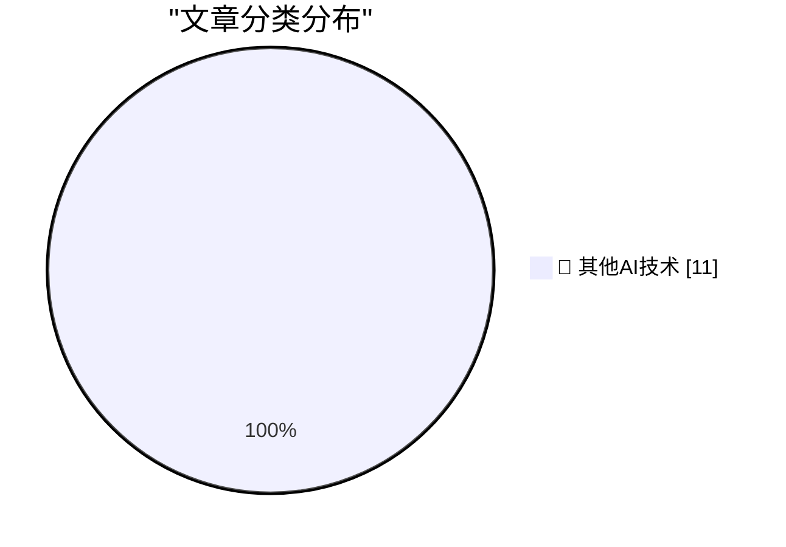

# 📰 AI 博客每日精选 — 2026-09-30

> 来自 98 个技术博客和社交媒体源，AI 精选 Top 11

## 🏆 今日必读

🥇 **Follow-Up on my Spitballed Predictions for Apple’s October**

[Follow-Up on my Spitballed Predictions for Apple’s October](https://daringfireball.net/2026/09/spitballing_predictions_for_apples_october) — daringfireball.net · 8 小时前 · 🔬 其他AI技术

> Follow-Up on my Spitballed Predictions for Apple’s October

🥈 **Destroy Any Website**

[Destroy Any Website](https://destroy.spritefusion.com/) — daringfireball.net · 9 小时前 · 🔬 其他AI技术

> Destroy Any Website

🥉 **Bastardica**

[Bastardica](https://bastardica.mitpit.com/) — daringfireball.net · 21 小时前 · 🔬 其他AI技术

> Bastardica

4️⃣ **‘When Did Google Get So F-Ing Weird?’**

[‘When Did Google Get So F-Ing Weird?’](https://sancho.bearblog.dev/google-weird/) — daringfireball.net · 22 小时前 · 🔬 其他AI技术

> ‘When Did Google Get So F-Ing Weird?’

5️⃣ **Joanna Stern Pokes the Pickle**

[Joanna Stern Pokes the Pickle](https://www.youtube.com/watch?v=YNqYEMuoQAI) — daringfireball.net · 22 小时前 · 🔬 其他AI技术

> Joanna Stern Pokes the Pickle

---

## 📊 数据概览

| 扫描源 | 抓取文章 | 时间范围 | 精选 |
|:---:|:---:|:---:|:---:|
| 65/98 | 2024 篇 → 11 篇 | 24h | **11 篇** |

### 分类分布

---

====================

## 🔬 其他AI技术

### 1. Follow-Up on my Spitballed Predictions for Apple’s October

[Follow-Up on my Spitballed Predictions for Apple’s October](https://daringfireball.net/2026/09/spitballing_predictions_for_apples_october) — **daringfireball.net** · 8 小时前 · ⭐ 15/25

> Follow-Up on my Spitballed Predictions for Apple’s October

📌 其他AI技术

---

### 2. Destroy Any Website

[Destroy Any Website](https://destroy.spritefusion.com/) — **daringfireball.net** · 9 小时前 · ⭐ 15/25

> Destroy Any Website

📌 其他AI技术

---

### 3. Bastardica

[Bastardica](https://bastardica.mitpit.com/) — **daringfireball.net** · 21 小时前 · ⭐ 15/25

> Bastardica

📌 其他AI技术

---

### 4. ‘When Did Google Get So F-Ing Weird?’

[‘When Did Google Get So F-Ing Weird?’](https://sancho.bearblog.dev/google-weird/) — **daringfireball.net** · 22 小时前 · ⭐ 15/25

> ‘When Did Google Get So F-Ing Weird?’

📌 其他AI技术

---

### 5. Joanna Stern Pokes the Pickle

[Joanna Stern Pokes the Pickle](https://www.youtube.com/watch?v=YNqYEMuoQAI) — **daringfireball.net** · 22 小时前 · ⭐ 15/25

> Joanna Stern Pokes the Pickle

📌 其他AI技术

---

### 6. ‘Donald Decodes’ Interview Craig Federighi Regarding the iPhone Duo

[‘Donald Decodes’ Interview Craig Federighi Regarding the iPhone Duo](https://www.youtube.com/watch?v=y227RF0smAg) — **daringfireball.net** · 22 小时前 · ⭐ 15/25

> ‘Donald Decodes’ Interview Craig Federighi Regarding the iPhone Duo

📌 其他AI技术

---

### 7. Why Stolen Device Protection Makes Passwords Safer

[Why Stolen Device Protection Makes Passwords Safer](https://sixcolors.com/post/2026/09/stolen-device-protection-passwords-glenn/) — **daringfireball.net** · 23 小时前 · ⭐ 15/25

> Why Stolen Device Protection Makes Passwords Safer

📌 其他AI技术

---

### 8. Pluralistic: Lindsay Owens's "Gouged" (29 Sep 2026)

[Pluralistic: Lindsay Owens's "Gouged" (29 Sep 2026)](https://pluralistic.net/2026/09/29/algorithmic-wage-theft/) — **pluralistic.net** · 10 小时前 · ⭐ 15/25

> Pluralistic: Lindsay Owens's "Gouged" (29 Sep 2026)

📌 其他AI技术

---

### 9. Dead Money

[Dead Money](https://www.wheresyoured.at/dead-money/) — **wheresyoured.at** · 8 小时前 · ⭐ 15/25

> Dead Money

📌 其他AI技术

---

### 10. VLM Enhanced Metadata For My Icon Galleries

[VLM Enhanced Metadata For My Icon Galleries](https://blog.jim-nielsen.com/2026/icon-galleries-vlm/) — **blog.jim-nielsen.com** · 5 小时前 · ⭐ 15/25

> VLM Enhanced Metadata For My Icon Galleries

📌 其他AI技术

---

### 11. When Internet Explorer passed Netscape for the first time

[When Internet Explorer passed Netscape for the first time](https://dfarq.homeip.net/when-internet-explorer-passed-netscape-for-the-first-time/?utm_source=rss&#038;utm_medium=rss&#038;utm_campaign=when-internet-explorer-passed-netscape-for-the-first-time) — **dfarq.homeip.net** · 13 小时前 · ⭐ 15/25

> When Internet Explorer passed Netscape for the first time

📌 其他AI技术

---

====================

*生成于 2026-09-30 00:02 | 扫描 65 源 → 获取 2024 篇 → 精选 11 篇*
*基于 [Hacker News Popularity Contest 2025](https://refactoringenglish.com/tools/hn-popularity/) RSS 源列表，由 [Andrej Karpathy](https://x.com/karpathy) 推荐*
*由「懂点儿AI」制作，欢迎关注同名微信公众号获取更多 AI 实用技巧 💡*
